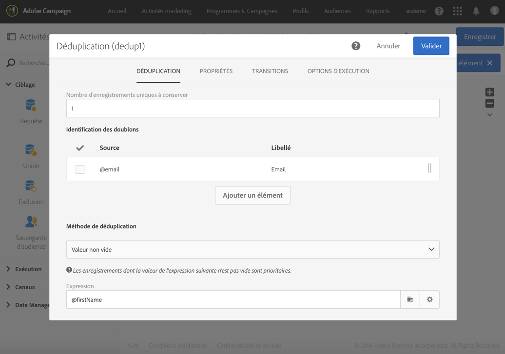

# Identifier des doublons avant une diffusion {#identifying-duplicates-before-a-delivery}

L&#39;exemple suivant illustre une déduplication permettant d&#39;exclure les doublons d&#39;une cible avant l&#39;envoi d&#39;un email. Cela permet d&#39;éviter d&#39;envoyer une communication plusieurs fois à un même profil.

Le workflow est constitué comme suit :

* Une [Requête](../../automating/using/query.md) permettant de définir la cible de l&#39;email. Ici, le workflow cible tous les profils ayant entre 18 et 25 ans et faisant partie de la base clients depuis plus d&#39;un an.

   

* Une [Déduplication](../../automating/using/deduplication.md) permettant d&#39;identifier les doublons issus de la requête précédente. Dans cet exemple, un seul enregistrement est conservé pour chaque doublon. Les doublons sont identifiés grâce à l&#39;adresse email. Ainsi, la diffusion email ne pourra être envoyée qu&#39;une fois pour chaque adresse email présente dans le ciblage.

   La méthode de déduplication sélectionnée est **[!UICONTROL Valeur non vide]**. Cela permet de s&#39;assurer que les enregistrements conservés en cas de doublons soient prioritairement ceux dont le champ **Prénom** est renseigné. Cela permettra plus de cohérence si le prénom est utilisé dans les champs de personnalisation du contenu de l&#39;email.

   De plus, une transition complémentaire est ajoutée afin de conserver les doublons et de pouvoir les lister.

   

* Une [Diffusion email](../../automating/using/email-delivery.md) placée à la suite de la transition sortante principale de la déduplication.
* Une [Sauvegarde d&#39;audience](../../automating/using/save-audience.md) placée à la suite de la transition complémentaire de la déduplication afin de sauvegarder les doublons dans une audience **Doublons**. Cette audience pourra être réutilisée afin d&#39;exclure directement ses membres de toute diffusion email.
