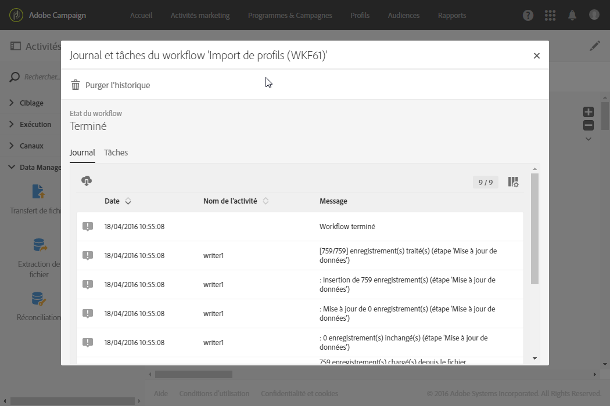

# Importer des données avec des modèles d'import{#importing-data-with-import-templates}

L'import de données vous permet de collecter des données afin d'alimenter la base de données de Campaign.

Alternativement aux [workflows](../../automating/using/discovering-workflows.md), Adobe Campaign propose une fonction d'import simplifiée permettant de gérer certains types d'import, préalablement définis par un administrateur.

Le principe de fonctionnement est le suivant : un **administrateur** définit et gère des modèles d'import (voir [Définir des modèles d'import](../../automating/using/defining-import-templates.md)). These import templates are then made available to users with simplified views under the **[!UICONTROL Profiles &amp; audiences]** &gt; **[!UICONTROL Imports]** menu.

Ces utilisateurs n'ont alors qu'à sélectionner le type d'import qu'ils souhaitent réaliser et à charger le fichier contenant les données à importer. Le workflow définit par l'administrateur est exécuté de manière transparente pour l'utilisateur, qui peut accéder au détail du résultat de son import une fois ce dernier terminé.

>[!NOTE]
>
>La fonction Import de données peut être gérée par des utilisateurs disposant des rôles **[!UICONTROL IMPORT GENERIQUE (import)]** et **[!UICONTROL WORKFLOW (workflow)]**. Pour plus d’informations sur les rôles, consultez [cette section](../../administration/using/list-of-roles.md).

Les imports peuvent être filtrés en fonction du modèle à partir duquel ils ont été exécutés, de leur date d'exécution ainsi que de leur statut d'exécution.

1. Depuis la vue d'ensemble des imports, cliquez sur le bouton **[!UICONTROL Créer.]** L'assistant d'import s'ouvre.
1. Sélectionnez le type d'import que vous souhaitez réaliser. Les types d'import correspondent aux modèles d'import disponibles.
1. Si besoin, téléchargez le fichier d'exemple associé au modèle sur votre poste afin de visualiser les types de données attendus dans le fichier à importer.
1. Téléchargez le fichier contenant les données à importer dans l'assistant.
1. Lancez l'import. L'assistant se ferme et vous renvoie à la liste des imports réalisés avec le modèle utilisé.
1. Rafraîchissez votre page et sélectionnez l'import que vous venez de réaliser afin de visualiser le détail de son exécution.

   

Les détails de l'exécution de l'import sont à présent disponibles. Vous pouvez également télécharger sur votre poste le fichier qui a été importé ainsi que le fichier contenant le détail des rejets (données non importées).
