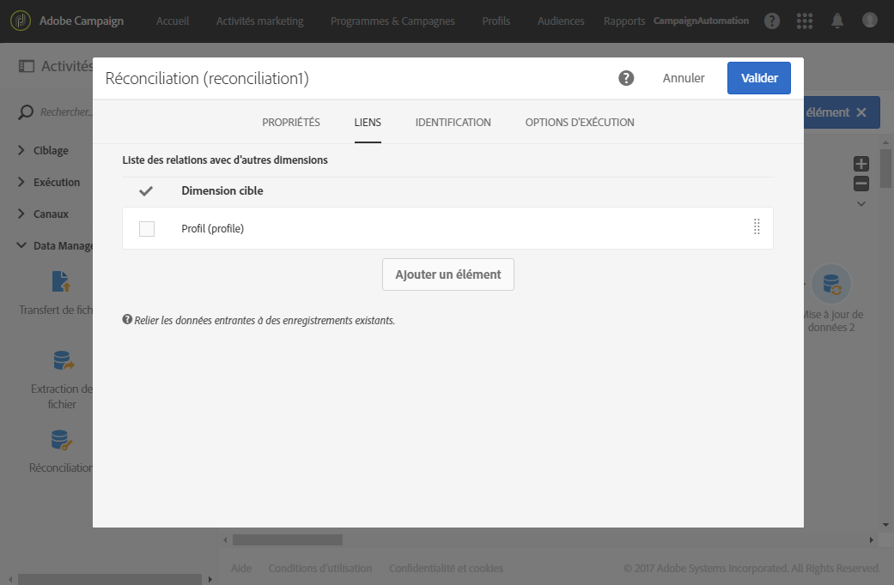

# Importer des données{#importing-data}

## Collecter des données {#collecting-data}

Vous pouvez collecter des données depuis un fichier pour les traiter et/ou les importer dans la base de données Adobe Campaign.

* L'activité **[!UICONTROL Chargement de fichier]** permet d'importer les données d'un fichier sous une forme structurée afin de les utiliser dans Adobe Campaign. Les données importées le sont temporairement et nécessitent l'utilisation d'une autre activité pour les intégrer définitivement dans la base de données Adobe Campaign.
* L'activité **[!UICONTROL Transfert de fichier]** permet de recevoir ou d'envoyer des fichiers, de tester la présence de fichiers ou de lister les fichiers dans Adobe Campaign.

   Vous pouvez utiliser cette activité avant un **[!UICONTROL Chargement de fichier]** si vous devez récupérer le fichier à partir d'une source externe.

## Bonnes pratiques d'import {#import-best-practices}

Pour garantir la cohérence des données au sein de la base de données et éviter les erreurs fréquentes lors de la mise à jour de la base de données ou de l'export de données, faites preuve de précaution et suivez les quelques règles simples détaillées ci-dessous.

### Utiliser les modèles d'import   {#using-import-templates}

La plupart des workflows d'import doivent contenir les activités suivantes : **[!UICONTROL Chargement (fichier)]**, **[!UICONTROL Réconciliation]**, **[!UICONTROL Segmentation]**, **[!UICONTROL Déduplication]**, **[!UICONTROL Mise à jour de données]**.

L'utilisation de modèles d'import facilite la préparation d'imports similaires et garantit la cohérence des données au sein de la base de données.

Pour de nombreux projets, les imports sont construits sans activité de **[!UICONTROL Déduplication]** car les fichiers utilisés n'ont pas de doublon. Des doublons apparaissent parfois suite à l'import d'autres fichiers. La déduplication est alors difficile. C'est pourquoi l'ajout d'une étape de déduplication est une précaution utile pour tous les workflows d'import.

Ne partez pas de l'hypothèse selon laquelle les données entrantes sont cohérentes et justes, ou que le département informatique ou le responsable Adobe Campaign s'en occupera. Gardez la normalisation des données à l'esprit tout au long du projet. Veillez à dédupliquer, à réconcilier et à maintenir la cohérence lorsque vous importez des données.

Un exemple de modèle de workflow générique conçu pour importer des données est disponible dans la section [Exemple : modèle de workflow d'import](../../automating/using/importing-data.md#example--import-workflow-template).

>[!NOTE]
>
>Vous pouvez également utiliser des [modèles d'import](../../automating/using/importing-data-with-import-templates.md). Il existe des modèles de workflow définis par un administrateur qui, lorsqu'ils sont activés, permettent uniquement de spécifier le fichier contenant les données à importer.

### Utiliser des formats de fichiers plats   {#using-flat-file-formats}

Le format le plus efficace pour les imports est le fichier plat. Les fichiers plats peuvent être importés en masse au niveau de la base de données.

Par exemple :

* Séparateur : onglet ou point virgule
* Première ligne avec en-têtes
* Pas de délimiteur de chaîne
* Format de date : AAAA/MM/JJ HH:mm:SS

Voici un exemple de fichier à importer :

```
lastname;firstname;birthdate;email;crmID
Smith;Hayden;23/05/1989;hayden.smith@example.com;124365
Mars;Daniel;17/11/1987;dannymars@example.com;123545
Smith;Clara;08/02/1989;hayden.smith@example.com;124567
Durance;Allison;15/12/1978;allison.durance@example.com;120987
```

### Utiliser la compression   {#using-compression}

Lorsque cela est possible, utilisez des fichiers compressés pour les imports et les exports. GZIP est pris en charge par défaut. Vous pouvez ajouter une étape de prétraitement lors de l'import des fichiers ou de post-traitement lors de l'extraction des données dans les activités de workflow **[!UICONTROL Chargement de fichier]** et **[!UICONTROL Extraction de fichier]**.

### Importer en mode Delta {#importing-in-delta-mode}

Les imports standard doivent être effectués en mode delta. Cela signifie qu'au lieu d'envoyer la table entière à chaque fois, seules les données modifiées ou nouvelles sont envoyée à Adobe Campaign.

Les imports complets sont réservés au chargement initial.

### Maintenir la cohérence   {#maintaining-consistency}

Pour maintenir la cohérence des données dans la base de données Adobe Campaign, veuillez appliquer les principes suivants :

* Si les données importées correspondent à une table de référence dans Adobe Campaign, elles doivent être réconciliées avec cette table dans le workflow. Les enregistrements sans correspondance doivent être rejetés.
* Assurez-vous que les données importées sont toujours **« normalisées »** (email, numéro de téléphone, adresse postale) et que cette normalisation est fiable et ne risque pas de changer au fil des années. Si ce n'est pas le cas, des doublons risquent d'apparaître dans la base de données et, dans la mesure où Adobe Campaign ne fournit pas d'outils de « correspondance approximative », leur suppression sera très difficile.
* Les données transactionnelles doivent être dotées d'une clé de réconciliation et être réconciliées avec les données existantes afin d'éviter la création de doublons.
* **Les fichiers liés doivent être importés dans l'ordre**. Si l'import est composé de fichiers multiples et interdépendants, le workflow doit vérifier que les fichiers sont importés dans l'ordre. Si un fichier échoue, les autres fichiers ne sont pas importés.
* **Dédupliquez**, réconciliez et maintenez la cohérence lorsque vous importez des données.

## Exemple : modèle de workflow d'import   {#example--import-workflow-template}

L'utilisation d'un modèle d'import est une bonne pratique si vous devez importer régulièrement des fichiers de structure identique.

Cet exemple montre comment pré-paramétrer un workflow qui pourra être réutilisé pour importer des profils en provenance d'un CRM dans la base de données Adobe Campaign.

1. Créez un nouveau modèle de workflow à partir de **[!UICONTROL Ressources &gt; Modèles &gt; Modèles de workflow]**.
1. Ajoutez les activités suivantes :

   * **[!UICONTROL Chargement de fichier]** : définissez la structure attendue du fichier contenant les données à importer.

      >[!NOTE]
      >
      >Il n'est possible d'importer que les données d'un seul fichier. Si le workflow comporte plusieurs activités de **[!UICONTROL Chargement de fichier]**, le même fichier sera réutilisé à chaque fois.

   * **[!UICONTROL Réconciliation]** : réconciliez les données importées avec les données se trouvant dans la base de données.
   * **[!UICONTROL Segmentation]** : créez des filtres pour traiter les enregistrements différemment selon qu'ils aient pu ou non être réconciliés.
   * **[!UICONTROL Déduplication]** : dédupliquez les données du fichier entrant avant son import dans la base de données.
   * **[!UICONTROL Mise à jour de données]** : mettez la base de données à jour avec les profils importés.
   

1. Configurez l'activité **[!UICONTROL Chargement de fichier]** :

   * définissez la structure attendue en téléchargeant un fichier d'exemple. Le fichier exemple doit contenir quelques lignes uniquement, mais toutes les colonnes nécessaires pour l'import. Vérifiez et éditez le format du fichier pour vous assurer que le type de chaque colonne est paramétré correctement : texte, date, nombre entier, etc. Par exemple :

      ```
      lastname;firstname;birthdate;email;crmID
      Smith;Hayden;23/05/1989;hayden.smith@mailtest.com;123456
      ```

   * Dans la section **[!UICONTROL Fichier à charger]**, sélectionnez **[!UICONTROL Transférer un nouveau fichier depuis le poste local]** et laissez le champ vide. A chaque fois qu'un nouveau workflow sera créé à partir de ce modèle, vous pourrez préciser ici le fichier souhaité (tant qu'il correspond à la structure définie).

      Toutes les options sont utilisables, mais il faut modifier le modèle en conséquence. Par exemple, si vous sélectionnez **[!UICONTROL Utiliser le fichier provenant de la transition entrante]**, vous pouvez ajouter une activité **[!UICONTROL Transfert de fichier]** avant de récupérer le fichier à importer à partir d'un serveur FTP/SFTP.

      Si vous souhaitez que les utilisateurs puissent télécharger un fichier contenant les erreurs qui se sont produites pendant un import, cochez l'option **[!UICONTROL Conserver les rejets dans un fichier]** et indiquez le **[!UICONTROL Nom du fichier]**.

      

1. Configurez l'activité **[!UICONTROL Réconciliation]**. Dans ce contexte, le but de cette activité est d'identifier les données entrantes.

   * Dans l'onglet **[!UICONTROL Liens]**, sélectionnez **[!UICONTROL Créer un élément]** et définissez un lien entre les données importées et la dimension de ciblage des destinataires (voir [Dimensions de ciblage et ressources](../../automating/using/query.md#targeting-dimensions-and-resources)). Dans cet exemple, le champ personnalisé **Identifiant dans le CRM** permet de créer la condition de jointure. Utilisez le champ ou la combinaison de champs nécessaire tant que l'identification des enregistrements uniques reste possible.
   * Dans l'onglet **[!UICONTROL Identification]**, laissez l'option **[!UICONTROL Identifier le document de ciblage à partir des données de travail]** décochée.
   

1. Configurez l'activité **[!UICONTROL Segmentation]** pour récupérer les destinataires réconciliés dans une transition, ainsi que les destinataires qui n'ont pas pu être réconciliés mais qui disposent de suffisamment de données dans une autre transition.

   La transition des destinataires réconciliés peut alors être utilisée pour mettre à jour la base de données. La transition des destinataires inconnus peut servir à créer de nouvelles entrées de destinataires dans la base de données si un ensemble d'informations minimum est disponible dans le fichier.

   Les destinataires ne pouvant pas être réconciliés et ne disposant pas de suffisamment de données sont sélectionnés dans une transition sortante complémentaire et peuvent être exportés dans un fichier séparé ou tout simplement ignorés.

   * Dans l'onglet **[!UICONTROL Général]** de l'activité, définissez le **[!UICONTROL Type de ressource]** sur **[!UICONTROL Ressource temporaire]** et sélectionnez **[!UICONTROL Réconciliation]** comme ensemble ciblé.
   * Dans l'onglet **[!UICONTROL Options avancées]**, cochez l'option **[!UICONTROL Générer le complémentaire]** pour voir si des enregistrements n'ont pas pu être intégrés dans la base de données. Le cas échéant, vous pourrez alors appliquer d'autres traitements aux données complémentaires : export de fichier, mise à jour de liste, etc.
   * Dans le premier segment de l'onglet **[!UICONTROL Segments]**, ajoutez une condition de filtrage sur la population entrante pour sélectionner uniquement les enregistrements pour lesquels l'identifiant dans le CRM du profil est différent de 0. De cette manière, les données du fichier réconciliées avec les profils de la base de données sont sélectionnées dans ce sous-ensemble.

      

   * Ajoutez un second segment pour sélectionner les enregistrements non réconciliés disposant de suffisamment de données pour être intégrés dans la base de données Par exemple : adresse email, prénom et nom de famille. La valeur de l'identifiant dans le CRM des profils des enregistrements qui ne sont pas réconciliés est égale à 0.

      

   * Tous les enregistrement qui ne sont pas sélectionnés dans les deux premiers sous-ensembles sont sélectionnés dans le **[!UICONTROL Complémentaire]**.

1. Configurez l'activité **[!UICONTROL Mise à jour de données]** située après la première transition sortante de l'activité **[!UICONTROL Segmentation]** paramétrée précédemment.

   * Sélectionnez **[!UICONTROL Mise à jour]** comme **[!UICONTROL Type d'opération]**, puisque la transition entrante contient uniquement des destinataires déjà présents dans la base de données.
   * Dans l'onglet **[!UICONTROL Identification]**, sélectionnez **[!UICONTROL En utilisant des critères de réconciliation]** et définissez une clé entre la **[!UICONTROL Dimension à mettre à jour]**, Profils dans le cas présent, et le lien créé dans l'activité **[!UICONTROL Réconciliation]**. Dans cet exemple, le champ personnalisé **Identifiant dans le CRM** est utilisé.

      

   * Dans l'onglet **[!UICONTROL Champs à mettre à jour]**, indiquez les champs de la dimension Profils à mettre à jour avec la valeur de la colonne correspondante du fichier. Si les noms des colonnes du fichier sont identiques ou presque identiques aux noms des champs de la dimension des destinataires, utilisez le bouton baguette magique pour réconcilier les différents champs automatiquement.

      

      >[!NOTE]
      >
      >Si vous envisagez d'envoyer des courriers à ces profils, veillez à inclure une adresse postale, car cette information est indispensable pour l'opérateur de services postaux. Assurez-vous également que la case **[!UICONTROL Adresse renseignée]** est cochée dans les informations des profils. Pour mettre à jour cette option dans un workflow, ajoutez simplement un élément aux champs à mettre à jour. Spécifiez **1** comme **[!UICONTROL Source]** et sélectionnez le champ **postalAddress/@addrDefined** comme **[!UICONTROL Destination]**. Pour plus d'informations sur les courriers et l'utilisation de l'option **[!UICONTROL Adresse renseignée]**, consultez [ce document](../../channels/using/about-direct-mail.md#recommendations).

1. Configurez l'activité **[!UICONTROL Déduplication]** située après la transition contenant les profils non réconciliés :

   * Dans l'onglet **[!UICONTROL Propriétés]**, définissez le **[!UICONTROL Type de ressource]** sur la ressource temporaire générée à partir de l'activité **[!UICONTROL Réconciliation]** du workflow.

      

   * Dans cet exemple, le champ email est utilisé pour trouver les profils uniques. Vous pouvez utiliser n'importe quel champ dont vous êtes sûr qu'il est rempli et qu'il fait partie d'une combinaison unique.
   * Sélectionnez une **[!UICONTROL Méthode de déduplication]**. Dans ce cas, l'application décide automatiquement quels enregistrements conserver en cas de doublons.
   

1. Configurez l'activité **[!UICONTROL Mise à jour de données]** située après l'activité **[!UICONTROL Déduplication]** paramétrée précédemment.

   * Sélectionnez **[!UICONTROL Ajouter uniquement]** comme **[!UICONTROL Type d'opération]**, puisque la transition entrante contient uniquement des profils non présents dans la base de données.
   * Dans l'onglet **[!UICONTROL Identification]**, sélectionnez **[!UICONTROL En utilisant des critères de réconciliation]** et définissez une clé entre la **[!UICONTROL Dimension à mettre à jour]**, Profils dans le cas présent, et le lien créé dans l'activité **[!UICONTROL Réconciliation]**. Dans cet exemple, le champ personnalisé **Identifiant dans le CRM** est utilisé.

      

   * Dans l'onglet **[!UICONTROL Champs à mettre à jour]**, indiquez les champs de la dimension Profils à mettre à jour avec la valeur de la colonne correspondante du fichier. Si les noms des colonnes du fichier sont identiques ou presque identiques aux noms des champs de la dimension des destinataires, utilisez le bouton baguette magique pour réconcilier les différents champs automatiquement.

      

      >[!NOTE]
      >
      >Si vous envisagez d'envoyer des courriers à ces profils, veillez à inclure une adresse postale, car cette information est indispensable pour l'opérateur de services postaux. Assurez-vous également que la case **[!UICONTROL Adresse renseignée]** est cochée dans les informations des profils. Pour mettre à jour cette option dans un workflow, ajoutez simplement un élément aux champs à mettre à jour. Spécifiez **1** comme **[!UICONTROL Source]** et sélectionnez le champ **[postalAddress/@addrDefined]** comme **[!UICONTROL Destination]**. Pour plus d'informations sur les courriers et l'utilisation de l'option **[!UICONTROL Adresse renseignée]**, consultez [ce document](../../channels/using/about-direct-mail.md#recommendations).

1. Après la troisième transition de l'activité **[!UICONTROL Segmentation]**, ajoutez une activité **[!UICONTROL Extraction de fichier]** et une activité **[!UICONTROL Transfert de fichier]** si vous voulez tracker les données non insérées dans la base de données. Paramétrez ces activités afin d'exporter la colonne dont vous avez besoin et de transférer le fichier sur un serveur FTP ou SFTP, où vous pourrez le récupérer.
1. Ajoutez une activité **[!UICONTROL Fin]** et enregistrez le modèle de workflow.

Le modèle est à présent utilisable et disponible pour chaque nouveau workflow. Il suffira alors de spécifier le fichier contenant les données à importer dans l'activité **[!UICONTROL Chargement de fichier]**.


