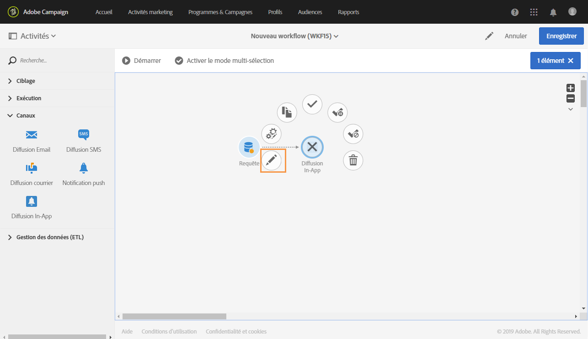
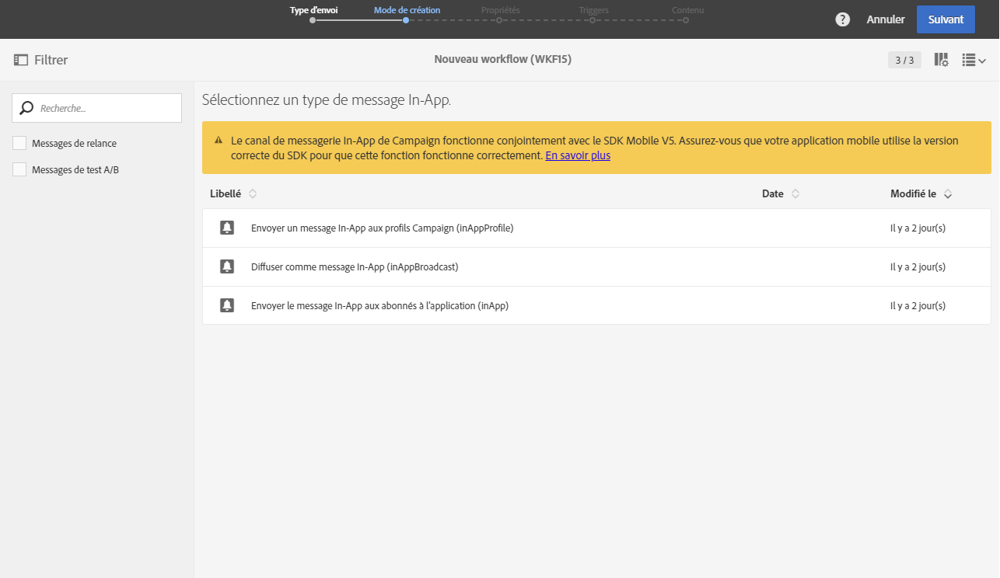
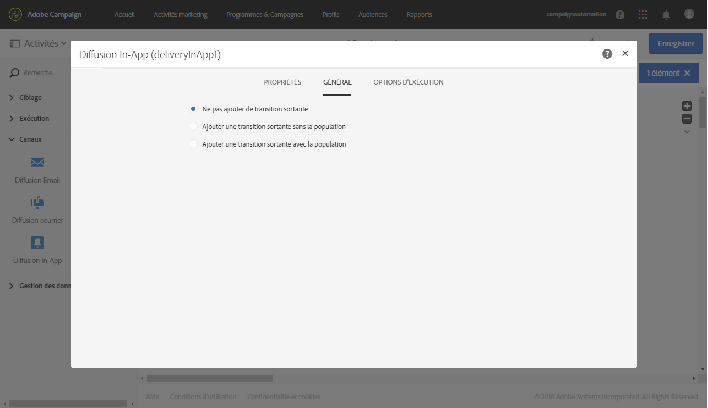

# Diffusion In-App{#in-app-delivery}

## Description {#description}

L'activité **Diffusion In-App** permet de paramétrer l'envoi d'un message in-app dans un workflow. La messagerie in-app permet d'afficher un message lorsque l'utilisateur est actif dans l'application. Pour plus d'informations sur la diffusion In-App, consultez cette [section](../../channels/using/about-in-app-messaging.md).

## Contexte d'utilisation {#context-of-use}

L'activité **[!UICONTROL Diffusion In-App]est généralement utilisée afin d'automatiser l'envoi d'un message in-app à une audience cible calculée dans le même workflow.**

Les destinataires sont définis en amont de l'activité dans le même workflow, grâce à des activités de ciblage telles que requêtes, intersections, etc.

La préparation du message est déclenchée selon les paramètres d'exécution du workflow. Depuis le tableau de bord du message, vous pouvez choisir de demander ou non une confirmation manuelle pour envoyer le message (requise par défaut). Vous pouvez lancer manuellement le workflow ou bien placer une activité de planification afin d'en automatiser l'exécution.

## Configuration {#configuration}

1. Placez une activité **[!UICONTROL Requête]dans votre workflow.** La dimension de ciblage de l'activité **[!UICONTROL Requête]** dans l'onglet **Propriétés]doit être mise à jour selon le modèle sélectionné à l'étape 4 :[!UICONTROL **

   * La dimension de ciblage doit être définie sur **[!UICONTROL mobileApp (mobileAppV5)]** pour le modèle **[!UICONTROL Cibler tous les utilisateurs d'une application mobile (inAppBroadcast)]**.
   * La dimension de ciblage doit être définie sur **[!UICONTROL Profil (profile)]** pour le modèle **Cibler les utilisateurs en fonction de leur profil Campaign (inAppProfile)[!UICONTROL .]**
   * La dimension de ciblage doit être définie sur **[!UICONTROL abonnements à une application (nms:appSubscriptionRcp:appSubscriptionRcpDetail)]** pour le modèle **Cibler les utilisateurs en fonction de leur profil Mobile (inApp)[!UICONTROL .]**

1. Placez une activité **[!UICONTROL Diffusion In-App]dans votre workflow.**
1. Sélectionnez l'activité puis ouvrez-la à l'aide du bouton 

   >[!NOTE]
   >
   >Les propriétés générales et les options avancées de l'activité (et non de la diffusion elle-même) sont disponibles à l'aide du bouton 

   

1. Sélectionnez le type de message in-app. Celui-ci dépendra des données ciblées dans votre activité **[!UICONTROL Requête].**

   * **[!UICONTROL Cibler les utilisateurs en fonction de leur profil Campaign (inAppProfile)]** : ce type de message permet de cibler les profils Adobe Campaign abonnés à votre application mobile et de personnaliser les messages In-App avec les attributs de profil disponibles dans Campaign.
   * **[!UICONTROL Cibler tous les utilisateurs d'une application mobile (inAppBroadcast)]** : ce type de message permet d'envoyer un message à tous les utilisateurs de votre application mobile, même s'ils ne possèdent pas de profil dans Campaign.
   * **[!UICONTROL Cibler les utilisateurs en fonction de leur profil Mobile (inApp)]** : ce type de message permet de cibler tous les utilisateurs d'une application mobile ayant un profil mobile dans Campaign, qu'ils soient connus ou non, et de personnaliser les messages in-app avec tous les attributs de profil obtenus à partir de l'appareil mobile.
   

1. Renseignez les propriétés du message in-app et sélectionnez votre application mobile dans le champ **[!UICONTROL Associer une application mobile à une diffusion].**
1. Dans l'onglet **[!UICONTROL Triggers], placez l'événement qui déclenchera votre message.** Trois catégories d'événements sont disponibles :
1. Définissez le contenu du message in-app. Consultez la section concernant la [personnalisation des messages in-app](../../channels/using/customizing-an-in-app-message.md).
1. Par défaut, l'activité **[!UICONTROL Diffusion In-App]ne possède aucune transition sortante.** Si vous souhaitez ajouter une transition sortante à votre activité **[!UICONTROL Diffusion In-App]**, accédez à l'onglet **Général]des options avancées de l'activité (bouton

   * **[!UICONTROL Ajouter une transition sortante sans la population]** : permet de générer une transition sortante contenant la même population que la transition entrante.
   * **[!UICONTROL Ajouter une transition sortante avec la population]** : permet de générer une transition sortante contenant la population à qui le message a été envoyé. Les membres de la cible exclus pendant la préparation de la diffusion sont exclus de cette transition.
   

1. Validez le paramétrage de l'activité et enregistrez le workflow.

Lorsque vous ouvrez à nouveau l'activité par la suite, vous accédez au tableau de bord du message in-app. Seul son contenu reste modifiable.

Par défaut, le démarrage d'un workflow de diffusion déclenche uniquement la préparation des messages. L'envoi des messages créés depuis un workflow doit toujours être confirmé après le démarrage du workflow. Dans le tableau de bord des messages, vous pouvez toutefois désactiver l'option **[!UICONTROL Demander confirmation avant d'envoyer les messages]si les messages ont été créés depuis un workflow.** Lorsque cette option est décochée, les messages sont envoyés sans autre préavis une fois la préparation terminée.

## Remarques {#remarks}

Les diffusions créées à partir d'un workflow sont accessibles dans la liste des activités marketing de l'application. Vous pouvez visualiser l'état d'exécution du workflow depuis le tableau de bord. Des liens dans le volet de résumé de la notification push vous permettent d'accéder directement aux éléments liés (workflow, campagne, etc.).

Depuis les diffusions parentes, accessibles depuis la liste des activités marketing, vous pouvez visualiser l'ensemble des envois ayant été réalisés (en fonction de la période d'agrégation définie lors du paramétrage de l'activité **[!UICONTROL Diffusion In-App].)** Pour cela, accédez au détail du bloc **[!UICONTROL Déploiement]** de la diffusion parente en sélectionnant .
