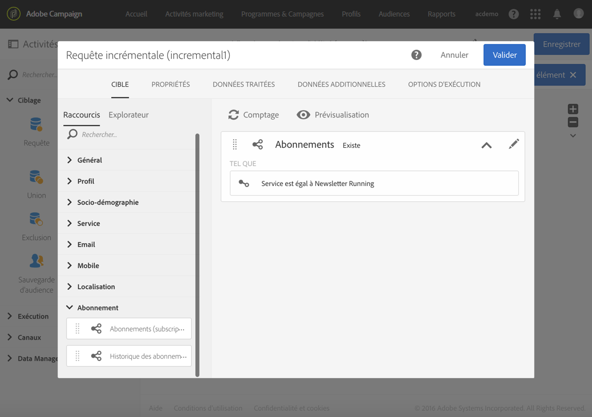

# Incremental query on subscribers to a service {#example--incremental-query-on-subscribers-to-a-service}

L&#39;exemple suivant illustre le paramétrage d&#39;une activité de **[!UICONTROL Requête incrémentale]** visant à filtrer les profils de la base Adobe Campaign qui sont abonnés au service **Newsletter Running**, afin de leur envoyer un email de bienvenue contenant un code promotion.

Le workflow est construit de la manière suivante :

* Un [Planificateur](../../automating/using/scheduler.md), afin que le workflow s&#39;exécute chaque lundi à 6h.

   

* Une [Requête incrémentale](../../automating/using/incremental-query.md), permettant de cibler tous les abonnés actuels lors de la première exécution, puis uniquement les nouveaux abonnés de la semaine lors des exécutions suivantes.

   

* Une [Diffusion Email](../../automating/using/email-delivery.md). Le workflow est exécuté une fois par semaine, mais vous pouvez agréger les emails envoyés ainsi que les résultats par mois, par exemple pour générer des rapports portant sur un mois entier et non une seule semaine.

   Pour cela, choisissez ici de créer un **[!UICONTROL Email récurrent]** regroupant les emails et les résultats **[!UICONTROL Par mois]**.

   Définissez le contenu de votre email, en insérant le code promotion de bienvenue. Pour plus d&#39;informations sur ce sujet, reportez-vous aux sections [Définition du contenu](../../designing/using/personalization.md) des courriels.

Lancez alors l&#39;exécution du workflow. Chaque semaine les nouveaux abonnés recevront l&#39;email de bienvenue avec le code promotion.
