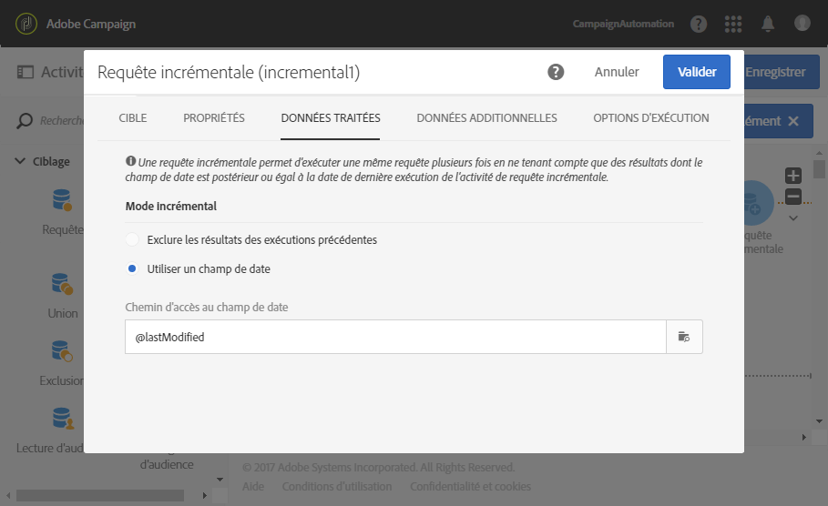
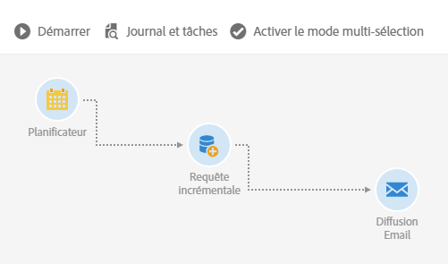
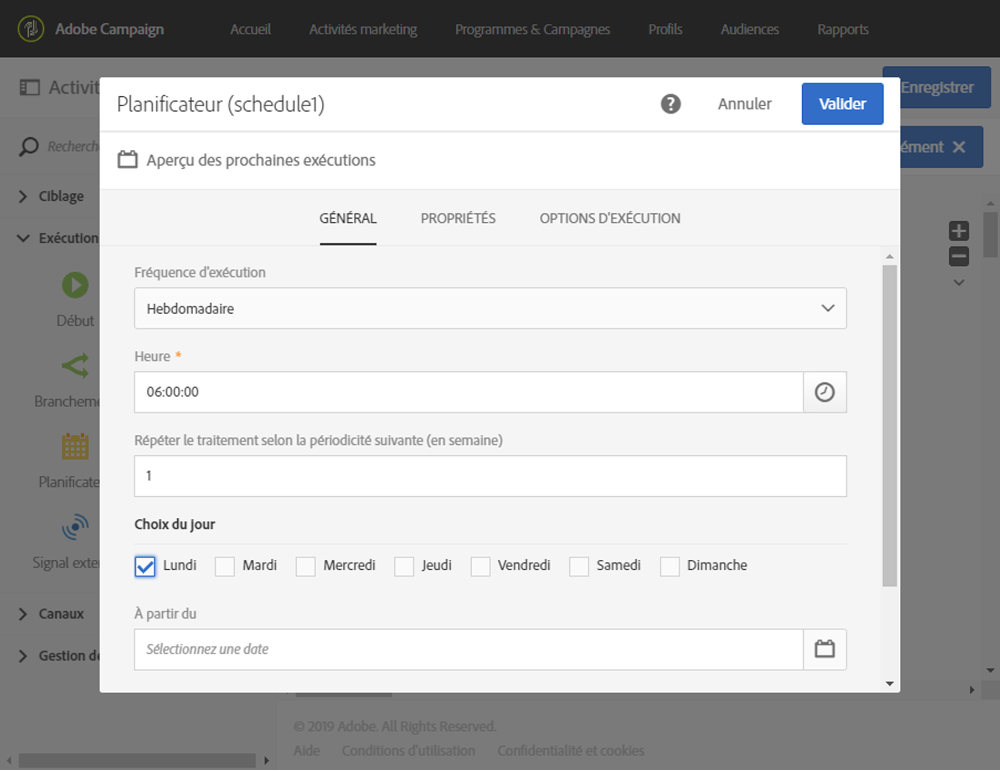

# Requête incrémentale{#incremental-query}

## Description {#description}

L'activité **[!UICONTROL Requête incrémentale]permet de filtrer et d'extraire une population d'éléments de la base de données Adobe Campaign.** A chaque nouvelle exécution de cette activité, les résultats des exécutions précédentes sont exclus. Cela permet de ne cibler que les éléments nouveaux.

Vous pouvez définir des **[!UICONTROL Données additionnelles]pour la population ciblée via un onglet dédié.** Ces données sont stockées dans des colonnes additionnelles et sont exploitables uniquement pour le workflow en cours.

L'activité utilise l'outil d'édition de requêtes, dont le fonctionnement est détaillé dans une [section dédiée](../../automating/using/editing-queries.md#about-query-editor).

## Contexte d'utilisation {#context-of-use}

Une **[!UICONTROL Requête incrémentale]** doit être associée à un **Planificateur]afin de définir la récurrence de l'exécution du workflow, et donc de la requête.[!UICONTROL **

L'onglet **[!UICONTROL Données traitées], spécifique à cette activité, permet de visualiser les résultats des exécutions précédentes de l'activité, le cas échéant.**

L'activité **[!UICONTROL Requête incrémentale]peut être utilisée dans plusieurs cas d'utilisation type :**

* segmentation d'individus afin de définir la cible d'un message, une audience, etc.
* export de données.

## Configuration {#configuration}

1. Placez une activité **[!UICONTROL Requête incrémentale]dans votre workflow.**
1. Sélectionnez l'activité puis ouvrez-la à l'aide du bouton 
1. If you would like to run a query on a resource other than the profile resource, go to the activity's **[!UICONTROL Properties]** tab and select a **[!UICONTROL Resource]** and a **[!UICONTROL Targeting dimension]**.

   **[!UICONTROL La ressource]** permet d'affiner les filtres affichés dans la palette alors que la dimension **[!UICONTROL Ciblage]**, contextuelle relative à la ressource sélectionnée, correspond au type de population à obtenir (profils identifiés, livraisons, données liées à la ressource sélectionnée, etc.).

1. Depuis l'onglet **[!UICONTROL Cible], effectuez votre requête en définissant et combinant des règles.**
1. Dans l'onglet **[!UICONTROL Données traitées], sélectionnez le mode incrémental que vous souhaitez utiliser pour les prochaines exécutions du workflow :**

   * **[!UICONTROL Exclure les résultats des exécutions précédentes]** : à chaque nouvelle exécution, les résultats des exécutions précédentes sont exclus.
   * **[!UICONTROL Utiliser un champ date]** : les prochaines exécutions tiennent compte uniquement des résultats pour lesquels le champ date sélectionné est postérieur ou égal à la date de dernière exécution de l'activité **[!UICONTROL Requête incrémentale.]** Vous pouvez sélectionner un champ date associé à la ressource sélectionnée dans l'onglet **[!UICONTROL Propriétés.]** Ce mode offre de meilleures performances lors de l'interrogation de ressources volumineuses telles que des données de log.

      Après la première exécution du workflow, vous pouvez voir dans cet onglet la date de dernière exécution qui sera utilisée pour la prochaine exécution. Cette date est automatiquement mise à jour à chaque exécution du workflow. Vous avez toujours la possibilité de remplacer cette valeur en en saisissant une autre qui répond à vos besoins.
   >[!NOTE]
   >
   >Le mode **[!UICONTROL Utiliser un champ date]offre davantage de flexibilité selon le champ date sélectionné.** Par exemple, si le champ sélectionné correspond à une date de modification, le mode du champ date vous permet de récupérer les données qui ont été récemment mises à jour. L'autre mode, en revanche, exclut simplement les enregistrements qui ont déjà été ciblés dans une exécution précédente, même s'ils ont été modifiés depuis la dernière exécution du workflow.

   

1. Vous pouvez définir des **[!UICONTROL Données additionnelles]pour la population ciblée via un onglet dédié.** Ces données sont stockées dans des colonnes additionnelles et sont exploitables uniquement pour le workflow en cours. Vous pouvez notamment ajouter des données provenant des tables de la base Adobe Campaign liées à la dimension de ciblage de la requête. Consultez la section [Enrichir des données](../../automating/using/query.md#enriching-data).
1. Validez le paramétrage de l'activité et enregistrez le workflow.

## Enrichir des données {#enriching-data}

De la même manière que pour une requête, vous pouvez enrichir les données issues d'une **[!UICONTROL Requête incrémentale]**. Consultez la section [Enrichir des données](../../automating/using/query.md#enriching-data).

## Exemple : requête incrémentale sur les abonnés à un service {#example--incremental-query-on-subscribers-to-a-service}

L'exemple suivant illustre le paramétrage d'une activité de **[!UICONTROL Requête incrémentale]** visant à filtrer les profils de la base Adobe Campaign qui sont abonnés au service **Newsletter Running**, afin de leur envoyer un email de bienvenue contenant un code promotion.

Le workflow est construit de la manière suivante :

* Un **[!UICONTROL Planificateur], afin que le workflow s'exécute chaque lundi à 6h.**

   

* Une **[!UICONTROL Requête incrémentale], permettant de cibler tous les abonnés actuels lors de la première exécution, puis uniquement les nouveaux abonnés de la semaine lors des exécutions suivantes.**

   

* Une **[!UICONTROL Diffusion Email.]** Le workflow est exécuté une fois par semaine, mais vous pouvez agréger les emails envoyés ainsi que les résultats par mois, par exemple pour générer des rapports portant sur un mois entier et non une seule semaine.

   Pour cela, choisissez ici de créer un **[!UICONTROL Email récurrent]** regroupant les emails et les résultats **[!UICONTROL Par mois]**.

   Définissez le contenu de votre email, en insérant le code promotion de bienvenue.

   Pour en savoir plus, consultez les sections [Diffusion Email](../../automating/using/email-delivery.md) et [Définir le contenu d'un email](../../designing/using/about-personalization.md).

Lancez alors l'exécution du workflow. Chaque semaine les nouveaux abonnés recevront l'email de bienvenue avec le code promotion.

## Exemple : requête incrémentale sur les logs de diffusion {#example--incremental-query-on-delivery-logs}

Vous pouvez utiliser une activité **[!UICONTROL Requête incrémentale]pour exporter de manière régulière les nouveaux logs vers des fichiers.** Cet export peut s'avérer utile si vous souhaitez par exemple utiliser les données des logs dans des outils de Business Intelligence ou de reporting externes.

Un exemple complet est présenté dans la section [Exporter des logs](../../automating/using/exporting-logs.md).
