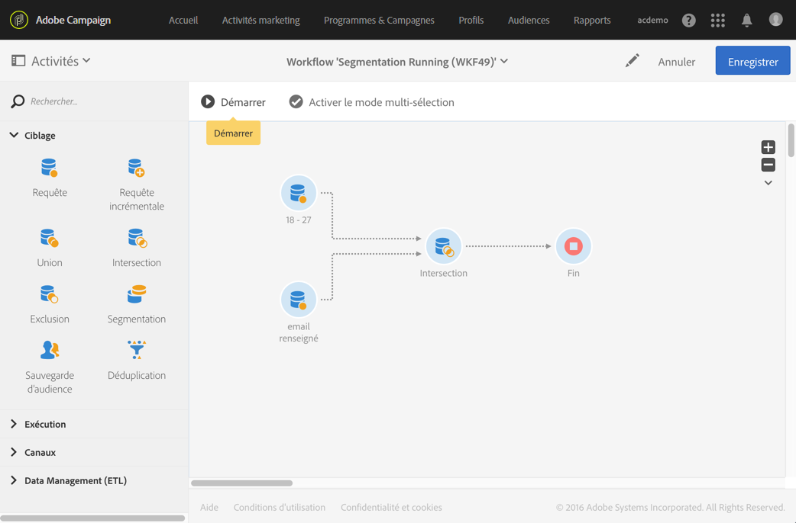

# Intersection{#intersection}

## Description {#description}

L'activité **[!UICONTROL Intersection]permet de ne conserver que les éléments communs aux différentes populations entrantes dans l'activité.**

## Contexte d'utilisation {#context-of-use}

L'activité **[!UICONTROL Intersection]est essentiellement utilisée afin de réaliser un filtrage supplémentaire sur les populations des transitions entrantes.**

## Configuration {#configuration}

1. Placez une activité **[!UICONTROL Intersection]dans votre workflow.**
1. Connectez-la à la suite d'autres activités telles que des requêtes.
1. Sélectionnez l'activité puis ouvrez-la à l'aide du bouton 
1. Select the **[!UICONTROL Reconciliation type]**:

   * **[!UICONTROL Uniquement les clés : mode par défaut.]** L'activité ne conserve qu'un élément lorsque des éléments provenant des différentes transitions entrantes ont la même clé.
   * **[!UICONTROL Toutes les colonnes communes : les données sont réconciliées sur la base des colonnes communes aux transitions entrantes.]** Vous devez alors sélectionner l'ensemble principal qui servira de base de comparaison. Cette option peut être utilisée notamment si les dimensions de ciblage des populations entrantes sont différentes.
   * **[!UICONTROL Une sélection de colonnes]** : sélectionnez cette option pour définir la liste des colonnes sur lesquelles sera appliquée la réconciliation des données. Vous devez d'abord sélectionner l'ensemble principal (celui qui contient les données sources), puis définir les champs à utiliser pour la jointure.

1. Cochez la case **[!UICONTROL Utiliser uniquement les données additionnelles communes]si vous souhaitez ne conserver que les données additionnelles présentes dans toutes les transitions entrantes.**
1. Si besoin, gérez les [Transitions](../../automating/using/executing-a-workflow.md#managing-an-activity-s-outbound-transitions) de l'activité afin d'accéder à des options avancées sur la population transmise en sortie.
1. Validez le paramétrage de l'activité et enregistrez le workflow.

## Exemple {#example}

L'exemple suivant montre l'intersection de deux activités de requête visant à filtrer respectivement les profils de la base Adobe Campaign dont l'âge est compris entre 18 et 27 ans et ceux dont l'adresse email renseignée est valide.

