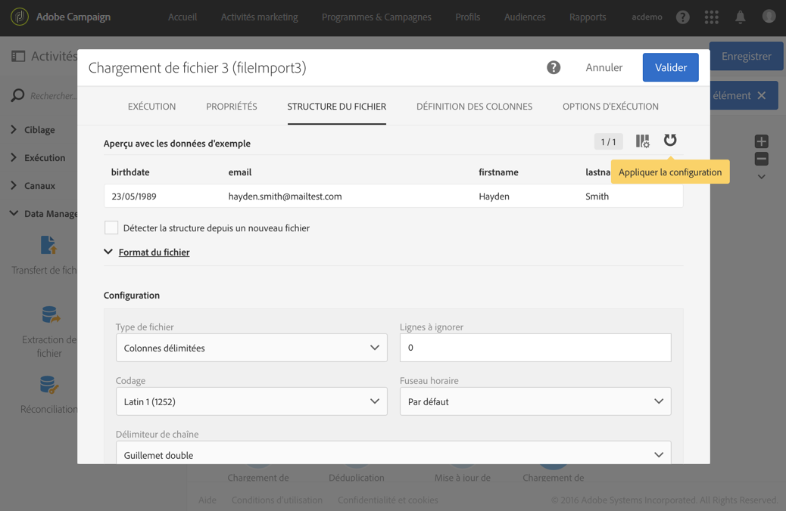
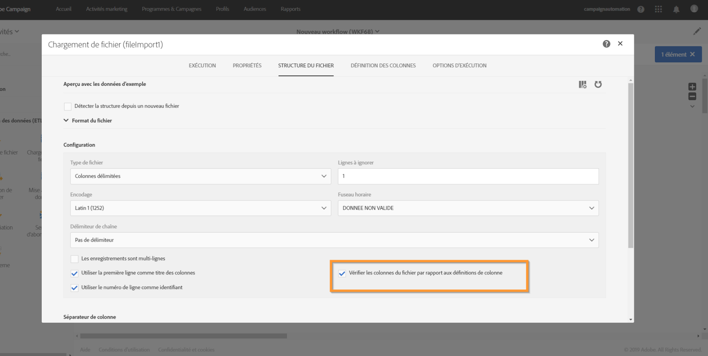
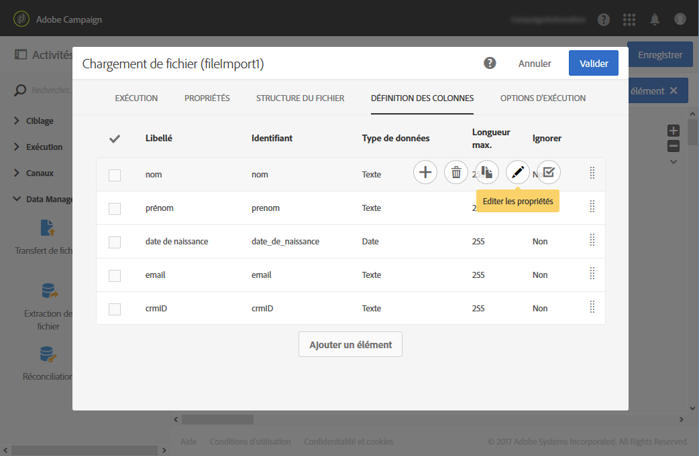
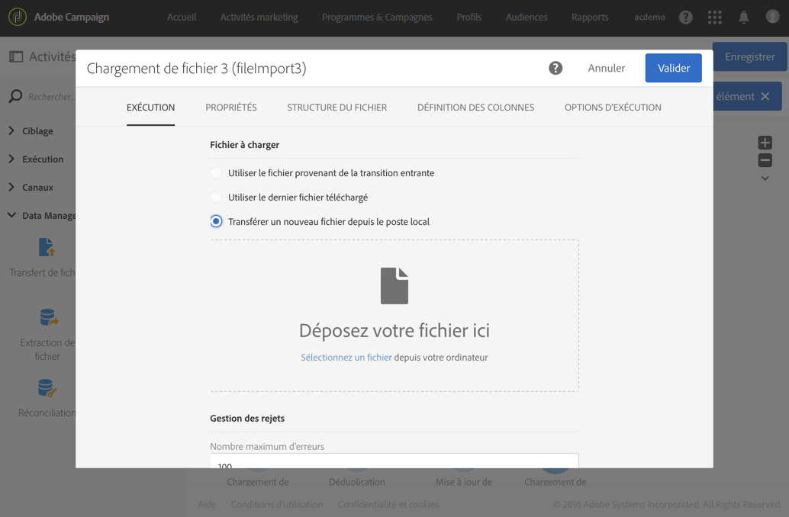
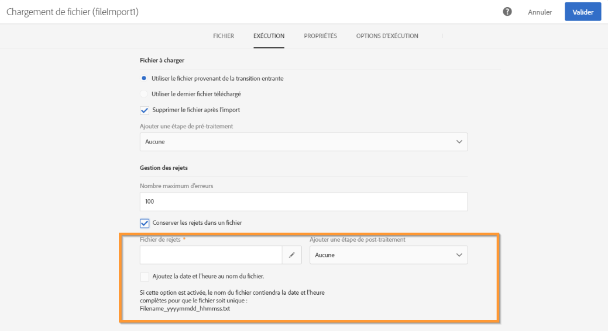
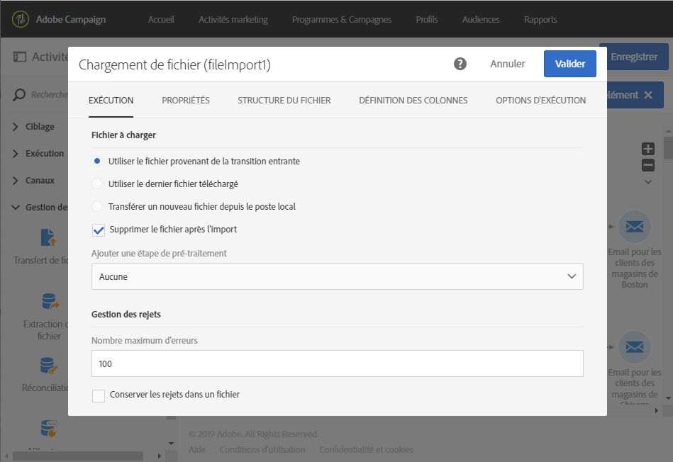

# Chargement de fichier{#load-file}

## Description {#description}

L'activité **[!UICONTROL Chargement de fichier]** permet d'importer les données d'un fichier sous une forme structurée afin de les utiliser dans Adobe Campaign. Les données importées le sont temporairement et nécessitent l'utilisation d'une autre activité pour les intégrer définitivement dans la base de données Adobe Campaign.

## Contexte d'utilisation  {#context-of-use}

La façon dont les données seront extraites est définie lors du paramétrage de l'activité. Le fichier à charger peut par exemple être une liste de contacts.

>[!CAUTION]
>
>Seuls les fichiers à structure "plate" sont pris en charge, comme par exemple les fichiers .txt, .csv, etc.

Vous pouvez ainsi :

* utiliser la structure du fichier pour l'appliquer aux données d'un autre fichier (récupéré grâce à l'activité **[!UICONTROL Transfert de fichier]**) ou,
* utiliser la structure et les données du fichier pour les importer dans Adobe Campaign.

## Configuration  {#configuration}

Le paramétrage de l'activité se déroule en deux temps. Tout d'abord, vous devez définir la structure du fichier attendue en téléchargeant un fichier d'exemple. Une fois cela réalisé, vous pouvez spécifier la provenance du fichier dont les données seront importées.

>[!NOTE]
>
>Les données du fichier d'exemple sont utilisées pour le paramétrage de l'activité mais ne sont pas importées. Il est recommandé d'utiliser un fichier d'exemple avec peu de données.

1. Placez une activité **[!UICONTROL Chargement de fichier]** dans votre workflow.
1. Sélectionnez l'activité puis ouvrez-la à l'aide du bouton , disponible dans les actions rapides qui s'affichent.
1. Téléchargez le fichier d'exemple qui permettra de définir la structure attendue lors de l'import du fichier final.

   

   Deux nouveaux onglets s'affichent dans l'activité après le téléchargement du fichier de données : **[!UICONTROL Structure du fichier]** et **[!UICONTROL Définition des colonnes]**.

1. Depuis l'onglet **[!UICONTROL Structure du fichier]**, visualisez la structure automatiquement détectée du fichier d'exemple.

   Si la structure du fichier a été détectée de manière incorrecte, vous disposez de plusieurs options permettant de corriger les éventuelles erreurs :

   * Vous pouvez choisir d'utiliser la structure d'un autre fichier en sélectionnant l'option **[!UICONTROL Détecter la structure depuis un nouveau fichier]**.
   * Vous pouvez modifier les paramètres de détection par défaut afin de les adapter à votre fichier. Le champ **[!UICONTROL Type de fichier]** permet d'indiquer si le fichier à importer est composé de colonnes à longueur fixe. Si c'est le cas, vous devez également spécifier le nombre maximal de caractères pour chaque colonne dans l'onglet **[!UICONTROL Définition des colonnes]**.

      Dans **[!UICONTROL Format du fichier]** sont regroupées toutes les options de détection nécessaires pour récupérer correctement les données du fichier. Vous pouvez les modifier puis détecter à nouveau la structure du dernier fichier chargé dans l'activité en prenant en compte ces nouveaux paramètres. Utilisez pour cela le bouton **[!UICONTROL Appliquer la configuration]**. Vous pouvez par exemple spécifier un séparateur de colonnes différent.

      >[!NOTE]
      >
      >Cette opération prend en compte le dernier fichier téléchargé dans l'activité. Si le fichier détecté est volumineux, l'aperçu des données porte seulement sur les 30 premières lignes.

      

      Dans la section **[!UICONTROL Format du fichier]**, l'option **[!UICONTROL Vérifier les colonnes du fichier par rapport aux définitions de colonne]** vous permet de vérifier que les colonnes du fichier que vous téléchargez correspondent à la définition des colonnes.

      Si le nombre et/ou le nom des colonnes ne correspond pas à la définition des colonnes, un message d'erreur apparaîtra lors de l'exécution du workflow. Si l'option n'est pas activée, les avertissements figureront dans le log.

      

1. Depuis l'onglet **[!UICONTROL Définition des colonnes]**, vérifiez le format des données de chaque colonne et ajustez les paramètres si nécessaire.

   L'onglet **[!UICONTROL Définition des colonnes]** vous permet de définir précisément la structure des données de chaque colonne pour importer des données qui ne contiennent pas d'erreur (grâce à la gestion des nulls par exemple) et les faire correspondre aux types pré-existants de la base Adobe Campaign pour des opérations ultérieures.

   Vous pouvez par exemple modifier le libellé d'une colonne, sélectionner son type (chaîne, nombre entier, date, etc.) ou encore définir le traitement des erreurs.

   Voir à ce sujet [Format des colonnes](../../automating/using/load-file.md#column-format).

   

1. Dans l'onglet **[!UICONTROL Exécution]**, spécifiez si le fichier à exploiter pour le chargement des données :

   * provient de la transition entrante dans le workflow,
   * est celui que vous avez téléchargé lors de l'étape précédente.
   * est un nouveau fichier à télécharger depuis le poste local. L'option **[!UICONTROL Transférer un nouveau fichier depuis le poste local]** s'affiche si le téléchargement d'un premier fichier a déjà été défini dans le workflow. Elle vous permet de télécharger un autre fichier à exploiter si le fichier actuel ne convient pas.

      

1. Si le fichier dont vous souhaitez charger les données est compressé dans un fichier GZIP (.gz), sélectionnez l'option **[!UICONTROL Décompression]** au niveau du champ **[!UICONTROL Ajouter une étape de pré-traitement]**. Cela permet de décompresser le fichier avant de procéder au chargement des données. Cette option est disponible uniquement si le fichier provient de la transition entrante de l'activité.
1. L'option **[!UICONTROL Conserver les rejets dans un fichier]** permet de télécharger un fichier contenant des erreurs s'étant produites lors de l'import et de l'appliquer à une étape de post-traitement.

   >[!NOTE]
   >
   >L'option **[!UICONTROL Ajoutez la date et l'heure au nom du fichier]** permet d'ajouter un horodatage au nom du fichier contenant les rejets.

   

1. Validez le paramétrage de l'activité et enregistrez le workflow.

## Format des colonnes  {#column-format}

Lorsque vous téléchargez un fichier d'exemple, le format des colonnes est automatiquement détecté avec des paramètres par défaut pour chaque type de données. Vous pouvez modifier ces paramètres par défaut afin de spécifier des traitements particulier à appliquer à vos données, notamment en cas d'erreur ou de valeur vide.

Pour cela, sélectionnez **[!UICONTROL Editer les propriétés]** dans les actions rapides de la colonne dont vous souhaitez définir le format. La fenêtre de détail du format de la colonne s'ouvre.

Vous pouvez alors modifier le formatage de chaque colonne.

Le formatage des colonnes permet de définir le traitement des valeurs de chaque colonne :

* **[!UICONTROL Ignorer la colonne]** : permet de ne pas traiter cette colonne lors du chargement des données.
* **[!UICONTROL Type de données]** : permet de spécifier le type de données attendu dans la colonne.
* **[!UICONTROL Format et séparateurs]**, **Propriétés** : permettent de définir les propriétés d'un texte, le format des heures, des dates et des valeurs numériques ainsi que le séparateur spécifié par le contexte de la colonne.

   * **[!UICONTROL Nombre de caractères maximum]** : permet de spécifier le nombre maximum de caractères pour les colonnes de type chaîne.

      Ce champ doit être renseigné lors du chargement des fichiers composés de colonnes à longueur fixe.

   * **[!UICONTROL Gestion de la casse]** : permet de définir si un traitement au niveau de la casse doit être appliqué pour les données de type **Texte**.
   * **[!UICONTROL Gestion des espaces]** : permet d'indiquer si certains espaces doivent être ignorés dans une chaîne pour les données de type **Texte**.
   * **[!UICONTROL Format des heures]**, **[!UICONTROL Format des dates]** : permettent de définir le format des heures ou des dates pour les données de type **Date**, **Heure** et **Date et heure**.
   * **[!UICONTROL Format]** : permet de définir le format des valeurs numériques pour les données de type **Nombre entier** et **Nombre flottant**.
   * **[!UICONTROL Séparateur]** : permet de définir le séparateur spécifié par le contexte de la colonne (séparateur de milliers ou séparateur décimal pour les valeurs numériques, séparateur pour les dates et les heures) pour les données de type **Date**, **Heure**, **Date et Heure**, **Nombre entier** et **Nombre flottant**.

* **[!UICONTROL Recodification des valeurs]** : ce champ est disponible uniquement dans le paramétrage du détail d'une colonne. Il permet de transformer certaines valeurs lors de l'import. Par exemple, vous pouvez transformer "trois" en "3".
* **[!UICONTROL Traitement des erreurs]** : permet de définir le comportement en cas d'erreur.

   * **[!UICONTROL Ignorer la valeur]** : la valeur est ignorée. Un avertissement est généré dans le journal d'exécution du workflow.
   * **[!UICONTROL Rejeter la ligne]** : la ligne entière n'est pas traitée.
   * **[!UICONTROL Utiliser une valeur par défaut]** : remplace la valeur causant l'erreur par une valeur par défaut, définie dans le champ **[!UICONTROL Valeur par défaut]**.
   * **[!UICONTROL Utiliser une valeur par défaut en cas d'absence de recodification]** : remplace la valeur causant l'erreur par une valeur par défaut, définie dans le champ **[!UICONTROL Valeur par défaut]**, sauf si une recodification a été définie pour la valeur en erreur (voir option **[!UICONTROL Recodification des valeurs]** ci-dessus).
   * **[!UICONTROL Rejeter la ligne en cas d'absence de recodification]** : la ligne entière n'est pas traitée sauf si une recodification a été définie pour la valeur en erreur (voir option **[!UICONTROL Recodification des valeurs]** ci-dessus).
   >[!NOTE]
   >
   >**[!UICONTROL Le Traitement des erreurs]** concerne les erreurs au niveau des valeurs renseignées dans le fichier importé. Par exemple, un mauvais type de données rencontré ("quatre" en toutes lettres pour une colonne de type "Nombre entier"), une chaîne contenant plus de caractères que le nombre maximum autorisé, une date avec les mauvais séparateurs, etc. En revanche, cette option ne concerne pas les erreurs générées par la gestion des valeurs vides.

* **[!UICONTROL Valeur par défaut]** : permet de spécifier la valeur par défaut en fonction du choix concernant le traitement des erreurs.
* **[!UICONTROL Gestion des valeurs vides]** : permet d'indiquer comment gérer les valeurs vides rencontrées lors du chargement des données.

   * **[!UICONTROL Générer une erreur pour les champs numériques]** : génère une erreur pour les champs numériques uniquement, sinon insère la valeur NULL.
   * **[!UICONTROL Insérer NULL dans le champ correspondant]** : autorise les valeurs vides. La valeur NULL est alors insérée.
   * **[!UICONTROL Générer une erreur]** : génère une erreur en cas de valeur vide.

## Exemple {#example}

L'activité de chargement de fichier sert essentiellement à structurer des données issues d'une activité de transfert de fichier en vue de les intégrer à des données existantes.

L'exemple suivant montre le résultat d'une activité de chargement d'un fichier automatiquement téléchargé via une activité de transfert, suivie d'une mise à jour de données. Le but de ce workflow est d'enrichir la base Adobe Campaign avec de nouveaux profils ou de mettre à jour les profils existants à partir des données récupérées dans le fichier importé.

1. Placez une activité **[!UICONTROL Transfert de fichier]** dans votre workflow et paramétrez-la de façon à récupérer le fichier de votre choix.
1. Placez une activité **[!UICONTROL Chargement de fichier]** et connectez-la à la suite de l'activité **[!UICONTROL Transfert de fichier]**.
1. Sélectionnez l'activité puis ouvrez-la à l'aide du bouton , disponible dans les actions rapides qui s'affichent.
1. Dans la section **[!UICONTROL Fichier à charger]** de l'onglet **[!UICONTROL Exécution]**, cochez la case **[!UICONTROL Utiliser le fichier provenant de la transition entrante]**.

   

1. Paramétrez l'activité comme indiqué ci-dessus.
1. Placez une activité **[!UICONTROL Mise à jour de données]**, connectez-la à la suite de l'activité **[!UICONTROL Chargement de fichier]** et paramétrez-la. Voir [Mise à jour de données](../../automating/using/update-data.md).

Une fois le workflow lancé, le fichier voulu est téléchargé, les données sont extraites, puis elles sont utilisées pour enrichir la base Adobe Campaign.
