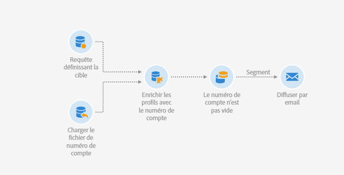
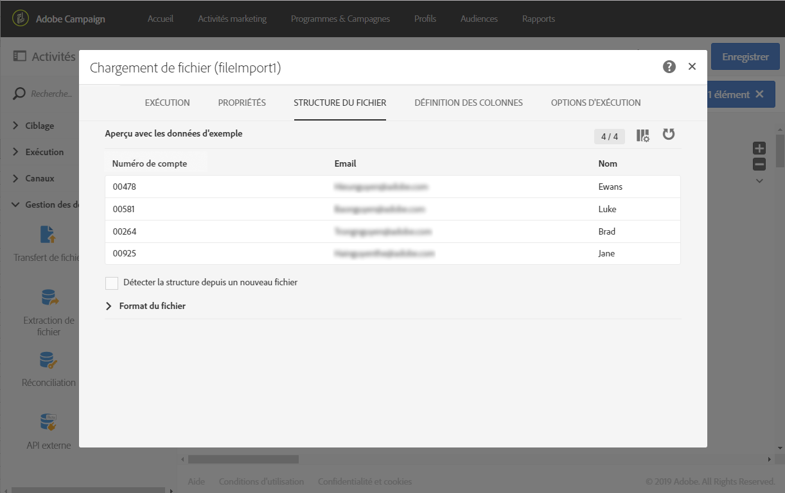
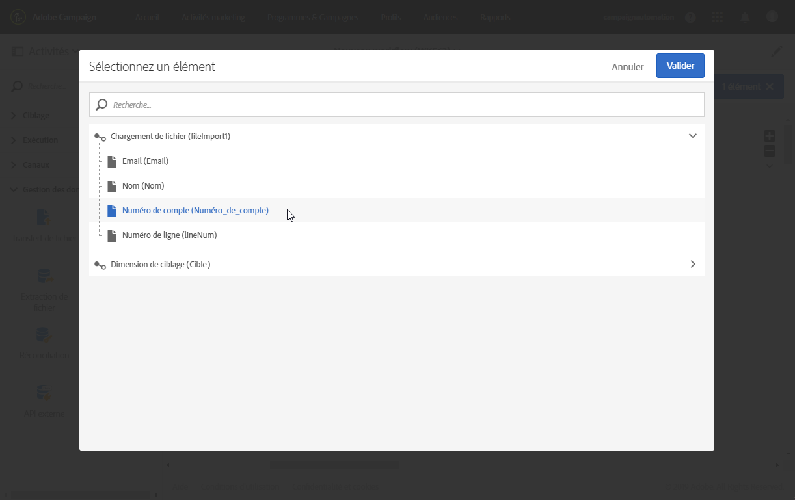
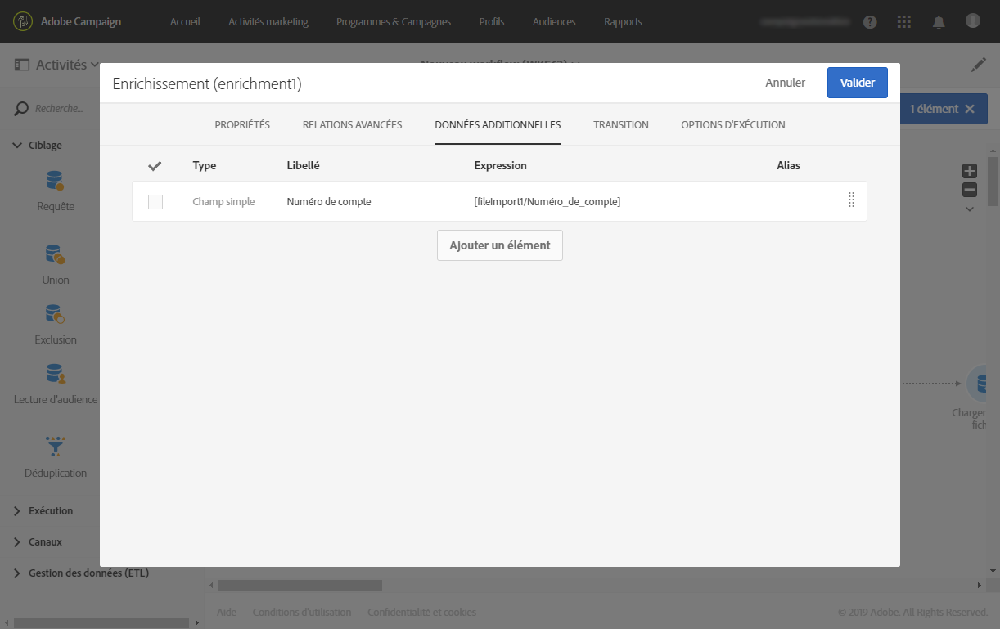

# Chargement de fichier {#load-file}

## Description {#description}

The **[!UICONTROL Load file]** activity allows you to import data in one structured form to use this data in Adobe Campaign. Les données importées le sont temporairement et nécessitent l&#39;utilisation d&#39;une autre activité pour les intégrer définitivement dans la base de données Adobe Campaign.

## Contexte d&#39;utilisation {#context-of-use}

La façon dont les données seront extraites est définie lors du paramétrage de l&#39;activité. Le fichier à charger peut par exemple être une liste de contacts.

>[!CAUTION]
>
>Seuls les fichiers de structure &quot;aplatis&quot; sont pris en compte, tels que les fichiers .txt, .csv, etc., par exemple.

Vous pouvez ainsi :

* Use the file structure to apply it to another file&#39;s data (recovered using the **[!UICONTROL Transfer file]** activity) or,
* utiliser la structure et les données du fichier pour les importer dans Adobe Campaign.

## Configuration {#configuration}

Le paramétrage de l&#39;activité se déroule en deux temps. Tout d&#39;abord, vous devez définir la structure du fichier attendue en téléchargeant un fichier d&#39;exemple. Une fois cela réalisé, vous pouvez spécifier la provenance du fichier dont les données seront importées.

>[!NOTE]
>
>Les données du fichier d&#39;exemple sont utilisées pour le paramétrage de l&#39;activité mais ne sont pas importées. Il est recommandé d&#39;utiliser un fichier d&#39;exemple avec peu de données.

1. Placez une activité **[!UICONTROL Load file]** dans votre workflow.
1. Sélectionnez l&#39;activité puis ouvrez-la à l&#39;aide du bouton , disponible dans les actions rapides qui s&#39;affichent.
1. Téléchargez le fichier d&#39;exemple qui permettra de définir la structure attendue lors de l&#39;import du fichier final.

   

   Once the data file is uploaded, two new tabs appear in the activity: **[!UICONTROL File structure]** and **[!UICONTROL Column definition]**.

1. Go to the **[!UICONTROL File structure]** tab to view the structure that is automatically detected from the sample file.

   Si la structure du fichier a été détectée de manière incorrecte, vous disposez de plusieurs options permettant de corriger les éventuelles erreurs :

   * Vous pouvez choisir d’utiliser la structure d’un autre fichier en sélectionnant l’ **[!UICONTROL Detect structure from a new file]** option.
   * Vous pouvez modifier les paramètres de détection par défaut afin de les adapter à votre fichier. The **[!UICONTROL File type]** field lets you specify if the file you want to import is made up of columns with fixed length. In that case, you must also specify the maximum number of characters for each column in the **[!UICONTROL Column definition]** tab.

      All of the detection options necessary to correctly recover the data from the file are regrouped in **[!UICONTROL File format]**. Vous pouvez les modifier puis détecter à nouveau la structure du dernier fichier chargé dans l&#39;activité en prenant en compte ces nouveaux paramètres. Pour ce faire, utilisez le **[!UICONTROL Apply configuration]** bouton. Vous pouvez par exemple spécifier un séparateur de colonnes différent.

      >[!NOTE]
      >
      >Cette opération prend en compte le dernier fichier téléchargé dans l&#39;activité. Si le fichier détecté est volumineux, l&#39;aperçu des données porte seulement sur les 30 premières lignes.

      

      Dans la **[!UICONTROL File format]** section, l’ **[!UICONTROL Check columns from file against column definitions]** option vous permet de vérifier que les colonnes du fichier que vous téléchargez correspondent à la définition de colonne.

      Si le nombre et/ou le nom des colonnes ne correspond pas à la définition des colonnes, un message d&#39;erreur apparaîtra lors de l&#39;exécution du workflow. Si l&#39;option n&#39;est pas activée, les avertissements figureront dans le log.

      

1. Go to the **[!UICONTROL Column definition]** tab to check the data format for each column and adjust the parameters if necessary.

   The **[!UICONTROL Column definition]** tab allows you to precisely specify the data structure of each column in order to import data that does not contain any errors (for example, using null management) and make it match the types that are already present in the Adobe Campaign database for future operations.

   Vous pouvez par exemple modifier le libellé d&#39;une colonne, sélectionner son type (chaîne, nombre entier, date, etc.) ou encore définir le traitement des erreurs.

   Voir à ce sujet [Format des colonnes](#column-format).

   

1. In the **[!UICONTROL Execution]** tab, specify whether the file is to be processed for loading data:

   * provient de la transition entrante dans le workflow ;
   * est celui que vous avez téléchargé lors de l&#39;étape précédente ;
   * est un nouveau fichier à télécharger depuis le poste local. L’ **[!UICONTROL Upload a new file from local machine]** option s’affiche si le téléchargement d’un premier fichier a déjà été défini dans le flux de travaux. Elle vous permet de télécharger un autre fichier à exploiter si le fichier actuel ne convient pas.

      

1. If the file that you want to load the data from is compressed into a GZIP file (.gz), select the **[!UICONTROL Decompression]** option in the **[!UICONTROL Add a pre-processing step]** field. Cela permet de décompresser le fichier avant de procéder au chargement des données. Cette option est disponible uniquement si le fichier provient de la transition entrante de l&#39;activité.
1. The **[!UICONTROL Keep the rejects in a file]** option enables you to download a file containing errors that occurred during the import, and to apply to it a post-processing stage. Lorsque l&#39;option est activée, la transition sortante est renommée &quot;Rejets&quot;.

   >[!NOTE]
   >
   >L’ **[!UICONTROL Add date and time to the file name]** option vous permet d’ajouter un horodatage au nom du fichier contenant les rejets.

   

1. Validez le paramétrage de l&#39;activité et enregistrez le workflow.

Si une erreur se produit dans l&#39;activité après l&#39;exécution du workflow, consultez les journaux pour obtenir plus de détails sur les valeurs incorrectes dans le fichier. Pour plus d&#39;informations sur les jounaux de workflows, reportez-vous à cette [section](../../automating/using/executing-a-workflow.md#monitoring)..

## Format des colonnes  {#column-format}

Lorsque vous téléchargez un fichier d&#39;exemple, le format des colonnes est automatiquement détecté avec des paramètres par défaut pour chaque type de données. Vous pouvez modifier ces paramètres par défaut afin de spécifier des traitements particulier à appliquer à vos données, notamment en cas d&#39;erreur ou de valeur vide.

To do this, select **[!UICONTROL Edit properties]** from the quick actions of the column whose format you would like to define. La fenêtre de détail du format de la colonne s&#39;ouvre.

Vous pouvez alors modifier le formatage de chaque colonne.

Le formatage des colonnes permet de définir le traitement des valeurs de chaque colonne :

* **[!UICONTROL Ignore column]**: ne traite pas cette colonne pendant le chargement des données.
* **[!UICONTROL Data type]**: spécifie le type de données attendu pour chaque colonne.
* **[!UICONTROL Format and separators]**, **Propriétés**: spécifiez les propriétés d’un texte, l’heure, la date et le format de valeur numérique, ainsi que le séparateur spécifié par le contexte de colonne.

   * **[!UICONTROL Maximum number of characters]**: spécifie le nombre maximal de caractères pour les colonnes de type chaîne.

      Ce champ doit être renseigné lors du chargement des fichiers composés de colonnes à longueur fixe.

   * **[!UICONTROL Letter case management]**: définit si un processus de casse des caractères doit être appliqué pour les données **de texte** .
   * **[!UICONTROL White space management]**: indique si certains espaces doivent être ignorés dans une chaîne pour les données **textuelles** .
   * **[!UICONTROL Time format]**, **[!UICONTROL Date format]**: spécifiez le format des données **Date**, **Heure** et **Date et Heure** .
   * **[!UICONTROL Format]** : permet de définir le format des valeurs numériques pour les données de type **Nombre entier** et **Nombre flottant**.
   * **[!UICONTROL Separator]**: définit le séparateur spécifié par le contexte de colonne (séparateur de milliers ou séparateur décimal pour les valeurs numériques, séparateur pour les dates et l’heure) pour les données **Date**, **Heure**, **Date et heure**, **Entier et Nombre flottant.******

* **[!UICONTROL Remapping of values]**: ce champ n’est disponible que dans la configuration des détails de colonne. Il permet de transformer certaines valeurs lors de l&#39;import. Par exemple, vous pouvez transformer &quot;trois&quot; en &quot;3&quot;.
* **[!UICONTROL Error processing]**: définit le comportement en cas d’erreur.

   * **[!UICONTROL Ignore the value]**: la valeur est ignorée. Un avertissement est généré dans le journal d&#39;exécution du workflow.
   * **[!UICONTROL Reject the line]**: la ligne entière n’est pas traitée.
   * **[!UICONTROL Use a default value]**: remplace la valeur à l’origine de l’erreur par une valeur par défaut, définie dans le **[!UICONTROL Default value]** champ.
   * **[!UICONTROL Use a default value in case the value is not remapped]**: remplace la valeur à l’origine de l’erreur par une valeur par défaut, définie dans le **[!UICONTROL Default value]** champ, sauf si un mappage a été défini pour la valeur erronée (voir l’ **[!UICONTROL Remapping of values]** option ci-dessus).
   * **[!UICONTROL Reject the line when there is no remapping value]**: la ligne entière n’est pas traitée, sauf si un mappage a été défini pour la valeur erronée (voir l’ **[!UICONTROL Remapping of values]** option ci-dessus).
   >[!NOTE]
   >
   >**[!UICONTROL Error processing]** concerne les erreurs relatives aux valeurs dans le fichier importé. Par exemple, un mauvais type de données rencontré (&quot;quatre&quot; en toutes lettres pour une colonne de type &quot;Nombre entier&quot;), une chaîne contenant plus de caractères que le nombre maximum autorisé, une date avec les mauvais séparateurs, etc. En revanche, cette option ne concerne pas les erreurs générées par la gestion des valeurs vides.

* **[!UICONTROL Default value]**: spécifie la valeur par défaut en fonction du traitement de l’erreur choisi.
* **[!UICONTROL Empty value management]**: indique comment gérer les valeurs vides pendant le chargement des données.

   * **[!UICONTROL Generate an error for numerical fields]**: génère une erreur pour les champs numériques uniquement, sinon insère une valeur NULL.
   * **[!UICONTROL Insert NULL in the corresponding field]**: autorise les valeurs vides. La valeur NULL est alors insérée.
   * **[!UICONTROL Generate an error]**: génère une erreur si une valeur est vide.

## Exemple 1 : mise à jour de la base de données {#example-1-update-the-database}

L&#39;activité de chargement de fichier sert essentiellement à structurer des données issues d&#39;une activité de transfert de fichier en vue de les intégrer à des données existantes.

L&#39;exemple suivant montre le résultat d&#39;une activité de chargement d&#39;un fichier automatiquement téléchargé via une activité de transfert, suivie d&#39;une mise à jour de données. Le but de ce workflow est d&#39;enrichir la base Adobe Campaign avec de nouveaux profils ou de mettre à jour les profils existants à partir des données récupérées dans le fichier importé.

1. Drag and drop a **[!UICONTROL Transfer file]** activity into your workflow and configure it in a way so that it recovers the file you would like.
1. Drag and drop a **[!UICONTROL Load file]** activity into your workflow and place it after the **[!UICONTROL Transfer file]** activity.
1. Sélectionnez l&#39;activité puis ouvrez-la à l&#39;aide du bouton , disponible dans les actions rapides qui s&#39;affichent.
1. Dans la **[!UICONTROL File to load]** section de l’ **[!UICONTROL Execution]** onglet, cochez l’ **[!UICONTROL Use the file specified in the inbound transition]** option.

   

1. Paramétrez l&#39;activité comme indiqué ci-dessus.
1. Drag and drop an **[!UICONTROL Update data]** activity into your workflow and place it after the **[!UICONTROL Load file]** activity, then configure it. Voir [Mise à jour de données](../../automating/using/update-data.md).

Une fois le workflow lancé, le fichier voulu est téléchargé, les données sont extraites, puis elles sont utilisées pour enrichir la base Adobe Campaign.

## Exemple 2 : envoi d&#39;un email contenant des champs enrichis {#example-2-email-with-enriched-fields}

<!--A new example showing how to send an email containing additional data retrieved from a load file activity has been added. [Read more](example-2-email-with-enriched-fields)-->

L&#39;activité Chargement de fichier permet également d&#39;envoyer un email enrichi avec des données additionnelles provenant d&#39;un fichier externe dans le même workflow.

L&#39;exemple ci-dessous montre comment envoyer un email enrichi avec des données additionnelles extraites d&#39;un fichier externe par le biais de l&#39;activité Chargement de fichier. Dans cet exemple, le fichier externe contient une liste de profils avec leur numéro de compte associé. Vous souhaitez importer ces données pour envoyer un email à chaque profil avec son numéro de compte.

1. Drag and drop a **[!UICONTROL Query]** activity into your workflow and open it to define the main target.

   <!--The Query activity is presented in the [Query](../../automating/using/query.md) section.-->

1. Drag and drop a **[!UICONTROL Load file]** activity to assign some data to a profile. Dans cet exemple, chargez un fichier contenant les numéros de compte correspondant à certains profils de la base de données.

   

1. Drag and drop an **[!UICONTROL Enrichment]** activity into your workflow and link the load file and query activities to it.

1. Dans l’ **[!UICONTROL Advanced relations]** onglet du    de, sélectionnez le **[!UICONTROL 0 or 1 cardinality simple link]** et définissez les champs à utiliser pour le rapprochement. Nous utilisons ici le nom de famille pour réconcilier les données avec les profils de base de données.

   

1. In the **[!UICONTROL Additional data]** tab, select the elements that you want to use in your email. Sélectionnez ici le numéro de compte (colonne du fichier que vous avez récupéré via l&#39;activité Chargement de fichier).

   

   <!---->

   Pour en savoir plus à ce sujet, reportez-vous à la section [Enrichissement](../../automating/using/enrichment.md).

1. Placez une activité **[!UICONTROL Segmentation]** dans votre workflow et ouvrez-la pour affiner la cible principale.

   

   Pour en savoir plus à ce sujet, reportez-vous à la section [Segmentation](../../automating/using/segmentation.md).

1. Drag and drop an **[!UICONTROL Email delivery]** activity into your workflow and open it.

   <!--The Email delivery activity is presented in the [Email delivery](../../automating/using/email-delivery.md) section.-->

1. Add a personalization field and select the additional data defined in the enrichment activity (here Account number) from the **[!UICONTROL Additional data (targetData)]** node. Vous pouvez ainsi récupérer dynamiquement le numéro de compte de chaque profil dans le contenu de l&#39;email.

   

1. Enregistrez l&#39;email et démarrez le workflow.

L&#39;email est envoyé à la cible. Chaque profil reçoit l&#39;email avec son numéro de compte correspondant.

