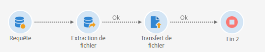
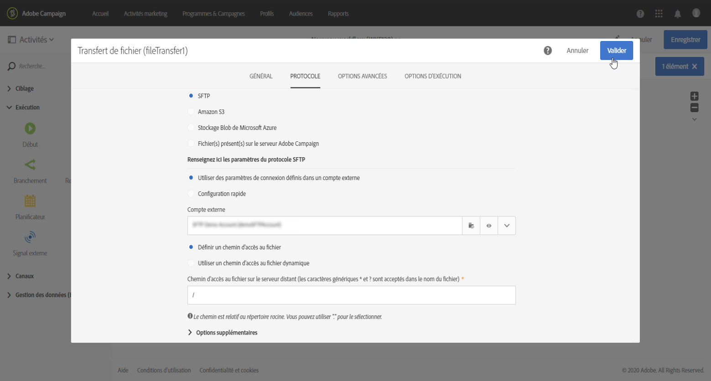

# Gérer des données cryptées {#managing-encrypted-data}

## À propos des étapes de prétraitement {#about-preprocessing-stages}

Dans certains cas, les données que vous souhaitez importer peuvent être cryptées, par exemple si elles contiennent des données PII.

Pour pouvoir crypter les données sortantes ou décrypter les données entrantes, vous devez gérer les clés GPG à l’aide du [panneau de contrôle](https://docs.adobe.com/content/help/fr-FR/control-panel/using/instances-settings/gpg-keys-management.html).

>[!NOTE]
>
>Le panneau de contrôle est disponible pour tous les clients hébergés sur AWS (à l’exception de ceux qui hébergent leurs instances marketing on-premise).

Si vous ne pouvez pas utiliser le panneau de contrôle, vous devez contacter l’Assistance clientèle d’Adobe afin qu’elle indique à votre instance les commandes de cryptage/décryptage nécessaires. Pour ce faire, envoyez une demande indiquant :

* Le **libellé** qui s’affichera dans l’interface de Campaign pour utiliser la commande. Par exemple, « Crypter le fichier ».
* La **commande** à installer sur votre instance.

Une fois la demande traitée, les commandes de cryptage/décryptage seront disponibles dans le champ **[!UICONTROL Étape de prétraitement]** des activités **[!UICONTROL Chargement de fichier]** et **[!UICONTROL Extraction de fichier]**. Vous pouvez les utiliser pour décrypter ou crypter les fichiers à importer ou exporter.

**Rubriques connexes :**

* [Chargement de fichier](../../automating/using/load-file.md)
* [Extraction de fichier](../../automating/using/extract-file.md)

## Cas pratique : import de données cryptées à l’aide d’une clé générée par le panneau de contrôle {#use-case-gpg-decrypt}

Dans ce cas pratique, nous allons créer un workflow afin d’importer des données cryptées dans un système externe, à l’aide d’une clé générée dans le panneau de contrôle.

Un tutoriel vidéo montrant comment utiliser une clé GPG pour décrypter des données est également disponible dans [cette section](https://docs.adobe.com/content/help/en/campaign-standard-learn/tutorials/administrating/control-panel/gpg-key-management/decrypting-data.html).

Les étapes pour traiter ce cas pratique sont les suivantes :

1. Utilisez le panneau de contrôle pour générer une paire de clés (publique/privée). Les étapes détaillées sont disponibles dans la [documentation du panneau de contrôle](https://docs.adobe.com/content/help/fr-FR/control-panel/using/instances-settings/gpg-keys-management.html#decrypting-data).

   * La clé publique sera partagée avec le système externe. Ce dernier l’utilisera pour crypter les données à envoyer à Campaign.
   * Campaign utilisera la clé privée pour décrypter les données cryptées entrantes.

   

1. Dans le système externe, utilisez la clé publique téléchargée à l’aide du panneau de contrôle pour crypter les données à importer dans Campaign Standard.

   

1. Dans Campaign Standard, créez un workflow pour importer les données cryptées et les décrypter à l’aide de la clé privée installée via le panneau de contrôle. Pour ce faire, nous allons créer un workflow comme suit :

   

   * **[!UICONTROL Transfert de fichier]** : transfère le fichier d’une source externe vers Campaign. Dans cet exemple, nous voulons transférer le fichier depuis un serveur SFTP.
   * **[!UICONTROL Chargement de fichier]** : charge les données du fichier dans la base de données et le décrypte à l’aide de la clé privée générée dans le panneau de contrôle.

1. Ouvrez l’activité **[!UICONTROL Transfert de fichier]**, puis configurez-la selon vos besoins. Les concepts généraux de configuration de l’activité sont présentés dans [cette section](../../automating/using/load-file.md).

   Dans l’onglet **[!UICONTROL Protocole]**, spécifiez des détails sur le serveur sftp et le fichier .gpg crypté à transférer.

   

1. Ouvrez l’activité **[!UICONTROL Chargement de fichier]**, puis configurez-la selon vos besoins. Les concepts généraux de configuration de l’activité sont présentés dans [cette section](../../automating/using/load-file.md).

   Ajoutez une étape de prétraitement à l’activité pour décrypter les données entrantes. Pour ce faire, sélectionnez l’option **[!UICONTROL Décryptage GPG]** dans la liste.

   >[!NOTE]
   >
   >Il n’est pas nécessaire de spécifier la clé privée à utiliser pour décrypter les données. La clé privée est stockée dans le panneau de contrôle, qui détecte automatiquement la clé à utiliser pour décrypter le fichier.

   

1. Cliquez sur **[!UICONTROL OK]** pour valider la configuration de l’activité.

1. Vous pouvez maintenant exécuter le workflow.

## Cas pratique : cryptage et export de données à l’aide d’une clé installée sur le panneau de contrôle {#use-case-gpg-encrypt}

Dans ce cas pratique, nous allons créer un workflow pour crypter et exporter des données à l’aide d’une clé installée sur le panneau de contrôle.

Un tutoriel vidéo montrant comment utiliser une clé GPG pour crypter des données est également disponible dans [cette section](https://docs.adobe.com/content/help/en/campaign-standard-learn/tutorials/administrating/control-panel/gpg-key-management/using-a-gpg-key-to-encrypt-data.html).

Les étapes pour traiter ce cas pratique sont les suivantes :

1. Générez une paire de clés GPG (publique/privée) à l’aide d’un utilitaire GPG, puis installez la clé publique sur le panneau de contrôle. Les étapes détaillées sont disponibles dans la [documentation du panneau de contrôle](https://docs.adobe.com/content/help/fr-FR/control-panel/using/instances-settings/gpg-keys-management.html#encrypting-data).

   

1. Dans Campaign Standard, créez un workflow pour exporter les données à l’aide de la clé privée installée à l’aide du panneau de contrôle. Pour ce faire, nous allons créer un workflow comme suit :

   

   * Activité **[!UICONTROL Requête]** : dans cet exemple, nous voulons exécuter une requête pour cibler les données de la base de données que nous voulons exporter.
   * Activité **[!UICONTROL Extraction de fichier]** : crypte et extrait les données dans un fichier.
   * **[!UICONTROL Transfert de fichier]** : transfère le fichier contenant les données cryptées vers un serveur SFTP.

1. Configurez l’activité **[!UICONTROL Requête]** pour qu’elle cible les données de votre choix dans la base de données. Voir à ce propos [cette section](../../automating/using/query.md).

1. Ouvrez l’activité **[!UICONTROL Extraction de fichier]**, puis configurez-la selon vos besoins (fichier de sortie, colonnes, format, etc.). Les concepts généraux de configuration de l’activité sont présentés dans [cette section](../../automating/using/extract-file.md).

   Ajoutez une étape de prétraitement à l’activité pour décrypter les données à extraire. Pour ce faire, sélectionnez la clé de chiffrement GPG à utiliser pour crypter les données.

   

   >[!NOTE]
   >
   >La valeur entre parenthèses est le **commentaire** que vous avez défini lors de la génération de la paire de clés à l’aide de votre outil de cryptage GPG. Veillez à bien sélectionner la clé correspondante correcte, sinon le destinataire ne pourra pas décrypter le fichier.

1. Ouvrez l’activité **[!UICONTROL Transfert de fichier]**, puis spécifiez le serveur SFTP auquel vous souhaitez envoyer le fichier. Les concepts généraux de configuration de l’activité sont présentés dans [cette section](../../automating/using/transfer-file.md).

   

1. Vous pouvez maintenant exécuter le workflow. Une fois exécuté, les données ciblées par la requête sont exportées vers le serveur SFTP dans un fichier .gpg crypté.

   
