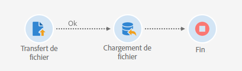
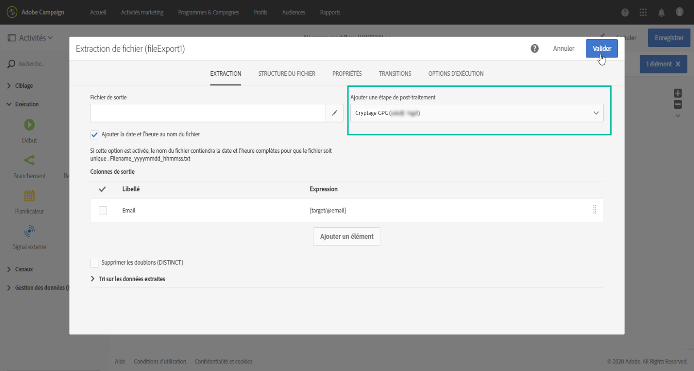

# Gérer des données cryptées {#managing-encrypted-data}

## A propos des étapes de prétraitement {#about-preprocessing-stages}

Dans certains cas, les données que vous souhaitez importer peuvent être cryptées, par exemple si elles contiennent des données d’identification personnelle.

Pour pouvoir importer ou exporter des fichiers cryptés, vous devez d’abord contacter l’Assistance clientèle d’Adobe pour obtenir votre instance avec les commandes de cryptage/décryptage nécessaires.

Pour ce faire, envoyez une requête indiquant :

* Le **libellé** qui s’affichera dans l’interface de Campaign pour utiliser la commande. Par exemple, « Crypter le fichier ».
* La **commande** à installer sur votre instance.

Once the request is processed, the encryption / decryption commands will be available in the **[!UICONTROL Pre-processing stage]** field from the **[!UICONTROL Load file]** and **[!UICONTROL Extract file]** activities. Vous pouvez les utiliser pour décrypter ou crypter les fichiers à importer ou exporter.

>[!NOTE]
>
>Notez que les clés GPG peuvent être ajoutées à votre instance à l’aide du Panneau de configuration, qui est disponible pour tous les clients hébergés sur AWS (sauf pour les clients qui hébergent leurs instances marketing sur site).
>
>For more on this, refer to [Control Panel documentation](https://docs.adobe.com/content/help/fr-FR/control-panel/using/control-panel-home.html).

**Rubriques connexes :**

* [Chargement de fichier](../../automating/using/load-file.md)
* [Extraction de fichier](../../automating/using/extract-file.md)

## Cas d’utilisation : Importation de données chiffrées à l’aide d’une clé générée par le Panneau de configuration {#use-case-gpg-decrypt}

Dans ce cas d’utilisation, nous allons créer un flux de travail afin d’importer des données chiffrées dans un système externe, à l’aide d’une clé générée dans le Panneau de configuration.

Les étapes pour effectuer cette utilisation sont les suivantes :

1. Utilisez le Panneau de configuration pour générer une paire de clés (publique/privée). Les étapes détaillées sont disponibles dans la documentation [du Panneau de](https://docs.adobe.com/content/help/en/control-panel/using/instances-settings/gpg-keys-management.html#decrypting-data)configuration.

   * La clé publique sera partagée avec le système externe. Ce dernier l’utilisera pour crypter les données à envoyer à Campaign.
   * Campaign utilisera la clé privée pour décrypter les données cryptées entrantes.

   

1. Dans le système externe, utilisez la clé publique téléchargée à partir du Panneau de configuration pour chiffrer les données à importer dans le Campaign Standard.

   

1. Dans le Campaign Standard, créez un processus pour importer les données chiffrées et les déchiffrer à l’aide de la clé privée qui a été installée via le Panneau de configuration. Pour ce faire, nous allons créer un processus comme suit :

   

   * **[!UICONTROL Transférer l&#39;activité du fichier]** : Transfère le fichier d’une source externe vers Campaign. Dans cet exemple, nous voulons transférer le fichier d’un serveur SFTP.
   * **[!UICONTROL Charger l&#39;activité du fichier]** : Charge les données du fichier dans la base de données et les déchiffre à l’aide de la clé privée générée dans le Panneau de configuration.

1. Ouvrez l’activité **[!UICONTROL Transférer le fichier]** , puis configurez-la selon vos besoins. Les concepts généraux de configuration de l’activité sont disponibles dans [cette section](../../automating/using/load-file.md).

   Dans l’onglet **[!UICONTROL Protocole]** , spécifiez des détails sur le serveur sftp et le fichier .gpg chiffré à transférer.

   

1. Ouvrez l’activité **[!UICONTROL Charger le fichier]** , puis configurez-la selon vos besoins. Les concepts généraux de configuration de l’activité sont disponibles dans [cette section](../../automating/using/load-file.md).

   Ajoutez une étape de prétraitement à l’activité afin de déchiffrer les données entrantes. Pour ce faire, sélectionnez l’option **[!UICONTROL Decryption GPG]** dans la liste.

   >[!NOTE]
   >
   >Notez que vous n’avez pas besoin de spécifier la clé privée à utiliser pour déchiffrer les données. La clé privée est stockée dans le Panneau de configuration, qui détecte automatiquement la clé à utiliser pour déchiffrer le fichier.

   

1. Click **[!UICONTROL OK]** to confirm the activity configuration.

1. Vous pouvez désormais exécuter le processus.

## Cas d’utilisation : Chiffrement et exportation de données à l’aide d’une clé installée sur le Panneau de configuration {#use-case-gpg-encrypt}

Dans ce cas d’utilisation, nous allons créer un processus afin de chiffrer et d’exporter des données à l’aide d’une clé installée sur le Panneau de configuration.

Les étapes pour effectuer cette utilisation sont les suivantes :

1. GPG, générez une paire de clés (publique/privée) à l&#39;aide d&#39;un utilitaire GPG, puis installez la clé publique sur le Panneau de configuration. Les étapes détaillées sont disponibles dans la documentation [du Panneau de](https://docs.adobe.com/content/help/en/control-panel/using/instances-settings/gpg-keys-management.html#encrypting-data)configuration.

   

1. Dans Campaign Standard, créez un processus pour exporter les données et exportez-les à l’aide de la clé privée qui a été installée via le Panneau de configuration. Pour ce faire, nous allons créer un processus comme suit :

   

   * **[!UICONTROL Requête]** activité : Dans cet exemple, nous voulons exécuter une requête de cible des données de la base de données que nous voulons exporter.
   * **[!UICONTROL Extraire l&#39;activité du fichier]** : Chiffre et extrait les données dans un fichier.
   * **[!UICONTROL Transférer l&#39;activité du fichier]** : Transfère le fichier contenant les données chiffrées vers un serveur SFTP.

1. Configurez l’activité de la **[!UICONTROL Requête]** pour qu’elle cible les données de votre choix à partir de la base de données. Voir à ce propos [cette section](../../automating/using/query.md).

1. Ouvrez l&#39;activité **[!UICONTROL Extract file]** , puis configurez-la selon vos besoins (fichier de sortie, colonnes, format, etc.). Les concepts généraux de configuration de l’activité sont disponibles dans [cette section](../../automating/using/extract-file.md).

   Ajoutez une étape de prétraitement à l’activité afin de chiffrer les données à extraire. Pour ce faire, sélectionnez la clé de chiffrement GPG à utiliser pour chiffrer les données.

   

   >[!NOTE]
   >
   >La valeur entre parenthèses est le **commentaire** que vous avez défini lors de la génération de la paire de clés à l&#39;aide de votre outil de chiffrement GPG. Assurez-vous de sélectionner la clé correspondante correcte, sinon le destinataire ne pourra pas déchiffrer le fichier.

1. Ouvrez l’activité **[!UICONTROL Transférer le fichier]** , puis spécifiez le serveur SFTP vers lequel vous souhaitez envoyer le fichier. Les concepts généraux de configuration de l’activité sont disponibles dans [cette section](../../automating/using/transfer-file.md).

   

1. Vous pouvez désormais exécuter le processus. Une fois exécuté, la cible de données par la requête est exportée vers le serveur SFTP dans un fichier .gpg chiffré.

   
