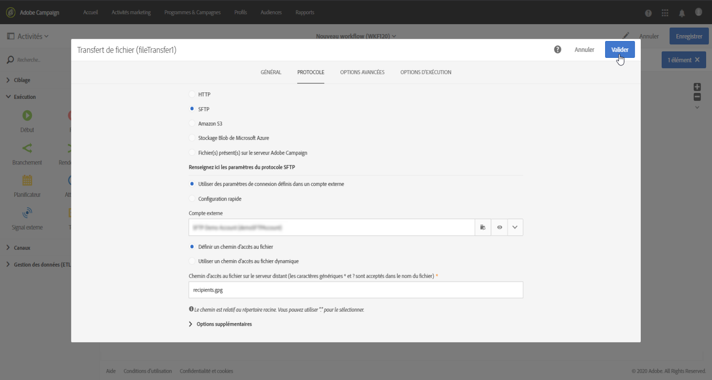
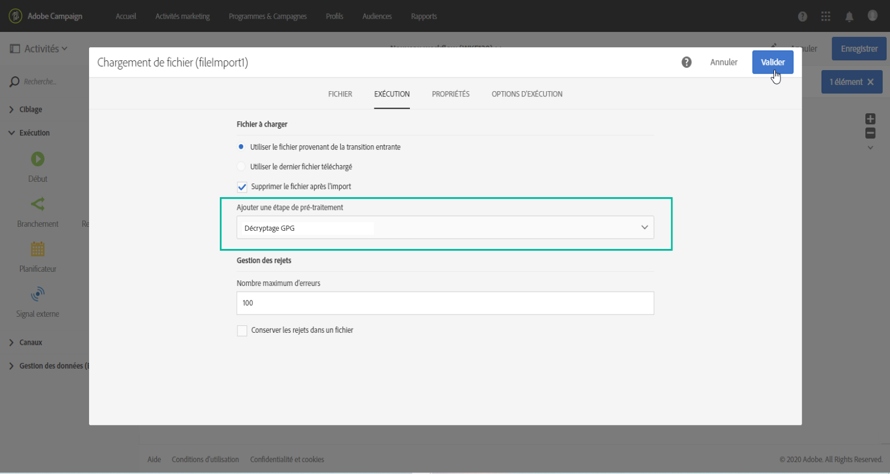

# Gérer des données chiffrées {#managing-encrypted-data}

## À propos des étapes de prétraitement {#about-preprocessing-stages}

Dans certains cas, les données que vous souhaitez importer peuvent être chiffrées, par exemple si elles contiennent des données PII.

Pour pouvoir chiffrer les données sortantes ou déchiffrer les données entrantes, vous devez gérer les clés GPG à l’aide du [Panneau de contrôle](https://experienceleague.adobe.com/docs/control-panel/using/instances-settings/gpg-keys-management.html?lang=fr).

>[!NOTE]
>
>Le Panneau de contrôle est disponible pour tous les clients hébergés sur AWS (à l’exception de ceux qui hébergent leurs instances marketing on-premise).

Si vous ne pouvez pas utiliser le Panneau de contrôle, vous devez contacter l’Assistance clientèle d’Adobe afin qu’elle indique à votre instance les commandes de chiffrement/déchiffrement nécessaires. Pour ce faire, envoyez une demande indiquant :

* Le **libellé** qui s’affichera dans l’interface de Campaign pour utiliser la commande. Par exemple, « Chiffrer le fichier ».
* La **commande** à installer sur votre instance.

Une fois la demande traitée, les commandes de chiffrement/déchiffrement seront disponibles dans le champ **[!UICONTROL Étape de prétraitement]** des activités **[!UICONTROL Chargement de fichier]** et **[!UICONTROL Extraction de fichier]**. Vous pouvez les utiliser pour déchiffrer ou chiffrer les fichiers à importer ou exporter.

**Rubriques connexes :**

* [Chargement de fichier](../../automating/using/load-file.md)
* [Extraction de fichier](../../automating/using/extract-file.md)

## Cas pratique : import de données chiffrées à l&#39;aide d&#39;une clé générée par le Panneau de contrôle {#use-case-gpg-decrypt}

Dans ce cas pratique, nous allons créer un workflow afin d’importer des données chiffrées dans un système externe, à l’aide d’une clé générée dans le Panneau de contrôle.

 [Découvrez cette fonctionnalité en vidéo](#video)

Les étapes pour traiter ce cas pratique sont les suivantes :

1. Utilisez le Panneau de contrôle pour générer une paire de clés (publique/privée). Les étapes détaillées sont disponibles dans la [documentation du Panneau de contrôle](https://experienceleague.adobe.com/docs/control-panel/using/instances-settings/gpg-keys-management.html?lang=fr#decrypting-data).

   * La clé publique sera partagée avec le système externe. Ce dernier l’utilisera pour chiffrer les données à envoyer à Campaign.
   * Campaign utilisera la clé privée pour déchiffrer les données chiffrées entrantes.

   

1. Dans le système externe, utilisez la clé publique téléchargée à l’aide du Panneau de contrôle pour chiffrer les données à importer dans Campaign Standard.

1. Dans Campaign Standard, créez un workflow pour importer les données chiffrées et les déchiffrer à l’aide de la clé privée installée via le Panneau de contrôle. Pour ce faire, nous allons créer un workflow comme suit :

   

   * **[!UICONTROL Transfert de fichier]** : transfère le fichier d’une source externe vers Campaign. Dans cet exemple, nous voulons transférer le fichier depuis un serveur SFTP.
   * **[!UICONTROL Chargement de fichier]** : charge les données du fichier dans la base de données et le déchiffre à l’aide de la clé privée générée dans le Panneau de contrôle.

1. Ouvrez l’activité **[!UICONTROL Transfert de fichier]**, puis configurez-la selon vos besoins. Les concepts généraux de configuration de l’activité sont présentés dans [cette section](../../automating/using/load-file.md).

   Dans l’onglet **[!UICONTROL Protocole]**, spécifiez des détails sur le serveur sftp et le fichier .gpg chiffré à transférer.

   

1. Ouvrez l’activité **[!UICONTROL Chargement de fichier]**, puis configurez-la selon vos besoins. Les concepts généraux de configuration de l’activité sont présentés dans [cette section](../../automating/using/load-file.md).

   Ajoutez une étape de prétraitement à l’activité pour déchiffrer les données entrantes. Pour ce faire, sélectionnez l’option **[!UICONTROL Déchiffrement GPG]** dans la liste.

   >[!NOTE]
   >
   >Il n’est pas nécessaire de spécifier la clé privée à utiliser pour déchiffrer les données. La clé privée est stockée dans le Panneau de contrôle, qui détecte automatiquement la clé à utiliser pour déchiffrer le fichier.

   

1. Cliquez sur **[!UICONTROL OK]** pour valider la configuration de l’activité.

1. Vous pouvez maintenant exécuter le workflow.

## Cas pratique : chiffrement et export de données à l&#39;aide d&#39;une clé installée sur le Panneau de contrôle {#use-case-gpg-encrypt}

Dans ce cas d’utilisation, nous allons créer un workflow pour chiffrer et exporter des données à l’aide d’une clé installée sur le Panneau de contrôle.

 [Découvrez cette fonctionnalité en vidéo](#video)

Les étapes pour traiter ce cas pratique sont les suivantes :

1. Générez une paire de clés GPG (publique/privée) à l’aide d’un utilitaire GPG, puis installez la clé publique sur le Panneau de contrôle. Les étapes détaillées sont disponibles dans la [documentation du Panneau de contrôle](https://experienceleague.adobe.com/docs/control-panel/using/instances-settings/gpg-keys-management.html?lang=fr#encrypting-data).

   

1. Dans Campaign Standard, créez un workflow pour exporter les données et les chiffrer à l&#39;aide de la clé privée installée à l&#39;aide du Panneau de contrôle. Pour ce faire, nous allons créer un workflow comme suit :

   

   * Activité **[!UICONTROL Requête]** : dans cet exemple, nous voulons exécuter une requête pour cibler les données de la base de données que nous voulons exporter.
   * Activité **[!UICONTROL Extraction de fichier]** : chiffre et extrait les données dans un fichier.
   * **[!UICONTROL Transfert de fichier]** : transfère le fichier contenant les données chiffrées vers un serveur SFTP.

1. Configurez l’activité **[!UICONTROL Requête]** pour qu’elle cible les données de votre choix dans la base de données. Voir à ce propos [cette section](../../automating/using/query.md).

1. Ouvrez l’activité **[!UICONTROL Extraction de fichier]**, puis configurez-la selon vos besoins (fichier de sortie, colonnes, format, etc.). Les concepts généraux de configuration de l’activité sont présentés dans [cette section](../../automating/using/extract-file.md).

   Ajoutez une étape de prétraitement à l’activité pour déchiffrer les données à extraire. Pour ce faire, sélectionnez la clé de chiffrement GPG à utiliser pour crypter les données.

   

   >[!NOTE]
   >
   >La valeur entre parenthèses est le **commentaire** que vous avez défini lors de la génération de la paire de clés à l’aide de votre outil de chiffrement GPG. Veillez à bien sélectionner la clé correspondante correcte, sinon le destinataire ne pourra pas décrypter le fichier.

1. Ouvrez l’activité **[!UICONTROL Transfert de fichier]**, puis spécifiez le serveur SFTP auquel vous souhaitez envoyer le fichier. Les concepts généraux de configuration de l’activité sont présentés dans [cette section](../../automating/using/transfer-file.md).

   

1. Vous pouvez maintenant exécuter le workflow. Une fois exécuté, les données ciblées par la requête sont exportées vers le serveur SFTP dans un fichier .gpg chiffré.

## Tutoriels vidéo {#video}

Cette vidéo montre comment utiliser une clé GPG pour déchiffrer des données.

>[!VIDEO](https://video.tv.adobe.com/v/35753?quality=12)

Cette vidéo montre comment chiffrer des données à l’aide d’une clé GPG.

>[!VIDEO](https://video.tv.adobe.com/v/36380?quality=12)

D’autres vidéos pratiques sur Campaign Standard sont disponibles [ici](https://experienceleague.adobe.com/docs/campaign-standard-learn/tutorials/overview.html?lang=fr).
