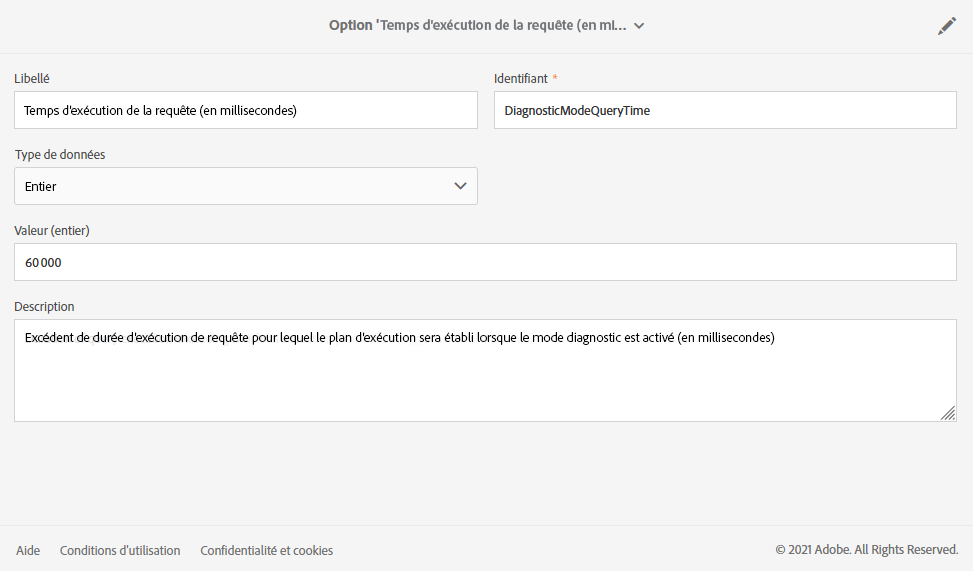

# Gestion des options d&#39;exécution {#managing-execution-options}

Pour modifier les propriétés d’exécution de l’ensemble d’un workflow, utilisez le bouton  pour accéder aux propriétés du workflow et sélectionnez la section **[!UICONTROL Exécution]**.

Les options possibles sont les suivantes :

* **[!UICONTROL Affinité par défaut]** : permet de forcer l’exécution d’un workflow ou d’une activité de workflow sur une machine en particulier.

* **[!UICONTROL Jours d’historique]** : indique le nombre de jours après lesquels l’historique doit être purgé. L’historique contient des éléments liés au workflow : logs, tâches, événements (objets techniques liés à l’opération du workflow), ainsi que les fichiers téléchargés par l’activité **[!UICONTROL Transfert de fichier]**. La valeur par défaut est de 30 jours pour les modèles de workflow d’usine.

   La purge de l’historique est effectuée par le workflow technique Nettoyage de la base, qui est exécuté par défaut tous les jours (voir [Liste des workflows techniques](../../administration/using/technical-workflows.md)).

   >[!IMPORTANT]
   >
   >Si le champ **[!UICONTROL Jours d’historique]** n’est pas renseigné, la valeur prise en compte est « 1 », ce qui signifie que l’historique sera purgé après 1 jour.

* **[!UICONTROL Enregistrer les requêtes SQL dans le journal]** : permet d’enregistrer les requêtes SQL du workflow dans les journaux.

* **[!UICONTROL Mode de diagnostic (enregistrer le plan d’exécution des requêtes longues et donner des recommandations)]** : cochez cette option si vous souhaitez que le plan d’exécution complet soit consigné. Elle est désactivée par défaut.

   Pour plus d&#39;informations sur cette option, consultez cette [section](#diagnostic-mode).

* **[!UICONTROL Conserver les résultats intermédiaires]** : cochez cette option si vous souhaitez pouvoir visualiser le détail des transitions.

   >[!CAUTION]
   >
   >Cette option consomme beaucoup d’espace disque. De plus, elle a été conçue pour vous aider à créer un workflow et à garantir une configuration et un comportement corrects. Laissez-la décochée sur les instances de production.

* **[!UICONTROL Exécuter dans le moteur (ne pas utiliser en production)]** : permet d’exécuter le workflow localement, à des fins de test d’environnement de développement.

* **[!UICONTROL Niveau de criticité]** : permet de définir un niveau de priorité pour l’exécution des workflows de votre instance Adobe Campaign. Ce champ est utilisé uniquement par les équipes d’Adobe à des fins de monitoring.

La section **[!UICONTROL Gestion des erreurs]** propose des options supplémentaires pour gérer le comportement des workflows en cas d’erreur. Ces options sont présentées dans la section [Gestion des erreurs](../../automating/using/monitoring-workflow-execution.md#error-management).

## Mode de diagnostic {#diagnostic-mode}

>[!CAUTION]
>
>Cette option peut avoir un impact significatif sur les performances de votre workflow et doit être utilisée avec parcimonie.

Lorsqu’elle est activée, l’option **[!UICONTROL Mode de diagnostic (Plan d’exécution des logs de requêtes longues et donner des recommandations)]** de la section **[!UICONTROL Exécution]** des propriétés du workflow consigne l’intégralité du plan d’exécution si une requête dure plus d’une minute.

Après avoir activé cette option et lancé votre workflow, si votre requête dure plus d’une minute, le plan d’exécution est consigné. Vous pouvez ensuite récupérer votre plan d’exécution à l’aide d’une ANALYSE EXPLAIN.

Pour plus d’informations à ce sujet, consultez la [documentation PostgreSQL](https://www.postgresql.org/docs/9.4/using-explain.html).

Si cette requête contient une analyse de séquence, le **[!UICONTROL mode de diagnostic]** fournit également des recommandations pour créer un index à l’aide d’une expression de filtre.

>[!NOTE]
>
> Ces recommandations sont faites à titre de référence uniquement et doivent être utilisées avec précaution en fonction de votre cas d’utilisation.

Les deux conditions suivantes doivent être remplies lors de l’exécution de votre workflow pour déclencher des recommandations :

* L’analyse de la séquence prend plus de 40 % de temps pour la requête.

* Les lignes résultantes après l’analyse de la séquence sont inférieures à 1 % du total des lignes présentes dans le tableau.

Vous pouvez gérer l’option à partir du menu avancé en sélectionnant **[!UICONTROL Administration]** > **[!UICONTROL Paramètres de l’application]** > **[!UICONTROL Options]** :

* **[!UICONTROL Heure d’exécution de la requête (en millisecondes)(DiagnosticModeQueryTime)]** : Depuis le champ  **** Valeur, vous pouvez définir une nouvelle heure pour l’exécution de votre requête. Si l&#39;exécution de votre requête dépasse cette valeur, le plan d&#39;exécution sera consigné.

   

* **[!UICONTROL Pourcentage du temps d’analyse seq (DiagnosticModeSeqScanPercentage)]** : À partir du champ  **** Valeur, vous pouvez modifier le pourcentage du temps de requête nécessaire à l’analyse de la séquence pour que la recommandation soit générée.

   
