# Gestion des packages{#managing-packages}

Les administrateurs peuvent définir des packages pour échanger des ressources entre différentes instances Adobe Campaign par le biais de fichiers structurés au format XML. Il peut s'agir de paramètres de configuration ou de données.

C'est utile par exemple quand on souhaite transférer des données d'un serveur à un autre ou répliquer les paramétrages d'une instance.

Les packages sont disponibles dans les menus **[!UICONTROL Administration]** &gt; **[!UICONTROL Déploiement]** &gt; **[!UICONTROL Exports de package]** ou **[!UICONTROL Imports de package]**. Les deux menus ont un comportement similaire.

Les éléments de chaque liste s'affichent par défaut selon leur date de modification ou d'installation, de la plus récente à la plus ancienne.

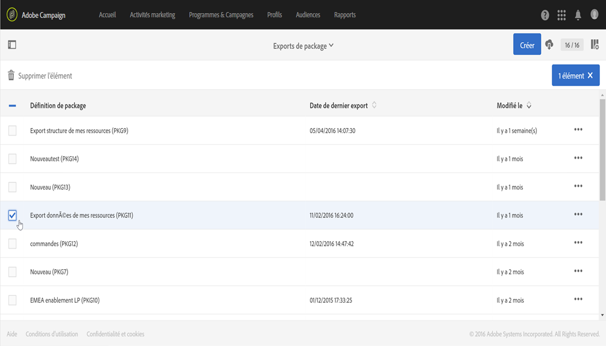

Pour afficher le contenu d'un élément et le modifier, cliquez sur son libellé. Reportez-vous aux sections [Export d'un package](../../automating/using/managing-packages.md#exporting-a-package) et [Import d'un package](../../automating/using/managing-packages.md#importing-a-package).

## Exports de package  {#package-exports}

### Packages par défaut {#standard-packages}

**[!UICONTROL Il existe deux packages natifs, Plate-forme]** et **[!UICONTROL Administration]**, qui contiennent chacun une liste prédéfinie de ressources à exporter. Ils s'ouvrent en lecture seule et peuvent uniquement être exportés.

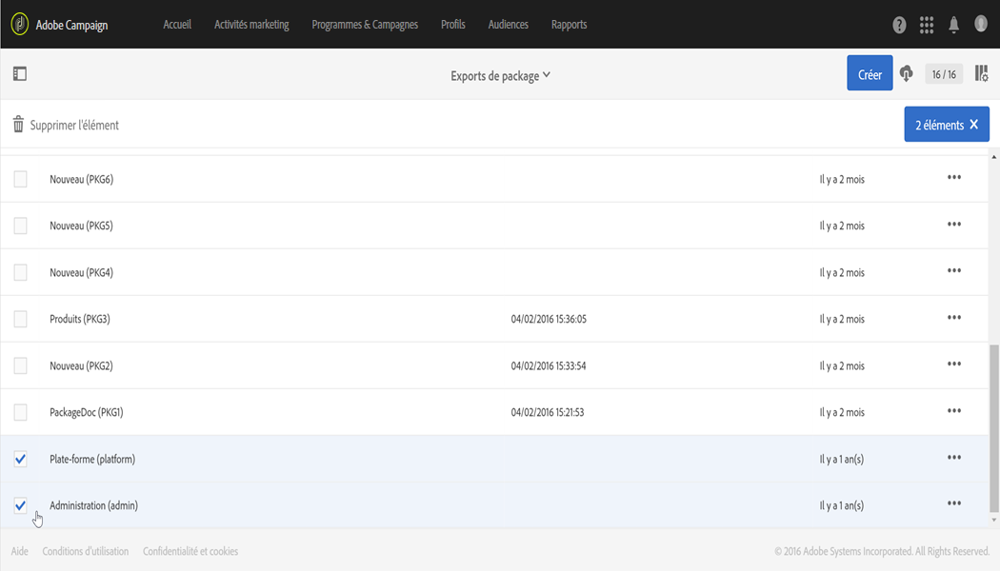

>[!CAUTION]
>
>L'export de package n'est pas autorisé si les ressources exportées ont des identifiants par défaut. Il est donc obligatoire de modifier les identifiants des ressources exportables en s'éloignant des modèles livrés par Adobe Campaign Standard. Par exemple, pour exporter des profils de test, il ne faut pas utiliser un identifiant contenant la valeur "SDM" ou "sdm". Lors de l'export de packages contenant des identifiants par défaut, les erreurs du type suivant peuvent s'afficher : "L'entité de type 'Marques (branding)' utilise un identifiant par défaut ('BRD1') susceptible de provoquer un conflit lors de l'import du package. Modifiez ce nom et renouvelez l'opération."

Les étapes d'export d'un package sont présentées dans la section [Export d'un package](../../automating/using/managing-packages.md#exporting-a-package).

* Le package **[!UICONTROL Plate-forme]** regroupe toutes les ressources ajoutées pendant la configuration technique : ressources personnalisées, ensembles de ressources personnalisées, triggers et options d'application de type **[!UICONTROL Système]**.
* Le package **[!UICONTROL Administration]** regroupe tous les objets ajoutés pendant la configuration métier : modèles d'opération, modèles de contenu, modèles de diffusion, modèles de landing page, modèles de programme et modèles de workflow.

   Il comprend également les objets suivants : blocs de contenu, mappings de ciblage, comptes externes, entités organisationnelles, options d'application de type **[!UICONTROL Utilisateur]**, rôles, typologies, règles de typologie et utilisateurs.

>[!NOTE]
>
>Il n'est pas possible de modifier la définition de ces deux packages. En revanche, ces derniers contiennent toujours les données disponibles les plus à jour. Vous pouvez [créer vos propres packages](../../automating/using/managing-packages.md#creating-a-package) pour exporter des éléments spécifiques.

### Création de package  {#creating-a-package}

Pour exporter des jeux de données spécifiques, vous devez créer un package.

Pour créer un package, vous devez disposer des droits d'administration.

1. Depuis **[!UICONTROL Administration]** &gt; **[!UICONTROL Déploiement]** &gt; **[!UICONTROL Exports de package]**, cliquez sur le bouton **[!UICONTROL Créer]** dans la liste des contenus de package.

   L'élément est immédiatement créé. Pour annuler sa création, il faut revenir à la liste et cocher la case correspondante pour le supprimer.

1. Dans l'écran de définition du package, indiquez un nom et un identifiant.
1. Cliquez sur le bouton **[!UICONTROL Editer les propriétés]** si vous souhaitez ajouter une description et restreindre l'accès à certains utilisateurs.

   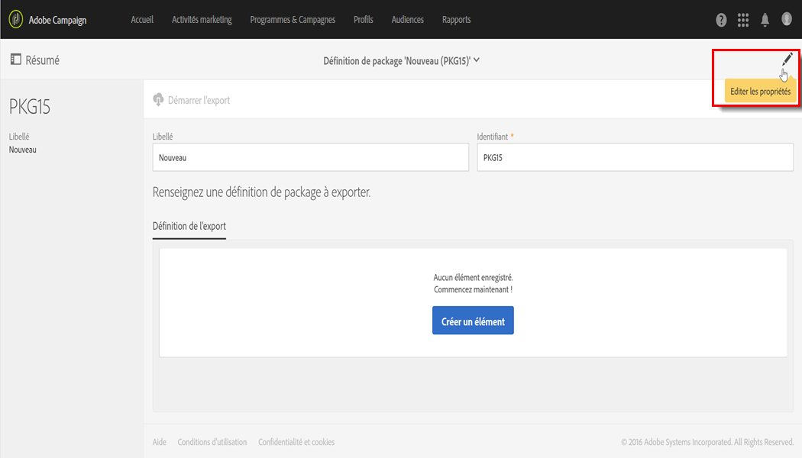

1. Dans l'onglet **[!UICONTROL Définition de l'export]**, utilisez le bouton **[!UICONTROL Créer un élément]** pour sélectionner les ressources que vous souhaitez exporter.

   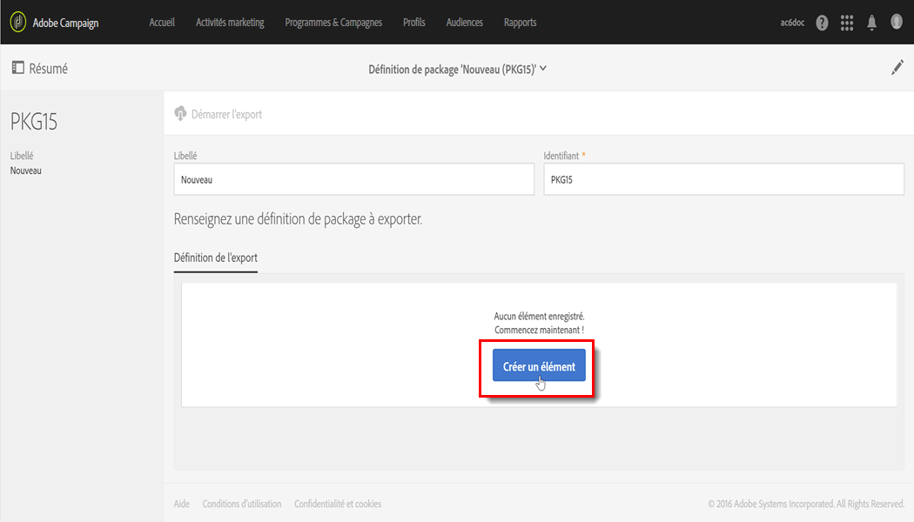

1. Les ressources s'affichent par ordre alphabétique et peuvent être filtrées par nom. Leur nom technique est indiqué entre parenthèses. Choisissez un élément de la liste et validez votre choix.

   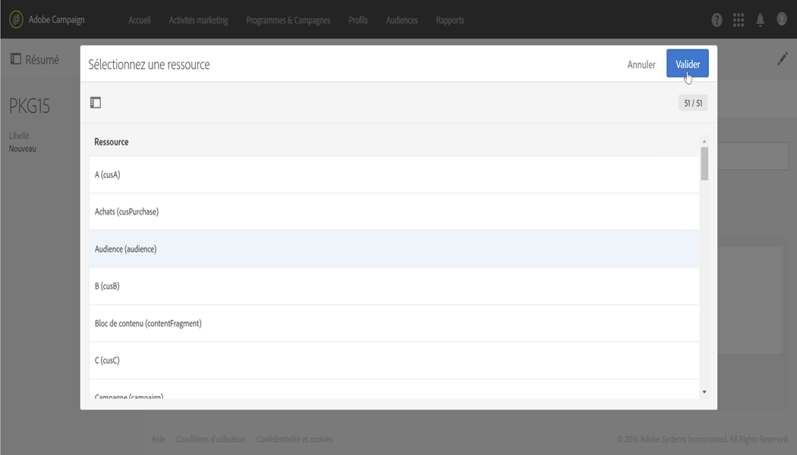

1. Le nom de la ressource s'affiche dans l'onglet **[!UICONTROL Définition de l'export]**. Pour modifier une ressource, cochez la case correspondante et utilisez le bouton **[!UICONTROL Afficher le détail de l'élément sélectionné]**.

   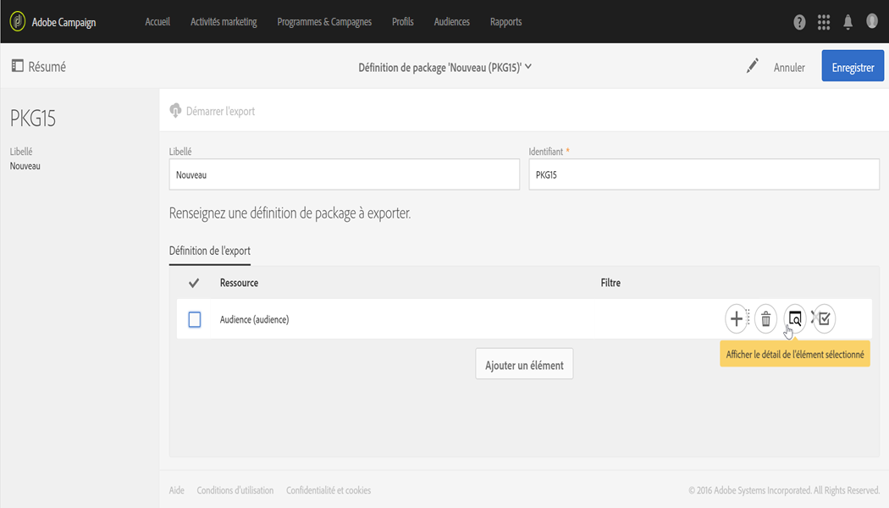

1. Utilisez l'éditeur de requêtes pour filtrer les éléments à exporter. Voir à ce propos la section [Edition de requêtes](../../automating/using/editing-queries.md#creating-queries).

   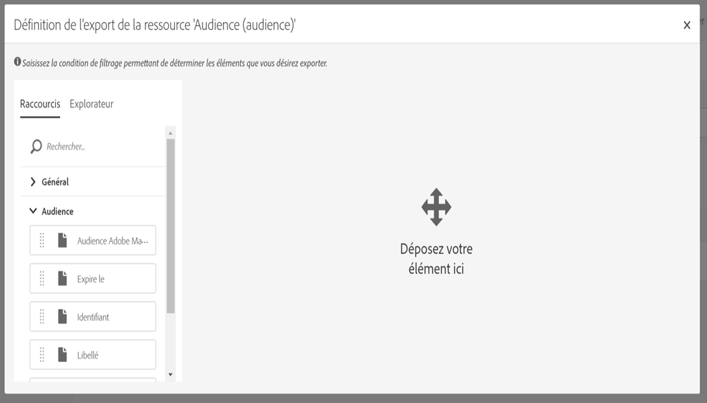

   >[!NOTE]
   >
   >Vous pouvez exporter jusqu'à 5 000 objets par ressource.

1. Une fois que vous avez défini toutes les ressources à exporter, enregistrez votre sélection.

Votre package est maintenant créé et prêt à être exporté.

### Export d'un package  {#exporting-a-package}

L'export d'un package vous permet d'enregistrer un état spécifique d'une ressource que vous pourrez réimporter ultérieurement sur une même instance ou sur une autre instance.

>[!CAUTION]
>
>L'export de packages n'est pas autorisé si les ressources exportées ont des identifiants d'usine. Il est donc obligatoire de modifier les identifiants des ressources exportables en s'éloignant des modèles livrés par Adobe Campaign Standard. Par exemple, pour exporter des profils de test, il ne faut pas utiliser un identifiant contenant la valeur "SDM" ou "sdm".

1. Depuis **[!UICONTROL Administration]** &gt; **[!UICONTROL Déploiement]** &gt; **[!UICONTROL Exports de package]**, sélectionnez un package pour accéder à ses détails.
1. Vérifiez que le package contient les données dont vous avez besoin.
1. Cliquez sur le bouton **[!UICONTROL Démarrer l'export]**.

Le fichier exporté est stocké dans le répertoire de téléchargement du navigateur utilisé. Il est automatiquement nommé "package_xxx.xml", "xxx" correspondant à l'identifiant du package.

Lorsque l'opération est terminée, plusieurs sections s'affichent :

* **[!UICONTROL La section Statut de l'export]** indique si l'opération s'est correctement déroulée.

   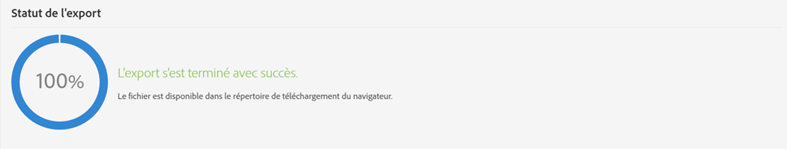

* L'onglet **[!UICONTROL Journal]** permet de consulter les différentes étapes de l'export. Il contient les états de tous les exports précédents.

   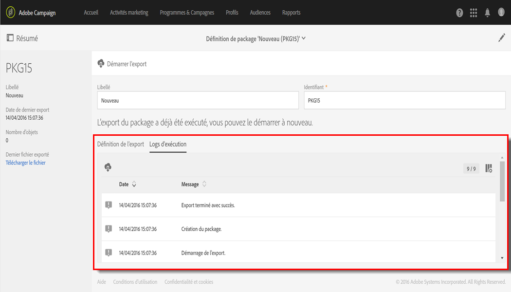

>[!NOTE]
>
>Lorsque vous sélectionnez, à partir de la liste des définitions de package, un élément qui a déjà été exporté, les onglets **[!UICONTROL Journal]** et **[!UICONTROL Dernier export]** sont toujours disponibles.

## Imports de package {#package-imports}

### Mises à jour système {#system-updates}

La liste des imports de package contient notamment les imports automatiques liés à des mises à jour effectuées par Adobe.

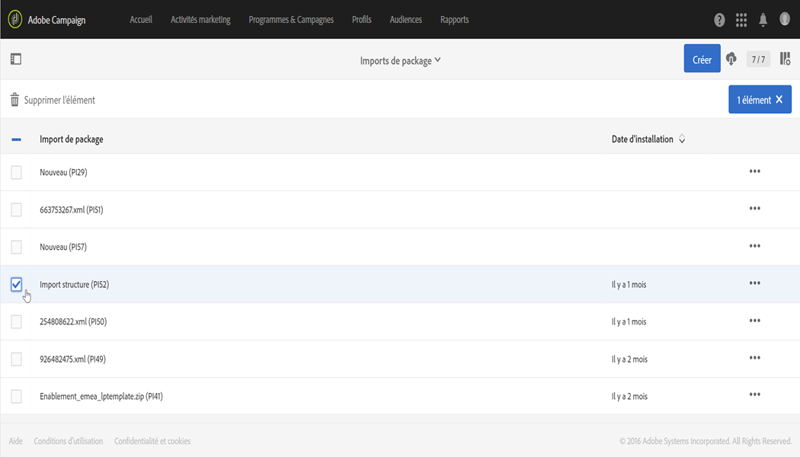

La vue **[!UICONTROL Logs d'exécution]** répertorie toutes les étapes de l'import. Le panneau latéral affiche les informations générales.

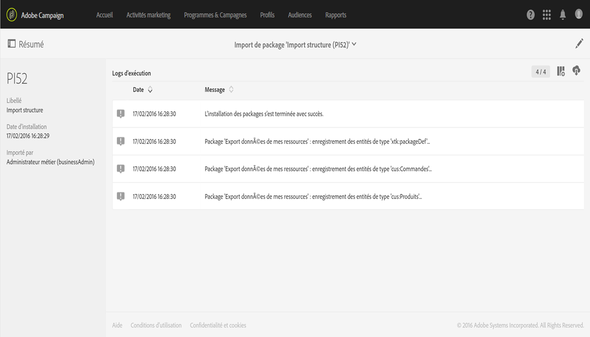

>[!NOTE]
>
>Ces éléments sont accessibles en lecture seule.

### Import d'un package  {#importing-a-package}

Un administrateur peut importer manuellement un package issu d'un export réalisé au préalable à partir d'une instance Adobe Campaign. Voir à ce propos la section [Exports de package](../../automating/using/managing-packages.md#package-exports).

L'import manuel d'un package consiste en deux étapes : il faut d'abord télécharger un fichier avant de pouvoir importer son contenu.

1. Depuis **[!UICONTROL Administration]** &gt; **[!UICONTROL Déploiement]** &gt; **[!UICONTROL Imports de package]**, cliquez sur le bouton **[!UICONTROL Créer]** dans la liste des imports de package.

   L'élément est immédiatement créé. Pour annuler sa création, il faut revenir à la liste et cocher la case correspondante pour le supprimer.

1. Indiquez un nom et un identifiant pour le nouvel import.
1. Sélectionnez le fichier que vous souhaitez télécharger par glisser-déposer ou en cliquant sur le lien **[!UICONTROL parcourez votre disque]**.

   Les fichiers importés doivent être au format XML ou ZIP (contenant un fichier XML).

   

   >[!NOTE]
   >
   >Pour remplacer le document téléchargé, supprimez d'abord le fichier à l'aide de la croix située à droite de son nom et renouvelez l'opération.

1. Une fois le fichier téléchargé, importez son contenu dans la base à l'aide du bouton **[!UICONTROL Démarrer l'import].**

   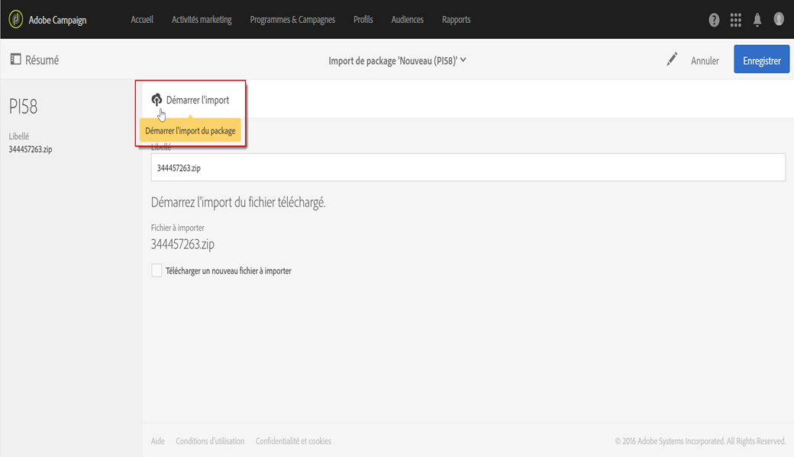

Lorsque l'opération est terminée, plusieurs sections s'affichent :

* **[!UICONTROL La section Statut de l'import]** indique si l'opération s'est correctement déroulée.
* L'onglet **[!UICONTROL Logs d'exécution]** permet de consulter les différentes étapes de l'import. Il est particulièrement important pour l'affichage des erreurs.

   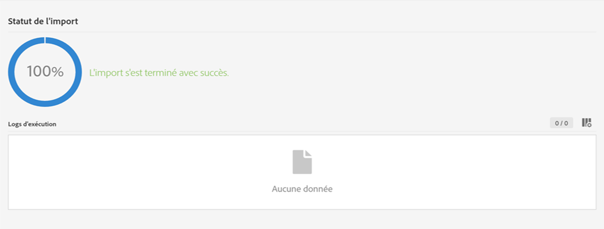

Une fois qu'un package a été importé, il n'est pas possible de le réimporter à partir du même élément. Vous pouvez uniquement modifier son libellé et son identifiant.

Pour réimporter le même package, vous devez revenir à la liste des imports de package, créer un élément et télécharger à nouveau le fichier de votre choix.
