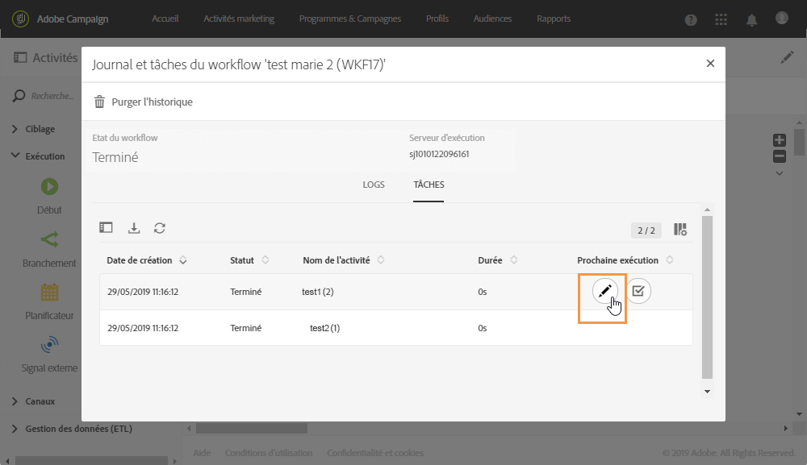

# Suivi des variables d’événements      {#monitoring-the-events-variables}

Il est possible de suivre les variables d’événements disponibles dans le workflow, y compris les paramètres externes déclarés. Pour cela, procédez comme suit :

1. Sélectionnez l’activité qui suit l’activité **[!UICONTROL Signal externe]**, puis cliquez sur le bouton **[!UICONTROL Journal et tâches]**.
1. Dans l’onglet **[!UICONTROL Tâches]**, cliquez sur le bouton .

   

1. Le contexte d’exécution de la tâche s’affiche (ID, état, durée, etc.), y compris toutes les variables d’événements actuellement disponibles dans le workflow.

   
