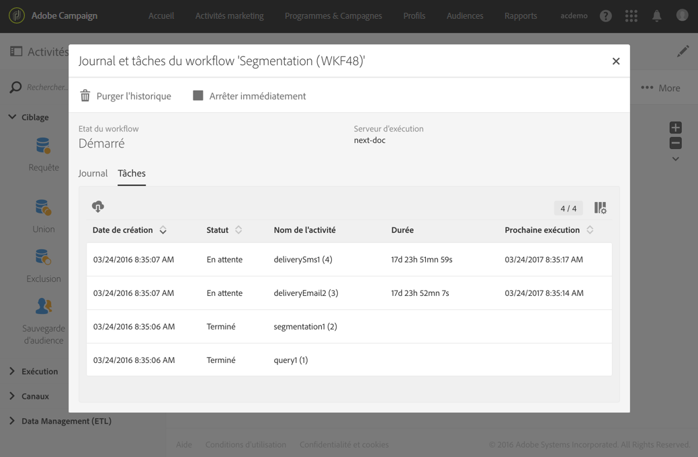

# Surveiller l&#39;exécution des workflows {#monitoring}

## Journal et tâches du workflow {#workflow-log-and-tasks}

L’icône  permet d’accéder au menu Journal et tâches du workflow.

L’historique d’un workflow est conservé pendant la durée que vous indiquez dans les options d’exécution du workflow (voir [Propriétés des workflows](../../automating/using/managing-execution-options.md)). Pendant cette durée, tous les messages sont donc conservés, même après un redémarrage. Si vous ne voulez pas conserver les messages d’une exécution précédente, vous devez purger l’historique en cliquant sur le bouton .

L’onglet **[!UICONTROL Journal]** contient l’historique de l’exécution de toutes les activités ou des activités sélectionnées. Il répertorie par ordre chronologique les opérations réalisées et les erreurs d’exécution.

L’onglet **[!UICONTROL Tâches]** permet de voir le séquencement de l’exécution des activités. Cliquez sur une tâche pour obtenir plus d’informations.

Dans ces deux listes :

* Cliquez sur le compteur pour obtenir le nombre total des activités selon le filtrage appliqué. Le comptage est affiché par défaut si le nombre d’éléments dans la liste est inférieur à 30.
* Le bouton **[!UICONTROL Configurer la liste]** permet de choisir les informations affichées, de définir l’ordre des colonnes et d’appliquer un tri.
* Vous pouvez utiliser des filtres pour trouver plus rapidement les informations dont vous avez besoin. Utilisez le champ de recherche pour rechercher du texte spécifique dans les noms des activités de workflow (par exemple &quot;requête&quot;) et les logs.

## Gestion des erreurs        {#error-management}

Lorsqu’une erreur se produit, le workflow se met en pause et l’activité qui était en cours d’exécution lorsque l’erreur s’est produite clignote alors en rouge.

Le statut du workflow passe au rouge et l’erreur est consignée dans le journal.

Vous pouvez paramétrer le workflow pour qu’il ne se mette pas en pause et continue son exécution en cas d’erreur. Pour cela, accédez aux propriétés du workflow à l’aide du bouton  et, dans la section **[!UICONTROL Exécution]**, sélectionnez l’option **Ignorer** dans le champ **En cas d’erreur**.

Dans ce cas, la tâche en erreur est abandonnée. Ce mode est particulièrement adapté aux workflows conçus pour permettre de retenter l’opération ultérieurement (actions périodiques).

>[!NOTE]
>
>Vous pouvez appliquer ce paramétrage au niveau de chaque activité. Pour cela, sélectionnez l’activité de votre choix puis ouvrez-là à l’aide de l’action rapide  et sélectionnez le mode de gestion des erreurs dans l’onglet **Options d’exécution.** Voir [Options d’exécution d’une activité](../../automating/using/activity-properties.md).

Dans les [propriétés du workflow](../../automating/using/managing-execution-options.md), des options supplémentaires liées à la gestion des erreurs sont disponibles.

Les options possibles sont les suivantes :

* **[!UICONTROL Superviseurs]** : permet de définir le groupe de personnes à avertir (email et notification in-app) si le workflow rencontre une erreur. Si aucun groupe n’est défini, personne ne sera notifié. Pour plus d’informations sur les notifications d’Adobe Campaign, voir [Notifications Adobe Campaign](../../administration/using/sending-internal-notifications.md).

* **[!UICONTROL En cas d’erreur]** : permet de définir l’action à effectuer lorsque l’activité a rencontré une erreur. Deux options sont disponibles :

   * **Suspendre le processus** : le workflow est automatiquement suspendu. Le statut du workflow est alors **En erreur** et la couleur qui lui est associée passe au rouge. Lorsque le problème est résolu, relancez le workflow.
   * **Ignorer** : l’activité n’est pas exécutée, de même que, par voie de conséquence, toutes celles qui lui succèdent (dans la même branche). Cela peut s’avérer utile dans le cas de tâches récurrentes. Si la branche comporte un planificateur placé en amont, celui-ci se déclenchera normalement à sa prochaine date d’exécution.

* **[!UICONTROL Erreurs consécutives]** : permet de définir un certain nombre d’erreurs consécutives autorisées avant que l’exécution du workflow ne soit automatiquement suspendue.

   * Si le nombre indiqué est **[!UICONTROL 0]** ou tant que ce nombre n’est pas atteint, les activités qui rencontrent des erreurs sont ignorées. Les autres branches du workflow sont exécutées normalement.

   * Si le nombre indiqué est atteint, l’ensemble du workflow est suspendu et passe **[!UICONTROL En erreur]**. Si des superviseurs ont été définis, ils sont automatiquement notifiés par un email. Voir [Notifications d’Adobe Campaign](../../administration/using/sending-internal-notifications.md).
