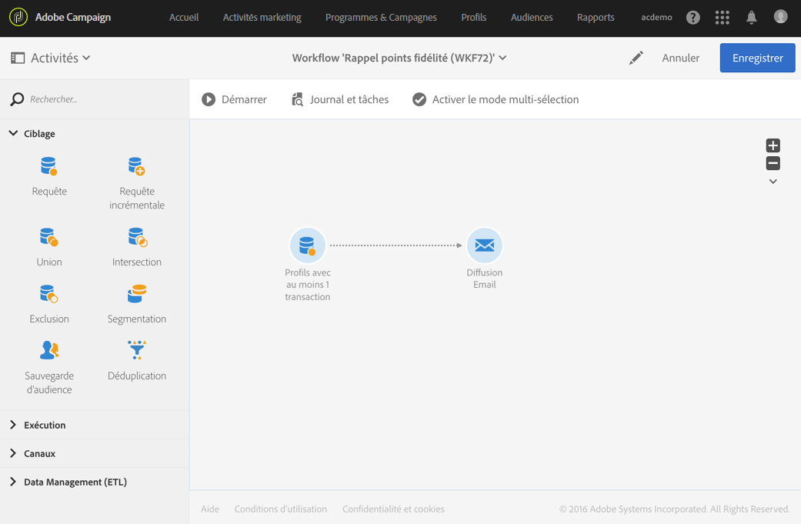
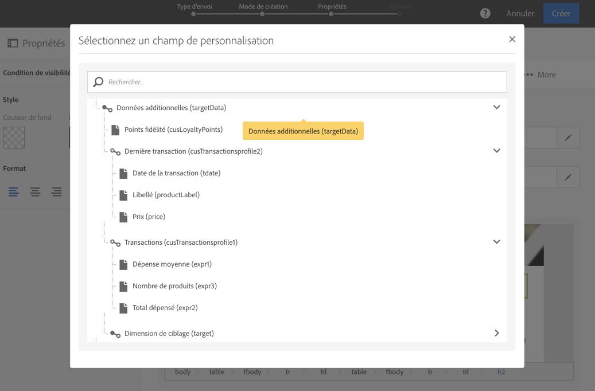

# Personnaliser un email avec des données additionnelles {#example--personalizing-an-email-with-additional-data}

L’exemple suivant illustre l’ajout de différents types de données additionnelles dans une requête et leur utilisation en tant que champ de personnalisation dans un email. Pour plus d’informations sur l’enrichissement des données ciblées par une activité de **[!UICONTROL Requête]**, consultez [cette section](../../automating/using/query.md#enriching-data).

Pour cet exemple, des [ressources personnalisées](../../developing/using/data-model-concepts.md) sont utilisées :

* La ressource **profile** a été étendue afin d’ajouter un champ permettant d’enregistrer les points fidélité de chaque profil.
* Une ressource **transactions** a été créée et recense tous les achats effectués par les profils de la base. La date, le prix et le produit acheté est conservé pour chaque transaction.
* Une ressource **produits** a été créée et référence les produits disponibles à l’achat.

L’objectif est d’envoyer un email aux profils pour lesquels au moins une transaction a été enregistrée. Via cet email, les clients recevront un rappel de la dernière transaction qu’ils ont effectuée ainsi que diverses informations récapitulatives sur l’ensemble de leurs transactions : nombre de produits achetés, total dépensé, rappel du nombre de points fidélité acquis.

Le workflow de se présente comme suit :

1. Ajoutez une activité de [Requête](../../automating/using/query.md) permettant de cibler les profils ayant effectué au moins une transaction.

   

1. Depuis l’onglet **[!UICONTROL Données additionnelles]** de la requête, définissez les différentes données devant être affichées dans l’email final :

   * Le champ simple de la dimension **profile** correspondant aux points fidélité. Reportez-vous à la section [Ajouter un champ simple](../../automating/using/query.md#adding-a-simple-field).
   * Deux agrégats basés sur la collection des transactions : le nombre de produits achetés et le montant total dépensé. Vous pouvez les ajouter depuis l’onglet **[!UICONTROL Données]** de la fenêtre de paramétrage des agrégats, en utilisant les agrégats **Count** et **Sum**. Reportez-vous à la section [Ajouter un agrégat](../../automating/using/query.md#adding-an-aggregate).
   * Une collection permettant de retrouver le montant, la date et le produit de la dernière transaction effectuée.

      Pour cela, vous devez ajouter les différents champs que vous souhaitez afficher depuis l’onglet **[!UICONTROL Données]** de la fenêtre de paramétrage d’une collection.

      Pour que seule la transaction la plus récente soit renvoyée, vous devez indiquer &quot;1&quot; au niveau du **[!UICONTROL Nombre de lignes à retourner]** et appliquer un tri décroissant sur le champ **Date** de la collection depuis l’onglet **[!UICONTROL Tri]**.

      Reportez-vous aux sections [Ajouter une collection](../../automating/using/query.md#adding-a-collection) et [Trier les données additionnelles](../../automating/using/query.md#sorting-additional-data).
   

1. Si vous souhaitez vérifier que les données sont correctement transmises en sortie de l’activité, lancez une première fois le workflow (sans l’activité de **[!UICONTROL Diffusion Email]**) et ouvrez la transition sortante de la requête.

   

1. Ajoutez une activité [Diffusion Email](../../automating/using/email-delivery.md). Dans le contenu de l’email, insérez les champs de personnalisation correspondant aux données calculées dans la requête. Vous pouvez les retrouver via le lien **[!UICONTROL Données additionnelles (targetData)]** de l’explorateur des champs de personnalisation.

   

Votre workflow est prêt à être exécuté. Les profils ciblés dans la requête recevront un email personnalisé contenant les données calculées issues de leurs transactions.
