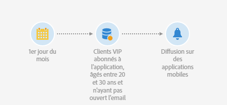
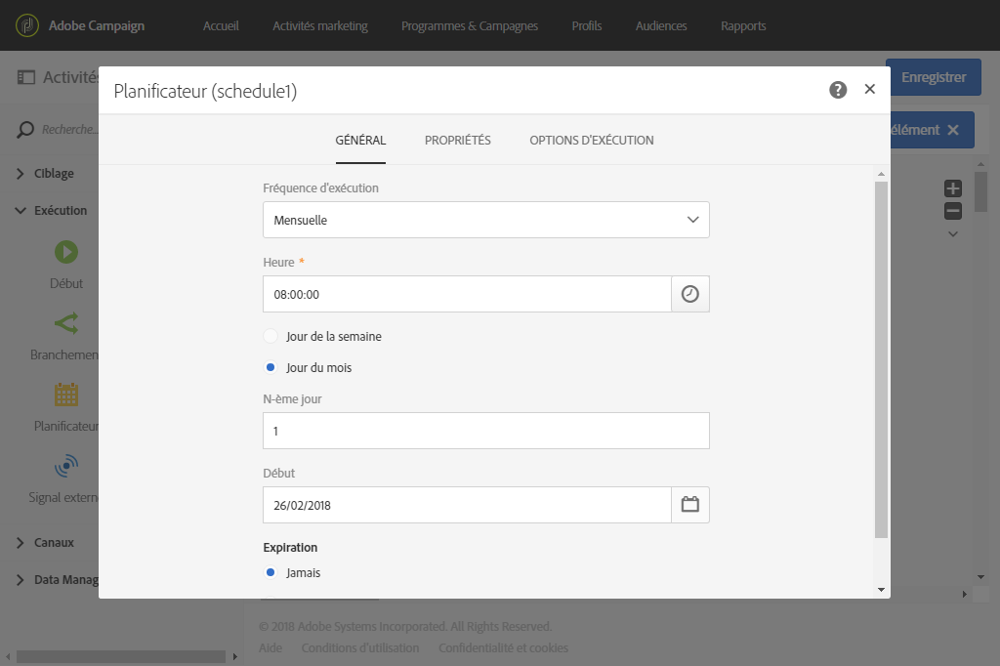
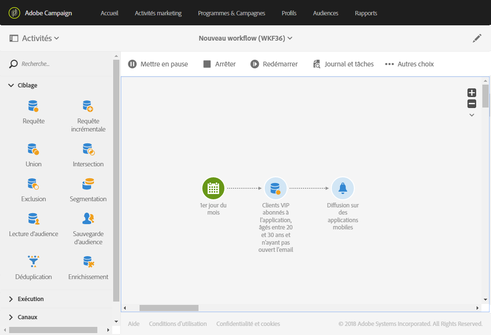

# Diffusion Notification push{#push-notification-delivery}

## Description {#description}

L&#39;activité **[!UICONTROL Notification push]** permet de paramétrer l&#39;envoi d&#39;une notification push dans un workflow. Cette notification peut être **unique** et n&#39;être envoyée qu&#39;une seule fois ou être **récurrente**.

Les notifications envoyées une seule fois sont des diffusions standard de notification push sur des applications mobiles, envoyées une seule fois.

Les notifications récurrentes permettent d&#39;envoyer plusieurs fois sur une période définie une même notification push à des cibles différentes. Vous pouvez agréger les diffusions par période afin d&#39;obtenir des rapports adaptés.

## Contexte d&#39;utilisation {#context-of-use}

L&#39;activité **[!UICONTROL Notification push]** est généralement utilisée afin d&#39;automatiser l&#39;envoi d&#39;une notification push à une cible calculée dans le même workflow.

Lorsque l&#39;activité est associée à un planificateur, il est possible de définir des notifications push récurrentes.

Les destinataires sont définis en amont de l&#39;activité dans le même workflow, grâce à des activités de ciblage telles que requêtes, intersections, etc.

La préparation du message est déclenchée selon les paramètres d&#39;exécution du workflow. Depuis le tableau de bord du message, vous pouvez choisir de demander ou non une confirmation manuelle pour envoyer le message (requise par défaut). Vous pouvez lancer manuellement le workflow ou bien placer une activité de planification afin d&#39;en automatiser l&#39;exécution.

## Configuration {#configuration}

1. Placez une activité **[!UICONTROL Notification push]** dans votre workflow.
1. Sélectionnez l&#39;activité puis ouvrez-la à l&#39;aide du bouton , disponible dans les actions rapides qui s&#39;affichent.

   >[!NOTE]
   >
   >Les propriétés générales et les options avancées de l&#39;activité (et non de la diffusion elle-même) sont disponibles à l&#39;aide du bouton , disponible dans les actions rapides de l&#39;activité. Ce bouton est spécifique à l&#39;activité **[!UICONTROL Notification push]**. Les propriétés de la notification push sont disponibles via la barre d&#39;actions du tableau de bord de la notification push.

1. Sélectionnez le mode d&#39;envoi de la notification push :

   * **[!UICONTROL Notification unique]** : la notification push est envoyée une seule fois. Vous pouvez définir à cet endroit si vous souhaitez ou non ajouter une transition en sortie de l&#39;activité. Les différents types de transition sont détaillés à l&#39;étape 7 de cette procédure.
   * **[!UICONTROL Notification récurrente]** : la notification push est envoyée plusieurs fois, à une fréquence définie dans une activité **[!UICONTROL Planificateur]**. Choisissez la période d&#39;agrégation des envois. Cela permet de regrouper tous les envois ayant eu lieu dans la période définie dans une seule notification push, aussi appelée **exécution récurrente** et accessible depuis la liste des activités marketing de l&#39;application.

      Par exemple, pour une notification récurrente d&#39;anniversaire, envoyée chaque jour, vous pouvez choisir d&#39;agréger les envois par mois. Vous pourrez ainsi obtenir des rapports sur votre diffusion mois par mois alors que la notification est envoyée chaque jour.

1. Sélectionnez un type de notification. Ces types sont issus des modèles de notifications push définis dans **[!UICONTROL Ressources]** > **[!UICONTROL Modèles]** > **[!UICONTROL Modèles de diffusion]**.
1. Renseignez les propriétés générales de la notification push. Vous pouvez également rattacher l&#39;activité à une campagne existante. Le libellé de l&#39;activité de diffusion dans le workflow est mis à jour avec le libellé de la notification push.
1. Définissez le contenu de la notification push. Voir [Création d&#39;une notification push](../../channels/using/preparing-and-sending-a-push-notification.md).
1. Par défaut, l&#39;activité **[!UICONTROL Notification push]** ne possède aucune transition sortante. Si vous souhaitez ajouter une transition sortante à votre activité **[!UICONTROL Notification push]**, accédez à l&#39;onglet **[!UICONTROL Général]** des options avancées de l&#39;activité (bouton , disponible dans les actions rapides de l&#39;activité) puis cochez l&#39;une des options suivantes :

   * **[!UICONTROL Ajouter une transition sortante sans la population]** : permet de générer une transition sortante contenant la même population que la transition entrante.
   * **[!UICONTROL Ajouter une transition sortante avec la population]** : permet de générer une transition sortante contenant la population à qui la notification a été envoyée. Les membres de la cible exclus pendant la préparation de la diffusion sont exclus de cette transition.

1. Validez le paramétrage de l&#39;activité et enregistrez le workflow.

Lorsque vous ouvrez à nouveau l&#39;activité par la suite, vous accédez au tableau de bord de la notification push. Seul son contenu reste modifiable.

Par défaut, le démarrage d&#39;un workflow de diffusion déclenche uniquement la préparation des messages. L&#39;envoi des messages créés depuis un workflow doit toujours être confirmé après le démarrage du workflow. Dans le tableau de bord des messages, vous pouvez toutefois désactiver l&#39;option **[!UICONTROL Demander confirmation avant d&#39;envoyer les messages]** si les messages ont été créés depuis un workflow. Lorsque cette option est décochée, les messages sont envoyés sans autre préavis une fois la préparation terminée.

## Remarques    {#remarks}

Les diffusions créées à partir d&#39;un workflow sont accessibles dans la liste des activités marketing de l&#39;application. Vous pouvez visualiser l&#39;état d&#39;exécution du workflow depuis le tableau de bord. Des liens dans le volet de résumé de la notification push vous permettent d&#39;accéder directement aux éléments liés (workflow, campagne, etc.).

Depuis les diffusions parentes, accessibles depuis la liste des activités marketing, vous pouvez visualiser l&#39;ensemble des envois ayant été réalisés (en fonction de la période d&#39;agrégation définie lors du paramétrage de l&#39;activité **[!UICONTROL Notification push]**). Pour cela, accédez au détail du bloc **[!UICONTROL Déploiement]** de la diffusion parente en sélectionnant .

## Envoi d&#39;une notification push récurrente avec un workflow {#sending-a-recurring-push-notification-with-a-workflow}

Dans cet exemple, une notification push personnalisée est envoyée chaque premier jour du mois, à 8h, aux abonnés de votre application mobile selon leur fuseau horaire. Pour cela :

1. L&#39;activité **[!UICONTROL Planificateur]** permet de démarrer le workflow plusieurs jours avant le début de la diffusion afin d&#39;envoyer à chaque abonné la notification à 8h, dans tous les fuseaux horaires spécifiés :

   * Dans le champ **[!UICONTROL Fréquence d&#39;exécution]**, sélectionnez Mensuelle.
   * Dans le champ **[!UICONTROL Heure]**, sélectionnez 8h.
   * Sélectionnez le jour auquel la diffusion sera envoyée chaque mois.
   * Sélectionnez la date de début du workflow. Celle-ci doit être au moins un jour avant le début de la diffusion. Sinon, certains destinataires pourront recevoir le message un jour après si l&#39;heure sélectionnée est déjà passée dans leur fuseau horaire.
   * Dans l&#39;onglet **[!UICONTROL Options d&#39;exécution]**, sélectionnez le fuseau horaire dans lequel démarrera le workflow dans le champ **[!UICONTROL Fuseau horaire]**. Dans cet exemple, le workflow démarrera à 8h, heure du Pacifique, une semaine avant le premier jour du mois, afin que les diffusions puissent être créées pour tous les fuseaux horaires applicables.
   >[!NOTE]
   >
   >Par défaut, le fuseau horaire sélectionné est celui défini dans les propriétés du workflow (voir [Construire un workflow](../../automating/using/building-a-workflow.md)).

   

1. L&#39;activité **Requête** permet de cibler les clients VIP, âgés entre 20 et 30 ans, abonnés à votre application mobile et n&#39;ayant pas ouvert l&#39;email que vous avez envoyé :

   * Sélectionnez une audience (vos clients VIP) et appliquez un filtrage sur l&#39;âge.
   * Placez l&#39;élément **Abonnements à une application** dans l&#39;espace de travail. Choisissez **Existe** et sélectionnez l&#39;application mobile à utiliser.
   * Sélectionnez l&#39;email que vous avez envoyé à vos clients.
   * Placez l&#39;élément **Logs de diffusion (logs)** dans l&#39;espace de travail, puis sélectionnez **Existe** pour cibler tous les clients qui ont reçu l&#39;email.
   * Placez l&#39;élément **Logs de tracking (tracking)** dans l&#39;espace de travail, puis sélectionnez **N&#39;existe pas** pour cibler tous les clients qui n&#39;ont pas ouvert l&#39;email.

      

1. L&#39;activité **Notification push** vous permet de saisir le contenu de votre message et de sélectionner les champs de personnalisation que vous souhaitez utiliser.

   * Sélectionnez l&#39;option **[!UICONTROL Notification récurrente]**.
   * Définissez le contenu de la notification push. Pour plus d&#39;informations sur le contenu d&#39;une notification push, consultez cette [section](../../channels/using/preparing-and-sending-a-push-notification.md).
   * Dans le bloc **[!UICONTROL Planning]**, sélectionnez **[!UICONTROL Messages à envoyer automatiquement dans le fuseau horaire défini ci-dessous]**. Dans le cas présent, Pacifique a été sélectionné pour le **[!UICONTROL Fuseau horaire de la date de contact]**, comme dans l&#39;activité **[!UICONTROL Planificateur]** du workflow.
   * Dans le champ **[!UICONTROL Optimiser le délai d&#39;envoi par destinataire]**, sélectionnez **[!UICONTROL Envoyer au fuseau horaire du destinataire]**.

      

1. Cliquez sur le bouton **[!UICONTROL Démarrer]** pour démarrer le workflow récurrent.

   

Votre workflow est maintenant en cours d&#39;exécution. Il commencera à la date de début sélectionnée pour le **[!UICONTROL Planificateur]** : 8h, heure du Pacifique. La notification push récurrente sera alors envoyée tous les premiers jours du mois, à 8h, selon le fuseau horaire des clients.
