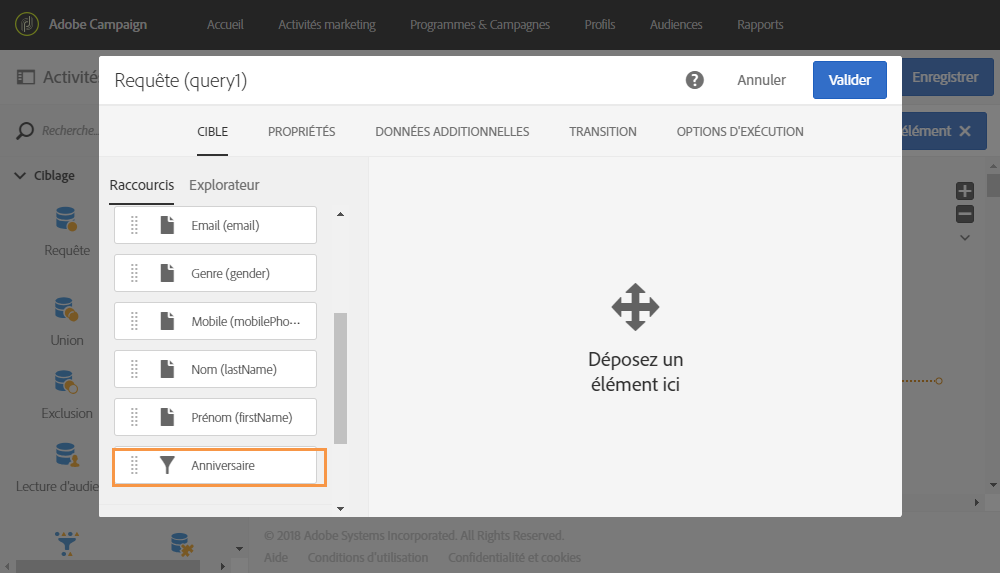
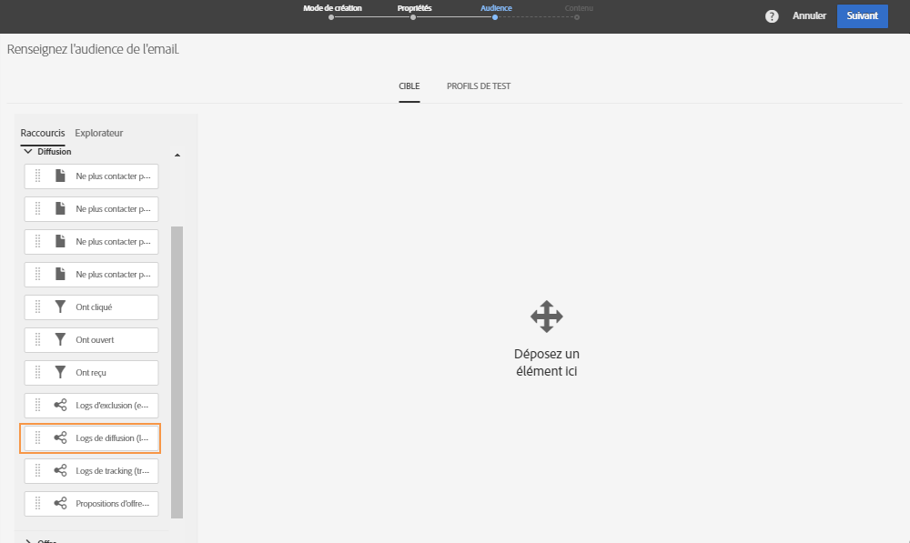
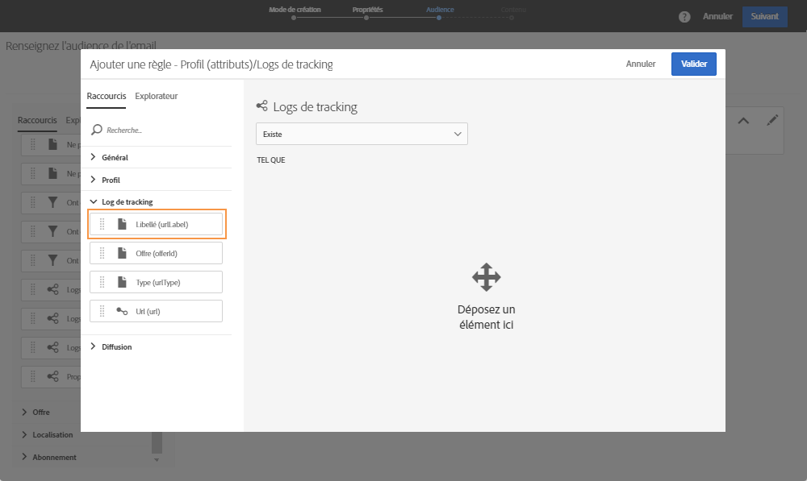

# Exemples de requêtes     {#query-samples}

Cette section présente un cas pratique d’utilisation d’une activité de **[!UICONTROL Requête]**. Pour plus d’informations sur l’utilisation d’une activité de **[!UICONTROL Requête]**, consultez [cette section](../../automating/using/query.md).

## Ciblage des attributs de profil simples {#targeting-on-simple-profile-attributes}

L’exemple qui suit montre une activité de requête configurée pour cibler les hommes âgés de 18 à 30 ans, vivant à Londres.

## Ciblage des attributs d’emails     {#targeting-on-email-attributes}

L’exemple qui suit montre une activité de requête configurée pour cibler des profils dont le domaine d’adresse électronique est « orange.co.uk ».

L’exemple qui suit montre une activité de requête configurée pour cibler des profils dont l’adresse électronique a été fournie.

## Ciblage de profils dont c’est l’anniversaire     {#targeting-profiles-whose-birthday-is-today}

L’exemple qui suit montre une activité de requête configurée pour cibler des profils dont c’est l’anniversaire.

1. Faites glisser le filtre **[!UICONTROL Anniversaire]** dans votre requête.

   

1. Définissez le **[!UICONTROL Type de filtre]** sur **[!UICONTROL Relatif]** et sélectionnez **[!UICONTROL Aujourd’hui]**.

   

## Ciblage des profils ayant ouvert une diffusion spécifique {#targeting-profiles-who-opened-a-specific-delivery}

L’exemple qui suit montre une activité de requête configurée pour filtrer les profils ayant ouvert une diffusion avec le libellé « Été ».

1. Faites glisser le filtre **[!UICONTROL Ont ouvert]** dans votre requête.

   

1. Sélectionnez la diffusion et cliquez sur **[!UICONTROL Confirmer]**.

   

## Ciblage des profils pour lesquels les diffusions ont échoué pour une raison spécifique {#targeting-profiles-for-whom-deliveries-failed-for-a-specific-reason}

L’exemple qui suit montre une activité de requête configurée pour filtrer les profils pour lesquels les diffusions ont échoué en raison d’une boîte pleine. Cette requête est uniquement disponible pour les utilisateurs dotés de droits d’administration et faisant partie des entités organisationnelles **[!UICONTROL All (tous)]** (voir [cette section](../../administration/using/organizational-units.md)).

1. Sélectionnez la ressource **[!UICONTROL Logs de diffusion]** afin de filtrer directement dans le tableau du log de diffusion (voir [Utiliser des ressources différentes des dimensions de ciblage](../../automating/using/using-resources-different-from-targeting-dimensions.md)).

   

1. Faites glisser le filtre **[!UICONTROL Nature de l’échec]** dans votre requête.

   

1. Sélectionnez le type d’échec que vous souhaitez cibler. Dans votre cas, **[!UICONTROL Boîte pleine]**.

   

## Ciblage des profils n’ayant pas été contactés au cours des 7 derniers jours {#targeting-profiles-not-contacted-during-the-last-7-days}

L’exemple qui suit montre une activité de requête configurée pour filtrer les profils n’ayant pas été contactés au cours des 7 derniers jours.

1. Faites glisser le filtre **[!UICONTROL Logs de diffusion (logs)]** dans votre requête.

   

   Sélectionnez **[!UICONTROL N’existe pas]** dans la liste déroulante, puis faites glisser le filtre **[!UICONTROL Diffusion]**.

   

1. Configurez le filtre comme indiqué ci-dessous.

   

## Ciblage des profils ayant cliqué sur un lien spécifique     {#targeting-profiles-who-clicked-a-specific-link-}

1. Faites glisser le filtre **[!UICONTROL Tracking (tracking)]** dans votre requête.

   

1. Faites glisser le filtre **[!UICONTROL Libellé (urlLabel)]**.

   

1. Dans le champ **[!UICONTROL Valeur]**, saisissez le libellé défini lors de l’insertion du lien à la diffusion, puis confirmez.

   
