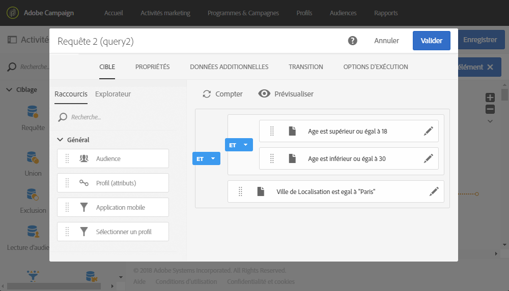
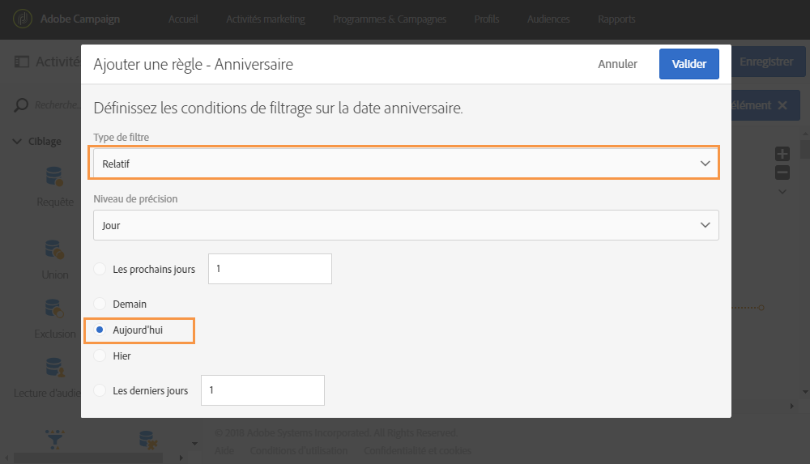

# Requête{#query}

## Description {#description}

L'activité **[!UICONTROL Requête]permet de filtrer et d'extraire une population d'éléments de la base de données Adobe Campaign.** Vous pouvez définir des **[!UICONTROL Données additionnelles]pour la population ciblée via un onglet dédié.** Ces données sont stockées dans des colonnes additionnelles et sont exploitables uniquement pour le workflow en cours.

L'activité utilise l'outil d'édition de requêtes, dont le fonctionnement est détaillé dans une [section dédiée](../../automating/using/editing-queries.md#about-query-editor).

## Contexte d'utilisation {#context-of-use}

L'activité **[!UICONTROL Requête]peut être utilisée dans plusieurs cas d'utilisation type :**

* segmentation d'individus afin de définir la cible d'un message, une audience, etc.
* enrichissement de données de toute table de la base Adobe Campaign
* export de données.

## Configuration {#configuration}

1. Placez une activité **[!UICONTROL Requête]dans votre workflow.**
1. Sélectionnez l'activité puis ouvrez-la à l'aide du bouton  Par défaut, l'activité est pré-paramétrée pour rechercher des profils.
1. If you would like to run a query on a resource other than the profile resource, go to the activity's **[!UICONTROL Properties]** tab and select a **[!UICONTROL Resource]** and a **[!UICONTROL Targeting dimension]**.

   **[!UICONTROL La ressource]** permet d'affiner les filtres affichés dans la palette alors que la dimension **[!UICONTROL Ciblage]**, contextuelle relative à la ressource sélectionnée, correspond au type de population à obtenir (profils identifiés, livraisons, données liées à la ressource sélectionnée, etc.).

   Voir à ce sujet [Dimensions de ciblage et ressources](../../automating/using/query.md#targeting-dimensions-and-resources).

1. Depuis l'onglet **[!UICONTROL Cible], effectuez votre requête en définissant et combinant des règles.**
1. Vous pouvez définir des **[!UICONTROL Données additionnelles]pour la population ciblée via un onglet dédié.** Ces données sont stockées dans des colonnes additionnelles et sont exploitables uniquement pour le workflow en cours. Vous pouvez notamment ajouter des données provenant des tables de la base Adobe Campaign liées à la dimension de ciblage de la requête. Consultez la section [Enrichir des données](../../automating/using/query.md#enriching-data).

   >[!NOTE]
   >
   >Par défaut, l'option **[!UICONTROL Supprimer les doublons (DISTINCT)]** est cochée dans les **[!UICONTROL Options avancées]de l'onglet** Données additionnelles] de la requête. **[!UICONTROL ** Pour des raisons de performance, il est recommandé de décocher cette option si l'activité **[!UICONTROL Requête]contient de nombreuses données additionnelles (à partir de 100) définies.** Sachez que si cette option est décochée, vous pouvez obtenir des doublons, selon les données faisant l'objet de la requête.

1. Dans l'onglet **[!UICONTROL Transition]**, l'option **Activer une transition sortante]permet d'ajouter une transition sortante après l'activité de requête, et ce même si elle ne récupère pas de données.[!UICONTROL **

   Le code segment de la transition sortante peut être personnalisé à l'aide d'une expression standard et de variables d'événements (voir [Personnaliser les activités avec des variables d'événements](../../automating/using/calling-a-workflow-with-external-parameters.md#customizing-activities-with-events-variables)).

1. Validez le paramétrage de l'activité et enregistrez le workflow.

## Dimensions de ciblage et ressources {#targeting-dimensions-and-resources}

Les dimensions de ciblage et les ressources permettent de définir sur quels éléments reposera une requête pour déterminer la cible d'une diffusion.

Les dimensions de ciblage sont définies dans les mappings de ciblage. Voir à ce propos [cette section](../../administration/using/target-mappings-in-campaign.md).

### Définir la dimension de ciblage et la ressource d'une requête {#defining-the-targeting-dimension-and-resource-of-a-query}

La dimension de ciblage et les ressources sont définies lors de la création d'un workflow, dans l'onglet **[!UICONTROL Propriétés]d'une activité Requête.**

>[!NOTE]
>
>La dimension de ciblage peut être également définie lors de la création d'une audience (voir [cette section](../../audiences/using/creating-audiences.md)).

Les dimensions de ciblage et les ressources sont liées. Les dimensions de ciblage disponibles dépendent donc de la ressource sélectionnée.

For example, for the Resource **[!UICONTROL Profiles (profile)]**, the following targeting dimensions will be available:

While for **[!UICONTROL Deliveries (delivery)]**, the list will contain the following targeting dimensions:

Une fois la dimension de ciblage et la ressource indiquées, différents filtres sont disponibles dans la requête.

Exemple de filtres disponibles pour la ressource **[!UICONTROL Profils (profile)] :**

Exemple de filtres disponibles pour la ressource **[!UICONTROL Diffusions (delivery)] :**

### Utiliser des ressources différentes des dimensions de ciblage {#using-resources-different-from-targeting-dimensions}

Par défaut, la dimension de ciblage et la ressource sont définies pour cibler des profils.

Il peut toutefois s'avérer utile d'utiliser une ressource différente de la dimension de ciblage si vous souhaitez rechercher un enregistrement spécifique dans une table distante.

**Exemple 1 : identification des profils ciblés par la diffusion avec le libellé « Ravi de vous revoir parmi nous »**.

* Dans ce cas, nous voulons cibler des profils. La dimension de ciblage sera donc définie sur **[!UICONTROL Profils (profile)]**.
* Nous voulons également filtrer les profils sélectionnés en fonction du libellé de la diffusion. La ressource sera donc définie sur **[!UICONTROL Logs de diffusion]**. Ainsi, nous appliquerons un filtre directement dans la table des logs de diffusion, ce qui offrira de meilleures performances.

**Exemple 2 : identification des profils qui n'étaient pas ciblés par la diffusion avec le libellé « Ravi de vous revoir parmi nous ».**

Dans l'exemple précédent, nous avons utilisé une ressource différente de la dimension de ciblage. Cette opération n'est possible que si vous recherchez un enregistrement qui **se trouve** dans la table distante (logs de diffusion dans le cas présent).

Si nous recherchons un enregistrement qui **ne figure pas** dans la table distante (comme des profils n'étant pas ciblés par une diffusion spécifique), nous devons utiliser les mêmes ressource et dimension de ciblage dans la mesure où l'enregistrement ne se trouve pas dans la table distante (logs de diffusion).

* Dans ce cas, nous voulons cibler des profils. La dimension de ciblage sera donc définie sur **[!UICONTROL Profils (profile)]**.
* Nous voulons également filtrer les profils sélectionnés en fonction du libellé de la diffusion. Il n'est pas possible d'appliquer directement un filtre sur les logs de diffusion dans la mesure où nous recherchons un enregistrement qui ne figure pas dans la table des logs de diffusion. La ressource sera donc définie sur **[!UICONTROL Profil (profile)]et la requête sera créée sur la table des profils.**

## Enrichir des données {#enriching-data}

The **[!UICONTROL Additional data]** tab of the **[!UICONTROL Query]**, **[!UICONTROL Incremental query]** and **[!UICONTROL Enrichment]** activities allows you to enrich the data targeted and transfer this data to the following workflow activities, where it can be utilized. Il est notamment possible d'ajouter :

* des données simples.
* des agrégats.
* des collections

Dans le cas des agrégats et des collections, un **[!UICONTROL Alias]est automatiquement défini afin de donner un identifiant technique à une expression complexe.** Cet alias, qui doit être unique, permet ainsi de retrouver simplement les agrégats et collections par la suite. Vous pouvez le modifier afin de lui donner un nom facilement reconnaissable.

>[!NOTE]
>
>Les alias doivent respecter les règles de syntaxe suivantes : seuls les caractères alphanumériques et les caractères "_" sont autorisés. Les alias sont sensibles à la casse. L'alias doit commencer par le caractère "@". Le caractère suivant immédiatement le "@" ne doit pas être numérique. Par exemple : @myAlias_1 et @_1Alias sont corrects ; @myAlias#1 et @1Alias sont incorrects.

Après avoir ajouté des données additionnelles, vous pouvez appliquer un niveau de filtre supplémentaire sur les données initialement ciblées en créant des conditions basées sur les données additionnelles définies.

>[!NOTE]
>
>Par défaut, l'option **[!UICONTROL Supprimer les doublons (DISTINCT)]** est cochée dans les **[!UICONTROL Options avancées]de l'onglet** Données additionnelles] de la requête. **[!UICONTROL ** Pour des raisons de performance, il est recommandé de décocher cette option si l'activité **[!UICONTROL Requête]contient de nombreuses données additionnelles (à partir de 100) définies.** Sachez que si cette option est décochée, vous pouvez obtenir des doublons, selon les données faisant l'objet de la requête.

### Ajouter un champ simple {#adding-a-simple-field}

En ajoutant un champ simple comme donnée additionnelle, celui-ci devient directement visible dans la transition sortante de l'activité. Cela permet par exemple de vérifier que les données issues de la requête sont celles souhaitées.

1. Depuis l'onglet **[!UICONTROL Données additionnelles], ajoutez un nouvel élément.**
1. Dans la fenêtre qui s'ouvre, au niveau du champ **[!UICONTROL Expression], sélectionnez l'un des champs disponibles directement dans la dimension de ciblage ou dans l'une des dimensions liées.** Vous pouvez éditer des expressions et utiliser des fonctions ou des calculs simples (hors agrégat) à partir des champs de la dimension.

   Un **[!UICONTROL Alias]est automatiquement créé si vous éditez une expression qui n'est pas un simple chemin XPATH (par exemple : "Year(&lt;@birthDate&gt;)").** Si vous le souhaitez, vous pouvez modifier ce dernier. Si vous sélectionnez un champ uniquement (par exemple : "@age"), il n'est pas nécessaire de définir un **[!UICONTROL Alias]**.

1. Sélectionnez **[!UICONTROL Ajouter]pour valider l'ajout du champ dans les données additionnelles.** Lorsque la requête sera exécutée, une colonne supplémentaire correspondant au champ ajouté sera présente dans la transition sortante de l'activité.

### Ajouter un agrégat {#adding-an-aggregate}

Les agrégats permettent de calculer des valeurs à partir de champs de la dimension de ciblage ou de champs des dimensions liées à la dimension de ciblage. Par exemple : la moyenne des achats réalisé par un profil.

1. Depuis l'onglet **[!UICONTROL Données additionnelles], ajoutez un nouvel élément.**
1. Dans la fenêtre qui s'ouvre, sélectionnez la collection que vous souhaitez utiliser pour créer votre agrégat au niveau du champ **[!UICONTROL Expression].**

   Un **[!UICONTROL Alias]est automatiquement créé.** Si vous le souhaitez, vous pouvez modifier ce dernier en revenant à l'onglet **[!UICONTROL Données additionnelles]de la requête.**

   La fenêtre de définition des agrégats s'ouvre.

1. Définissez un agrégat depuis l'onglet **[!UICONTROL Données.]** En fonction du type d'agrégat sélectionné, seuls les éléments dont le type de données est compatible sont disponibles au niveau du champ **[!UICONTROL Expression.]** Par exemple, il n'est possible de calculer une somme qu'avec des données numériques.

   

   Vous pouvez ajouter plusieurs agrégats portant sur les champs de la collection sélectionnée. Veillez à définir des libellés explicites afin de pouvoir distinguer les différentes colonnes dans le détail des données transmises en sortie de l'activité.

   Vous pouvez également modifier les alias définis automatiquement pour chaque agrégat.

   

1. Au besoin, vous pouvez ajouter un filtre afin de limiter les données prises en compte.

   Reportez-vous à la section [Filtrer les données ajoutées](../../automating/using/query.md#filtering-added-data).

1. Sélectionnez **[!UICONTROL Valider]pour finaliser l'ajout des agrégats.**

>[!NOTE]
>
>Vous ne pouvez pas créer d'expression contenant un agrégat directement à partir du champ **[!UICONTROL Expression]** de la fenêtre **Nouvelle donnée additionnelle[!UICONTROL .]**

### Ajouter une collection {#adding-a-collection}

1. Depuis l'onglet **[!UICONTROL Données additionnelles], ajoutez un nouvel élément.**
1. Dans la fenêtre qui s'ouvre, sélectionnez la collection que vous souhaitez ajouter au niveau du champ **[!UICONTROL Expression.]** Un **[!UICONTROL Alias]est automatiquement créé.** Si vous le souhaitez, vous pouvez modifier ce dernier en revenant à l'onglet **[!UICONTROL Données additionnelles]de la requête.**
1. Sélectionnez **[!UICONTROL Ajouter]**. Une nouvelle fenêtre s'ouvre, vous permettant d'affiner les données de la collection que vous souhaitez afficher.
1. Dans l'onglet **[!UICONTROL Paramètres]**, sélectionnez **[!UICONTROL Collection]et définissez le nombre de lignes de la collection que vous souhaitez ajouter. Par exemple, si vous souhaitez retrouver les trois achats les plus récents réalisés par chaque profil, indiquez "3" au niveau du champ** Nombre de lignes à retourner **.**

   >[!NOTE]
   >
   >Vous devez indiquer un nombre supérieur ou égal à 1.

1. Depuis l'onglet **[!UICONTROL Données], définissez les champs de la collection que vous souhaitez afficher pour chaque ligne.**

   

1. Si vous le souhaitez, vous pouvez ajouter un filtre afin de limiter les lignes de la collection prises en compte.

   Reportez-vous à la section [Filtrer les données ajoutées](../../automating/using/query.md#filtering-added-data).

1. Si vous le souhaitez, vous pouvez définir un tri sur les données.

   Par exemple, si vous avez sélectionné 3 lignes à renvoyer dans l'onglet **[!UICONTROL Paramètres], et que vous souhaitez récupérer les trois achats les plus récents, vous pouvez définir un tri décroissant sur le champ "date" de la collection qui correspond aux transactions.**

1. Reportez-vous à la section [Trier les données ajoutées](../../automating/using/query.md#sorting-additional-data).
1. Sélectionnez **[!UICONTROL Valider]pour finaliser l'ajout de la collection.**

### Filtrer les données ajoutées {#filtering-added-data}

Lorsque vous ajoutez un agrégat ou une collection, vous avez la possibilité de spécifier un filtre supplémentaire afin de limiter les données que vous souhaitez afficher.

Par exemple, si vous souhaitez ne traiter que les lignes d'une collection de transactions dont le montant est supérieur à 50 euros, vous pouvez ajouter une condition sur le champ correspondant au montant de la transaction depuis l'onglet **[!UICONTROL Filtre].**

### Trier les données ajoutées {#sorting-additional-data}

Lorsque vous ajoutez un agrégat ou une collection aux données d'une requête, vous pouvez indiquer si vous souhaitez appliquer un tri - croissant ou décroissant - basé sur la valeur du champ ou de l'expression défini.

Par exemple, si vous souhaitez ne conserver que la transaction la plus récente effectuée par un profil, indiquez "1" au niveau du champ **[!UICONTROL Nombre de lignes à retourner]** de l'onglet **[!UICONTROL Paramètres], et appliquez un tri décroissant sur le champ correspondant à la date de la transaction via l'onglet** Tri **.**

### Filtrer les données ciblées en fonction des données additionnelles {#filtering-the-targeted-data-according-to-additional-data}

Lorsque vous avez ajouté des données additionnelles, un nouvel onglet **[!UICONTROL Affiner la cible]** apparaît dans la **[!UICONTROL Requête]**. Cet onglet vous permet d'appliquer un filtrage supplémentaire sur les données ciblées initialement dans l'onglet **[!UICONTROL Cible], en prenant en compte les données ajoutées.**

For example, if you have targeted all of the profiles that carried out at least one transaction and an aggregate calculating the average transaction amount carried out for each profile was added to the **[!UICONTROL Additional data]**, you can refine the population initially calculated using this average.

Pour cela, dans l'onglet **[!UICONTROL Affiner la cible], ajoutez simplement une condition sur cette donnée additionnelle.**

### Exemple : personnaliser un email avec des données additionnelles {#example--personalizing-an-email-with-additional-data}

L'exemple suivant illustre l'ajout de différents types de données additionnelles dans une requête et leur utilisation en tant que champ de personnalisation dans un email.

Pour cet exemple, des [ressources personnalisées](../../developing/using/data-model-concepts.md) sont utilisées :

* La ressource **profile** a été étendue afin d'ajouter un champ permettant d'enregistrer les points fidélité de chaque profil.
* Une ressource **transactions** a été créée et recense tous les achats effectués par les profils de la base. La date, le prix et le produit acheté est conservé pour chaque transaction.
* Une ressource **produits** a été créée et référence les produits disponibles à l'achat.

L'objectif est d'envoyer un email aux profils pour lesquels au moins une transaction a été enregistrée. Via cet email, les clients recevront un rappel de la dernière transaction qu'ils ont effectuée ainsi que diverses informations récapitulatives sur l'ensemble de leurs transactions : nombre de produits achetés, total dépensé, rappel du nombre de points fidélité acquis.

Le workflow se présente comme suit :

1. Ajoutez une activité de **[!UICONTROL Requête]permettant de cibler les profils ayant effectué au moins une transaction.**

   

   Depuis l'onglet **[!UICONTROL Données additionnelles]de la requête, définissez les différentes données devant être affichées dans l'email final :**

   * Le champ simple de la dimension **profile** correspondant aux points fidélité. Reportez-vous à la section [Ajouter un champ simple](../../automating/using/query.md#adding-a-simple-field).
   * Deux agrégats basés sur la collection des transactions : le nombre de produits achetés et le montant total dépensé. Vous pouvez les ajouter depuis l'onglet **[!UICONTROL Données]** de la fenêtre de paramétrage des agrégats, en utilisant les agrégats **Count** et **Sum.** Reportez-vous à la section [Ajouter un agrégat](../../automating/using/query.md#adding-an-aggregate).
   * Une collection permettant de retrouver le montant, la date et le produit de la dernière transaction effectuée.

      Pour cela, vous devez ajouter les différents champs que vous souhaitez afficher depuis l'onglet **[!UICONTROL Données]de la fenêtre de paramétrage d'une collection.**

      Pour que seule la transaction la plus récente soit renvoyée, vous devez indiquer "1" au niveau du **[!UICONTROL Nombre de lignes à retourner]** et appliquer un tri décroissant sur le champ **Date** de la collection depuis l'onglet **Tri[!UICONTROL .]**

      Reportez-vous aux sections [Ajouter une collection](../../automating/using/query.md#adding-a-collection) et [Trier les données ajoutées](../../automating/using/query.md#sorting-additional-data).
   

   Si vous souhaitez vérifier que les données sont correctement transmises en sortie de l'activité, lancez une première fois le workflow (sans l'activité de **[!UICONTROL Diffusion Email]) et ouvrez la transition sortante de la requête.**

   

1. Ajoutez une activité **[!UICONTROL Diffusion Email.]** Dans le contenu de l'email, insérez les champs de personnalisation correspondant aux données calculées dans la requête. Vous pouvez les retrouver via le lien **[!UICONTROL Données additionnelles (targetData)]de l'explorateur des champs de personnalisation.**

   

Votre workflow est prêt à être exécuté. Les profils ciblés dans la requête recevront un email personnalisé contenant les données calculées issues de leurs transactions.

## Exemples de requêtes {#query-samples}

### Ciblage des attributs de profil simples {#targeting-on-simple-profile-attributes}

L’exemple qui suit montre une activité de requête configurée pour cibler les hommes âgés de 18 à 30 ans, vivant à Londres.

### Ciblage des attributs d’emails {#targeting-on-email-attributes}

L’exemple qui suit montre une activité de requête configurée pour cibler des profils dont le domaine d’adresse électronique est « orange.co.uk ».

L’exemple qui suit montre une activité de requête configurée pour cibler des profils dont l’adresse électronique a été fournie.

### Ciblage de profils dont c’est l’anniversaire {#targeting-profiles-whose-birthday-is-today}

L’exemple qui suit montre une activité de requête configurée pour cibler des profils dont c’est l’anniversaire.

1. Faites glisser le filtre **[!UICONTROL Anniversaire]dans votre requête.**

   

1. Set the **[!UICONTROL Filter type]** to **[!UICONTROL Relative]** and select **[!UICONTROL Today]**.

   

### Ciblage des profils ayant ouvert une diffusion spécifique {#targeting-profiles-who-opened-a-specific-delivery}

L’exemple qui suit montre une activité de requête configurée pour filtrer les profils ayant ouvert une diffusion avec le libellé « Été ».

1. Faites glisser le filtre **[!UICONTROL Ont ouvert]dans votre requête.**

   

1. Sélectionnez la diffusion et cliquez sur **[!UICONTROL Confirmer]**.

   

### Ciblage des profils pour lesquels les diffusions ont échoué pour une raison spécifique {#targeting-profiles-for-whom-deliveries-failed-for-a-specific-reason}

L’exemple qui suit montre une activité de requête configurée pour filtrer les profils pour lesquels les diffusions ont échoué en raison d’une boîte pleine. Cette requête est uniquement disponible pour les utilisateurs doté de droits d'administration et faisant partie des entités organisationnelles **[!UICONTROL All (tous)]** (voir [cette section](../../administration/using/organizational-units.md)).

1. Sélectionnez la ressource **[!UICONTROL Logs de diffusion]** afin de filtrer directement dans le tableau du log de diffusion (voir [Utiliser des ressources différentes des dimensions de ciblage](../../automating/using/query.md#using-resources-different-from-targeting-dimensions)).

   

1. Faites glisser le filtre **[!UICONTROL Nature de l’échec]dans votre requête.**

   

1. Sélectionnez le type d’échec que vous souhaitez cibler. Dans votre cas, **[!UICONTROL Boîte pleine]**.

   

### Ciblage des profils n’ayant pas été contactés au cours des 7 derniers jours {#targeting-profiles-not-contacted-during-the-last-7-days}

L’exemple qui suit montre une activité de requête configurée pour filtrer les profils n’ayant pas été contactés au cours des 7 derniers jours.

1. Faites glisser le filtre **[!UICONTROL Logs de diffusion (logs)]dans votre requête.**

   

   Sélectionnez **[!UICONTROL N'existe pas]** dans la liste déroulante, puis faites glisser le filtre **Diffusion[!UICONTROL .]**

   

1. Configurez le filtre comme indiqué ci-dessous.

   

### Ciblage des profils ayant cliqué sur un lien spécifique {#targeting-profiles-who-clicked-a-specific-link-}

1. Faites glisser le filtre **[!UICONTROL Tracking (tracking)]dans votre requête.**

   

1. Faites glisser le filtre **[!UICONTROL Libellé (urlLabel)].**

   

1. Dans le champ **[!UICONTROL Valeur], saisissez le libellé défini lors de l'insertion du lien à la diffusion, puis confirmez.**

   

