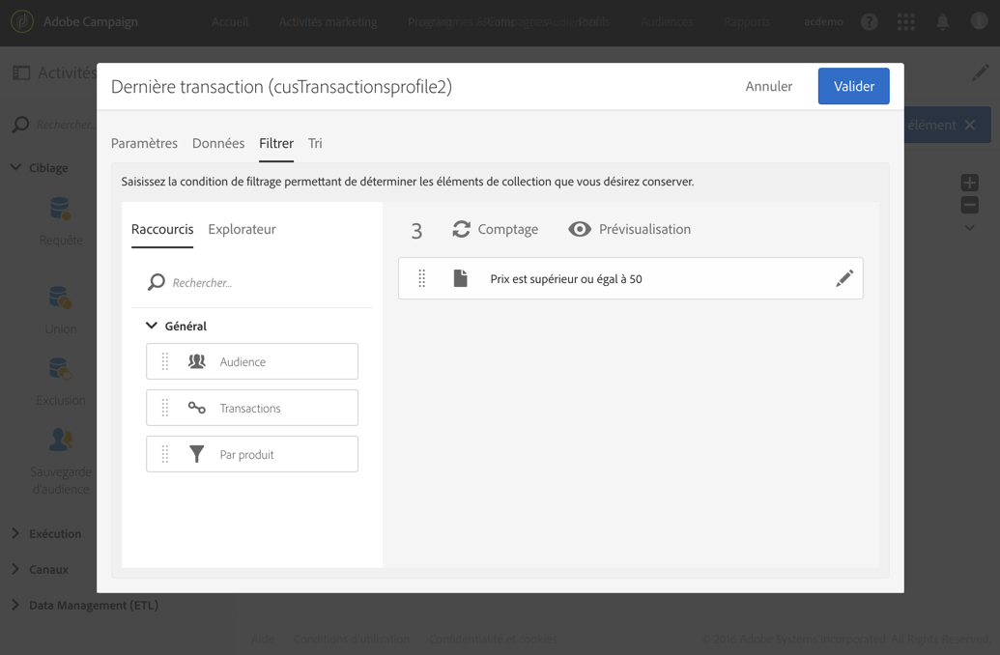

# Requête{#query}

## Description {#description}

The **[!UICONTROL Query]** activity allows you to filter and extract a population of elements from the Adobe Campaign database. You can define **[!UICONTROL Additional data]** for the targeted population via a dedicated tab. Ces données sont stockées dans des colonnes additionnelles et sont exploitables uniquement pour le workflow en cours.

L&#39;activité utilise l&#39;outil d&#39;édition de requêtes, dont le fonctionnement est détaillé dans une [section dédiée](../../automating/using/editing-queries.md#about-query-editor).

## Contexte d&#39;utilisation {#context-of-use}

The **[!UICONTROL Query]** activity can be used for various types of uses:

* segmentation d&#39;individus afin de définir la cible d&#39;un message, une audience, etc.
* enrichissement de données de toute table de la base Adobe Campaign
* export des données.

## Configuration {#configuration}

1. Placez une activité **[!UICONTROL Query]** dans votre workflow.
1. Sélectionnez l&#39;activité puis ouvrez-la à l&#39;aide du bouton , disponible dans les actions rapides qui s&#39;affichent. Par défaut, l&#39;activité est pré-paramétrée pour rechercher des profils.
1. If you would like to run a query on a resource other than the profile resource, go to the activity&#39;s **[!UICONTROL Properties]** tab and select a **[!UICONTROL Resource]** and a **[!UICONTROL Targeting dimension]**.

   The **[!UICONTROL Resource]** allows you to refine the filters displayed in the palette whereas the **[!UICONTROL Targeting dimension]**, contextual with regard to the resource selected, corresponds to the type of population that you would like to obtain (identified profiles, deliveries, data linked to the selected resource, etc.).

   Voir à ce sujet [Dimensions de ciblage et ressources](#targeting-dimensions-and-resources).

1. In the **[!UICONTROL Target]** tab, run your query by defining and combining rules.
1. You can define **[!UICONTROL Additional data]** for the targeted population via a dedicated tab. Ces données sont stockées dans des colonnes additionnelles et sont exploitables uniquement pour le workflow en cours. Vous pouvez notamment ajouter des données provenant des tables de la base Adobe Campaign liées à la dimension de ciblage de la requête. Consultez la section [Enrichir des données](#enriching-data).

   >[!NOTE]
   >
   >Par défaut, l’ **[!UICONTROL Remove duplicate rows (DISTINCT)]** option est cochée dans **[!UICONTROL Advanced options]** l’onglet **[!UICONTROL Additional data]** de l’. If the **[!UICONTROL Query]** activity contains many (from 100) additional data defined, it is recommended to uncheck this option, for performance reasons. Sachez que si cette option est décochée, vous pouvez obtenir des doublons, selon les données faisant l&#39;objet de la requête.

1. In the **[!UICONTROL Transition]** tab, the **[!UICONTROL Enable an outbound transition]** option lets you add an outbound transition after the query activity, even if it retrieves no data.

   Le code segment de la transition sortante peut être personnalisé à l&#39;aide d&#39;une expression standard et de variables d&#39;événements (voir [Personnaliser les activités avec des variables d&#39;événements](../../automating/using/calling-a-workflow-with-external-parameters.md#customizing-activities-with-events-variables)).

1. Validez le paramétrage de l&#39;activité et enregistrez le workflow.

## Dimensions de ciblage et ressources {#targeting-dimensions-and-resources}

Les dimensions de ciblage et les ressources permettent de définir sur quels éléments reposera une requête pour déterminer la cible d&#39;une diffusion.

Les dimensions de ciblage sont définies dans les mappings de ciblage. Voir à ce propos [cette section](../../administration/using/target-mappings-in-campaign.md).

### Définir la dimension de ciblage et la ressource d&#39;une requête {#defining-the-targeting-dimension-and-resource-of-a-query}

Targeting dimension and resources are defined when creating a workflow, in the **[!UICONTROL Properties]** tab of a Query activity.

>[!NOTE]
>
>La dimension de ciblage peut être également définie lors de la création d&#39;une audience (voir [cette section](../../audiences/using/creating-audiences.md)).

Les dimensions de ciblage et les ressources sont liées. Les dimensions de ciblage disponibles dépendent donc de la ressource sélectionnée.

For example, for the Resource **[!UICONTROL Profiles (profile)]**, the following targeting dimensions will be available:

While for **[!UICONTROL Deliveries (delivery)]**, the list will contain the following targeting dimensions:

Une fois la dimension de ciblage et la ressource indiquées, différents filtres sont disponibles dans la requête.

Example of available filters for the **[!UICONTROL Profiles (profile)]** resource:

Example of available filters for the **[!UICONTROL Deliveries (delivery)]** resource:

### Utiliser des ressources différentes des dimensions de ciblage {#using-resources-different-from-targeting-dimensions}

Par défaut, la dimension de ciblage et la ressource sont définies pour cibler des profils.

Il peut toutefois s&#39;avérer utile d&#39;utiliser une ressource différente de la dimension de ciblage si vous souhaitez rechercher un enregistrement spécifique dans une table distante.

**Exemple 1 : identification des profils ciblés par la diffusion avec le libellé « Ravi de vous revoir parmi nous »**.

* Dans ce cas, nous voulons cibler des profils. We will set the targeting dimension to **[!UICONTROL Profiles (profile)]**.
* Nous voulons également filtrer les profils sélectionnés en fonction du libellé de la diffusion. We will therefore set the resource to **[!UICONTROL Delivery logs]**. Ainsi, nous appliquerons un filtre directement dans la table des logs de diffusion, ce qui offrira de meilleures performances.

**Exemple 2 : identification des profils qui n&#39;étaient pas ciblés par la diffusion avec le libellé « Ravi de vous revoir parmi nous ».**

Dans l&#39;exemple précédent, nous avons utilisé une ressource différente de la dimension de ciblage. Cette opération n&#39;est possible que si vous recherchez un enregistrement qui **se trouve** dans la table distante (logs de diffusion dans le cas présent).

Si nous recherchons un enregistrement qui **ne figure pas** dans la table distante (comme des profils n&#39;étant pas ciblés par une diffusion spécifique), nous devons utiliser les mêmes ressource et dimension de ciblage dans la mesure où l&#39;enregistrement ne se trouve pas dans la table distante (logs de diffusion).

* Dans ce cas, nous voulons cibler des profils. We will set the targeting dimension to **[!UICONTROL Profiles (profile)]**.
* Nous voulons également filtrer les profils sélectionnés en fonction du libellé de la diffusion. Il n&#39;est pas possible d&#39;appliquer directement un filtre sur les logs de diffusion dans la mesure où nous recherchons un enregistrement qui ne figure pas dans la table des logs de diffusion. We will therefore set the resource to **[!UICONTROL Profile (profile)]** and build our query on the profiles table.

## Enrichir des données {#enriching-data}

The **[!UICONTROL Additional data]** tab of the **[!UICONTROL Query]**, **[!UICONTROL Incremental query]** and **[!UICONTROL Enrichment]** activities allows you to enrich the data targeted and transfer this data to the following workflow activities, where it can be utilized. Il est notamment possible d&#39;ajouter :

* des données simples.
* des agrégats.
* des collections.

Dans le cas des agrégats et des collections, un **[!UICONTROL Alias]** est automatiquement défini afin de donner un identifiant technique à une expression complexe. Cet alias, qui doit être unique, permet ainsi de retrouver simplement les agrégats et collections par la suite. Vous pouvez le modifier afin de lui donner un nom facilement reconnaissable.

>[!NOTE]
>
>Les alias doivent respecter les règles de syntaxe suivantes : seuls les caractères alphanumériques et les caractères &quot;_&quot; sont autorisés. Les alias sont sensibles à la casse. L&#39;alias doit commencer par le caractère &quot;@&quot;. Le caractère suivant immédiatement le &quot;@&quot; ne doit pas être numérique. Par exemple : @myAlias_1 et @_1Alias sont corrects ; @myAlias#1 et @1Alias sont incorrects.

Après avoir ajouté des données additionnelles, vous pouvez appliquer un niveau de filtre supplémentaire sur les données initialement ciblées en créant des conditions basées sur les données additionnelles définies.

>[!NOTE]
>
>Par défaut, l’ **[!UICONTROL Remove duplicate rows (DISTINCT)]** option est cochée dans **[!UICONTROL Advanced options]** l’onglet **[!UICONTROL Additional data]** de l’. If the **[!UICONTROL Query]** activity contains many (from 100) additional data defined, it is recommended to uncheck this option, for performance reasons. Sachez que si cette option est décochée, vous pouvez obtenir des doublons, selon les données faisant l&#39;objet de la requête.

### Ajouter un champ simple {#adding-a-simple-field}

En ajoutant un champ simple comme donnée additionnelle, celui-ci devient directement visible dans la transition sortante de l&#39;activité. Cela permet par exemple de vérifier que les données issues de la requête sont celles souhaitées.

1. From the **[!UICONTROL Additional data]** tab, add a new element.
1. Dans la fenêtre qui s&#39;ouvre, au niveau du champ **[!UICONTROL Expression]**, sélectionnez l&#39;un des champs disponibles directement dans la dimension de ciblage ou dans l&#39;une des dimensions liées. Vous pouvez éditer des expressions et utiliser des fonctions ou des calculs simples (hors agrégat) à partir des champs de la dimension.

   Un **[!UICONTROL Alias]** est automatiquement créé si vous éditez une expression qui n&#39;est pas un simple chemin XPATH (par exemple : &quot;Year(&lt;@birthDate>)&quot;). Si vous le souhaitez, vous pouvez modifier ce dernier. Si vous sélectionnez un champ uniquement (par exemple : &quot;@age&quot;), il n&#39;est pas nécessaire de définir un **[!UICONTROL Alias]**.

1. Select **[!UICONTROL Add]** to confirm adding the field to the additional data. Lorsque la requête sera exécutée, une colonne supplémentaire correspondant au champ ajouté sera présente dans la transition sortante de l&#39;activité.

### Ajouter un agrégat {#adding-an-aggregate}

Les agrégats permettent de calculer des valeurs à partir de champs de la dimension de ciblage ou de champs des dimensions liées à la dimension de ciblage. Par exemple : la moyenne des achats réalisé par un profil.
Lorsque vous utilisez   avec, sa fonction peut retourner à zéro, qui est alors considérée comme NULL. Utilisez l’ **[!UICONTROL Output filtering]** onglet de votre  pour filtrer la valeur agrégée :

* si vous ne voulez aucune valeur, vous devez filtrer **[!UICONTROL is null]**.
* si vous ne souhaitez pas que les valeurs zéro soient filtrées **[!UICONTROL is not null]**.

Notez que si vous devez effectuer un tri sur votre  , vous devez filtrer les valeurs nulles, sinon la valeur NULL apparaîtra comme le nombre le plus élevé.

1. From the **[!UICONTROL Additional data]** tab, add a new element.
1. Dans la fenêtre qui s&#39;ouvre, sélectionnez la collection que vous souhaitez utiliser pour créer votre agrégat au niveau du champ **[!UICONTROL Expression]**.

   An **[!UICONTROL Alias]** is created automatically. If you like, you can modify it by going back to the query&#39;s **[!UICONTROL Additional data]** tab.

   La fenêtre de définition des agrégats s&#39;ouvre.

1. Define an aggregate from the **[!UICONTROL Data]** tab. En fonction du type d&#39;agrégat sélectionné, seuls les éléments dont le type de données est compatible sont disponibles au niveau du champ **[!UICONTROL Expression]**. Par exemple, il n&#39;est possible de calculer une somme qu&#39;avec des données numériques.

   

   Vous pouvez ajouter plusieurs agrégats portant sur les champs de la collection sélectionnée. Veillez à définir des libellés explicites afin de pouvoir distinguer les différentes colonnes dans le détail des données transmises en sortie de l&#39;activité.

   Vous pouvez également modifier les alias définis automatiquement pour chaque agrégat.

   

1. Au besoin, vous pouvez ajouter un filtre afin de limiter les données prises en compte.

   Reportez-vous à la section [Filtrer les données ajoutées](#filtering-added-data).

1. Select **[!UICONTROL Confirm]** to add aggregates.

>[!NOTE]
>
>You cannot create an expression containing an aggregate directly from the **[!UICONTROL Expression]** field of the **[!UICONTROL New additional data]** window.

### Ajouter une collection {#adding-a-collection}

1. From the **[!UICONTROL Additional data]** tab, add a new element.
1. Dans la fenêtre qui s&#39;ouvre, sélectionnez la collection que vous souhaitez ajouter au niveau du champ **[!UICONTROL Expression]**. An **[!UICONTROL Alias]** is created automatically. If you like, you can modify it by going back to the query&#39;s **[!UICONTROL Additional data]** tab.
1. Sélectionner **[!UICONTROL Add]**. Une nouvelle fenêtre s&#39;ouvre, vous permettant d&#39;affiner les données de la collection que vous souhaitez afficher.
1. Dans l’ **[!UICONTROL Parameters]** onglet, sélectionnez **[!UICONTROL Collection]** et définissez le nombre de lignes de la collection à ajouter. Par exemple, si vous souhaitez que les trois achats les plus récents soient effectués par chaque , saisissez &quot;3&quot; dans le **[!UICONTROL Number of lines to return]** champ.

   >[!NOTE]
   >
   >Vous devez indiquer un nombre supérieur ou égal à 1.

1. From the **[!UICONTROL Data]** tab, define the fields of the collection that you want to display for each line.

   

1. Si vous le souhaitez, vous pouvez ajouter un filtre afin de limiter les lignes de la collection prises en compte.

   Reportez-vous à la section [Filtrer les données ajoutées](#filtering-added-data).

1. Si vous le souhaitez, vous pouvez définir un tri sur les données.

   For example, if you have selected 3 lines to return in the **[!UICONTROL Parameters]** tab, and you want to determine the three most recent purchases, you can define a descending sort on the &quot;date&quot; field of the collection that corresponds to the transactions.

1. Reportez-vous à la section [Trier les données ajoutées](#sorting-additional-data).
1. Select **[!UICONTROL Confirm]** to add the collection.

### Filtrer les données ajoutées {#filtering-added-data}

Lorsque vous ajoutez un agrégat ou une collection, vous avez la possibilité de spécifier un filtre supplémentaire afin de limiter les données que vous souhaitez afficher.

For example, if you want to only process the collection lines of transactions with amounts of 50 dollars and above, you can add a condition on the field corresponding to the transaction amount from the **[!UICONTROL Filter]** tab.

### Trier les données ajoutées {#sorting-additional-data}

Lorsque vous ajoutez un agrégat ou une collection aux données d&#39;une requête, vous pouvez indiquer si vous souhaitez appliquer un tri - croissant ou décroissant - basé sur la valeur du champ ou de l&#39;expression défini.

For example, if you want to save only the transaction that was carried out most recently by a profile, enter &quot;1&quot; in the **[!UICONTROL Number of lines to return]** field of the **[!UICONTROL Parameters]** tab, and apply a descending sort on the field corresponding to the transaction date via the **[!UICONTROL Sort]** tab.

### Filtrer les données ciblées en fonction des données additionnelles {#filtering-the-targeted-data-according-to-additional-data}

Once you have added additional data, a new **[!UICONTROL Output filtering]** tab appears in the **[!UICONTROL Query]**. This tab allows you to apply an additional filter on the data initially targeted in the **[!UICONTROL Target]** tab, by taking into account the added data.

For example, if you have targeted all of the profiles that carried out at least one transaction and an aggregate calculating the average transaction amount carried out for each profile was added to the **[!UICONTROL Additional data]**, you can refine the population initially calculated using this average.

To do this, in the **[!UICONTROL Output filtering]** tab, simply add a condition on this additional data.

### Exemple : personnaliser un email avec des données additionnelles {#example--personalizing-an-email-with-additional-data}

L&#39;exemple suivant illustre l&#39;ajout de différents types de données additionnelles dans une requête et leur utilisation en tant que champ de personnalisation dans un email.

Pour cet exemple, des [ressources personnalisées](../../developing/using/data-model-concepts.md) sont utilisées :

* La ressource **profile** a été étendue afin d&#39;ajouter un champ permettant d&#39;enregistrer les points fidélité de chaque profil.
* Une ressource **transactions** a été créée et recense tous les achats effectués par les profils de la base. La date, le prix et le produit acheté est conservé pour chaque transaction.
* Une ressource **produits** a été créée et référence les produits disponibles à l&#39;achat.

L&#39;objectif est d&#39;envoyer un email aux profils pour lesquels au moins une transaction a été enregistrée. Via cet email, les clients recevront un rappel de la dernière transaction qu&#39;ils ont effectuée ainsi que diverses informations récapitulatives sur l&#39;ensemble de leurs transactions : nombre de produits achetés, total dépensé, rappel du nombre de points fidélité acquis.

Le workflow de se présente comme suit :

1. Add a **[!UICONTROL Query]** activity, which allows you to target the profiles that have carried out at least one transaction.

   

   From the query&#39;s **[!UICONTROL Additional data]** tab, define the different data to be displayed in the final email:

   * Le champ simple de la dimension **profile** correspondant aux points fidélité. Reportez-vous à la section [Ajouter un champ simple](#adding-a-simple-field).
   * Deux agrégats basés sur la collection des transactions : le nombre de produits achetés et le montant total dépensé. You can add them from the **[!UICONTROL Data]** tab of the aggregate configuration window, using the **Count** and **Sum** aggregates. Reportez-vous à la section [Ajouter un agrégat](#adding-an-aggregate).
   * Une collection permettant de retrouver le montant, la date et le produit de la dernière transaction effectuée.

      To do this, you have to add the different fields that you want to display from the **[!UICONTROL Data]** tab of the collection configuration window.

      To return only the most recent transaction, you have to enter &quot;1&quot; for the **[!UICONTROL Number of lines to return]** and apply a descending sort on the **Date** field of the collection from the **[!UICONTROL Sort]** tab.

      Reportez-vous aux sections [Ajouter une collection](#adding-a-collection) et [Trier les données ajoutées](#sorting-additional-data).
   

   If you would like to check that the data is correctly transferred by the activity&#39;s outbound transition, start the workflow for the first time (without the **[!UICONTROL Email delivery]** activity) and open the query&#39;s outbound transition.

   

1. Ajouter un  **[!UICONTROL Email delivery]** . Dans le contenu de l&#39;email, insérez les champs de personnalisation correspondant aux données calculées dans la requête. You can find it via the **[!UICONTROL Additional data (targetData)]** link of the personalization fields explorer.

   

Votre workflow est prêt à être exécuté. Les profils ciblés dans la requête recevront un email personnalisé contenant les données calculées issues de leurs transactions.

## Exemples de requêtes {#query-samples}

### Ciblage des attributs de profil simples {#targeting-on-simple-profile-attributes}

L&#39;exemple qui suit montre une activité de requête configurée pour cibler les hommes âgés de 18 à 30 ans, vivant à Londres.

### Ciblage des attributs d&#39;emails {#targeting-on-email-attributes}

L&#39;exemple qui suit montre une activité de requête configurée pour cibler des profils dont le domaine d&#39;adresse électronique est « orange.co.uk ».

L&#39;exemple qui suit montre une activité de requête configurée pour cibler des profils dont l&#39;adresse électronique a été fournie.

### Ciblage de profils dont c&#39;est l&#39;anniversaire {#targeting-profiles-whose-birthday-is-today}

L&#39;exemple qui suit montre une activité de requête configurée pour cibler des profils dont c&#39;est l&#39;anniversaire.

1. Drag the **[!UICONTROL Birthday]** filter in your query.

   

1. Définissez le **[!UICONTROL Filter type]** sur **[!UICONTROL Relative]** et sélectionnez **[!UICONTROL Today]**.

   

### Ciblage des profils ayant ouvert une diffusion spécifique {#targeting-profiles-who-opened-a-specific-delivery}

L&#39;exemple qui suit montre une activité de requête configurée pour filtrer les profils ayant ouvert une diffusion avec le libellé « Été ».

1. Drag the **[!UICONTROL Opened]** filter in your query.

   

1. Select the delivery then click **[!UICONTROL Confirm]**.

   

### Ciblage des profils pour lesquels les diffusions ont échoué pour une raison spécifique {#targeting-profiles-for-whom-deliveries-failed-for-a-specific-reason}

L&#39;exemple qui suit montre une activité de requête configurée pour filtrer les profils pour lesquels les diffusions ont échoué en raison d&#39;une boîte pleine. This query is only available for users with administration rights and belonging to the **[!UICONTROL All (all)]** organizational units (see [this section](../../administration/using/organizational-units.md)).

1. Select the **[!UICONTROL Delivery logs]** resource in order to filter directly in the delivery log table (see [Using resources different from targeting dimensions](#using-resources-different-from-targeting-dimensions)).

   

1. Drag the **[!UICONTROL Nature of failure]** filter in your query.

   

1. Sélectionnez le type d&#39;échec que vous souhaitez cibler. Dans notre cas **[!UICONTROL Mailbox full]**.

   

### Ciblage des profils n&#39;ayant pas été contactés au cours des 7 derniers jours {#targeting-profiles-not-contacted-during-the-last-7-days}

L&#39;exemple qui suit montre une activité de requête configurée pour filtrer les profils n&#39;ayant pas été contactés au cours des 7 derniers jours.

1. Drag the **[!UICONTROL Delivery logs (logs)]** filter in your query.

   

   Sélectionnez **[!UICONTROL Does not exist]** dans le  déroulant, puis faites glisser le **[!UICONTROL Delivery]** filtre.

   

1. Configurez le filtre comme indiqué ci-dessous.

   

### Ciblage des profils ayant cliqué sur un lien spécifique {#targeting-profiles-who-clicked-a-specific-link-}

1. Drag the **[!UICONTROL Tracking logs (tracking)]** filter in your query.

   

1. Faites glisser le **[!UICONTROL Label (urlLabel)]** filtre.

   

1. In the **[!UICONTROL Value]** field, type the label that was defined when inserting the link in the delivery, then confirm.

   

