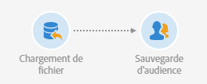
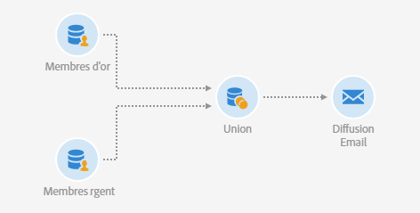

# Lecture d'audience{#read-audience}

## Description {#description}


L'activité **[!UICONTROL Lecture d'audience]permet de récupérer une audience existante et de l'affiner en y appliquant des conditions de filtrage supplémentaires.**

## Contexte d'utilisation {#context-of-use}

L'activité **[!UICONTROL Lecture d'audience]** est une version simplifiée de l'activité **Requête], conçue pour les cas où l'on souhaite simplement sélectionner une audience existante.[!UICONTROL **

## Configuration {#configuration}

1. Placez une activité **[!UICONTROL Lecture d'audience]dans votre workflow.**
1. Sélectionnez l'activité puis ouvrez-la à l'aide du bouton 
1. Sélectionnez l'audience que vous souhaitez récupérer dans l'onglet **[!UICONTROL Propriétés].**

   You can retrieve audiences of the following types: **[!UICONTROL List]**, **[!UICONTROL Query]**, **[!UICONTROL File]** and **[!UICONTROL Experience Cloud]**. Pour plus d'informations sur les types d'audiences, consultez la documentation [Audiences](../../audiences/using/about-audiences.md).

   L'option **[!UICONTROL Utiliser une audience dynamique]vous permet de définir le nom de l'audience à cibler en fonction des variables d'événements du workflow.** Voir à ce propos la section [Personnaliser les activités avec des variables d'événements](../../automating/using/calling-a-workflow-with-external-parameters.md#customizing-activities-with-events-variables).

   

1. Pour appliquer un filtrage supplémentaire à l'audience sélectionnée, ajoutez des conditions via l'onglet **[!UICONTROL Filtrage de la source]de l'activité.**

   Pour plus d'informations sur la création des conditions de filtrage, voir la documentation [Créer des requêtes](../../automating/using/editing-queries.md#creating-queries).

1. Validez le paramétrage de l'activité et enregistrez le workflow.

## Exemple : réconcilier une audience de type fichier avec la base de données {#example--reconcile-a-file-audience-with-the-database}

Cet exemple montre comment utiliser l'activité **[!UICONTROL Lecture d'audience]pour réconcilier une audience créée directement à partir d'un import de fichier.**

Lors d'un import de fichier, il est possible de sauvegarder son contenu directement dans une audience. Il s'agit alors d'une audience de type fichier et ses données ne sont liées à aucune ressource de base de données.

Le workflow d'import se présente comme suit :



* Une activité [Chargement de fichier](../../automating/using/load-file.md) télécharge un fichier contenant des données de profils extraites à l'aide d'un outil externe.

   Par exemple :

   ```
   lastname;firstname;birthdate;email;crmID
   Smith;Hayden;23/05/1989;hayden.smith@example.com;124365
   Mars;Daniel;17/11/1987;dannymars@example.com;123545
   Smith;Clara;08/02/1989;hayden.smith@example.com;124567
   Durance;Allison;15/12/1978;allison.durance@example.com;120987
   Lucassen;Jody;28/03/1988;jody.lucassen@example.com;127634
   Binder;Tom;19/01/1982;tombinder@example.com;128653
   Binder;Tommy;19/01/1915;tombinder@example.com;134576
   Connor;Jade;10/10/1979;connor.jade@example.com;132452
   Mack;Clarke;02/03/1985;clarke.mack@example.com;149876
   Ross;Timothy;04/07/1986;timross@example.com;157643
   ```

* Une activité [Sauvegarde d'audience](../../automating/using/save-audience.md) sauvegarde les données entrantes sous forme d'audience. Comme les données n'ont pas encore été réconciliées, l'audience est une Audience Fichier et ses données ne sont pas encore reconnues en tant que données de profil.

Le workflow de réconciliation se présente comme suit :


* L'activité **[!UICONTROL Lecture d'audience]télécharge l'audience de type Fichier créée dans le workflow d'import.** Les données de l'audience ne sont pas encore réconciliées avec la base de données Adobe Campaign.
* Via son onglet **[!UICONTROL Identification], une activité[Réconciliation](../../automating/using/reconciliation.md)identifie les données entrantes comme étant des profils.** Par exemple, en utilisant le champ **email** comme critère de réconciliation.
* Une activité [Mise à jour de données](../../automating/using/update-data.md) insère et met à jour la ressource profils de la base de données avec les données entrantes. Comme les données sont déjà identifiées comme des profils, vous pouvez sélectionner l'option **[!UICONTROL En utilisant directement la dimension de ciblage]**, puis **[!UICONTROL Profils]dans l'onglet** Identification] de l'activité. **[!UICONTROL ** Pour finir, ajoutez simplement la liste des champs à mettre à jour dans l'onglet correspondant.

## Exemple : union sur deux audiences affinées {#example--union-on-two-refined-audiences}

Le workflow défini dans cet exemple montre l'union de deux activités **[!UICONTROL Lecture d'audience.]** L'objectif de ce workflow est d'envoyer un email aux membres Gold ou Silver qui ont entre 18 et 30 ans.

Des audiences spécifiques sont déjà créées dans le système pour tracker les membres Gold et Silver.

Le workflow se présente comme suit :



* Une première activité **[!UICONTROL Lecture d'audience]qui récupère l'audience membres Gold et l'affine en sélectionnant uniquement les profils qui ont entre 18 et 30 ans.**
* Une deuxième activité **[!UICONTROL Lecture d'audience]qui récupère l'audience membres Silver et l'affine en sélectionnant uniquement les profils qui ont entre 18 et 30 ans.**
* Une activité **[!UICONTROL Union]** qui réunit les populations issues des deux activités **Lecture d'audience]en une population finale.[!UICONTROL **
* Une activité **[!UICONTROL Diffusion Email]** qui envoie l'email à la population en provenance de l'activité **Union[!UICONTROL .]**

