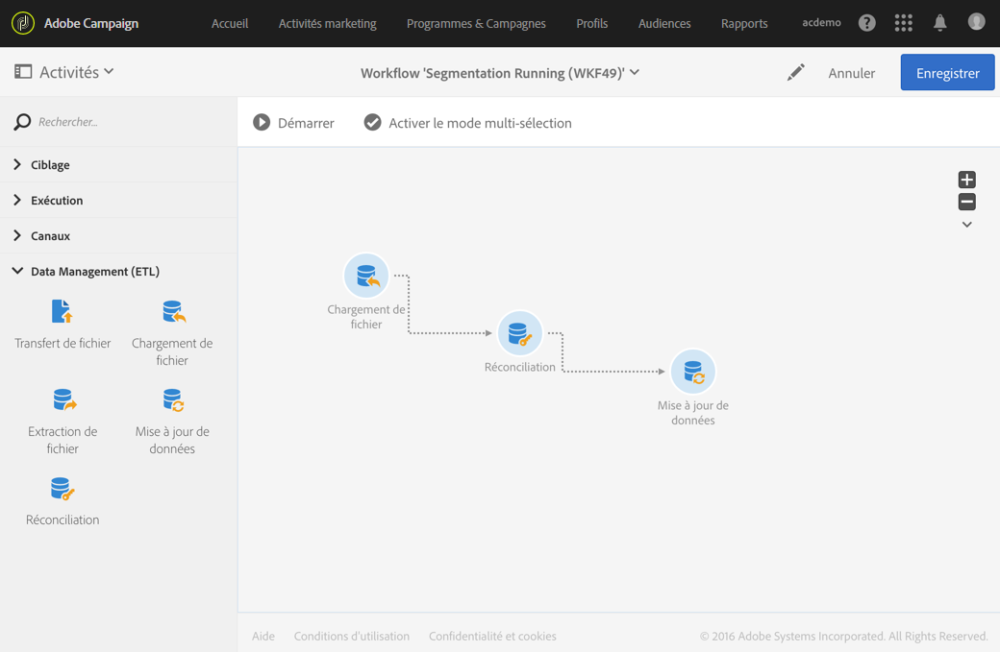
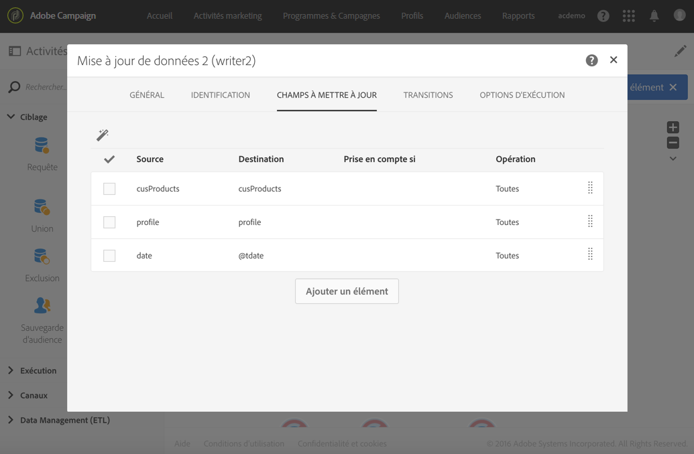

# Réconciliation des données à l’aide des relations {#reconciliation-relations}

L&#39;exemple suivant illustre un workflow permettant de mettre à jour les données de la base à partir de données d&#39;achats contenues dans un fichier. Les données d&#39;achats comportent des données référençant des éléments d&#39;autres dimensions, tels que l&#39;email des clients et les codes produits.

>[!NOTE]
>
>Les ressources **Transactions** et **Produits** utilisées dans cet exemple n&#39;existent pas par défaut dans la base de données Adobe Campaign. Elles ont donc été préalablement créées à l&#39;aide de la fonction de [Personnalisation des ressources. ](../../developing/using/data-model-concepts.md) Les profils correspondant aux adresses mail du fichier importé ainsi que les produits ont préalablement été chargés dans la base de données.

Le workflow se compose des activités suivantes :



* un [Chargement de fichier](../../automating/using/load-file.md) permettant de charger et détecter les données du fichier à importer. Le fichier importé contient les données suivantes :

   * la date de la transaction
   * l&#39;adresse email du client
   * le code du produit acheté.

   ```
   date;client;product
   2015-05-19 09:00:00;mail1@email.com;ZZ1
   2015-05-19 09:01:00;mail2@email.com;ZZ2
   2015-05-19 09:01:01;mail3@email.com;ZZ2
   2015-05-19 09:01:02;mail4@email.com;ZZ2
   2015-05-19 09:02:00;mail5@email.com;ZZ3
   2015-05-19 09:03:00;mail6@email.com;ZZ4
   2015-05-19 09:04:00;mail7@email.com;ZZ5
   2015-05-19 09:05:00;mail8@email.com;ZZ7
   2015-05-19 09:06:00;mail9@email.com;ZZ6
   ```

* une [Réconciliation](../../automating/using/reconciliation.md) permettant de rattacher les données d&#39;achat à des profils de la base ainsi qu&#39;à des produits. Il est ainsi nécessaire de définir une relation entre les données du fichier et la table des profils ainsi que la table des produits. Cette configuration est réalisée dans l&#39;onglet **[!UICONTROL Relations]** de l&#39;activité :

   * Relation avec les **Profils** : la colonne **client** du fichier est liée au champ **email** de la dimension des **Profils**.
   * Relation avec les **Produits** : la colonne **produit** du fichier est liée au champ **productCode** de la dimension des **Profils**.

   Des colonnes sont ajoutées aux données entrantes afin de référencer les clés étrangères des dimensions liées.

   

* une [Mise à jour de données](../../automating/using/update-data.md) permettant de définir les champs de la base à mettre à jour à l&#39;aide des données importées. Comme les données ont déjà été identifiées comme appartenant à la dimension des **Transactions** dans l&#39;activité précédente, il est ici possible d&#39;utiliser directement l&#39;option d&#39;identification **[!UICONTROL En utilisant directement la dimension de ciblage]**.

   En utilisant l&#39;option de détection automatique des champs à mettre à jour, les liens configurés dans l&#39;activité précédente (vers les profils et les produits) sont ajoutés à la liste des **[!UICONTROL Champs à mettre à jour]**. Vous devez également vous assurer que le champ correspondant à la date de la transaction soit correctement ajouté à cette liste.

   

   
