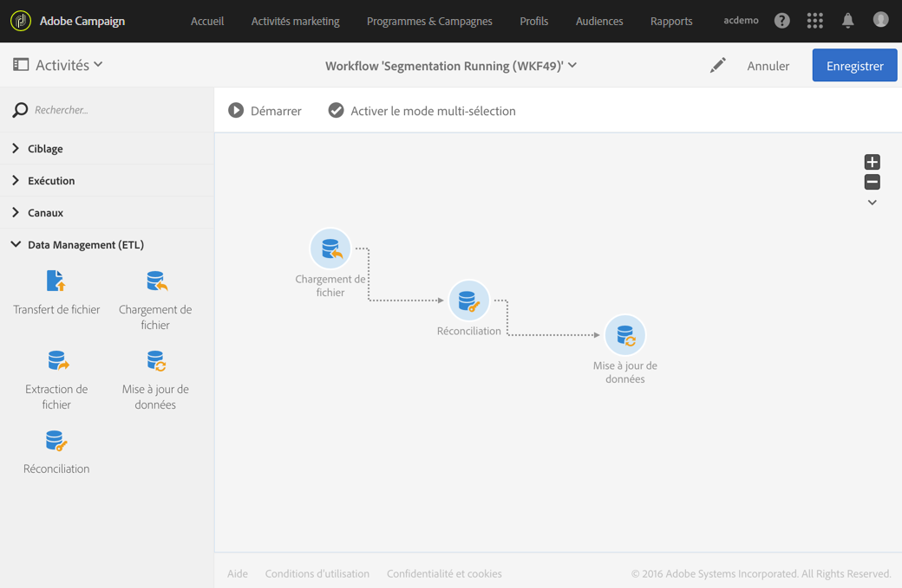
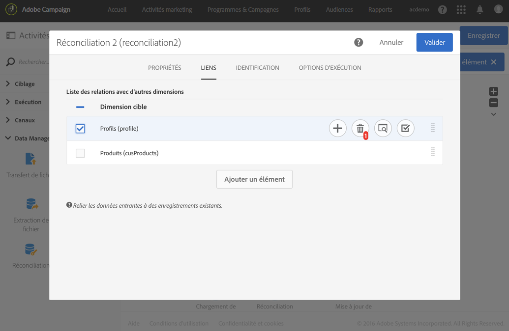
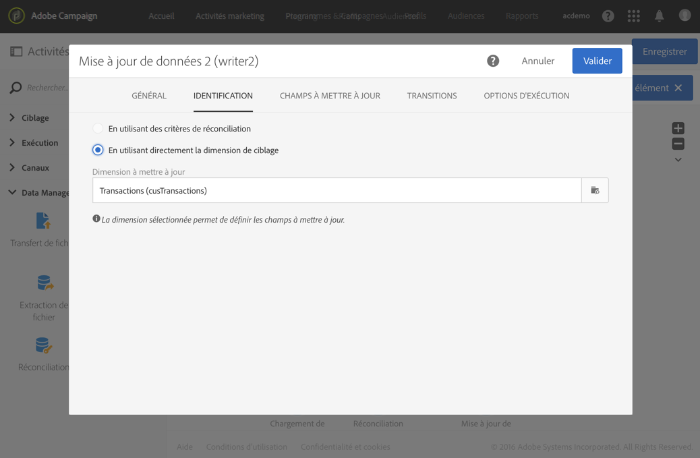
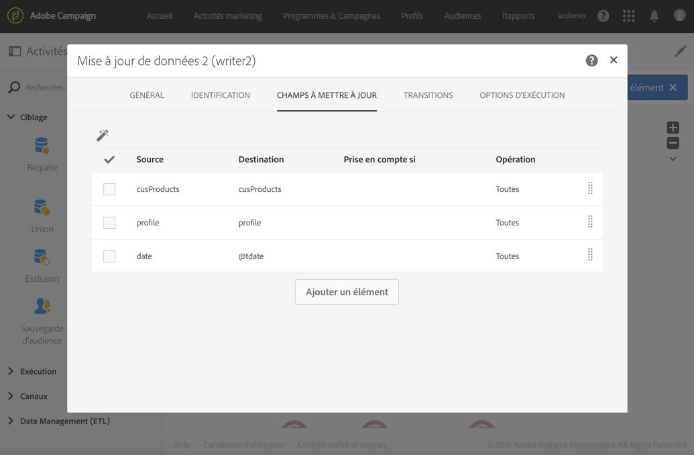
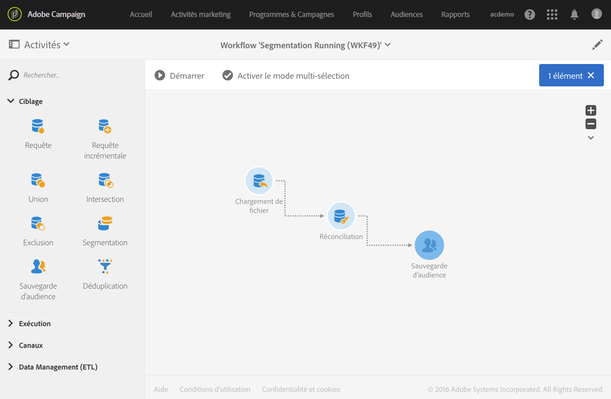
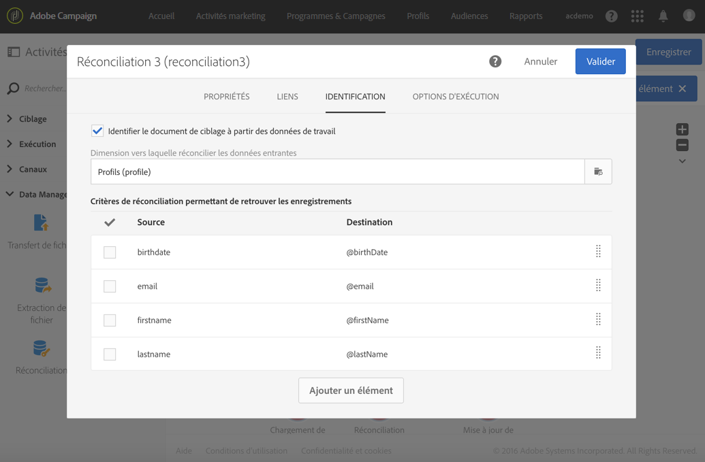
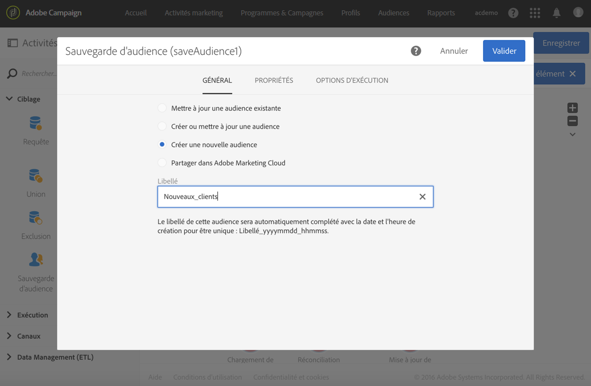

# Réconciliation{#reconciliation}

## Description {#description}


L'activité **[!UICONTROL Réconciliation]permet de relier des données non identifiées à des ressources existantes.**

## Contexte d'utilisation {#context-of-use}

L'activité **[!UICONTROL Réconciliation]est essentiellement utilisée à des fins de Data Management et répond à deux cas d'utilisation distincts :**

* Ajout de relations : un onglet **[!UICONTROL Liens]permet d'ajouter des liens entre les données entrantes et plusieurs autres dimensions de la base de données Adobe Campaign.**

   Par exemple, un fichier contenant des données d'achats peut également contenir des informations permettant d'identifier les produits achetés ainsi que l'acheteur. Deux dimensions supplémentaires (en plus de celle des **Achats**) sont alors concernées par les données du fichier : la dimension des **Produits** et la dimension des **Profils.** Il faut ainsi créer des relations entre ces dernières et la dimension des **Achats** (voir exemple ci-après).

   Lorsqu'une relation est définie, une colonne est ajoutée aux données entrantes afin de référencer la clé étrangère de la dimension liée.

   >[!NOTE]
   >
   >Cette opération suppose que les données des dimensions liées sont déjà présentes en base. Par exemple, si vous importez un fichier d'actes d'achats indiquant quel produit a été acheté, à quelle heure, par quel client, etc., le produit ainsi que le client doivent déjà exister en base.

* Identification de données : un onglet **[!UICONTROL Identification]vous permet de simplement associer les données entrantes à des colonnes d'une dimension existante dans la base de données Adobe Campaign.** En sortie de l'activité, les données sont identifiées comme appartenant à la dimension définie.

   Vous pouvez par exemple ensuite réaliser une sauvegarde d'audience, mettre à jour les données de la base, etc.

L'activité **[!UICONTROL Réconciliation]peut par exemple être placée après une activité de chargement de données visant à importer des données non standard dans la base.**

## Configuration {#configuration}

1. Placez une activité **[!UICONTROL Réconciliation]dans votre workflow, à la suite d'une transition contenant une population dont la dimension de ciblage ne provient pas directement d'Adobe Campaign.** Voir à ce sujet [Dimensions de ciblage et ressources](../../automating/using/query.md#targeting-dimensions-and-resources).
1. Sélectionnez l'activité puis ouvrez-la à l'aide du bouton 
1. Si vous souhaitez définir des liens entre les données entrantes et d'autres dimensions de la base, accédez à l'onglet **[!UICONTROL Liens].**

   Ajoutez autant de relations que nécessaire. Pour chaque relation, sélectionnez d'abord la dimension liée puis dans le détail du lien, indiquez les champs correspondants.

1. Si vous souhaitez simplement identifier les données entrantes, accédez à l'onglet **[!UICONTROL Identification]** et cochez la case **Identifier le document de ciblage à partir des données de travail[!UICONTROL .]**

   Sélectionnez la dimension de ciblage vers laquelle vous souhaitez réconcilier les données entrantes.

   Ajoutez des critères de réconciliation permettant d'associer un enregistrement de la transition entrante à un enregistrement de la dimension de ciblage sélectionnée. Si plusieurs critères sont indiqués, ils doivent tous être vérifiés pour que le l'association entre les données puisse se faire.

   Choisissez le mode de **[!UICONTROL Traitement des lignes sources non identifiées] :**

   * **[!UICONTROL Les ignorer]** : seules les données ayant pu être identifiées sont conservées dans la transition sortante de l'activité.
   * **[!UICONTROL Les conserver dans la population de sortie]** : toutes les données de la transition entrante sont conservées dans la transition sortante de l'activité.

1. Validez le paramétrage de l'activité et enregistrez le workflow.

## Exemple 1 : définition de relations {#example-1--relation-definition}

L'exemple suivant illustre un workflow permettant de mettre à jour les données de la base à partir de données d'achats contenues dans un fichier. Les données d'achats comportent des données référençant des éléments d'autres dimensions, tels que l'email des clients et les codes produits.

>[!NOTE]
>
>Les ressources **Transactions** et **Produits** utilisées dans cet exemple n'existent pas par défaut dans la base de données Adobe Campaign. Elles ont donc été préalablement créées à l'aide de la fonction de [Personnalisation des ressources. ](../../developing/using/data-model-concepts.md) Les profils correspondant aux adresses mail du fichier importé ainsi que les produits ont préalablement été chargés dans la base de données.

Le workflow se compose des activités suivantes :



* un **[!UICONTROL Chargement de fichier]permettant de charger et détecter les données du fichier à importer.** Le fichier importé contient les données suivantes :

   * la date de la transaction
   * l'adresse email du client
   * le code du produit acheté.
   
   ```
   date;client;product
   2015-05-19 09:00:00;mail1@email.com;ZZ1
   2015-05-19 09:01:00;mail2@email.com;ZZ2
   2015-05-19 09:01:01;mail3@email.com;ZZ2
   2015-05-19 09:01:02;mail4@email.com;ZZ2
   2015-05-19 09:02:00;mail5@email.com;ZZ3
   2015-05-19 09:03:00;mail6@email.com;ZZ4
   2015-05-19 09:04:00;mail7@email.com;ZZ5
   2015-05-19 09:05:00;mail8@email.com;ZZ7
   2015-05-19 09:06:00;mail9@email.com;ZZ6
   ```

* une **[!UICONTROL Réconciliation]permettant de rattacher les données d'achat à des profils de la base ainsi qu'à des produits.** Il est ainsi nécessaire de définir une relation entre les données du fichier et la table des profils ainsi que la table des produits. Cette configuration est réalisée dans l'onglet **[!UICONTROL Relations]de l'activité :**

   * Relation avec les **Profils** : la colonne **client** du fichier est liée au champ **email** de la dimension des **Profils**.
   * Relation avec les **Produits** : la colonne **produit** du fichier est liée au champ **productCode** de la dimension des **Profils**.
   Des colonnes sont ajoutées aux données entrantes afin de référencer les clés étrangères des dimensions liées.

   

* une **[!UICONTROL Mise à jour de données]permettant de définir les champs de la base à mettre à jour à l'aide des données importées.** Comme les données ont déjà été identifiées comme appartenant à la dimension des **Transactions** dans l'activité précédente, il est ici possible d'utiliser directement l'option d'identification **[!UICONTROL En utilisant directement la dimension de ciblage].**

   En utilisant l'option de détection automatique des champs à mettre à jour, les liens configurés dans l'activité précédente (vers les profils et les produits) sont ajoutés à la liste des **[!UICONTROL Champs à mettre à jour]**. Vous devez également vous assurer que le champ correspondant à la date de la transaction soit correctement ajouté à cette liste.

   

   

## Exemple 2 : identification {#example-2--identification}

L'exemple suivant illustre un workflow permettant de créer une audience de profils directement à partir d'un fichier importé contenant des nouveaux clients. Il se compose des activités suivantes :



* un **[!UICONTROL Chargement de fichier]permettant de charger et détecter les données du fichier à importer.** Le fichier importé contient les données suivantes :

   ```
   lastname;firstname;email;dateofbirth
   jackman;megan;megan.jackman@testmail.com;07/08/1975
   phillips;edward;phillips@testmail.com;09/03/1986
   weaver;justin;justin_w@testmail.com;11/15/1990
   martin;babeth;babeth_martin@testmail.net;11/25/1964
   reese;richard;rreese@testmail.com;02/08/1987
   cage;nathalie;cage.nathalie227@testmail.com;07/03/1989
   xiuxiu;andrea;andrea.xiuxiu@testmail.com;09/12/1992
   grimes;daryl;daryl_890@testmail.com;12/06/1979
   tycoon;tyreese;tyreese_t@testmail.net;10/08/1971
   ```

* une **[!UICONTROL Réconciliation]permettant d'associer chaque colonne du fichier chargé à une colonne de la dimension des profils.** Les enregistrements du fichier ne pouvant pas être identifiés (données manquantes, type de données incompatible, etc.) sont ignorés afin de préserver l'intégrité des données de l'audience finale.

   

* une **[!UICONTROL Sauvegarde d'audience]permettant d'enregistrer l'audience de profils.**

   

