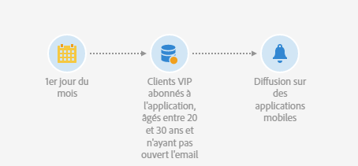
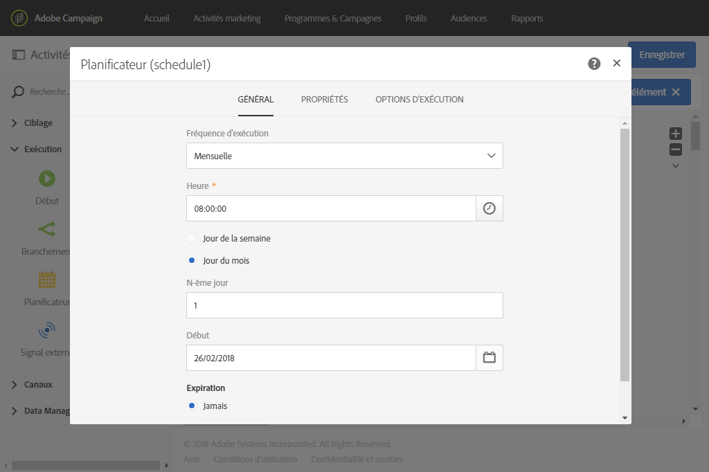
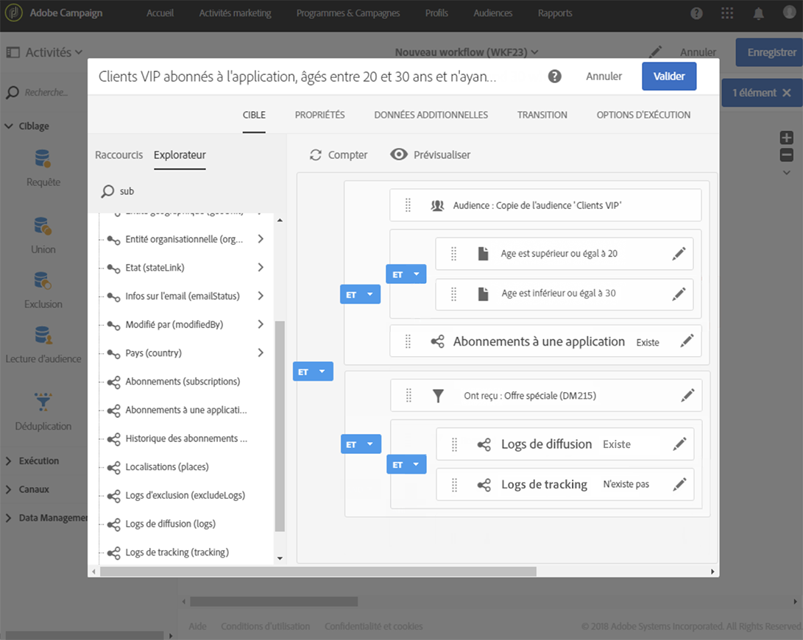
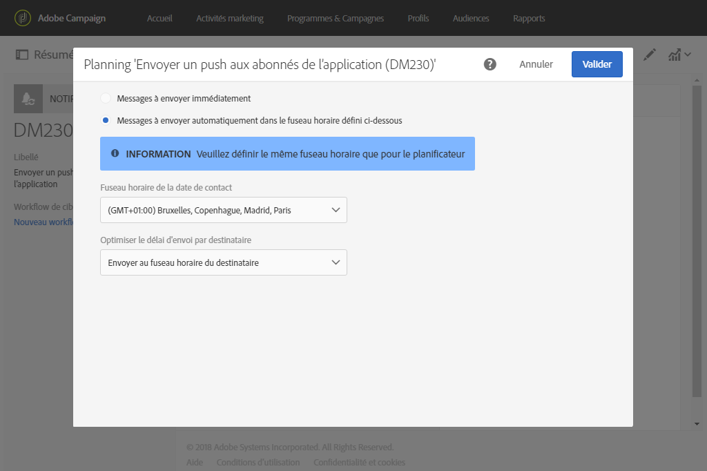
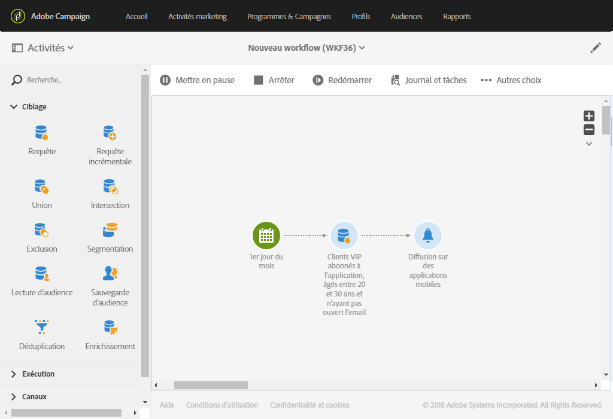

# Envoi d&#39;une notification push récurrente avec un workflow {#sending-a-recurring-push-notification-with-a-workflow}

Dans cet exemple, une notification push personnalisée est envoyée chaque premier jour du mois, à 8h, aux abonnés de votre application mobile selon leur fuseau horaire.

Pour créer le workflow, procédez comme suit :

1. L&#39;activité [Planificateur](../../automating/using/scheduler.md) permet de démarrer le workflow plusieurs jours avant le début de la diffusion afin d&#39;envoyer à chaque abonné la notification à 8h, dans tous les fuseaux horaires spécifiés :

   * Dans le champ **[!UICONTROL Fréquence d&#39;exécution]**, sélectionnez Mensuelle.
   * Dans le champ **[!UICONTROL Heure]**, sélectionnez 8h.
   * Sélectionnez le jour auquel la diffusion sera envoyée chaque mois.
   * Sélectionnez la date de début du workflow. Celle-ci doit être au moins un jour avant le début de la diffusion. Sinon, certains destinataires pourront recevoir le message un jour après si l&#39;heure sélectionnée est déjà passée dans leur fuseau horaire.
   * Dans l&#39;onglet **[!UICONTROL Options d&#39;exécution]**, sélectionnez le fuseau horaire dans lequel démarrera le workflow dans le champ **[!UICONTROL Fuseau horaire]**. Dans cet exemple, le workflow démarrera à 8h, heure du Pacifique, une semaine avant le premier jour du mois, afin que les diffusions puissent être créées pour tous les fuseaux horaires applicables.

   >[!NOTE]
   >
   >Par défaut, le fuseau horaire sélectionné est celui défini dans les propriétés du workflow (voir [Construire un workflow](../../automating/using/building-a-workflow.md)).

   

1. L&#39;activité [Requête](../../automating/using/query.md) permet de cibler les clients VIP, âgés entre 20 et 30 ans, abonnés à votre application mobile et n&#39;ayant pas ouvert l&#39;email que vous avez envoyé :

   * Sélectionnez une audience (vos clients VIP) et appliquez un filtrage sur l&#39;âge.
   * Placez l&#39;élément **Abonnements à une application** dans l&#39;espace de travail. Choisissez **Existe** et sélectionnez l&#39;application mobile à utiliser.
   * Sélectionnez l&#39;email que vous avez envoyé à vos clients.
   * Placez l&#39;élément **Logs de diffusion (logs)** dans l&#39;espace de travail, puis sélectionnez **Existe** pour cibler tous les clients qui ont reçu l&#39;email.
   * Placez l&#39;élément **Logs de tracking (tracking)** dans l&#39;espace de travail, puis sélectionnez **N&#39;existe pas** pour cibler tous les clients qui n&#39;ont pas ouvert l&#39;email.

      

1. L’activité [Diffusion notification push](../../automating/using/push-notification-delivery.md) vous permet de saisir le contenu de votre message et de sélectionner les champs de personnalisation que vous souhaitez utiliser.

   * Sélectionnez l&#39;option **[!UICONTROL Notification récurrente]**.
   * Définissez le contenu de la notification push. Pour plus d&#39;informations sur le contenu d&#39;une notification push, consultez cette [section](../../channels/using/preparing-and-sending-a-push-notification.md).
   * Dans le bloc **[!UICONTROL Planning]**, sélectionnez **[!UICONTROL Messages à envoyer automatiquement dans le fuseau horaire défini ci-dessous]**. Dans le cas présent, Pacifique a été sélectionné pour le **[!UICONTROL Fuseau horaire de la date de contact]**, comme dans l&#39;activité **[!UICONTROL Planificateur]** du workflow.
   * Dans le champ **[!UICONTROL Optimiser le délai d&#39;envoi par destinataire]**, sélectionnez **[!UICONTROL Envoyer au fuseau horaire du destinataire]**.

      

1. Cliquez sur le bouton **[!UICONTROL Démarrer]** pour démarrer le workflow récurrent.

   

Votre workflow est maintenant en cours d&#39;exécution. Il commencera à la date de début sélectionnée pour le **[!UICONTROL Planificateur]** : 8h, heure du Pacifique. La notification push récurrente sera alors envoyée tous les premiers jours du mois, à 8h, selon le fuseau horaire des clients.
