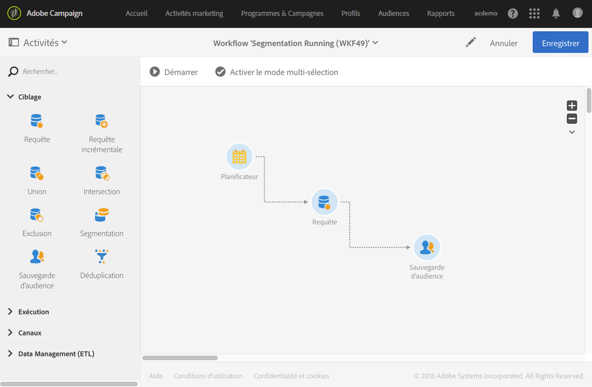
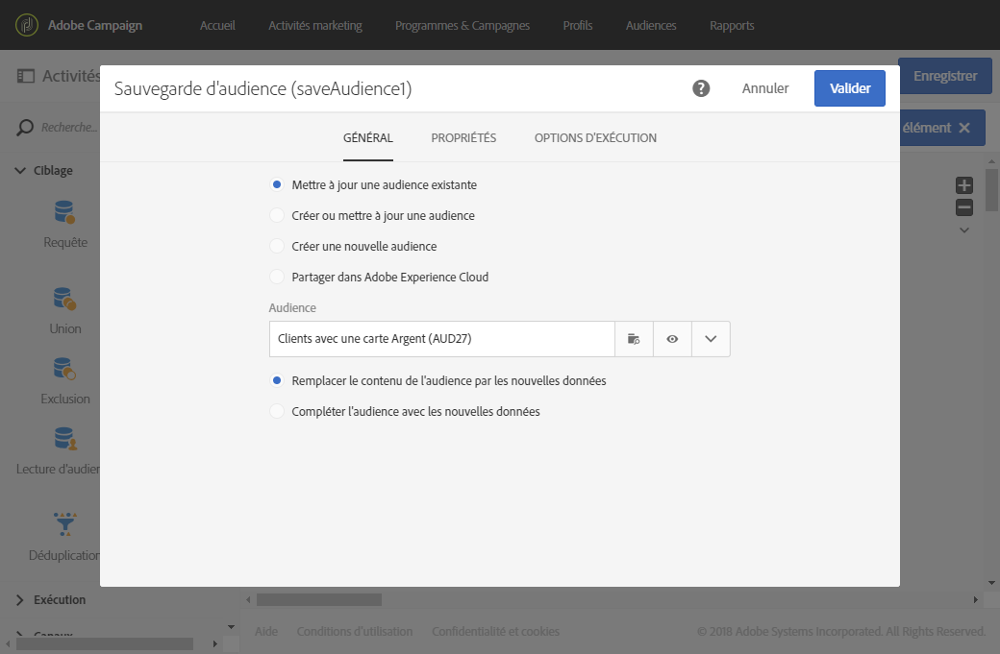

# Sauvegarde d'audience{#save-audience}

## Description {#description}

L'activité **[!UICONTROL Sauvegarde d'audience]permet de mettre à jour une audience existante ou de créer une nouvelle audience à partir de la population calculée en amont dans un workflow.** Les audiences créées ou pouvant être mises à jour à partir de cette activité sont de type **Liste** ou **Fichier.** Elles sont ajoutées à la liste des audiences de l'application, disponible via le menu **[!UICONTROL Audiences].**

>[!NOTE]
>
>Si l'audience créée par le biais de l'activité **[!UICONTROL Sauvegarde d'audience]a été enrichie de données additionnelles, vous ne pourrez pas utiliser ces données pour personnaliser une diffusion autonome.** Elles ne peuvent être utilisées qu'à partir d'une diffusion exécutée dans un workflow.

Cette activité permet également d'exporter des profils en tant qu'audience/segment Adobe Experience Cloud. Cela permet par la suite de pouvoir exploiter ces audiences dans d'autres solutions Adobe Experience Cloud. Pour plus d'informations sur les audiences partagées, voir [Utilisation de Campaign et People Core Service](../../integrating/using/about-campaign-audience-manager-or-people-core-service-integration.md).

## Contexte d'utilisation {#context-of-use}

L'activité **[!UICONTROL Sauvegarde d'audience]est essentiellement utilisée afin de conserver des groupes de population calculés dans le même workflow, en les convertissant en audiences réutilisables.**

## Configuration {#configuration}

1. Placez une activité **[!UICONTROL Sauvegarde d'audience]dans votre workflow.**
1. Connectez-la à la suite d'autres activités de ciblage telles qu'une requête, une intersection, une union ou une exclusion.
1. Sélectionnez l'activité puis ouvrez-la à l'aide du bouton 
1. Sélectionnez l'action que vous souhaitez réaliser :

   * **[!UICONTROL Mettre à jour une audience existante : sélectionnez une audience existante et choisissez le type de mise à jour :]**

      * **[!UICONTROL Remplacer le contenu de l'audience par les nouvelles données : l'intégralité du contenu de l'audience est remplacée.]** Les anciennes données sont perdues. Seules les données issues de la transition entrante de l'activité de sauvegarde d'audience sont conservées.
      * **[!UICONTROL Compléter l'audience avec les nouvelles données : les anciennes données de l'audience sont conservées et sont complétées avec celles issues de la transition entrante de l'activité de sauvegarde d'audience.]**
   * **[!UICONTROL Créer et mettre à jour une audience : saisissez le nom d'une audience et choisissez le type de mise à jour.]** L'audience est créée si elle n'existe pas. Si elle existe déjà, elle est mise à jour selon le mode choisi :

      * **[!UICONTROL Remplacer le contenu de l'audience par les nouvelles données : l'intégralité du contenu de l'audience est remplacée.]** Les anciennes données sont perdues. Seules les données issues de la transition entrante de l'activité de sauvegarde d'audience sont conservées.

         Attention, cette option écrase le type et la dimension de ciblage de l'audience mise à jour.

      * **[!UICONTROL Compléter l'audience avec les nouvelles données : les anciennes données de l'audience sont conservées et sont complétées avec celles issues de la transition entrante de l'activité de sauvegarde d'audience.]**

         Attention, cette option provoque une erreur si le type ou la dimension de ciblage de l'audience mise à jour ne sont pas compatibles avec le paramétrage actuel du workflow. Par exemple, il est impossible de compléter une audience de type fichier avec des profils issus d'une requête.
   * **[!UICONTROL Créer une nouvelle audience : renseignez le nom de l'audience à créer.]** L'heure et la date de création de l'audience seront automatiquement ajoutées au nom de l'audience. Cela permet à l'audience d'être unique à chaque exécution du workflow.
   * **[!UICONTROL Partager dans Adobe Experience Cloud]** : si vous avez ciblé des profils et que vous souhaitez exporter votre audience vers Adobe Experience Cloud, sélectionnez cette option, puis sélectionnez une audience partagée existante ou créez une audience.

      Sélectionnez également une **[!UICONTROL Source de données partagées]qui correspond à la ressource des données contenues dans l’audience, afin que les données soient correctement réconciliées dans Adobe Experience Cloud.**

      En utilisant cette option, l'audience partagée n'est pas ajoutée à la liste des audiences d'Adobe Campaign, disponible via le menu **[!UICONTROL Audiences].**

      >[!NOTE]
      >
      >Cette option n'est disponible que si la fonctionnalité de partage d'audiences avec Adobe Experience Cloud a été paramétrée par votre administrateur. Pour plus d'informations, voir [Utilisation de Campaign et People Core Service](../../integrating/using/about-campaign-audience-manager-or-people-core-service-integration.md).
   Le type des audiences sauvegardées ou des audiences disponibles lors d'une mise à jour dépend des activités placées en amont dans le workflow.

   Si la dimension de ciblage de l'audience est inconnue au moment de la sauvegarde (par exemple si elle est issue d'un import de fichier), l'audience créée ou mise à jour est de type **[!UICONTROL Fichier].**

   Si la dimension de ciblage de l'audience sauvegardée est déjà définie au moment de la sauvegarde (par exemple si elle est issue d'un ciblage, après une requête, etc.), l'audience créée ou mise à jour est de type **[!UICONTROL Liste].**

   Le contenu de l'audience sauvegardée est ensuite disponible dans la vue détaillée de l'audience, accessible depuis le menu **[!UICONTROL Audiences.]** Les colonnes disponibles depuis cette vue correspondent aux colonnes de la transition entrante de l'activité de sauvegarde du workflow. Par exemple : les colonnes du fichier importé, les données additionnelles ajoutées depuis une requête.

1. Validez le paramétrage de l'activité et enregistrez le workflow.

## Exemple {#example}

Le workflow défini dans cet exemple illustre la mise à jour régulière d'une audience à partir d'un ciblage :

* Il est exécuté automatiquement une fois par mois grâce à un **[!UICONTROL Planificateur]**.
* Une **[!UICONTROL Requête]permet de récupérer tous les profils abonnés aux différents services disponibles de l'application.**
* La **[!UICONTROL Sauvegarde d'audience]permet de mettre à jour l'audience spécifiée en y supprimant les profils s'étant désabonnés des services depuis la dernière exécution du workflow et en y ajoutant les nouveaux abonnés.**

L'activité **[!UICONTROL Sauvegarde d'audience]est paramétrée comme suit :**

