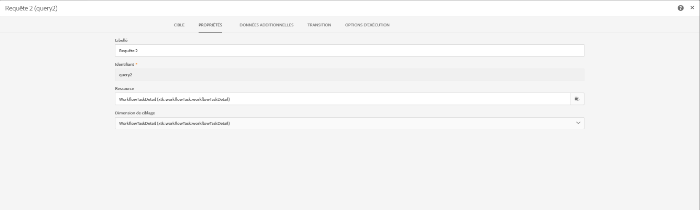
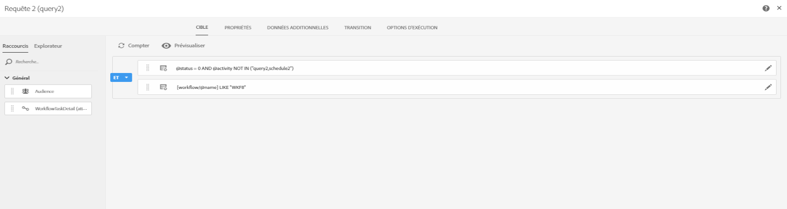
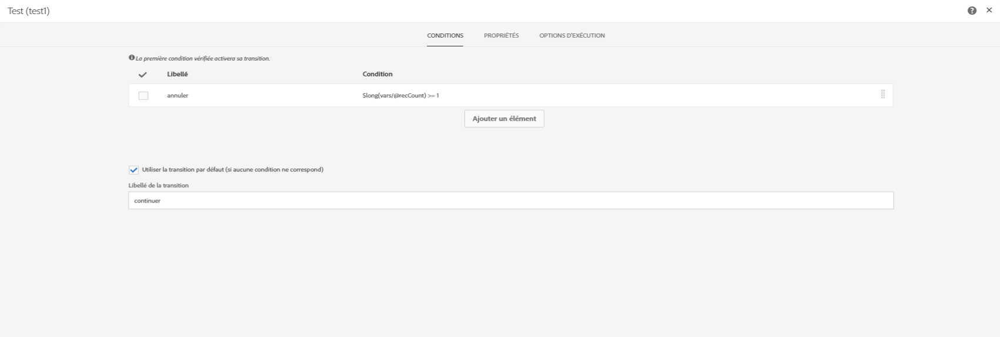
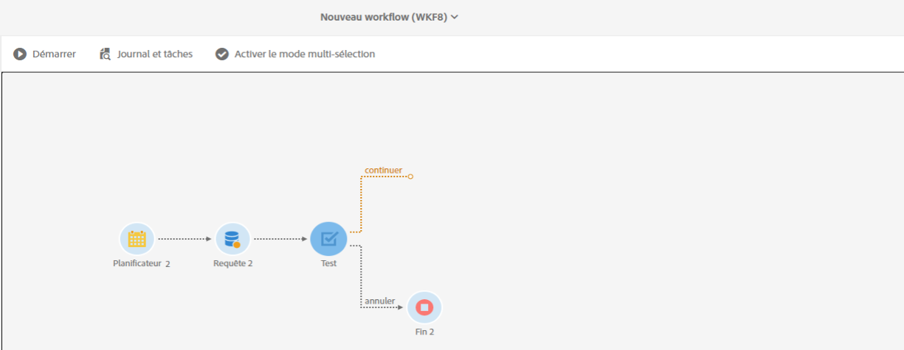

# Exécution superposée de workflows planifiés {#preventing-overlapping-execution-of-scheduled-workflows}

## A propos de l’exécution des workflows planifiés

En Campaign Standard, le moteur de workflow garantit qu’une instance de processus est exécutée par un seul processus. Le blocage d&#39;activités telles que les importations, les requêtes à exécution longue ou les écritures dans la base de données empêche l&#39;exécution de toute autre tâche lors de l&#39;exécution.

D&#39;un autre côté, les activités non bloquantes ne bloquent pas l&#39;exécution d&#39;autres tâches (en général les activités qui attendent un événement tel que l&#39;activité **[!UICONTROL Planificateur]**).

Cela peut conduire à un scénario où un workflow basé sur une planification peut début de s&#39;exécuter même lorsque l&#39;exécution précédente du même workflow n&#39;est pas encore terminée, ce qui peut entraîner des problèmes de données inattendus.

Par conséquent, lorsque vous concevez un processus planifié qui comprend plusieurs activités, vous devez vous assurer que le processus n’est pas replanifié tant qu’il n’est pas terminé. Pour ce faire, vous devez configurer votre flux de travaux afin d’empêcher son exécution si une ou plusieurs tâches d’une exécution précédente sont toujours en attente.

## Configuration du processus

Pour vérifier si une ou plusieurs tâches d&#39;une exécution de flux de travaux précédente sont toujours en attente, vous devez utiliser une activité **[!UICONTROL Requête]** et une  **[!UICONTROL Test]**.

1. Ajoutez une activité **[!UICONTROL Requête]** après l&#39;activité **[!UICONTROL Planificateur]**, puis configurez-la comme suit.

1. Remplacez la ressource d’activité par **[!UICONTROL WorkflowTaskDetail]**, ce qui signifie qu’elle cible les tâches actuelles du processus.

   

1. Configurez la requête avec les règles suivantes :

   

   * La première règle filtres la tâche en cours (requête2) ainsi que la tâche de planification suivante (annexe2) appartenant au workflow en cours.

      >[!NOTE]
      >
      >Lorsqu&#39;une activité **[!UICONTROL Planificateur]** est début, elle ajoute immédiatement une autre tâche de planification à exécuter à la prochaine heure planifiée et début le flux de travail. Par conséquent, il est important de filtrer la requête ainsi que les tâches de planification lors de la recherche de tâches en attente d’une exécution précédente.

   * La deuxième règle détermine si les tâches d’une exécution précédente du flux de travaux sont toujours principales (en attente), ce qui correspond à l’état d’exécution 0.

1. Ajoutez une activité **[!UICONTROL Test]** afin de vérifier le nombre de tâches en attente renvoyées par l&#39;activité **[!UICONTROL Requête]**. Pour ce faire, configurez deux transitions sortantes.

   

   * La première transition continue l&#39;exécution du flux de travaux s&#39;il n&#39;y a pas de tâches en attente,
   * La deuxième transition annule l&#39;exécution du flux de travaux s&#39;il existe des tâches en attente.

   

Vous pouvez désormais configurer le reste de votre flux de travail selon vos besoins. Si l&#39;exécution du workflow est annulée en raison de tâches en attente, lorsque le workflow s&#39;exécute de nouveau selon la planification, il peut passer par ces étapes. Ainsi, l’exécution du flux de travail ne se poursuivra que s’il n’existe aucune tâche principale (en attente) issue d’une exécution précédente.
