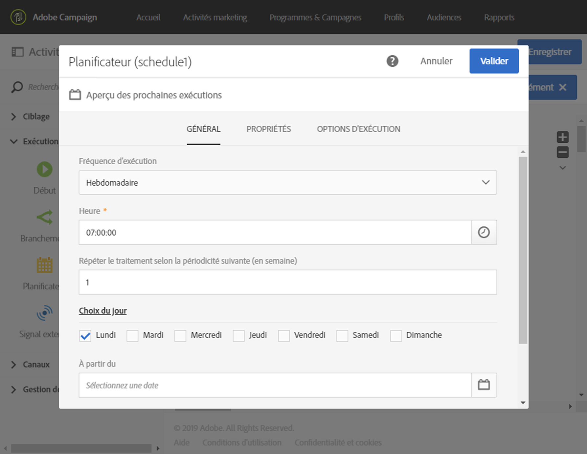

# Planificateur{#scheduler}

## Description {#description}

L'activité **[!UICONTROL Planificateur]permet de planifier le déclenchement d'un workflow ou d'une activité.**

## Contexte d'utilisation {#context-of-use}

L'activité **[!UICONTROL Planificateur]est à considérer comme un départ planifié.** Les règles de positionnement de l'activité dans le diagramme sont les mêmes que pour l'activité **[!UICONTROL Début.]** L'activité ne doit jamais comporter de transition entrante.

Lors de la construction de votre workflow, n'utilisez pas plus d'une activité **[!UICONTROL Planificateur]par branche et pensez à définir un fuseau horaire.** Sinon, il sera défini pour être exécuté selon le fuseau horaire du serveur.

>[!CAUTION]
>
>La **[!UICONTROL Fréquence de répétition]de l'activité ne peut pas être inférieure à 10 minutes,** ce qui signifie qu'un workflow ne peut pas être exécuté automatiquement plusieurs fois toutes les 10 minutes.

## Configuration {#configuration}

1. Placez une activité **[!UICONTROL Planificateur]dans votre workflow.**
1. Sélectionnez l'activité puis ouvrez-la à l'aide du bouton 
1. Specify the **[!UICONTROL Execution frequency]**:

   * **[!UICONTROL Une seule fois]** : le workflow n'est exécuté qu'une seule fois.
   * **[!UICONTROL Plusieurs fois par jour]** : le workflow est exécuté de manières régulière plusieurs fois par jour. Vous pouvez configurer des exécutions à des moments spécifiques ou régulièrement.
   * **[!UICONTROL Quotidienne]** : le workflow est exécuté à une heure précise, une fois par jour.
   * **[!UICONTROL Hebdomadaire]**: le processus est exécuté à un moment spécifié, sur un ou plusieurs jours d'une semaine.
   * **[!UICONTROL Mensuelle]** : le workflow est exécuté à un instant défini, une ou plusieurs fois par mois. Vous pouvez sélectionner des mois lorsque vous avez besoin du flux de travail. Vous pouvez également configurer les exécutions le jour de semaine spécifié du mois, comme le deuxième mardi du mois.
   * **[!UICONTROL Annuelle]** : le workflow est exécuté à un instant défini, une ou plusieurs fois par an.

1. Spécifiez les détails de l'exécution selon la fréquence choisie. Les champs du détail peuvent varier en fonction de la fréquence sélectionnée (heure, fréquence de répétition, jours spécifiques, etc.).

   >[!NOTE]
   >
   >Le champ **[!UICONTROL Fréquence de répétition]vous permet d'espacer dans le temps les déclenchements du workflow.** Par exemple, si vous sélectionnez une fréquence d'exécution quotidienne et que la fréquence de répétition est paramétrée sur **2** (jours), le workflow sera déclenché tous les deux jours. La fréquence de répétition ne peut pas être inférieure à 10 minutes. Si la fréquence de répétition est paramétrée sur **0** (également valeur par défaut), l'option n'est pas prise en compte et le workflow s'exécute selon la fréquence d'exécution définie.

1. Définissez l'expiration de l'exécution :

   * **[!UICONTROL Jamais]** : Le workflow sera exécuté selon la fréquence d'exécution définie, sans limite dans le temps ni au niveau du nombre d'itérations.
   * **[!UICONTROL Après un certain nombre d'itérations]** : le workflow sera exécuté selon la fréquence d'exécution définie, dans la limite de **X** itérations. Indiquez alors le **[!UICONTROL Nombre d'itérations].**
   * **[!UICONTROL A la date spécifiée]** : le workflow sera exécuté selon la fréquence d'exécution définie, jusqu'à une date précise. Indiquez alors la date limite d'exécution.

1. Check the schedule of the next ten executions of your workflow by clicking **[!UICONTROL Preview next executions]**.

1. Dans l'onglet **[!UICONTROL Options d'exécution]**, définissez le fuseau horaire du Planificateur dans le champ **Fuseau horaire[!UICONTROL .]** Vous pouvez ainsi démarrer le workflow dans un fuseau horaire spécifique. Sinon, celui-ci s'exécutera par défaut dans le fuseau horaire du serveur.

   Pour plus d'informations sur l'envoi d'une diffusion selon le fuseau horaire du destinataire, consultez cette [section](../../sending/using/sending-messages-at-the-recipient-s-time-zone.md) ou reportez-vous à cet [exemple](../../automating/using/push-notification-delivery.md#sending-a-recurring-push-notification-with-a-workflow) de workflow récurrent.

1. Validez le paramétrage de l'activité et enregistrez le workflow.

## Exemple {#example}

Dans l'exemple suivant, l'activité est paramétrée afin de faire démarrer le workflow toutes les deux semaines, le lundi matin à 7h, pour une durée indéterminée.

