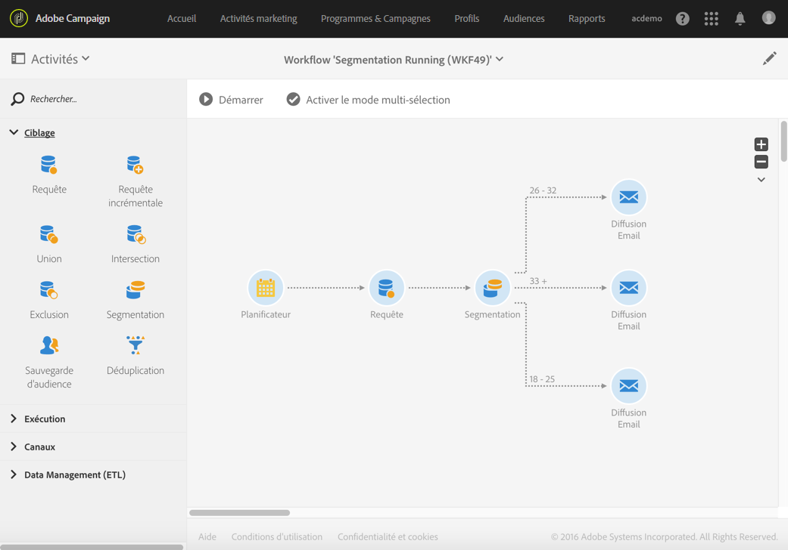
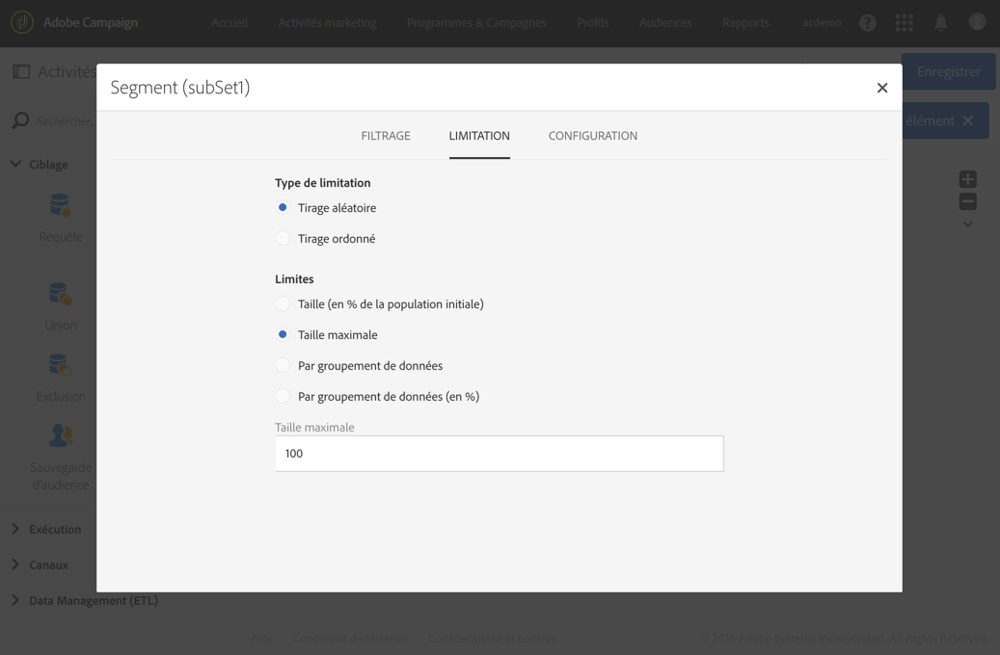

# Segmentation en fonction des groupes d’âge {#segmentation-age-groups}

L&#39;exemple suivant illustre une segmentation de profils de la base de données en fonction de leur tranche d&#39;âge.

Le but du workflow est d&#39;envoyer un email distinct pour chaque tranche d&#39;âge. En considérant que ce workflow fait partie d&#39;une campagne de test, chaque segment ne pourra contenir qu&#39;un maximum de 100 profils, sélectionnés aléatoirement, afin d&#39;utiliser des audiences à la fois limitées et représentatives.

Le workflow est défini comme suit :

* Une activité Planificateur permettant de définir la date d&#39;exécution du workflow.
* Une activité [Requête](../../automating/using/query.md) permettant de cibler les profils de personnes dont la date de naissance et l&#39;adresse email sont renseignées.
* Une activité [Segmentation](../../automating/using/segmentation.md) permet de créer trois segments répartis dans des transitions sortantes différentes : 18 - 25 ans, 26 - 32 ans et plus de 32 ans. Les segments sont définis selon les paramètres suivants :

   

   * un filtrage sur l&#39;âge permettant de définir la tranche d&#39;âge du segment

      

   * une limitation de type **[!UICONTROL Tirage aléatoire]** associé à une limite de **[!UICONTROL Taille maximale]** avec pour valeur 100.

      

* Une activité [Diffusion email](../../automating/using/email-delivery.md) par segment.
