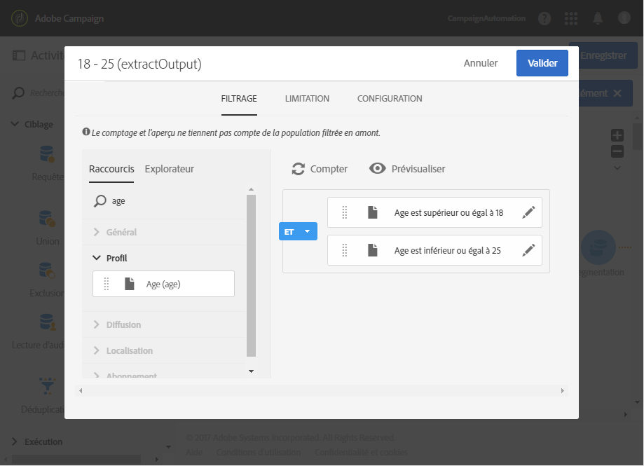
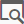
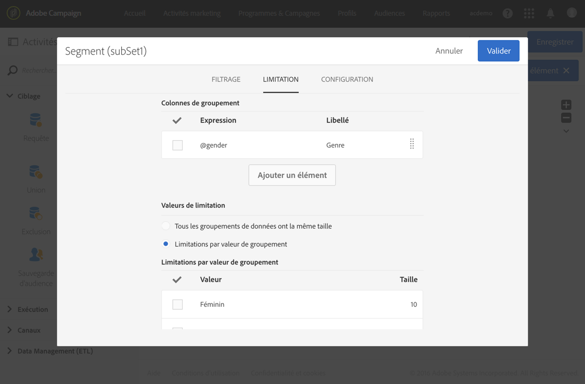
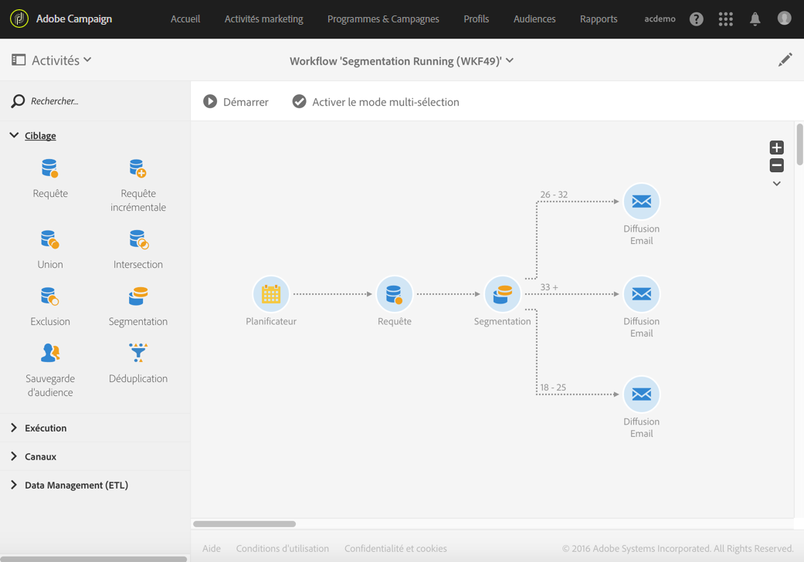
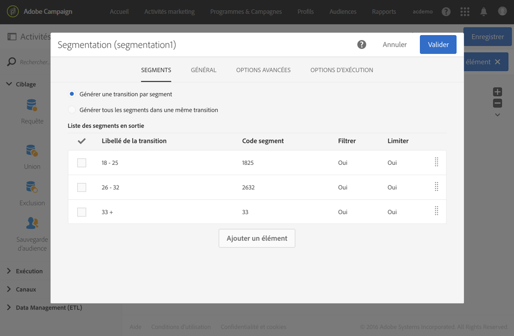
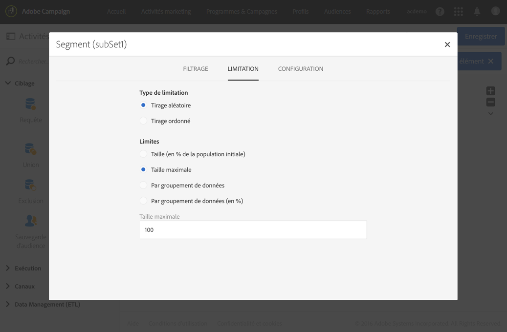

# Segmentation{#segmentation}

## Description {#description}

L'activité **[!UICONTROL Segmentation]permet de créer un ou plusieurs segments à partir d'une population calculée par des activités placées en amont.** En sortie de l'activité, ils peuvent être traités dans une seule transition ou dans des transitions distinctes.

>[!NOTE]
>
>Par défaut, un membre de la population entrante ne peut appartenir qu'à un seul segment. Les filtrages sont appliqués dans l'ordre des segments dans l'activité.

## Contexte d'utilisation {#context-of-use}

The **[!UICONTROL Segmentation]** activity is generally placed after targeting activities (query, intersection, union, exclusion, etc.) in order to define the standard population based on which the segments are formed.

## Configuration {#configuration}

1. Placez une activité **[!UICONTROL Segmentation]dans votre workflow.**
1. Sélectionnez l'activité puis ouvrez-la à l'aide du bouton 
1. Sélectionnez le **[!UICONTROL Type de ressource]sur lequel doit être effectuée la segmentation :**

   * **[!UICONTROL Ressource de la base]** si la segmentation porte sur des données déjà existantes en base de données. Sélectionnez la **[!UICONTROL Dimension de filtrage]en fonction des données que vous souhaitez segmenter.** Par défaut, la segmentation porte sur les **profils**.
   * **[!UICONTROL Ressource temporaire]** si la segmentation porte sur des données temporaires du workflow : sélectionnez l'**[!UICONTROL Ensemble ciblé]contenant les données à segmenter.** Ce cas peut être rencontré à la suite d'un import de fichier ou si des données de la base ont été enrichies.

1. Sélectionnez le type de transition sortante que vous souhaitez :

   * **[!UICONTROL Générer une transition par segment]** : une transition sortante est ajoutée en sortie de l'activité pour chaque segment paramétré.
   * **[!UICONTROL Générer tous les segments dans une même transition]** : tous les segments paramétrés sont regroupés dans la même transition sortante. Indiquez le libellé de la transition. Les membres de chaque segment conservent le code segment qui leur a été associé.

1. Ajoutez un segment à l'aide du bouton  ou **Ajouter un élément]et renseignez ses propriétés de base :[!UICONTROL **

   * **[!UICONTROL Ne pas activer la transition si la population est vide]** : le segment n'est activé que si des données sont récupérées.
   * **[!UICONTROL Filtrer la population initiale (requête)]** : permet de filtrer la population de ce segment.
   * **[!UICONTROL Limiter la population de ce segment]** : permet de limiter la taille du segment.
   * **[!UICONTROL Filtrer et limiter la population de ce segment]** : permet de filtrer la population du segment et d'en limiter la taille.
   * **[!UICONTROL Libellé]** : libellé du segment.
   * **[!UICONTROL Code segment]** : code assigné à la population de segments. Le code segment peut être personnalisé à l'aide d'une expression standard et de variables d'événements (voir [Personnaliser les activités avec des variables d'événements](../../automating/using/calling-a-workflow-with-external-parameters.md#customizing-activities-with-events-variables)).
   * **[!UICONTROL Exclure ce segment de la population]** : permet d'exclure le segment défini de la population en sortie de l'activité. Cette option ne peut être utilisée que si l'option **[!UICONTROL Générer tous les segments dans une même transition]est sélectionnée.**
   

1. Ouvrez le détail du segment afin d'accéder aux options de configuration de ce dernier. Pour cela, cochez la case correspondante dans la liste des segments de l'activité, puis sélectionnez .
1. Si vous avez coché une option permettant de filtrer la population initiale, ouvrez l'onglet **[!UICONTROL Filtrage]et définissez la population de votre segment.** Les filtres sont basés sur la dimension de filtrage sélectionnée à l'étape 4. Pour plus d'informations sur le filtrage de la population, consultez la section [Edition de requête](../../automating/using/editing-queries.md).

   Si la segmentation porte sur une ressource temporaire, le comptage et la prévisualisation de la population ne sont pas disponibles dans cet onglet.

1. Si vous avez coché une option permettant de limiter la taille du segment, ouvrez l'onglet **[!UICONTROL Limitation].**

   Sélectionnez tout d'abord le **[!UICONTROL Type de limitation]que vous souhaitez appliquer :**

   * **[!UICONTROL Tirage aléatoire]** : la population du segment est sélectionnée de manière aléatoire, en tenant compte du paramétrage réalisé dans l'onglet **[!UICONTROL Filtrage], le cas échéant.**
   * **[!UICONTROL Tirage ordonné]** : la population du segment est sélectionnée de manière ordonnée. Vous devez alors définir les colonnes à prendre en compte et le type de tri à appliquer. Par exemple, si vous choisissez le champ **Age** comme colonne de tri, en appliquant un **[!UICONTROL Tri descendant], et que vous définissez ensuite une limite de 100, seuls les 100 profils les plus âgés seront conservés.**
   Définissez ensuite la taille **[!UICONTROL Limite]du segment :**

   * **[!UICONTROL Taille (en % de la population initiale)]** : définissez la taille du segment à l'aide d'un pourcentage de la population initiale de l'activité.
   * **[!UICONTROL Taille maximale]** : définissez un nombre maximum de membres pour la population du segment.
   * **[!UICONTROL Par groupement de données]** : vous pouvez limiter la population du segment en fonction des valeurs d'un champ précis de la population entrante. Sélectionnez le champ sur lequel appliquer le groupement puis définissez les valeurs à utiliser.
   * **[!UICONTROL Par groupement de données (en %)]** : vous pouvez limiter la population du segment en fonction des valeurs d'un champ précis de la population entrante à l'aide d'un pourcentage. Sélectionnez le champ sur lequel appliquer le groupement puis définissez les valeurs à utiliser.

      >[!NOTE]
      >
      >Vous pouvez choisir des limitations différentes pour chaque valeur. Par exemple, vous pouvez définir un groupement sur le champ **[!UICONTROL Genre]** et limiter la population dont le genre est **[!UICONTROL Masculin]à 10 et la population dont le genre est** Féminin] à 30. **[!UICONTROL ** Si vous utilisez plusieurs champs pour le groupement de données, tous les groupements doivent être de la même taille.
   

1. Validez la configuration du segment.
1. Ajoutez autant de segments que nécessaire en répétant les étapes 6 à 10 de cette procédure.
1. Si nécessaire, éditez les paramètres de l'onglet **[!UICONTROL Options avancées]de l'activité :**

   * Cochez l'option **[!UICONTROL Permettre le recouvrement des populations de sortie]si vous souhaitez qu'un membre de la population entrante puisse appartenir à plusieurs segments.** La population en sortie de l'activité pourra être supérieure à la population en entrée.
   * Cochez l'option **[!UICONTROL Concaténer le code de chaque segment]si la population entrante a déjà un code segment et que vous souhaitez le conserver.** Le code segment défini dans l'activité sera ajouté au code segment initial.
   * Cochez l'option **[!UICONTROL Générer le complémentaire]si vous souhaitez exploiter la population restante.**

1. Validez le paramétrage de l'activité et enregistrez le workflow.

## Exemple {#example}

L'exemple suivant illustre une segmentation de profils de la base de données en fonction de leur tranche d'âge. Le but du workflow est d'envoyer un email distinct pour chaque tranche d'âge. En considérant que ce workflow fait partie d'une campagne de test, chaque segment ne pourra contenir qu'un maximum de 100 profils, sélectionnés aléatoirement, afin d'utiliser des audiences à la fois limitées et représentatives.

Le workflow est défini comme suit :

* Une activité **[!UICONTROL Planificateur]permettant de définir la date d'exécution du workflow.** Consultez la section [Planificateur](../../automating/using/scheduler.md).
* Une activité **[!UICONTROL Requête]permettant de cibler les profils de personnes dont la date de naissance et l'adresse email sont renseignées.** Consultez la section [Requête](../../automating/using/query.md).
* Une activité **[!UICONTROL Segmentation]permet de créer trois segments répartis dans des transitions sortantes différentes : 18 - 25 ans, 26 - 32 ans et plus de 32 ans.** Les segments sont définis selon les paramètres suivants :

   

   * un filtrage sur l'âge permettant de définir la tranche d'âge du segment

      

   * une limitation de type **[!UICONTROL Tirage aléatoire]** associé à une limite de **Taille maximale]avec pour valeur 100.[!UICONTROL **

      

* Une activité **[!UICONTROL Diffusion email]par segment.** Consultez la section [Diffusion Email](../../automating/using/email-delivery.md).

