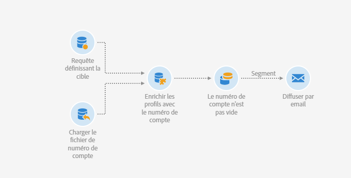
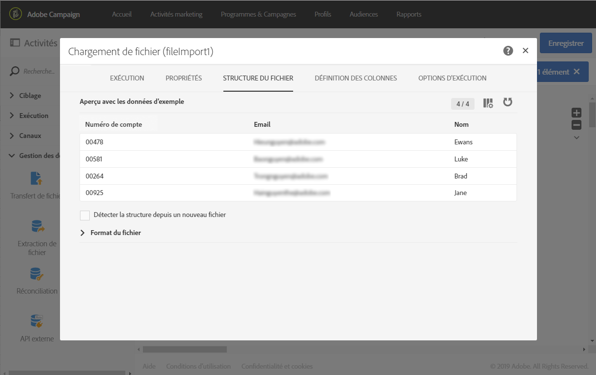
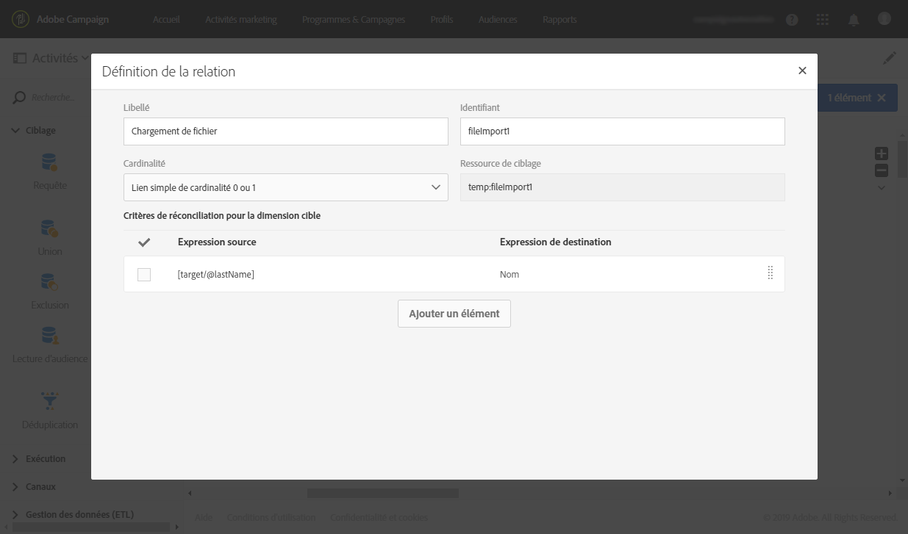
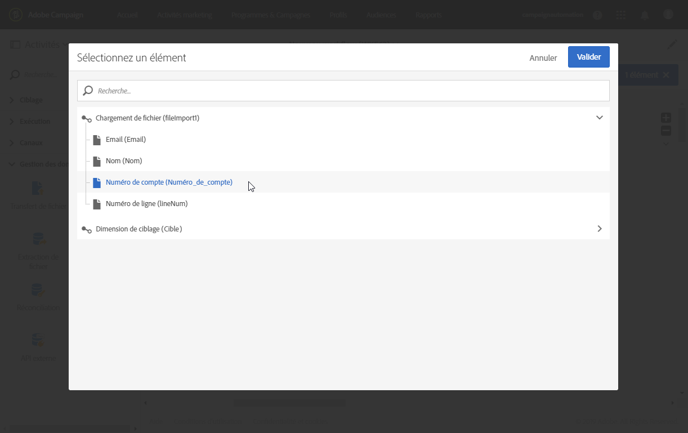
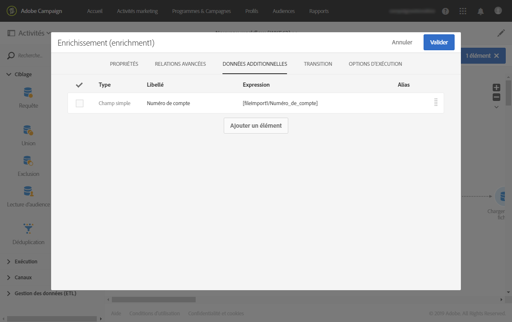
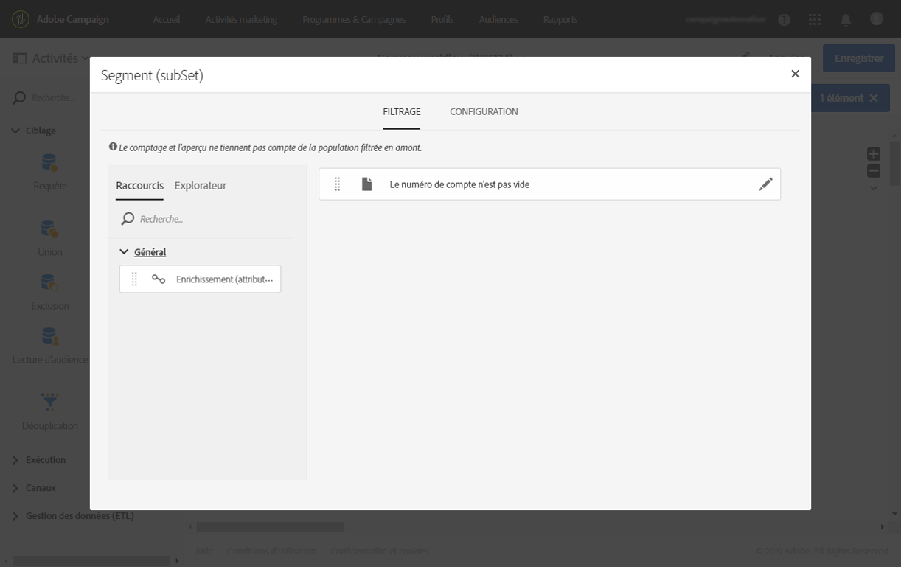
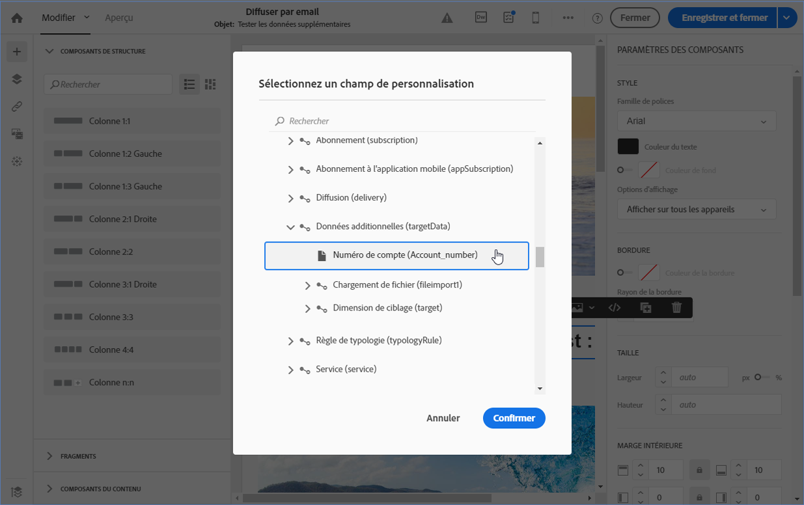
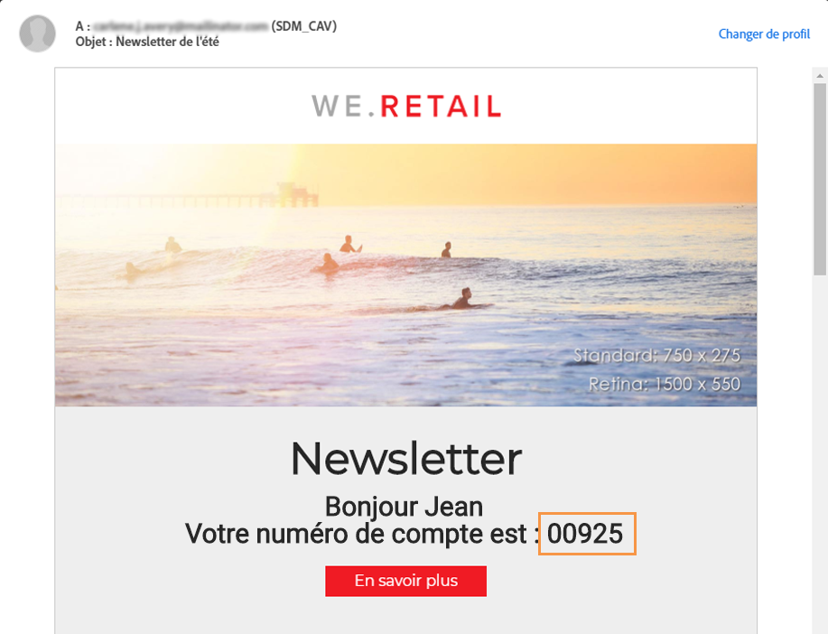

# Envoi d’un email contenant des champs enrichis {#sending-email-enriched-fields}

<!--A new example showing how to send an email containing additional data retrieved from a load file activity has been added. [Read more](example-2-email-with-enriched-fields)-->

L&#39;activité Chargement de fichier permet également d&#39;envoyer un email enrichi avec des données additionnelles provenant d&#39;un fichier externe dans le même workflow.

L&#39;exemple ci-dessous montre comment envoyer un email enrichi avec des données additionnelles extraites d&#39;un fichier externe par le biais de l&#39;activité Chargement de fichier. Dans cet exemple, le fichier externe contient une liste de profils avec leur numéro de compte associé. Vous souhaitez importer ces données pour envoyer un email à chaque profil avec son numéro de compte.

Pour créer le workflow, procédez comme suit :

1. Placez une activité [Requête](../../automating/using/query.md) dans votre workflow et ouvrez-la pour définir la cible principale.

   <!--The Query activity is presented in the [Query](../../automating/using/query.md) section.-->

1. Placez une activité [Chargement de fichier](../../automating/using/load-file.md) pour affecter des données à un profil. Dans cet exemple, chargez un fichier contenant les numéros de compte correspondant à certains profils de la base de données.

   

1. Placez une activité [Enrichissement](../../automating/using/enrichment.md) dans votre workflow et liez les activités Chargement de fichier et Requête à cette activité.

1. Dans l&#39;onglet **[!UICONTROL Relations avancées]** de l&#39;activité Enrichissement, sélectionnez le **[!UICONTROL Lien simple de cardinalité 0 ou 1]** et définissez les champs à utiliser pour la réconciliation. Nous utilisons ici le nom de famille pour réconcilier les données avec les profils de base de données.

   

1. Dans l&#39;onglet **[!UICONTROL Données additionnelles]**, sélectionnez les éléments à utiliser dans votre email. Sélectionnez ici le numéro de compte (colonne du fichier que vous avez récupéré via l&#39;activité Chargement de fichier).

   

   <!---->

   Pour en savoir plus à ce sujet, reportez-vous à la section [Enrichissement](../../automating/using/enrichment.md).

1. Placez une activité [Segmentation](../../automating/using/segmentation.md) dans votre workflow et ouvrez-la pour affiner la cible principale.

   

   Pour en savoir plus à ce sujet, reportez-vous à la section [Segmentation](../../automating/using/segmentation.md).

1. Placez une activité [Diffusion Email](../../automating/using/email-delivery.md) dans votre workflow, puis ouvrez-la.

   <!--The Email delivery activity is presented in the [Email delivery](../../automating/using/email-delivery.md) section.-->

1. Ajoutez un champ de personnalisation et sélectionnez les données additionnelles définies dans l&#39;activité Enrichissement (ici, le numéro de compte) du nœud **[!UICONTROL Données additionnelles (targetData)]**. Vous pouvez ainsi récupérer dynamiquement le numéro de compte de chaque profil dans le contenu de l&#39;email.

   

1. Enregistrez l&#39;email et démarrez le workflow.

L&#39;email est envoyé à la cible. Chaque profil reçoit l&#39;email avec son numéro de compte correspondant.

