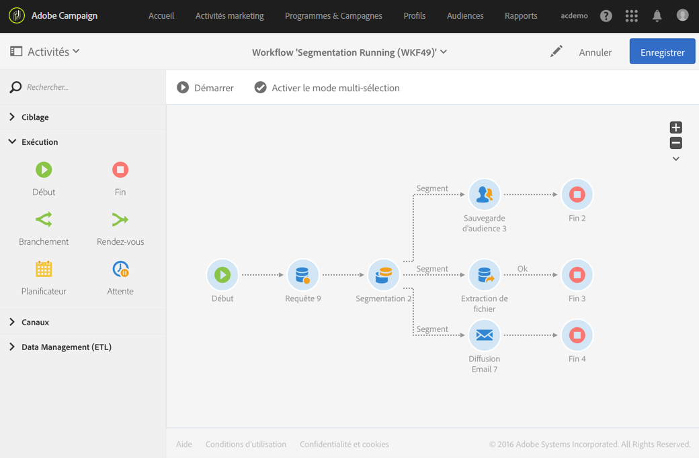

# Début et Fin{#start-and-end}

## Description {#description}

Les activités **[!UICONTROL Début]** et **[!UICONTROL Fin]** permettent respectivement de marquer graphiquement les points de départ et de fin d&#39;un workflow.

## Contexte d&#39;utilisation {#context-of-use}

L&#39;exécution d&#39;un workflow démarre par des activités sans transition entrante, et s&#39;arrête lorsqu&#39;il n&#39;y a plus de tâche en cours. Il est néanmoins possible d&#39;ajouter des activités **[!UICONTROL Début]** et **[!UICONTROL Fin]** pour marquer graphiquement les points de départ et de fin d&#39;un workflow, en cas de workflow relativement complexe par exemple.

Il est recommandé d&#39;utiliser une activité **[!UICONTROL Fin]** au lieu de laisser la dernière transition d&#39;un workflow telle quelle pour s&#39;assurer que le workflow se termine correctement.

## Configuration {#configuration}

1. Placez une activité **[!UICONTROL Début]** ou **[!UICONTROL Fin]** dans votre workflow.
1. Connectez l&#39;activité **[!UICONTROL Début]** en amont d&#39;autres activités telles que des requêtes, et l&#39;activité **[!UICONTROL Fin]** à la suite d&#39;une série d&#39;activités.
1. Sélectionnez l’activité puis ouvrez-la à l’aide du bouton , disponible dans les actions rapides qui s’affichent.
1. Vous pouvez paramétrer l&#39;objet **Fin** pour qu&#39;il interrompe toutes les tâches en cours du workflow, y compris celles qui ne sont pas terminées. Pour cela, sélectionnez l&#39;option correspondante.
1. Validez le paramétrage de l&#39;activité et enregistrez le workflow.

## Déclenchement d&#39;un autre workflow   {#triggering-another-workflow}

Vous pouvez déclencher un autre workflow à l&#39;aide de l&#39;onglet **[!UICONTROL Signal externe]** d&#39;une activité **[!UICONTROL Fin]**. Consultez la section [Signal externe](../../automating/using/external-signal.md).

## Exemple {#example}

L&#39;exemple suivant montre l&#39;exécution d&#39;un workflow complexe avec une activité **[!UICONTROL Début]** et plusieurs activités **[!UICONTROL Fin]**. La case **[!UICONTROL Arrêter toutes les tâches en cours]** a été cochée pour la première activité **[!UICONTROL Fin]**. Une fois que la tâche correspondante sera terminée, l&#39;ensemble du workflow sera interrompu : l&#39;effet sera le même que si l&#39;on avait sélectionné le bouton  (voir la section [La barre d&#39;actions).](../../automating/using/workflow-interface.md#action-bar)

