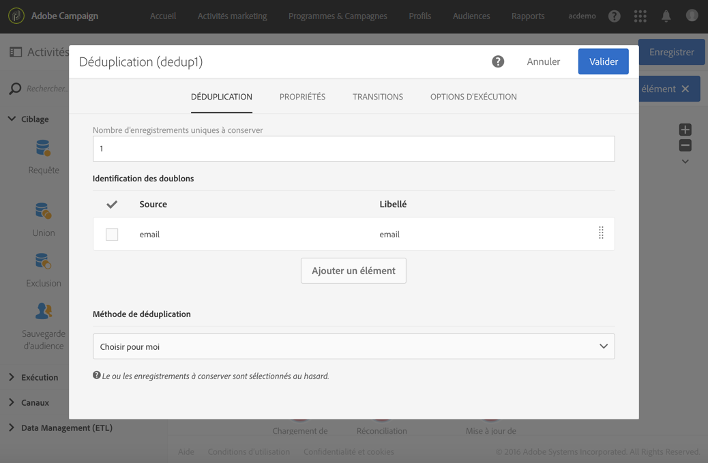

# Abonner des profils à un service spécifique après l’import d’un fichier{#subscribing-profiles-to-a-specific-service-after-importing-a-file}

Cet exemple illustre comment importer un fichier contenant des profils et les abonner à un service existant. Après l’import du fichier, une réconciliation est nécessaire afin d’identifier les données importées comme étant des profils. Afin d’assurer que le fichier ne contient aucun doublon, une déduplication sera exécutée sur les données.

Le workflow de se présente comme suit :


* Une activité de [Chargement de fichier](../../automating/using/load-file.md) permettant de charger le fichier de profils et de définir la structure des colonnes importées.

   Pour cet exemple, le fichier chargé est au format .csv et contient les données suivantes :

   ```
   lastname;firstname;email;birthdate;subdate
   jackman;megan;megan.jackman@testmail.com;07/08/1975;10/08/2017
   phillips;edward;phillips@testmail.com;09/03/1986;10/08/2017
   weaver;justin;justin_w@testmail.com;11/15/1990;10/08/2017
   martin;babeth;babeth_martin@testmail.net;11/25/1964;10/08/2017
   reese;richard;rreese@testmail.com;02/08/1987;11/08/2017
   cage;nathalie;cage.nathalie227@testmail.com;07/03/1989;11/08/2017
   xiuxiu;andrea;andrea.xiuxiu@testmail.com;09/12/1992;11/08/2017
   grimes;daryl;daryl_890@testmail.com;12/06/1979;12/08/2017
   tycoon;tyreese;tyreese_t@testmail.net;10/08/1971;12/08/2017
   ```

   

* Une [Réconciliation](../../automating/using/reconciliation.md) permet d’identifier les données provenant du fichier comme appartenant à la dimension des profils de la base de données Adobe Campaign. Seul l’onglet **[!UICONTROL Identification]** est configuré. Il permet d’identifier les données du fichier en fonction de l’adresse email des profils.

   

* Une [Déduplication](../../automating/using/deduplication.md) basée sur le champ **email** de la ressource temporaire (issue de la réconciliation) permettant d’identifier d’éventuels doublons. Si les données importées depuis le fichier contiennent des doublons, l’abonnement à un service échouera pour l’ensemble des données.

   

* Une activité de [Services d’abonnements](../../automating/using/subscription-services.md) permet de sélectionner le service auquel les profils doivent s’abonner, le champ correspondant à la date d’abonnement et l’origine de l’abonnement.

   
