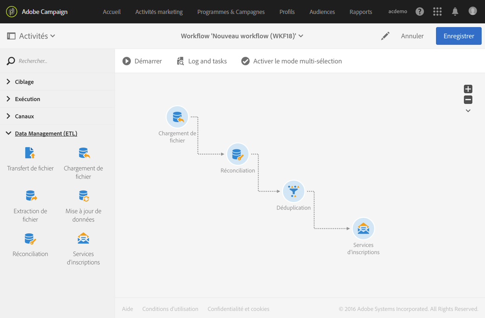
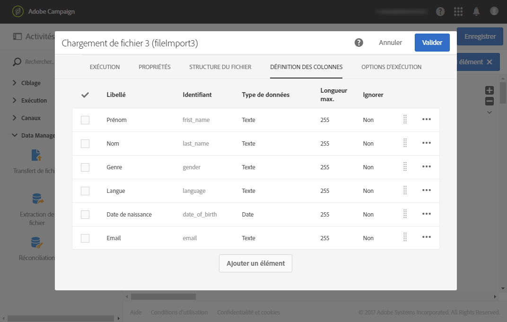
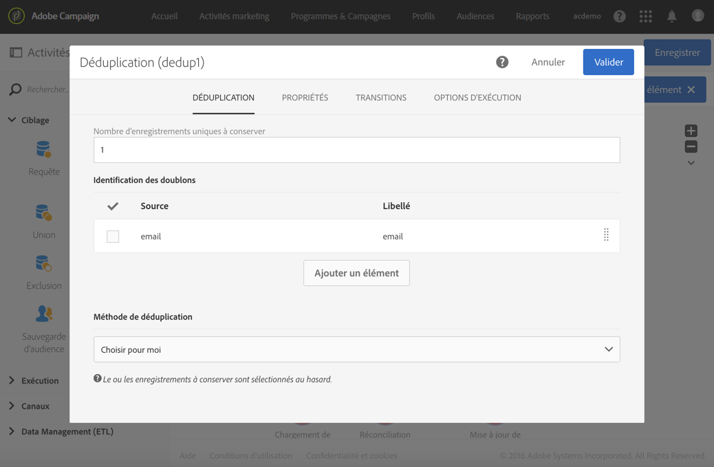
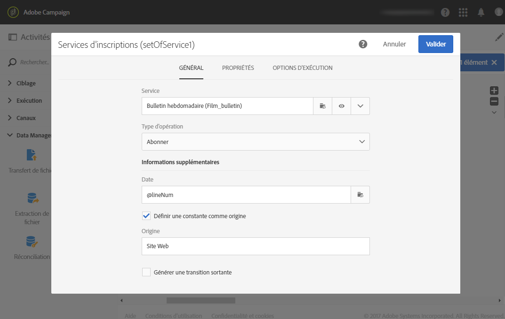
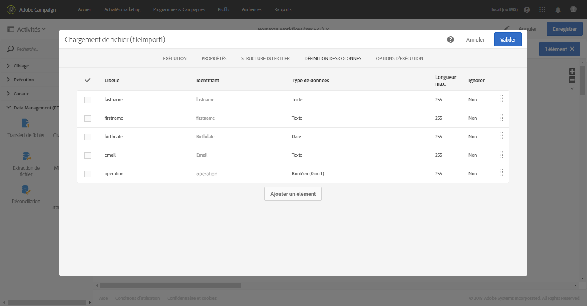
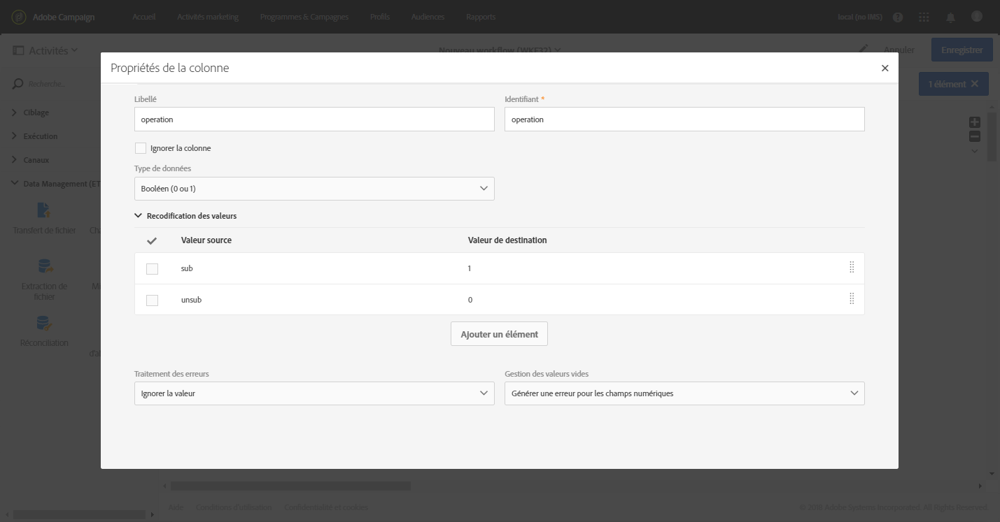
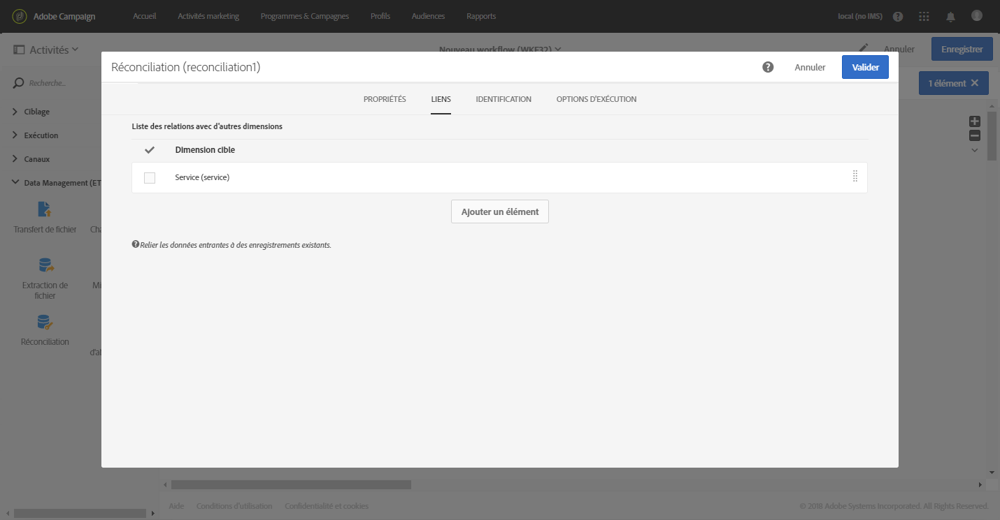
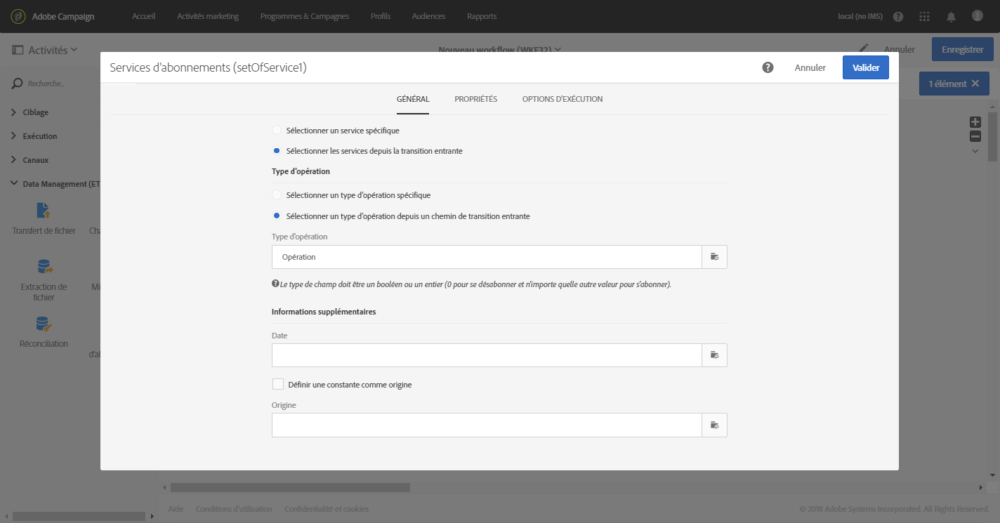

# Services d'inscriptions{#subscription-services}

## Description {#description}


L'activité **[!UICONTROL Services d'inscription]permet d'inscrire ou de désinscrire des profils en masse à un service.**

>[!CAUTION]
>
>Lorsqu'un abonnement est géré dans le cadre d'un workflow, les profils abonnés ou non ne reçoivent pas les différents emails de confirmation définis dans les propriétés du service.

## Contexte d'utilisation {#context-of-use}

L'activité **[!UICONTROL Services d'inscriptions]est la seule fonctionnalité d'Adobe Campaign qui permet d'inscrire ou de désinscrire plusieurs profils à un service en une seule action.**

Vous pouvez utiliser cette activité après avoir effectué un ciblage ou importé un fichier avec des données identifiées.

Si elle est spécifiée dans un fichier par le biais de colonnes dédiées, cette activité permet également de sélectionner l'action (abonner ou désabonner) et le service sur lequel exécuter l'action.

## Configuration {#configuration}

1. Placez une activité **[!UICONTROL Services d'inscription]dans votre workflow.**
1. Connectez-la à la suite d'autres activités de ciblage telles qu'une requête ou une réconciliation suivant un import.
1. Sélectionnez l'activité puis ouvrez-la à l'aide du bouton 
1. Sélectionnez le **[!UICONTROL Service]dont vous souhaitez gérer les inscriptions à l'aide de l'une des options suivantes :**

   * **[!UICONTROL Sélectionner un service spécifique]** : sélectionnez manuellement un service.
   * **[!UICONTROL Sélectionner les services depuis la transition entrante]** : le service est spécifié dans la transition entrante. Vous pouvez, par exemple, importer un fichier qui spécifie le service à gérer pour chaque ligne. Si vous avez sélectionné cette option, vérifiez qu'un lien a été préalablement créé entre les données et la ressource **Service**, comme illustré dans [cet exemple](../../automating/using/subscription-services.md#example--updating-multiple-subscription-statuses-from-a-file).

      Le service sur lequel effectuer l'opération est alors sélectionné de manière dynamique pour chaque enregistrement.

1. Sélectionnez le **[!UICONTROL Type d'opération]à exécuter à l'aide de l'une des options suivantes :**

   * **[!UICONTROL Sélectionner un type d'opération spécifique]** : sélectionnez manuellement un type d'opération si vous souhaitez **[!UICONTROL Abonner]** ou **Désabonner]des profils.[!UICONTROL **
   * **[!UICONTROL Sélectionner un type d'opération depuis un chemin de transition entrante]** : sélectionnez la colonne des données entrantes spécifiant l'opération à effectuer pour chaque enregistrement.

      Dans cette colonne, l'opération doit être spécifiée sous la forme d'une valeur booléenne ou d'un entier. Utilisez la valeur **0** pour désabonner un enregistrement et la valeur **1** pour en abonner un.

      Si les valeurs contenues dans un fichier importé ne répondent pas aux exigences ci-dessus, vous pouvez toujours utiliser l'option [Recodification des valeurs](../../automating/using/load-file.md#column-format) disponible dans l'activité **[!UICONTROL Chargement de fichier].**

1. Si les données en entrée contiennent une colonne avec la date d'abonnement au service correspondant au profil, sélectionnez-la. Vous pouvez la laisser vide, mais aucune date d'abonnement n'est définie lors de l'exécution du workflow.
1. Définissez l'origine de l'abonnement. Vous pouvez la définir sur une origine des champs des données en entrée ou sur une valeur constante de votre choix en cochant l'option **[!UICONTROL Définir une constante comme origine.]** Vous pouvez la laisser vide, mais aucune origine n'est définie lors de l'exécution du workflow.
1. En cas de besoin, vous pouvez générer une transition sortante. Cette transition contient exactement les mêmes données que celles de l'activité entrante.
1. Validez le paramétrage de l'activité et enregistrez le workflow.

   Ce dernier est prêt à être exécuté. Une fois exécuté, vous pouvez visualiser les profils inscrits ou désinscrits dans le détail du service.

## Exemple : abonner des profils à un service spécifique après l'import d'un fichier {#example--subscribing-profiles-to-a-specific-service-after-importing-a-file}

Cet exemple illustre comment importer un fichier contenant des profils et les abonner à un service existant. Après l'import du fichier, une réconciliation est nécessaire afin d'identifier les données importées comme étant des profils. Afin d'assurer que le fichier ne contient aucun doublon, une déduplication sera exécutée sur les données.

Le workflow se présente comme suit :



* Une activité de **[!UICONTROL Chargement de fichier]permettant de charger le fichier de profils et de définir la structure des colonnes importées.**

   Pour cet exemple, le fichier chargé est au format .csv et contient les données suivantes :

   ```
   lastname;firstname;email;birthdate;subdate
   jackman;megan;megan.jackman@testmail.com;07/08/1975;10/08/2017
   phillips;edward;phillips@testmail.com;09/03/1986;10/08/2017
   weaver;justin;justin_w@testmail.com;11/15/1990;10/08/2017
   martin;babeth;babeth_martin@testmail.net;11/25/1964;10/08/2017
   reese;richard;rreese@testmail.com;02/08/1987;11/08/2017
   cage;nathalie;cage.nathalie227@testmail.com;07/03/1989;11/08/2017
   xiuxiu;andrea;andrea.xiuxiu@testmail.com;09/12/1992;11/08/2017
   grimes;daryl;daryl_890@testmail.com;12/06/1979;12/08/2017
   tycoon;tyreese;tyreese_t@testmail.net;10/08/1971;12/08/2017
   ```

   

* Une **[!UICONTROL Réconciliation]permet d'identifier les données provenant du fichier comme appartenant à la dimension des profils de la base de données Adobe Campaign.** Seul l'onglet **[!UICONTROL Identification]est configuré.** Il permet d'identifier les données du fichier en fonction de l'adresse email des profils.

   

* Une **[!UICONTROL Déduplication]** basée sur le champ **email** de la ressource temporaire (issue de la réconciliation) permettant d'identifier d'éventuels doublons. Si les données importées depuis le fichier contiennent des doublons, l'abonnement à un service échouera pour l'ensemble des données.

   

* Une activité de **[!UICONTROL Services d'inscription]permet de sélectionner le service auquel les profils doivent s'abonner, le champ correspondant à la date d'abonnement et l'origine de l'abonnement.**

   

## Exemple : mettre à jour plusieurs statuts d'abonnement depuis un fichier {#example--updating-multiple-subscription-statuses-from-a-file}

Cet exemple illustre comment importer un fichier contenant des profils et mettre à jour leur abonnement à plusieurs services indiqués dans le fichier. Après l'import du fichier, une réconciliation est nécessaire afin d'identifier les données importées comme étant des profils avec un lien aux services. Afin d'assurer que le fichier ne contient aucun doublon, une déduplication sera exécutée sur les données.

Le workflow se présente comme suit :


* Une activité de **[!UICONTROL Chargement de fichier]permettant de charger le fichier de profils et de définir la structure des colonnes importées.**

   Pour cet exemple, le fichier chargé est au format .csv et contient les données suivantes :

   ```
   lastname;firstname;email;birthdate;service;operation
   jackman;megan;megan.jackman@testmail.com;07/08/1975;SVC2;sub
   phillips;edward;phillips@testmail.com;09/03/1986;SVC3;unsub
   weaver;justin;justin_w@testmail.com;11/15/1990;SVC3;sub
   martin;babeth;babeth_martin@testmail.net;11/25/1964;SVC3;unsub
   reese;richard;rreese@testmail.com;02/08/1987;SVC3;sub
   cage;nathalie;cage.nathalie227@testmail.com;07/03/1989;SVC3;sub
   xiuxiu;andrea;andrea.xiuxiu@testmail.com;09/12/1992;SVC4;sub
   grimes;daryl;daryl_890@testmail.com;12/06/1979;SVC3;unsub
   tycoon;tyreese;tyreese_t@testmail.net;10/08/1971;SVC2;sub
   ```

   

   Comme vous l'avez peut-être remarqué, l'opération est spécifiée en tant que "sub" ou "unsub" dans le fichier. Le système attend une valeur de type **Booléen** ou **Entier** pour déterminer l'opération à réaliser : la valeur "0" pour désabonner et la valeur "1" pour abonner. Pour répondre à cette exigence, une recodification des valeurs est effectuée dans le détail de la colonne "operation".

   

   Si le fichier utilise déjà les valeurs "0" et "1" pour identifier l'opération, il n'est pas nécessaire de recodifier ces valeurs. Veillez simplement à ce que la colonne soit traitée comme un **Booléen** ou un **Entier** dans l'onglet **[!UICONTROL Définition des colonnes].**

* Une **[!UICONTROL Réconciliation]permet d'identifier les données provenant du fichier comme appartenant à la dimension des profils de la base de données Adobe Campaign.** Par le biais de l'onglet **[!UICONTROL Identification]**, le champ **email** du fichier est associé au champ **email** de la ressource de profil.

   

   Dans l'onglet **[!UICONTROL Liens]**, un lien est créé avec la ressource de service pour que le champ **service** du fichier soit reconnu. Dans cet exemple, les valeurs correspondent au champ **nom** de la ressource de service.

   

* Une **[!UICONTROL Déduplication]** basée sur le champ **email** de la ressource temporaire (issue de la réconciliation) permet d'identifier les doublons. Il est important de supprimer les doublons, car s'il en existe, l'abonnement à un service échouera pour l'ensemble des données.

   

* Une activité **[!UICONTROL Services d'inscription]** identifie les services à mettre à jour comme provenant de la transition, au travers du lien créé dans l'activité **Réconciliation[!UICONTROL .]**

   Le **[!UICONTROL Type d'opération]** est identifié comme provenant du champ **operation** du fichier. Seul un champ Booléen ou Entier peut être sélectionné ici. Si la colonne du fichier contenant l'opération à effectuer n'apparaît pas dans la liste, vérifiez que vous avez correctement défini le format de la colonne dans l'activité **[!UICONTROL Chargement de fichier], comme expliqué plus haut dans cet exemple.**

   

