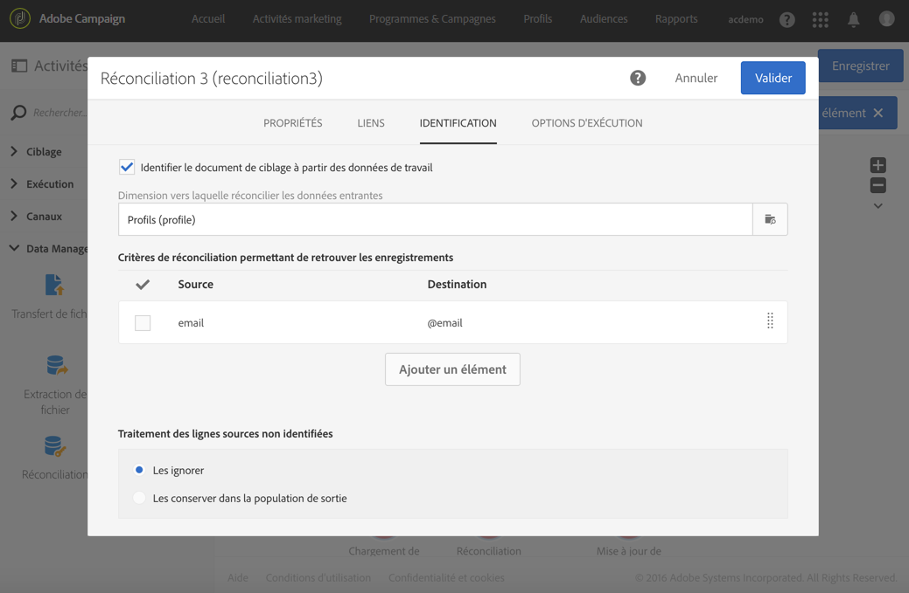

# Services d&#39;inscriptions{#subscription-services}

## Description {#description}


The **[!UICONTROL Subscription Services]** activity allows you to take profiles in mass and subscribe them to a service or unsubscribe them from a service.

>[!CAUTION]
>
>Lorsqu&#39;un abonnement est géré dans le cadre d&#39;un workflow, les profils abonnés ou non ne reçoivent pas les différents emails de confirmation définis dans les propriétés du service.

## Contexte d&#39;utilisation {#context-of-use}

The **[!UICONTROL Subscription Services]** activity is the only Adobe Campaign functionality which allows multiple profiles to be subscribed to or to be unsubscribed from a service in a single action.

Vous pouvez utiliser cette activité après avoir effectué un ciblage ou importé un fichier avec des données identifiées.

Si elle est spécifiée dans un fichier par le biais de colonnes dédiées, cette activité permet également de sélectionner l&#39;action (abonner ou désabonner) et le service sur lequel exécuter l&#39;action.

## Configuration {#configuration}

1. Placez une activité **[!UICONTROL Subscription Services]** dans votre workflow.
1. Connectez-la à la suite d&#39;autres activités de ciblage telles qu&#39;une requête ou une réconciliation suivant un import.
1. Sélectionnez l&#39;activité puis ouvrez-la à l&#39;aide du bouton , disponible dans les actions rapides qui s&#39;affichent.
1. Sélectionnez le **[!UICONTROL Service]** dont vous souhaitez gérer les inscriptions à l&#39;aide de l&#39;une des options suivantes :

   * **[!UICONTROL Select a specific service]**: sélectionnez manuellement un service.
   * **[!UICONTROL Select services from the inbound transition]**: le service est spécifié dans le  entrant. Vous pouvez, par exemple, importer un fichier qui spécifie le service à gérer pour chaque ligne. Si vous avez sélectionné cette option, vérifiez qu&#39;un lien a été préalablement créé entre les données et la ressource **Service**, comme illustré dans [cet exemple](#example--updating-multiple-subscription-statuses-from-a-file).

      Le service sur lequel effectuer l&#39;opération est alors sélectionné de manière dynamique pour chaque enregistrement.

1. Select the **[!UICONTROL Operation type]** to execute using one of the following options:

   * **[!UICONTROL Select a specific operation type]**: sélectionnez manuellement si vous souhaitez **[!UICONTROL Subscribe]** ou **[!UICONTROL Unsubscribe]** des .
   * **[!UICONTROL Select an operation type from a path of inbound transition]**: sélectionnez la colonne des données entrantes qui spécifie l’opération à effectuer pour chaque enregistrement.

      Dans cette colonne, l&#39;opération doit être spécifiée sous la forme d&#39;une valeur booléenne ou d&#39;un entier. Utilisez la valeur **0** pour désabonner un enregistrement et la valeur **1** pour en abonner un.

      In case the values contained in an imported file do not match the above requirements, you can still use the [Remapping of values](../../automating/using/load-file.md#column-format) option available in the **[!UICONTROL Load file]** activity.

1. Si les données en entrée contiennent une colonne avec la date d&#39;abonnement au service correspondant au profil, sélectionnez-la. Vous pouvez la laisser vide, mais aucune date d&#39;abonnement n&#39;est définie lors de l&#39;exécution du workflow.
1. Définissez l&#39;origine de l&#39;abonnement. You can set it to one of the fields of the inbound data or to a constant value of your choice by checking the **[!UICONTROL Set a constant as origin]** option. Vous pouvez la laisser vide, mais aucune origine n&#39;est définie lors de l&#39;exécution du workflow.
1. En cas de besoin, vous pouvez générer une transition sortante. Cette transition contient exactement les mêmes données que celles de l&#39;activité entrante.
1. Validez le paramétrage de l&#39;activité et enregistrez le workflow.

   Ce dernier est prêt à être exécuté. Une fois exécuté, vous pouvez visualiser les profils inscrits ou désinscrits dans le détail du service.

## Exemple : abonner des profils à un service spécifique après l&#39;import d&#39;un fichier {#example--subscribing-profiles-to-a-specific-service-after-importing-a-file}

Cet exemple illustre comment importer un fichier contenant des profils et les abonner à un service existant. Après l&#39;import du fichier, une réconciliation est nécessaire afin d&#39;identifier les données importées comme étant des profils. Afin d&#39;assurer que le fichier ne contient aucun doublon, une déduplication sera exécutée sur les données.

Le workflow de se présente comme suit :


* A **[!UICONTROL Load file]** activity loads the profile file and defines the structure of the imported columns.

   Pour cet exemple, le fichier chargé est au format .csv et contient les données suivantes :

   ```
   lastname;firstname;email;birthdate;subdate
   jackman;megan;megan.jackman@testmail.com;07/08/1975;10/08/2017
   phillips;edward;phillips@testmail.com;09/03/1986;10/08/2017
   weaver;justin;justin_w@testmail.com;11/15/1990;10/08/2017
   martin;babeth;babeth_martin@testmail.net;11/25/1964;10/08/2017
   reese;richard;rreese@testmail.com;02/08/1987;11/08/2017
   cage;nathalie;cage.nathalie227@testmail.com;07/03/1989;11/08/2017
   xiuxiu;andrea;andrea.xiuxiu@testmail.com;09/12/1992;11/08/2017
   grimes;daryl;daryl_890@testmail.com;12/06/1979;12/08/2017
   tycoon;tyreese;tyreese_t@testmail.net;10/08/1971;12/08/2017
   ```

   

* A **[!UICONTROL Reconciliation]** activity identifies the data from the file as belonging to the profile dimension of the Adobe Campaign database. Seul l&#39;onglet **[!UICONTROL Identification]** est configuré. Il permet d&#39;identifier les données du fichier en fonction de l&#39;adresse email des profils.

   

* A **[!UICONTROL Deduplication]** based on the **email** field of the temporary resource (resulting from the reconciliation) identifies any duplicates. Si les données importées depuis le fichier contiennent des doublons, l&#39;abonnement à un service échouera pour l&#39;ensemble des données.

   

* A **[!UICONTROL Subscription Services]** activity lets you select the service to which the profiles must be subscribed, the field corresponding to the subscription date, and the origin of the subscription.

   

## Exemple : mettre à jour plusieurs statuts d&#39;abonnement depuis un fichier {#example--updating-multiple-subscription-statuses-from-a-file}

Cet exemple illustre comment importer un fichier contenant des profils et mettre à jour leur abonnement à plusieurs services indiqués dans le fichier. Après l&#39;import du fichier, une réconciliation est nécessaire afin d&#39;identifier les données importées comme étant des profils avec un lien aux services. Afin d&#39;assurer que le fichier ne contient aucun doublon, une déduplication sera exécutée sur les données.

Le workflow de se présente comme suit :


* A **[!UICONTROL Load file]** activity loads the profile file and defines the structure of the imported columns.

   Pour cet exemple, le fichier chargé est au format .csv et contient les données suivantes :

   ```
   lastname;firstname;email;birthdate;service;operation
   jackman;megan;megan.jackman@testmail.com;07/08/1975;SVC2;sub
   phillips;edward;phillips@testmail.com;09/03/1986;SVC3;unsub
   weaver;justin;justin_w@testmail.com;11/15/1990;SVC3;sub
   martin;babeth;babeth_martin@testmail.net;11/25/1964;SVC3;unsub
   reese;richard;rreese@testmail.com;02/08/1987;SVC3;sub
   cage;nathalie;cage.nathalie227@testmail.com;07/03/1989;SVC3;sub
   xiuxiu;andrea;andrea.xiuxiu@testmail.com;09/12/1992;SVC4;sub
   grimes;daryl;daryl_890@testmail.com;12/06/1979;SVC3;unsub
   tycoon;tyreese;tyreese_t@testmail.net;10/08/1971;SVC2;sub
   ```

   

   Comme vous l&#39;avez peut-être remarqué, l&#39;opération est spécifiée en tant que &quot;sub&quot; ou &quot;unsub&quot; dans le fichier. Le système attend une valeur de type **Booléen** ou **Entier** pour déterminer l&#39;opération à réaliser : la valeur &quot;0&quot; pour désabonner et la valeur &quot;1&quot; pour abonner. Pour répondre à cette exigence, une recodification des valeurs est effectuée dans le détail de la colonne &quot;operation&quot;.

   

   Si le fichier utilise déjà les valeurs &quot;0&quot; et &quot;1&quot; pour identifier l&#39;opération, il n&#39;est pas nécessaire de recodifier ces valeurs. Only make sure that the column is processed as a **Boolean** or **Integer** in the **[!UICONTROL Column definition]** tab.

* A **[!UICONTROL Reconciliation]** activity identifies the data from the file as belonging to the profile dimension of the Adobe Campaign database. Par le biais de l&#39;onglet **[!UICONTROL Identification]**, le champ **email** du fichier est associé au champ **email** de la ressource de profil.

   

   In the **[!UICONTROL Relations]** tab, a link is created with the service resource to allow the **service** field of the file to be recognized. Dans cet exemple, les valeurs correspondent au champ **nom** de la ressource de service.

   

* A **[!UICONTROL Deduplication]** based on the **email** field of the temporary resource (resulting from the reconciliation) identifies duplicates. Il est important de supprimer les doublons, car s&#39;il en existe, l&#39;abonnement à un service échouera pour l&#39;ensemble des données.

   

* A **[!UICONTROL Subscription Services]** identifies the services to update as coming from the transition, through the link created in the **[!UICONTROL Reconciliation]** activity.

   The **[!UICONTROL Operation type]** is identified as coming from the **operation** field of the file. Seul un champ Booléen ou Entier peut être sélectionné ici. If the column of your file that contains the operation to perform does not appear in the list, make sure that you have correctly set your column format in the **[!UICONTROL Load file]** activity, as explained earlier in this example.

   

