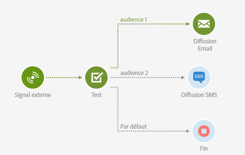
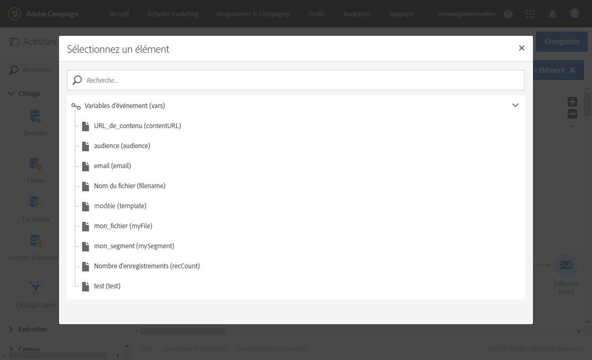
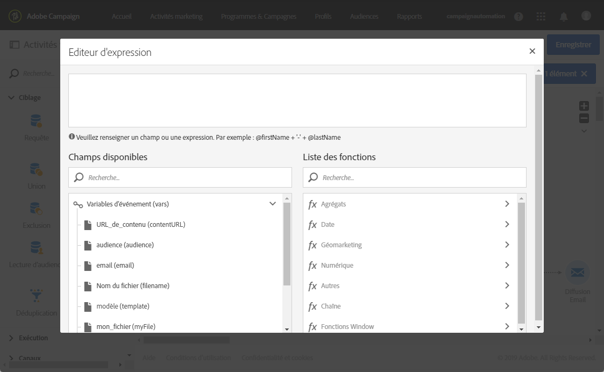

# Test{#test}

## Description {#description}

L'activité **[!UICONTROL Test]active une transition en fonction d'un résultat au test.**

## Contexte d'utilisation {#context-of-use}

Une activité **Test** active la première transition qui satisfait la condition qui lui est associée.

Si aucune condition n'est satisfaite et que l'option **Utiliser la transition par défaut** est activée, une transition par défaut sera activée.

Les conditions peuvent être basées sur des **fonctions** ou des **variables**, par exemple des variables d'événements qui ont été déclarées dans l'activité **[!UICONTROL Signal externe]du workflow.**

**Rubriques connexes :**

* [Liste des fonctions](../../automating/using/list-of-functions.md)
* [Appeler un workflow avec des paramètres externes](../../automating/using/calling-a-workflow-with-external-parameters.md)

## Configuration {#configuration}

1. Faites glisser une activité **[!UICONTROL Test]et déposez-la dans le workflow.**
1. Sélectionnez l'activité puis ouvrez-la à l'aide du bouton 
1. Définissez les attributs de chaque condition :

   Lorsque vous éditez le champ **[!UICONTROL Condition], deux boutons vous aident à appeler des variables d'événements et à éditer des expressions en associant des variables et des fonctions :**

   *  : sélectionnez la variable d'événements parmi toutes les variables disponibles dans le workflow (voir [Personnaliser un workflow avec des paramètres externes](../../automating/using/calling-a-workflow-with-external-parameters.md#customizing-a-workflow-with-external-parameters))

      

   *  : éditez les expressions en associant des variables et des fonctions. Pour plus d'informations sur l'éditeur d'expression, voir [cette section](../../automating/using/advanced-expression-editing.md).

      

