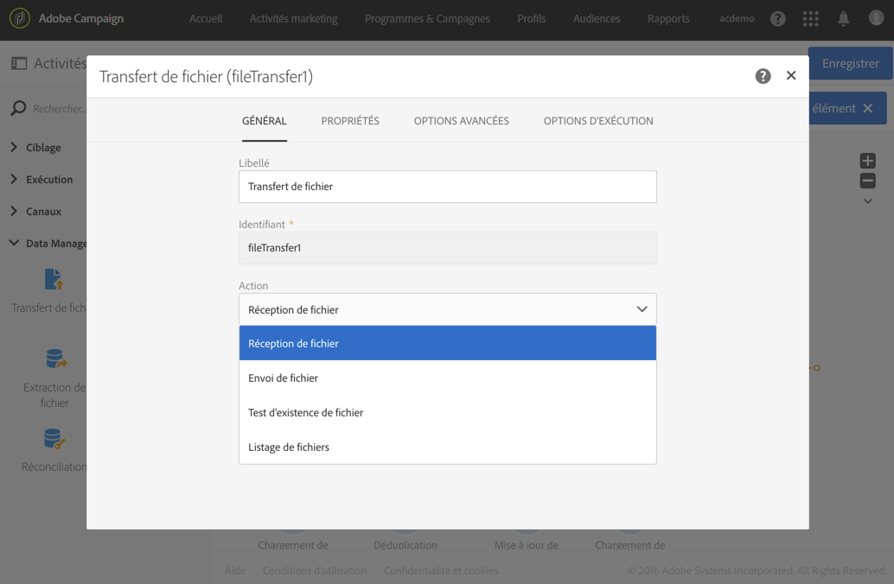
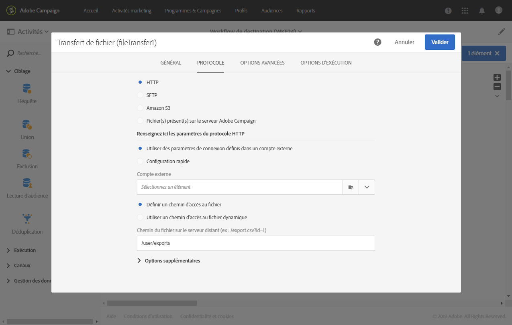
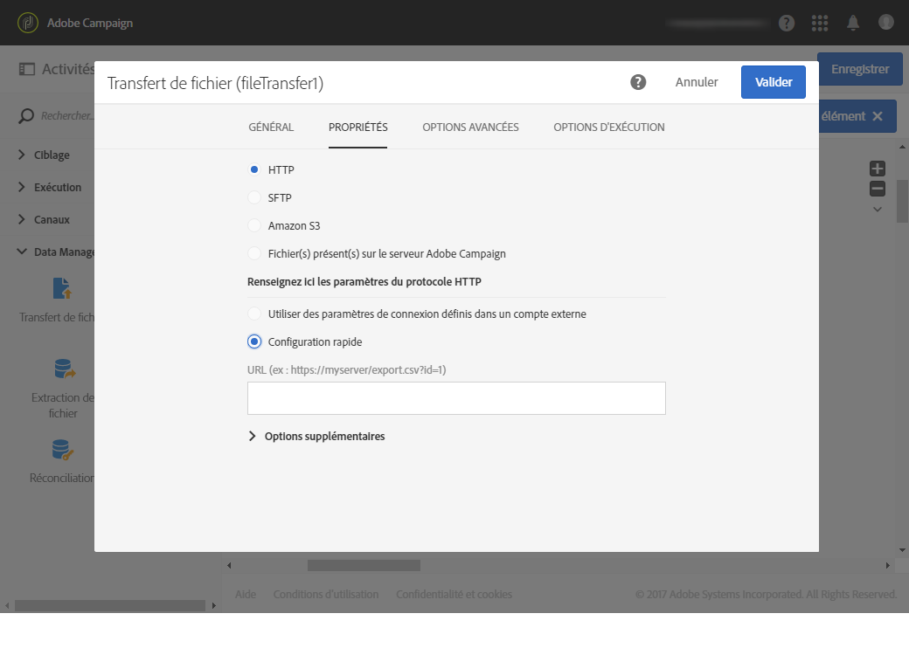
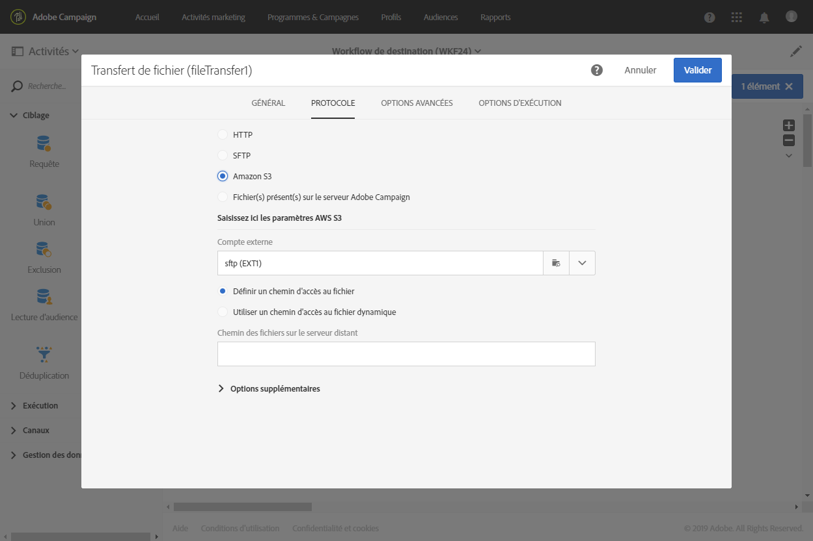
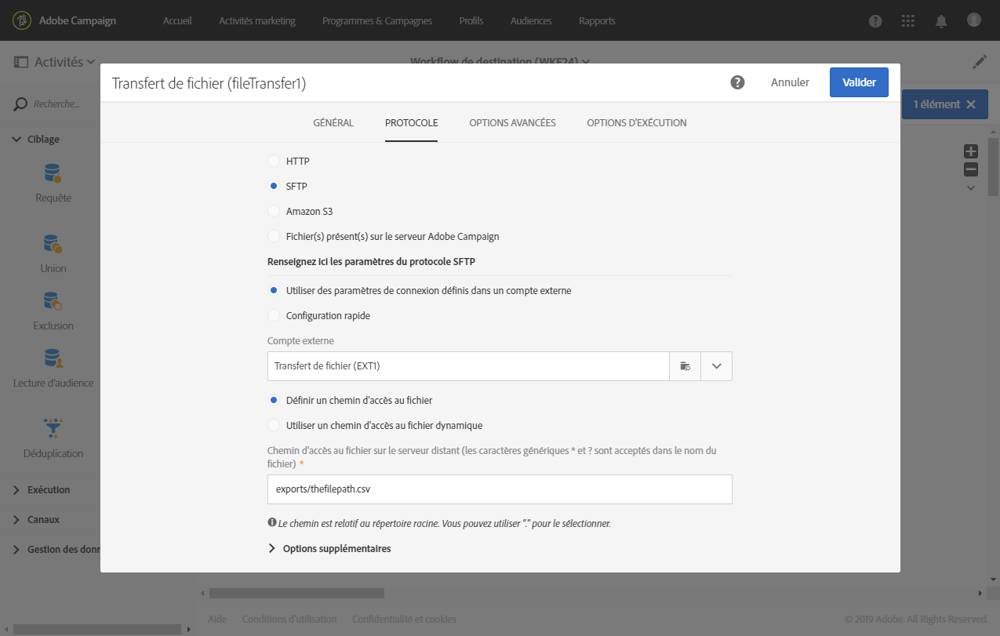
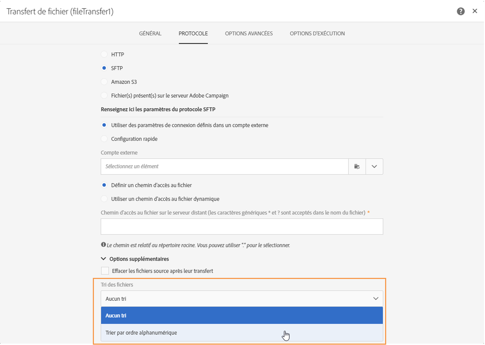
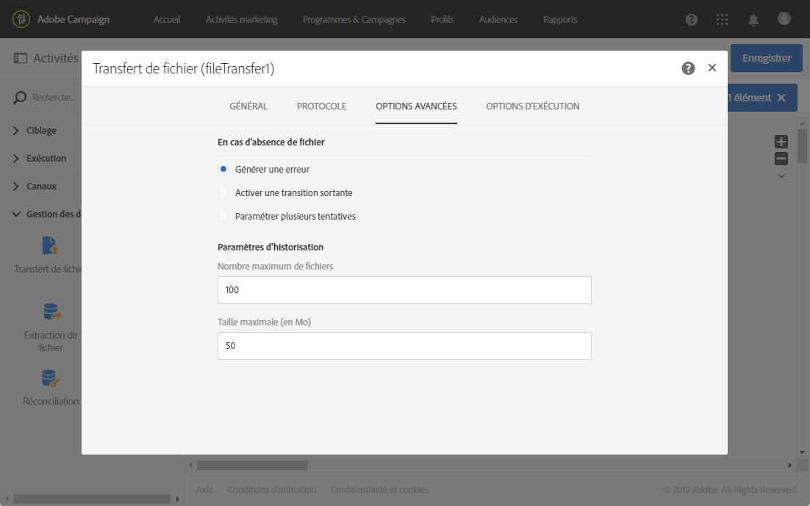

# Transfert de fichier{#transfer-file}

## Description {#description}

L'activité **[!UICONTROL Transfert de fichier]** permet de recevoir ou d'envoyer des fichiers, de tester la présence de fichiers ou de lister les fichiers dans Adobe Campaign.

## Contexte d'utilisation {#context-of-use}

La façon dont les données seront extraites est définie lors du paramétrage de l'activité. Le fichier à charger peut par exemple être une liste de contacts.

Vous pouvez utiliser cette activité pour récupérer des données qui seront ensuite structurées avec l'activité **[!UICONTROL Chargement de fichier]**.

## Configuration {#configuration}

1. Placez une activité **[!UICONTROL Transfert de fichier]** dans votre workflow.
1. Sélectionnez l'activité puis ouvrez-la à l'aide du bouton , disponible dans les actions rapides qui s'affichent.
1. Utilisez la liste déroulante du champ **[!UICONTROL Action]** pour sélectionner l'action de l'activité, à savoir :

   

   * **Réception de fichier** : vous permet de télécharger un fichier.
   * **Envoi de fichier** : vous permet d'envoyer un fichier. Le téléchargement d'un fichier depuis Adobe Campaign génère une entrée de journal dans le menu **[!UICONTROL Audits des exports]**. Pour plus d'informations sur les audits des exports, consultez la section [Audits des exports](../../administration/using/auditing-export-logs.md).
   * **Test d'existence de fichier** : vous permet de vérifier l'existence d'un fichier.
   * **Listage de fichiers** : vous permet de lister les fichiers présents dans Adobe Campaign.
   En fonction de l'action sélectionnée, un ou plusieurs protocoles sont disponibles :

   * **HTTP** : ce protocole permet de lancer le téléchargement d'un fichier depuis un compte externe ou une URL.

      * Cliquez sur l'option **[!UICONTROL Utiliser des paramètres de connexion définis dans un compte externe]** puis sélectionnez le compte désiré et indiquez le chemin du fichier à télécharger.

         

      * Cliquez sur l'option **[!UICONTROL Configuration rapide]** puis entrez l'URL dans le champ qui s'affiche.

         
   * **S3** : ce protocole permet de lancer le téléchargement d'un fichier depuis une URL ou un compte externe via Amazon Simple Storage Service (S3).

      * Sélectionnez le compte externe et spécifiez le chemin du fichier à télécharger.

         
   * **SFTP** : ce protocole permet de lancer le téléchargement d'un fichier depuis une URL ou un compte externe.

      * Cliquez sur l'option **[!UICONTROL Utiliser des paramètres de connexion définis dans un compte externe]** puis sélectionnez le compte désiré et indiquez le chemin du fichier à télécharger.

         

         >[!CAUTION]
         >
         >Les caractères génériques sont supportés.

      * Cliquez sur l'option **[!UICONTROL Configuration rapide]** puis entrez l'URL dans le champ qui s'affiche.
      * Si vous voulez trier les fichiers importés, sélectionnez l'option **[!UICONTROL Trier par ordre alphanumérique]** dans la section **[!UICONTROL Options supplémentaires]**. Les fichiers sont ensuite traités en ordre séquentiel.

         
   * **Fichier(s) présent(s) sur le serveur Adobe Campaign** : ce protocole correspond au répertoire contenant le ou les fichiers à récupérer.

      Les métacaractères, ou caractères génériques (par exemple * ou ?) peuvent être utilisés pour filtrer les fichiers.

      Complétez ce champ et confirmez votre activité pour utiliser ce protocole.

      >[!NOTE]
      >
      >Le chemin doit être relatif au répertoire d'espace de stockage du serveur Adobe Campaign. Les fichiers se trouvent dans le répertoire **sftp&lt;nomdevotreinstance&gt;/**. Il est également impossible de parcourir les niveaux de répertoires supérieurs à l'espace de stockage. Par exemple : **utilisateur&lt;nomdevotreinstance&gt;/my_recipients.csv** est correct. **../hello/my_recipients.csv** est incorrect. **//myserver/hello/myrecipients.csv** est incorrect.
   Choisissez votre protocole et complétez les champs associés.

   L'option **[!UICONTROL Utiliser un chemin d'accès au fichier dynamique]**, disponible pour chaque protocole, vous permet d'utiliser une expression standard et des variables d'événements afin de personnaliser le nom du fichier à transférer. Voir à ce propos la section [Personnaliser les activités avec des variables d'événements](../../automating/using/calling-a-workflow-with-external-parameters.md#customizing-activities-with-events-variables).

1. La section **[!UICONTROL Options supplémentaires]**, disponible en fonction du protocole choisi, vous permet d'ajouter des paramètres à votre protocole. Vous pouvez ainsi :

   * **[!UICONTROL Effacer les fichiers source après leur transfert]**.
   * **[!UICONTROL Désactiver le mode passif]**.
   * **[!UICONTROL Lister tous les fichiers]** : cette option est disponible lors de la sélection de l'action **[!UICONTROL Listage de fichiers]**. Elle permet de répertorier tous les fichiers présents sur le serveur dans la variable d'événement **vars.filenames**. Les noms des fichiers y sont séparés par les caractères **'n'**.

1. La section **[!UICONTROL En cas d'absence de fichier]** de l'onglet **[!UICONTROL Options avancées]** vous permet d'agir sur les erreurs ou les fichiers inexistants détectés lors du lancement de l'activité.

   Vous pouvez également définir de nouvelles tentatives. Les différentes tentatives apparaissent dans le journal d'exécution du workflow.

   

1. Validez le paramétrage de l'activité et enregistrez le workflow.

## Paramètres d'historisation  {#historization-settings}

A chacune de ses exécutions, l'activité **[!UICONTROL Transfert de fichier]** stocke les fichiers transférés ou téléchargés dans un dossier dédié. Un dossier est créé pour chaque activité **[!UICONTROL Transfert de fichier]** d'un workflow. Par conséquent, il est important de pouvoir limiter la taille de ce dossier de façon à préserver l'espace physique sur le serveur.

Pour cela, vous pouvez définir les **[!UICONTROL Paramètres d'historisation]** dans les **[!UICONTROL Options avancées]** de l'activité **[!UICONTROL Transfert de fichier]**.

**[!UICONTROL Les Paramètres d'historisation]** permettent de définir un nombre maximum de fichiers ou la taille totale du dossier de l'activité. Par défaut, 100 fichiers et 50 Mo sont autorisés.

A chaque exécution de l'activité, le dossier est vérifié comme suit :

* Seuls les fichiers créés plus de 24 heures avant l'exécution de l'activité sont pris en compte.
* Si le nombre de fichiers pris en compte est supérieur à la valeur du paramètre **[!UICONTROL Nombre maximum de fichiers]**, les fichiers les plus anciens sont supprimés jusqu'à ce que le **[!UICONTROL Nombre maximum de fichiers]** soit atteint.
* Si la taille totale des fichiers pris en compte est supérieure à la valeur du paramètre **[!UICONTROL Taille maximale (en Mo)]**, les fichiers les plus anciens sont supprimés jusqu'à ce que la **[!UICONTROL Taille maximale (en Mo)]** soit atteinte.

>[!NOTE]
Si l'activité n'est pas exécutée à nouveau, son dossier ne sera pas vérifié ni purgé. Faites donc preuve de prudence lorsque vous transférez des fichiers de grande taille.

## Exemple {#example}

L'exemple suivant montre le paramétrage d'une activité **Transfert de fichier** qui sera ensuite suivie d'une activité **Chargement de fichier** puis **Mise à jour de données**. Le but de ce workflow est d'ajouter ou de mettre à jour les profils de la base Adobe Campaign avec les données récupérées par le workflow.

1. Placez une activité **Transfert de fichier** dans votre workflow.
1. Sélectionnez l'activité puis ouvrez-la à l'aide du bouton , disponible dans les actions rapides qui s'affichent.
1. Dans l'onglet **[!UICONTROL Protocole]**, choisissez le protocole **SFTP**.
1. Sélectionnez l'option **Utiliser des paramètres de connexion définis dans un compte externe**.
1. Renseignez le nom du compte externe.
1. Renseignez le **chemin des fichiers sur le serveur distant**.

   

1. Validez votre activité et sauvegardez votre workflow.

