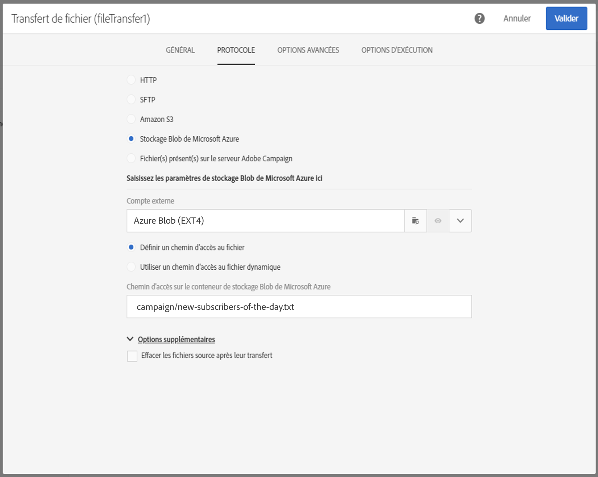

# Transfert de fichier{#transfer-file}

## Description {#description}

L’activité **[!UICONTROL Transfert de fichier]** permet de recevoir ou d’envoyer des fichiers, de tester la présence de fichiers ou de lister les fichiers dans Adobe Campaign.

## Contexte d’utilisation {#context-of-use}

La façon dont les données seront extraites est définie lors du paramétrage de l’activité. Le fichier à charger peut par exemple être une liste de contacts.

Vous pouvez utiliser cette activité pour récupérer des données qui seront ensuite structurées avec l’activité **[!UICONTROL Chargement de fichier]**.

**Rubriques connexes :**

* [Cas pratique : mise à jour des données à l’aide d’un téléchargement automatique de fichier](../../automating/using/update-data-automatic-download.md)

## Configuration {#configuration}

1. Placez une activité **[!UICONTROL Transfert de fichier]** dans votre workflow.
1. Sélectionnez l’activité puis ouvrez-la à l’aide du bouton , disponible dans les actions rapides qui s’affichent.
1. Utilisez la liste déroulante du champ **[!UICONTROL Action]** pour sélectionner l’action de l’activité, à savoir :

   

   * **Réception de fichier** : vous permet de télécharger un fichier.
   * **Envoi de fichier** : vous permet d’envoyer un fichier. Le téléchargement d’un fichier depuis Adobe Campaign génère une entrée de journal dans le menu **[!UICONTROL Audits des exports]**. Pour plus d’informations sur les audits des exports, consultez la section [Audits des exports](../../administration/using/auditing-export-logs.md).
   * **Test d’existence de fichier** : vous permet de vérifier l’existence d’un fichier.
   * **Listage de fichiers** : vous permet de lister les fichiers présents sur le serveur défini dans l’onglet **[!UICONTROL Protocole]**. Cette action est principalement utilisée à des fins de débogage, afin de vérifier si l’activité est configurée en fonction de vos besoins avant de télécharger les fichiers à partir du serveur distant.

1. Sélectionnez le protocole que vous souhaitez utiliser :
   * [HTTP](#HTTP-configuration-wf)
   * [SFTP](#SFTP-configuration-wf)
   * [Amazon S3](#S3-configuration-wf)
   * [Stockage Blob de Microsoft Azure](#azure-blob-configuration-wf)
   * [Fichier(s) présent(s) sur le serveur Adobe Campaign](#files-server-configuration-wf)

1. La section **[!UICONTROL Options supplémentaires]**, disponible en fonction du protocole choisi, vous permet d’ajouter des paramètres à votre protocole. Vous pouvez ainsi :

   * **[!UICONTROL Effacer les fichiers source après leur transfert]**.
   * **[!UICONTROL Désactiver le mode passif]**.
   * **[!UICONTROL Lister tous les fichiers]** : cette option est disponible lors de la sélection de l’action **[!UICONTROL Listage de fichiers]** dans l&#39;onglet **[!UICONTROL Général]**. Elle permet de répertorier tous les fichiers présents sur le serveur dans la variable d’événement **vars.filenames**. Les noms des fichiers y sont séparés par les caractères **’n’**.

1. La section **[!UICONTROL En cas d’absence de fichier]** de l’onglet **[!UICONTROL Options avancées]** vous permet d’agir sur les erreurs ou les fichiers inexistants détectés lors du lancement de l’activité.

   Vous pouvez également définir de nouvelles tentatives. Les différentes tentatives apparaissent dans le journal d’exécution du workflow.

   

1. Validez le paramétrage de l’activité et enregistrez le workflow.

### Configuration avec HTTP {#HTTP-configuration-wf}

Le protocole HTTP permet de lancer le téléchargement d’un fichier depuis un compte externe ou une URL.

Avec ce protocole, vous pouvez choisir l’option **[!UICONTROL Utiliser des paramètres de connexion définis dans un compte externe]**. Dans ce cas, sélectionnez le compte de votre choix et indiquez le chemin d’accès au fichier à télécharger.

Vous pouvez également choisir l’option **[!UICONTROL Configuration rapide]**. Il suffit de saisir l’URL dans le champ URL.

### Configuration avec SFTP {#SFTP-configuration-wf}

Le protocole SFTP permet de lancer le téléchargement d’un fichier depuis une URL ou un compte externe.

Avec ce protocole, vous pouvez choisir l’option **[!UICONTROL Utiliser des paramètres de connexion définis dans un compte externe]** puis sélectionner le compte désiré et indiquer le chemin d’accès au fichier à télécharger.

>[!CAUTION]
>
>Les caractères génériques sont pris en charge.

Vous pouvez également choisir l’option **[!UICONTROL Configuration rapide]**. Il suffit de saisir l’URL dans le champ URL.

### Configuration avec Amazon S3 {#S3-configuration-wf}

Le protocole Amazon S3 permet de lancer le téléchargement d’un fichier depuis une URL ou un compte externe via Amazon Simple Storage Service (S3).

1. Sélectionnez un compte externe Amazon S3. Pour plus d’informations à ce propos, consultez cette [page](../../administration/using/external-accounts.md#amazon-s3-external-account).

2. Choisissez si vous souhaitez **[!UICONTROL Définir un chemin d’accès au fichier]** ou **[!UICONTROL Utiliser un chemin d’accès au fichier dynamique]**.

3. Indiquez le chemin d’accès au fichier à télécharger.

   

4. Si vous souhaitez supprimer les fichiers source une fois le transfert terminé, cochez la case **[!UICONTROL Effacer les fichiers source après leur transfert]**.

### Configuration avec le stockage Blob Microsoft Azure {#azure-blob-configuration-wf}

Le protocole Blob Microsoft Azure permet d’accéder à l’objet Blob situé sur un compte de stockage Blob Microsoft Azure.

1. Sélectionnez un compte externe **[!UICONTROL Blob Microsoft Azure]**. Pour plus d’informations à ce propos, consultez cette [page](../../administration/using/external-accounts.md#microsoft-azure-external-account).

1. Choisissez si vous souhaitez **[!UICONTROL Définir un chemin d’accès au fichier]** ou **[!UICONTROL Utiliser un chemin d’accès au fichier dynamique]**.

   

1. Indiquez le chemin d’accès au fichier à télécharger ; il peut correspondre à plusieurs objets Blob. Dans ce cas, l’activité **[!UICONTROL Transfert de fichier]** activera la transition sortante une fois par objet Blob trouvé. Ils seront ensuite traités par ordre alphabétique.

   >[!CAUTION]
   >
   >Les caractères génériques ne sont pas pris en charge pour faire correspondre plusieurs noms du fichier. Vous devez saisir un préfixe. Tous les noms d’objets Blob correspondant à ce préfixe seront éligibles.

   Voici une liste d’exemples de chemins de fichier :

   * **&quot;campaign/&quot;** : correspond à tous les objets Blob dans le dossier Campaign situé à la racine du conteneur.
   * **&quot;campaign/new-&quot;** : correspond à tous les objets Blob avec un nom de fichier commençant par « new- » et se trouvant dans le dossier Campaign.
   * **&quot;&quot;** : l’ajout d’un chemin d’accès vide permet de faire correspondre tous les objets Blob disponibles dans le conteneur.

### Configuration avec des fichiers présents sur le serveur Adobe Campaign {#files-server-configuration-wf}

Le protocole **[!UICONTROL Fichier(s) présent(s) sur le serveur Adobe Campaign]** correspond au référentiel contenant le ou les fichiers à récupérer.
Les métacaractères, ou caractères génériques (par exemple * ou ?) peuvent être utilisés pour filtrer les fichiers.

Choisissez si vous souhaitez **[!UICONTROL Définir un chemin d’accès au fichier]** ou **[!UICONTROL Utiliser un chemin d’accès au fichier dynamique]**. L’option **[!UICONTROL Utiliser un chemin d’accès au fichier dynamique]** permet d’utiliser une expression standard et des variables d’événements pour personnaliser le nom du fichier à transférer. Voir à ce propos [cette page](../../automating/using/customizing-workflow-external-parameters.md).

Veuillez noter que le chemin doit être relatif au répertoire d’espace de stockage du serveur Adobe Campaign. Les fichiers se trouvent dans le répertoire **sftp&lt;nomdevotreinstance>/**. Il est également impossible de parcourir les niveaux de répertoires supérieurs à l’espace de stockage.

par exemple :

`user&lt;yourinstancename>/my_recipients.csv` est correct.

`../hello/my_recipients.csv` est incorrect.

`//myserver/hello/myrecipients.csv` est incorrect.

## Paramètres d’historisation  {#historization-settings}

A chacune de ses exécutions, l’activité **[!UICONTROL Transfert de fichier]** stocke les fichiers transférés ou téléchargés dans un dossier dédié. Un dossier est créé pour chaque activité **[!UICONTROL Transfert de fichier]** d’un workflow. Par conséquent, il est important de pouvoir limiter la taille de ce dossier de façon à préserver l’espace physique sur le serveur.

Pour cela, vous pouvez définir les **[!UICONTROL Paramètres d’historisation]** dans les **[!UICONTROL Options avancées]** de l’activité **[!UICONTROL Transfert de fichier]**.

**[!UICONTROL Les Paramètres d’historisation]** permettent de définir un nombre maximum de fichiers ou la taille totale du dossier de l’activité. Par défaut, 100 fichiers et 50 Mo sont autorisés.

A chaque exécution de l’activité, le dossier est vérifié comme suit :

* Seuls les fichiers créés plus de 24 heures avant l’exécution de l’activité sont pris en compte.
* Si le nombre de fichiers pris en compte est supérieur à la valeur du paramètre **[!UICONTROL Nombre maximum de fichiers]**, les fichiers les plus anciens sont supprimés jusqu’à ce que le **[!UICONTROL Nombre maximum de fichiers]** soit atteint.
* Si la taille totale des fichiers pris en compte est supérieure à la valeur du paramètre **[!UICONTROL Taille maximale (en Mo)]**, les fichiers les plus anciens sont supprimés jusqu’à ce que la **[!UICONTROL Taille maximale (en Mo)]** soit atteinte.

>[!NOTE]
>
>Si l’activité n’est pas exécutée à nouveau, son dossier ne sera pas vérifié ni purgé. Faites donc preuve de prudence lorsque vous transférez des fichiers de grande taille.

## Variables de sortie {#output-variables}

L&#39;activité **[!UICONTROL Transfert de fichier]** génère des variables d&#39;événement en tant que sortie, que vous pouvez exploiter dans d&#39;autres activités, par exemple pour vérifier le nombre de fichiers téléchargés à l&#39;aide d&#39;une activité [Test](../../automating/using/test.md).

Notez que les variables d&#39;événement peuvent également être transmises à un autre workflow à l’aide d’un signal externe (voir [Personnaliser un workflow avec des paramètres externes](../../automating/using/customizing-workflow-external-parameters.md)).

Les variables de sortie disponibles sont les suivantes :

* **[!UICONTROL fileName]** : nom des fichiers transférés.
* **[!UICONTROL filesCount]** : nombre de fichiers transférés.

