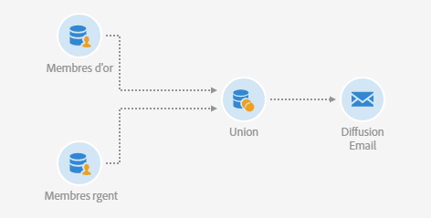

# Union sur deux audiences affinées {#example--union-on-two-refined-audiences}

Le workflow défini dans cet exemple montre l&#39;union de deux activités **[!UICONTROL Lecture d&#39;audience]**. L&#39;objectif de ce workflow est d&#39;envoyer un email aux membres Gold ou Silver qui ont entre 18 et 30 ans. Des audiences spécifiques sont déjà créées dans le système pour tracker les membres Gold et Silver.

Le workflow se présente comme suit :

* Une première activité [Lecture d&#39;audience](../../automating/using/read-audience.md) qui récupère l&#39;audience membres Gold et l&#39;affine en sélectionnant uniquement les profils qui ont entre 18 et 30 ans.
* Une deuxième activité **[!UICONTROL Lecture d&#39;audience]** qui récupère l&#39;audience membres Silver et l&#39;affine en sélectionnant uniquement les profils qui ont entre 18 et 30 ans.
* Une activité [Union](../../automating/using/union.md) qui réunit les populations issues des deux activités **[!UICONTROL Lecture d&#39;audience]** en une population finale.
* Une activité [Diffusion Email](../../automating/using/email-delivery.md) qui envoie l&#39;email à la population en provenance de l&#39;activité **[!UICONTROL Union]**.
