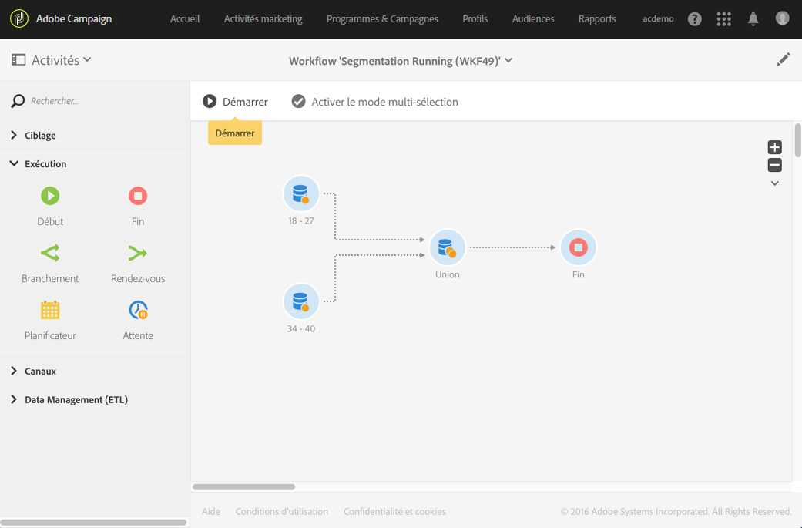

# Union{#union}

## Description {#description}

L'activité **[!UICONTROL Union]** permet de regrouper le résultat de plusieurs activités dans une même cible.

>[!NOTE]
>
>Les ensembles ne doivent pas nécessairement être homogènes.

## Contexte d'utilisation  {#context-of-use}

L'activité **[!UICONTROL Union]** est utilisée afin de réunir les populations des transitions entrantes dans le cadre d'une segmentation, d'une définition d'audience ou en vue de la préparation de la cible d'un message par exemple.

## Configuration {#configuration}

1. Placez une activité **[!UICONTROL Union]** dans votre workflow.
1. Connectez-la à la suite d'autres activités telles que des requêtes.
1. Sélectionnez l'activité puis ouvrez-la à l'aide du bouton , disponible dans les actions rapides qui s'affichent.
1. Sélectionnez le **[!UICONTROL Type de réconciliation]** pour définir la gestion des doublons issus de la confrontation des populations entrantes :

   * **[!UICONTROL Uniquement les clés]** : c'est le mode par défaut. L'activité ne conserve qu'un élément lorsque des éléments provenant des différentes transitions entrantes ont la même clé. Cette option ne peut être utilisée que si les populations en entrée sont homogènes.
   * **[!UICONTROL Toutes les colonnes communes]** : les données sont réconciliées sur la base de toutes les colonnes communes aux transitions entrantes. Vous devez alors sélectionner l'ensemble principal qui sera conservé en cas de doublon. Cette option peut être utilisée notamment si les dimensions de ciblage des populations entrantes sont différentes.
   * **[!UICONTROL Une sélection de colonnes]** : sélectionnez cette option pour définir la liste des colonnes sur lesquelles sera appliquée la réconciliation des données. Vous devez d'abord sélectionner l'ensemble principal (celui qui contient les données sources), puis les colonnes à utiliser pour la jointure.

1. Cochez la case **[!UICONTROL Utiliser uniquement les données additionnelles communes]** si vous souhaitez ne conserver que les données additionnelles présentes dans toutes les transitions entrantes.
1. Cochez la case **[!UICONTROL Limiter la taille de la population générée]** si vous souhaitez limiter la taille de la population à un nombre donné d'enregistrements, que vous indiquez dans le champ **[!UICONTROL Nombre maximum d'enregistrements]**.
1. Si besoin, gérez les [Transitions](../../automating/using/executing-a-workflow.md#managing-an-activity-s-outbound-transitions) de l'activité afin d'accéder à des options avancées sur la population calculée.
1. Validez le paramétrage de l'activité et enregistrez le workflow.

## Exemple  {#example}

L'exemple suivant montre le résultat de deux activités de requête visant à regrouper les profils de la base Adobe Campaign dont l'âge est compris entre 18 et 27 ans et ceux dont l'âge est compris entre 34 et 40 ans. Le résultat contient l'ensemble des profils des deux requêtes ou le nombre d'enregistrements maximum défini lors du paramétrage, le cas échéant.

