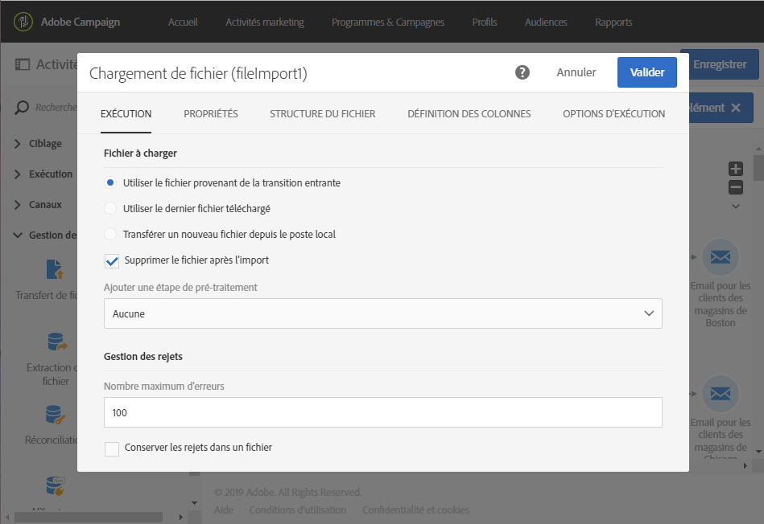

# Mise à jour des données à l’aide d’un téléchargement automatique de fichier{#updating-data-automatic-file-download}

L&#39;activité de chargement de fichier sert essentiellement à structurer des données issues d&#39;une activité de transfert de fichier en vue de les intégrer à des données existantes.

L&#39;exemple suivant montre le résultat d&#39;une activité de chargement d&#39;un fichier automatiquement téléchargé via une activité de transfert, suivie d&#39;une mise à jour de données. Le but de ce workflow est d&#39;enrichir la base Adobe Campaign avec de nouveaux profils ou de mettre à jour les profils existants à partir des données récupérées dans le fichier importé.

Pour créer le workflow, procédez comme suit :

1. Placez une activité [Transfert de fichier](../../automating/using/transfer-file.md) dans votre workflow.
1. Sélectionnez l’activité puis ouvrez-la à l’aide du bouton , disponible dans les actions rapides qui s’affichent.
1. Configurez l’activité de manière à ce qu’elle récupère le fichier de votre choix. Dans l’onglet **[!UICONTROL Protocole]**, choisissez le protocole **SFTP**.
1. Sélectionnez l’option **Utiliser des paramètres de connexion définis dans un compte externe**.
1. Renseignez le nom du compte externe.
1. Renseignez le **chemin des fichiers sur le serveur distant**.

   

1. Validez votre activité.
1. Placez une activité [Chargement de fichier](../../automating/using/load-file.md) et connectez-la à la suite de l&#39;activité **[!UICONTROL Transfert de fichier]**.
1. Sélectionnez l&#39;activité puis ouvrez-la à l&#39;aide du bouton , disponible dans les actions rapides qui s&#39;affichent.
1. Dans la section **[!UICONTROL Fichier à charger]** de l&#39;onglet **[!UICONTROL Exécution]**, cochez la case **[!UICONTROL Utiliser le fichier provenant de la transition entrante]**.

   

1. Paramétrez l&#39;activité comme indiqué ci-dessus.
1. Placez une activité [Mise à jour de données](../../automating/using/update-data.md), connectez-la à la suite de l&#39;activité **[!UICONTROL Chargement de fichier]** et paramétrez-la.

Une fois le workflow lancé, le fichier voulu est téléchargé, les données sont extraites, puis elles sont utilisées pour enrichir la base Adobe Campaign.
