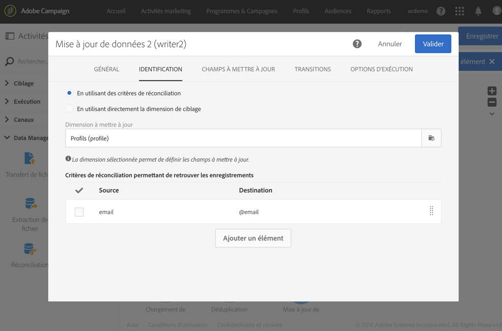
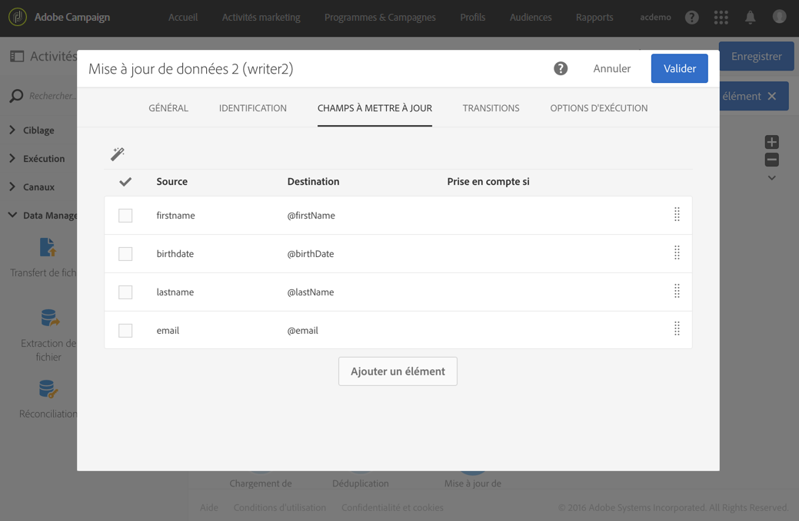

# Mise à jour de la base de données avec des données externes {#update-database-file}

L’exemple suivant montre le paramétrage d’une **[!UICONTROL Mise à jour de données]** suite à un **[!UICONTROL Chargement de fichier]**. Le but du workflow est d&#39;ajouter ou de mettre à jour les profils de la base Adobe Campaign avec les données récupérées depuis le fichier.

Dans cet exemple, la clé de réconciliation utilisée est l’**adresse email**. Le fichier chargé dans l’activité [Chargement de fichier](../../automating/using/load-file.md) est un fichier au format **.txt** contenant les données suivantes, à titre d’exemple :

```
lastname;firstname;email;birthdate
jackman;megan;megan.jackman@testmail.com;07/08/1975
phillips;edward;phillips@testmail.com;09/03/1986
weaver;justin;justin_w@testmail.com;11/15/1990
martin;babeth;babeth_martin@testmail.net;11/25/1964
reese;richard;rreese@testmail.com;02/08/1987
cage;nathalie;cage.nathalie227@testmail.com;07/03/1989
xiuxiu;andrea;andrea.xiuxiu@testmail.com;09/12/1992
grimes;daryl;daryl_890@testmail.com;12/06/1979
tycoon;tyreese;tyreese_t@testmail.net;10/08/1971
```

L&#39;activité de [Mise à jour de données](../../automating/using/update-data.md) est paramétrée comme suit :




