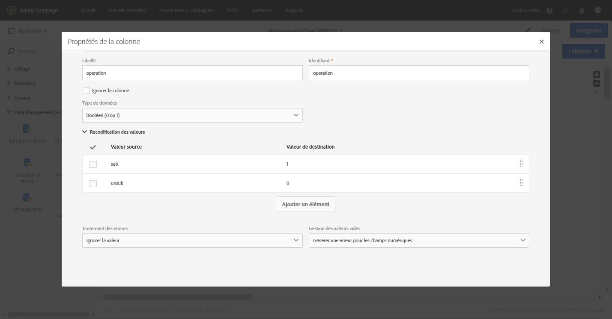
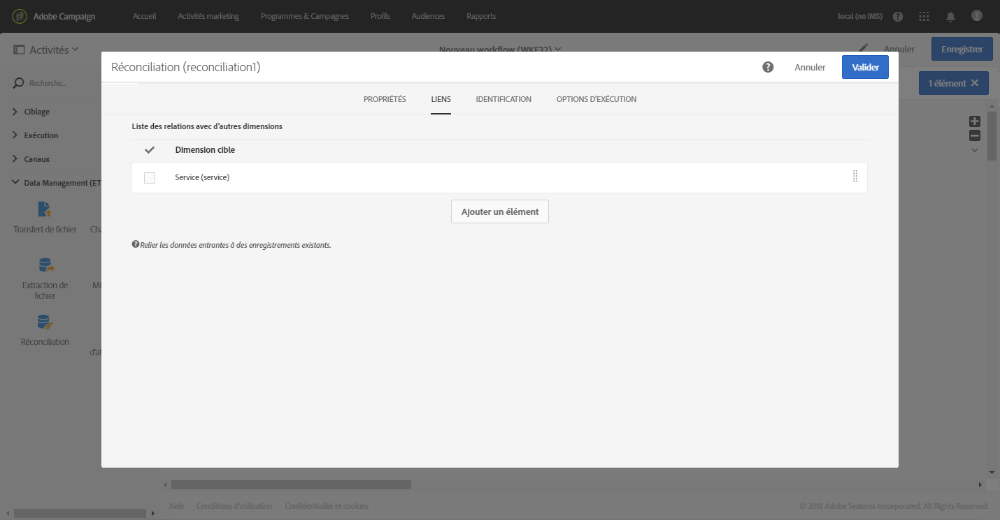

# Mise à jour de plusieurs statuts d’abonnement depuis un fichier {#updating-multiple-subscription-statuses-from-a-file}

Cet exemple illustre comment importer un fichier contenant des profils et mettre à jour leur abonnement à plusieurs services indiqués dans le fichier. Après l’import du fichier, une réconciliation est nécessaire afin d’identifier les données importées comme étant des profils avec un lien aux services. Afin d’assurer que le fichier ne contient aucun doublon, une déduplication sera exécutée sur les données.

Le workflow de se présente comme suit :


* Une activité de [Chargement de fichier](../../automating/using/load-file.md) permettant de charger le fichier de profils et de définir la structure des colonnes importées.

   Pour cet exemple, le fichier chargé est au format .csv et contient les données suivantes :

   ```
   lastname;firstname;email;birthdate;service;operation
   jackman;megan;megan.jackman@testmail.com;07/08/1975;SVC2;sub
   phillips;edward;phillips@testmail.com;09/03/1986;SVC3;unsub
   weaver;justin;justin_w@testmail.com;11/15/1990;SVC3;sub
   martin;babeth;babeth_martin@testmail.net;11/25/1964;SVC3;unsub
   reese;richard;rreese@testmail.com;02/08/1987;SVC3;sub
   cage;nathalie;cage.nathalie227@testmail.com;07/03/1989;SVC3;sub
   xiuxiu;andrea;andrea.xiuxiu@testmail.com;09/12/1992;SVC4;sub
   grimes;daryl;daryl_890@testmail.com;12/06/1979;SVC3;unsub
   tycoon;tyreese;tyreese_t@testmail.net;10/08/1971;SVC2;sub
   ```

   

   Comme vous l’avez peut-être remarqué, l’opération est spécifiée en tant que &quot;sub&quot; ou &quot;unsub&quot; dans le fichier. Le système attend une valeur de type **Booléen** ou **Entier** pour déterminer l’opération à réaliser : la valeur &quot;0&quot; pour désabonner et la valeur &quot;1&quot; pour abonner. Pour répondre à cette exigence, une recodification des valeurs est effectuée dans le détail de la colonne &quot;operation&quot;.

   

   Si le fichier utilise déjà les valeurs &quot;0&quot; et &quot;1&quot; pour identifier l’opération, il n’est pas nécessaire de recodifier ces valeurs. Veillez simplement à ce que la colonne soit traitée comme un **Booléen** ou un **Entier** dans l’onglet **[!UICONTROL Définition des colonnes]**.

* Une [Réconciliation](../../automating/using/reconciliation.md) permet d’identifier les données provenant du fichier comme appartenant à la dimension des profils de la base de données Adobe Campaign. Par le biais de l’onglet **[!UICONTROL Identification]**, le champ **email** du fichier est associé au champ **email** de la ressource de profil.

   

   Dans l’onglet **[!UICONTROL Liens]**, un lien est créé avec la ressource de service pour que le champ **service** du fichier soit reconnu. Dans cet exemple, les valeurs correspondent au champ **nom** de la ressource de service.

   

* Une [Déduplication](../../automating/using/deduplication.md) basée sur le champ **email** de la ressource temporaire (issue de la réconciliation) permet d’identifier les doublons. Il est important de supprimer les doublons, car s’il en existe, l’abonnement à un service échouera pour l’ensemble des données.

   

* Une activité [Services d’abonnements](../../automating/using/subscription-services.md) identifie les services à mettre à jour comme provenant de la transition, par le biais du lien créé dans l’activité **[!UICONTROL Réconciliation]**.

   Le **[!UICONTROL Type d’opération]** est identifié comme provenant du champ **operation** du fichier. Seul un champ Booléen ou Entier peut être sélectionné ici. Si la colonne du fichier contenant l’opération à effectuer n’apparaît pas dans la liste, vérifiez que vous avez correctement défini le format de la colonne dans l’activité **[!UICONTROL Chargement de fichier]**, comme expliqué plus haut dans cet exemple.

   
