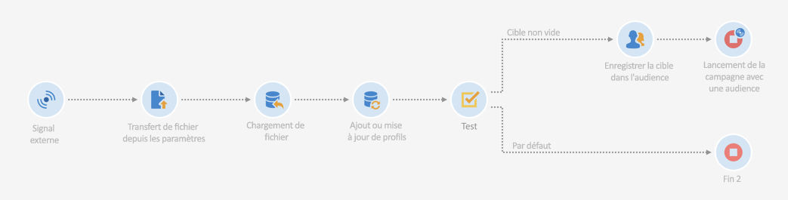
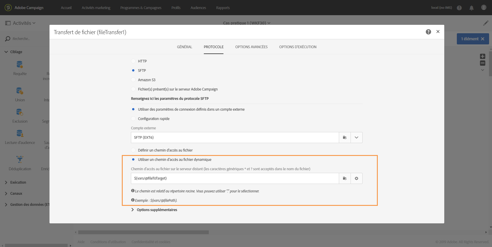
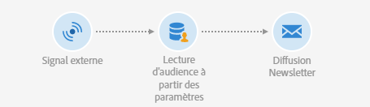
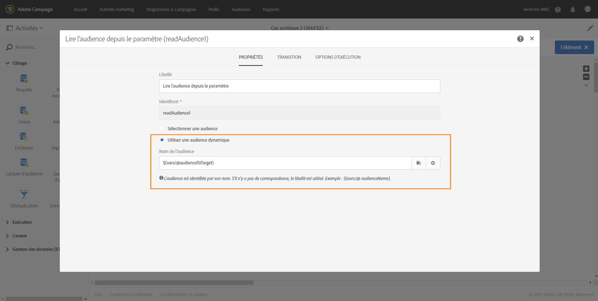

# Utilisation :{#use-case}

Le cas pratique ci-dessous vous présente comment appeler un workflow avec des paramètres au sein de vos workflows.

L’objectif est de déclencher un workflow à partir d’un appel API avec des paramètres externes. Ce workflow chargera des données dans votre base de données à partir d’un fichier et créera une audience associée. Une fois l’audience créée, un deuxième workflow sera déclenché pour envoyer un message personnalisé avec les paramètres externes définis dans l’appel API.

Pour mettre en place ce cas pratique, vous devez réaliser les actions ci-dessous :

1. **Effectuez un appel API** pour déclencher le workflow 1 avec des paramètres externes. Voir [Etape 1 : configurer l’appel API](../../automating/using/use-case-calling-workflow.md#step-1--configuring-the-api-call).
1. **Créez le workflow 1** : le workflow transférera un fichier et le chargera dans la base de données. Il effectuera ensuite un test pour déterminer si les données sont vides et finira par enregistrer les profils dans une audience. Enfin, il déclenchera le workflow 2. Voir [Etape 2 : configurer le workflow 1](../../automating/using/use-case-calling-workflow.md#step-2--configuring-workflow-1).
1. **Créez le workflow 2** : le workflow lira l’audience créée dans le workflow 1, puis il enverra un message personnalisé aux profils, avec un code segment personnalisé au moyen des paramètres. Voir [Etape 3 : configurer le workflow 2](../../automating/using/use-case-calling-workflow.md#step-3--configuring-workflow-2).


## Prérequis {#prerequisites}

Avant de configurer les workflows, vous devez créer les workflows 1 et 2 avec une activité **[!UICONTROL Signal externe]** dans chacun d’eux. Ce faisant, vous pourrez cibler ces activités Signal lors de l’appel des workflows.

## Etape 1 : configurer l’appel API      {#step-1--configuring-the-api-call}

Effectuez un appel API pour déclencher le workflow 1 avec des paramètres. Pour plus d’informations sur la syntaxe de l’appel API, consultez la [documentation des API REST Campaign Standard](../../api/using/triggering-a-signal-activity.md).

Dans notre cas, nous souhaitons appeler le workflow avec les paramètres ci-dessous :

* **fileToTarget** : nom du fichier que nous voulons importer dans la base de données.
* **discountDesc** : description que nous voulons afficher dans la diffusion pour la remise.

```
-X POST https://mc.adobe.io/<ORGANIZATION>/campaign/<TRIGGER_URL>
-H 'Authorization: Bearer <ACCESS_TOKEN>' 
-H 'Cache-Control: no-cache' 
-H 'X-Api-Key: <API_KEY>' 
-H 'Content-Type: application/json;charset=utf-8' 
-H 'Content-Length:79' 
-i
-d {
-d "source:":"API",
-d "parameters":{
-d "fileToTarget":"profile.txt",
-d "discountDesc":"Running shoes"
-d } 
```

## Etape 2 : configurer le workflow 1       {#step-2--configuring-workflow-1}

Le workflow 1 sera créé tel que ci-dessous :

* **[!UICONTROL Activité Signal externe]** : où les paramètres externes doivent être déclarés afin d’être utilisés au sein du workflow.
* **[!UICONTROL Activité Transfert de fichier]** : importe le fichier avec le nom défini dans les paramètres.
* **[!UICONTROL Activité Chargement de fichier]** : charge dans la base de données les données du fichier importé.
* **[!UICONTROL Activité Mise à jour de données]** : ajoute les données du fichier importé à la base de données ou la met à jour avec ces données.
* **[!UICONTROL Activité Test]** : vérifie si des données sont importées.
* **[!UICONTROL Activité Sauvegarde d’audience]** : si le fichier contient des données, enregistre les profils dans une audience.
* **[!UICONTROL Activité Fin]** : appelle le workflow 2 avec les paramètres que vous voulez utiliser dans celui-ci.



Suivez les étapes ci-dessous pour configurer le workflow :

1. Déclarez les paramètres qui ont été définis dans l’appel API. Pour ce faire, ouvrez l’activité **[!UICONTROL Signal externe]**, puis ajoutez les noms et les types de paramètres.

   

1. Ajoutez une activité **[!UICONTROL Transfert de fichier]** afin d’importer des données dans la base de données. Pour cela, faites glisser et déposez l’activité, ouvrez-la, puis sélectionnez l’onglet **[!UICONTROL Protocole]**.
1. Sélectionnez l’option **[!UICONTROL Utiliser un chemin d’accès au fichier dynamique]**, puis utilisez le paramètre **fileToTarget** comme fichier à transférer :

   ```
   $(vars/@fileToTarget)
   ```

   

1. Chargez les données du fichier dans la base de données.

   Pour ce faire, faites glisser une activité **[!UICONTROL Chargement de fichier]** et déposez-la dans le workflow, puis configurez-la selon vos besoins.

1. Insérez les données du fichier importé dans la base de données ou mettez-la à jour avec ces données.

   Pour cela, faites glisser et déposez une activité **[!UICONTROL Mise à jour de données]**, puis sélectionnez l’onglet **[!UICONTROL Identification]** afin d’ajouter un critère de réconciliation (dans notre cas, le champ **email**).

   

1. Sélectionnez l’onglet **[!UICONTROL Champs à mettre à jour]**, puis spécifiez les champs à mettre à jour dans la base de données (dans notre cas, les champs **firstname** et **email**).

   

1. Vérifiez si des données sont récupérées à partir du fichier. Pour ce faire, faites glisser une activité **[!UICONTROL Test]** et déposez-la dans le workflow, puis cliquez sur le bouton **[!UICONTROL Ajouter un élément]** afin d’ajouter une condition.
1. Nommez et définissez la condition. Dans notre cas, nous voulons tester si la transition sortante contient des données avec la syntaxe ci-dessous :

   ```
   $long(vars/@recCount)>0
   ```

   

1. Si des données sont récupérées, enregistrez-les dans une audience. Pour cela, ajoutez une activité **[!UICONTROL Sauvegarde d’audience]** à la transition **Cible non vide**, puis ouvrez-la.
1. Sélectionnez l’option **[!UICONTROL Utiliser un libellé dynamique]**, puis utilisez le paramètre **fileToTarget** comme libellé de l’audience :

   ```
   $(vars/@fileToTarget)
   ```

   

1. Faites glisser et déposez une activité **[!UICONTROL Fin]** qui appellera le workflow 2 avec des paramètres, puis ouvrez-la.
1. Sélectionnez l’onglet **[!UICONTROL Signal externe]**, puis spécifiez le workflow à déclencher et son activité Signal associée.
1. Définissez les paramètres que vous voulez utiliser au sein du workflow 2 ainsi que leurs valeurs associées.

   Dans notre cas, nous souhaitons transmettre les paramètres initialement définis dans l’appel API (**fileToTarget** et **discountDesc**), de même qu’un paramètre **segmentCode** supplémentaire avec une valeur constante (&quot;remise de 20 %&quot;).

   

Le workflow 1 est configuré, et vous pouvez maintenant créer le workflow 2. Voir à ce propos [cette section](../../automating/using/use-case-calling-workflow.md#step-3--configuring-workflow-2).

## Etape 3 : configurer le workflow 2       {#step-3--configuring-workflow-2}

Le workflow 2 sera créé tel que ci-dessous :

* **[!UICONTROL Activité Signal externe]** : où les paramètres doivent être déclarés afin d’être utilisés au sein du workflow.
* **[!UICONTROL Activité Lecture d’audience]** : lit l’audience enregistrée dans le workflow 1.
* **[!UICONTROL Activité Diffusion Email]** : envoie un message récurrent à l’audience ciblée, personnalisée avec des paramètres.



Suivez les étapes ci-dessous pour configurer le workflow :

1. Déclarez les paramètres qui ont été définis dans le workflow 1.

   Pour ce faire, ouvrez l’activité **[!UICONTROL Signal externe]**, puis ajoutez le nom et le type de chaque paramètre défini dans l’activité **[!UICONTROL Fin]** du workflow 1.

   

1. Utilisez l’audience qui a été enregistrée dans le workflow 1. Pour cela, faites glisser une activité **[!UICONTROL Lecture d’audience]** et déposez-la dans le workflow, puis ouvrez-la.
1. Sélectionnez l’option **[!UICONTROL Utiliser une audience dynamique]**, puis utilisez le paramètre **fileToTarget** comme nom de l’audience à lire :

   ```
   $(vars/@fileToTarget)
   ```

   

1. Nommez la transition sortante selon le paramètre **segmentCode**.

   Pour ce faire, sélectionnez l’onglet **[!UICONTROL Transition]**, puis l’option **[!UICONTROL Utiliser un code segment dynamique]**.

1. Utilisez le paramètre **segmentCode** comme nom de la transition sortante :

   ```
   $(vars/@segmentCode)
   ```

   

1. Faites glisser et déposez une activité **[!UICONTROL Diffusion Email]** pour envoyer un message à l’audience.
1. Identifiez les paramètres à utiliser dans le message afin de le personnaliser avec le paramètre **discountDesc**. Pour cela, ouvrez les options avancées de l’activité, puis ajoutez le nom et la valeur du paramètre.

   

1. Vous pouvez à présent configurer le message. Ouvrez l’activité, puis sélectionnez **[!UICONTROL Email récurrent]**.

   

1. Sélectionnez le modèle à utiliser, puis définissez les propriétés d’email selon vos besoins.
1. Utilisez le paramètre **discountDesc** en tant que champ de personnalisation. Pour ce faire, sélectionnez-le dans la liste des champs de personnalisation.

   

1. Vous pouvez maintenant terminer la configuration du message et l’envoyer ensuite de manière habituelle.

   

## Exécuter les workflows       {#executing-the-workflows}

Une fois les workflows créés, vous pouvez les exécuter. Assurez-vous que les deux workflows sont démarrés avant d’effectuer l’appel API.
