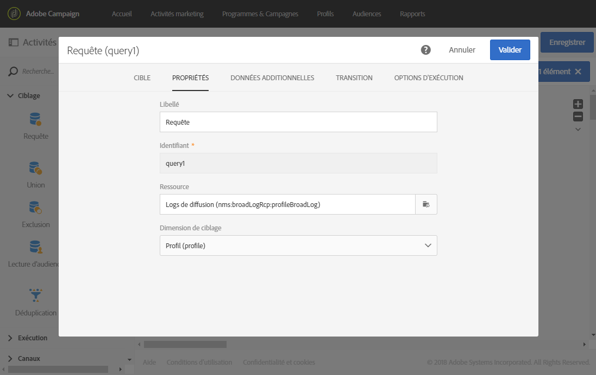
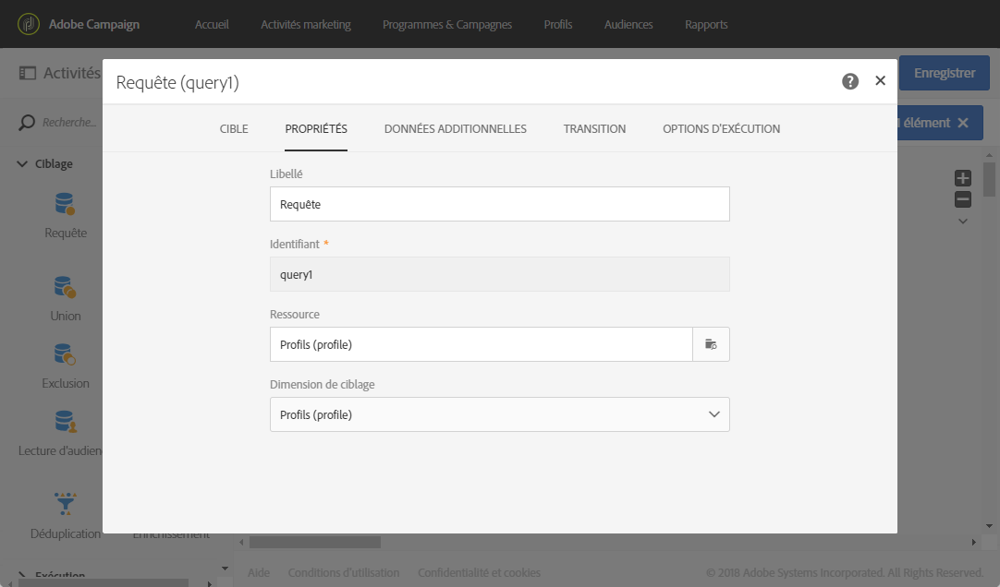

# Utiliser des ressources différentes des dimensions de ciblage {#using-resources-different-from-targeting-dimensions}

Ces cas pratiques montrent comment utiliser une ressource différente de la dimension de ciblage, par exemple, pour rechercher un enregistrement spécifique dans un tableau distant.

Pour plus d’informations sur les dimensions de ciblage et les ressources, reportez-vous à [cette section](../../automating/using/query.md#targeting-dimensions-and-resources)

**Exemple 1 : identification des profils ciblés par la diffusion avec le libellé « Ravi de vous revoir parmi nous »**.

* Dans ce cas, nous voulons cibler des profils. La dimension de ciblage sera donc définie sur **[!UICONTROL Profils (profile)]**.
* Nous voulons également filtrer les profils sélectionnés en fonction du libellé de la diffusion. La ressource sera donc définie sur **[!UICONTROL Logs de diffusion]**. Ainsi, nous appliquerons un filtre directement dans la table des logs de diffusion, ce qui offrira de meilleures performances.

**Exemple 2 : identification des profils qui n’étaient pas ciblés par la diffusion avec le libellé « Ravi de vous revoir parmi nous ».**

Dans l’exemple précédent, nous avons utilisé une ressource différente de la dimension de ciblage. Cette opération n’est possible que si vous recherchez un enregistrement qui **se trouve** dans la table distante (logs de diffusion dans le cas présent).

Si nous recherchons un enregistrement qui **ne figure pas** dans la table distante (comme des profils n’étant pas ciblés par une diffusion spécifique), nous devons utiliser les mêmes ressource et dimension de ciblage dans la mesure où l’enregistrement ne se trouve pas dans la table distante (logs de diffusion).

* Dans ce cas, nous voulons cibler des profils. La dimension de ciblage sera donc définie sur **[!UICONTROL Profils (profile)]**.
* Nous voulons également filtrer les profils sélectionnés en fonction du libellé de la diffusion. Il n’est pas possible d’appliquer directement un filtre sur les logs de diffusion dans la mesure où nous recherchons un enregistrement qui ne figure pas dans la table des logs de diffusion. La ressource sera donc définie sur **[!UICONTROL Profil (profile)]** et la requête sera créée sur la table des profils.

