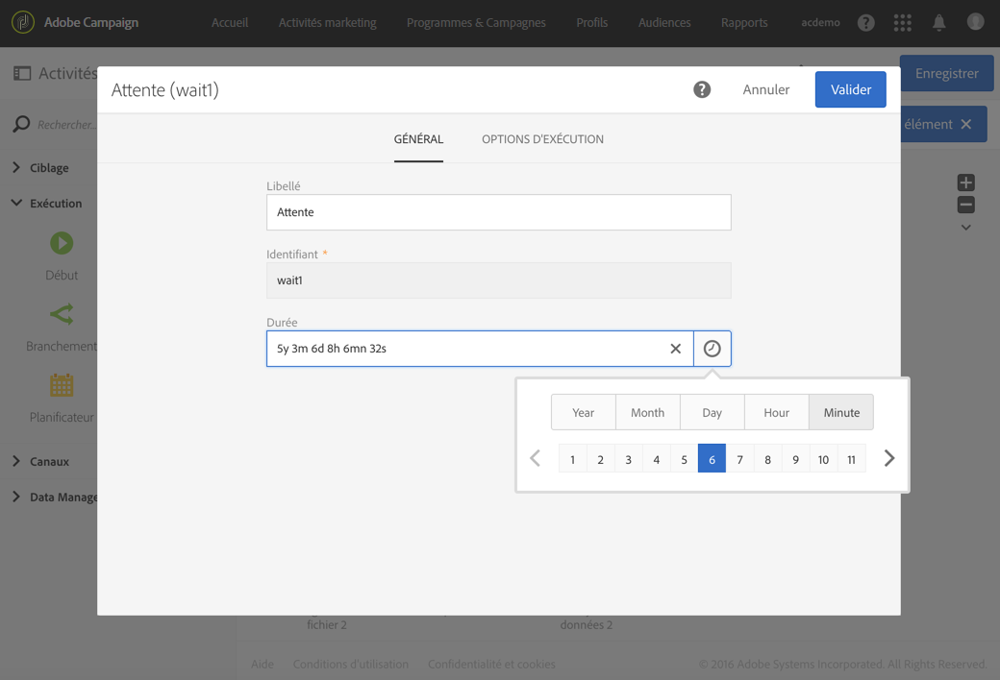
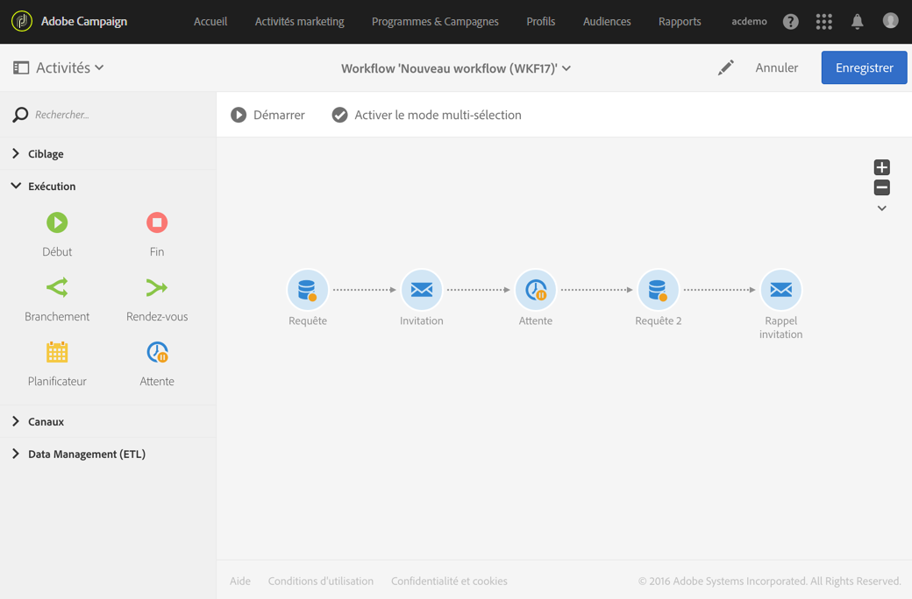

# Attente{#wait}

## Description {#description}

L'activité **[!UICONTROL Attente]** permet de suspendre momentanément l'exécution d'une partie d'un workflow. Elle active sa transition sortante après un délai pouvant aller de quelques secondes à plusieurs mois, permettant l'exécution des activités placées à la suite.

## Contexte d'utilisation  {#context-of-use}

L'activité **[!UICONTROL Attente]** est utilisée pour permettre qu'un certain temps s'écoule entre l'exécution de deux activités. Par exemple, attendre plusieurs jours après une activité de diffusion par email puis analyser les ouvertures et les clics générés pendant ce laps de temps avant d'appliquer d'autres traitements (email de rappel, création d'audience, etc.).

## Configuration  {#configuration}

1. Placez une activité **[!UICONTROL Attente]** dans votre workflow.
1. Sélectionnez l'activité puis ouvrez-la à l'aide du bouton , disponible dans les actions rapides qui s'affichent.
1. Définissez la **[!UICONTROL Durée]** de l'attente entre l'activation de la transition entrante et l'activation de la transition sortante de l'activité.

   Vous pouvez saisir manuellement la durée ou utiliser le sélecteur disponible au niveau du champ.

   

1. Validez le paramétrage de l'activité et enregistrez le workflow.

## Exemple  {#example}

L'exemple suivant illustre l'activité **[!UICONTROL Attente]** dans un cas typique. Un email d'invitation à un événement est envoyé. 24 heures après l'envoi, les journaux de la diffusion email sont analysés et un email de rappel est envoyé aux personnes ayant reçu le premier email mais qui ne se sont pas inscrits.

Le workflow se présente comme suit :

* Une première **[!UICONTROL Requête]** permettant de cibler les profils à qui envoyer l'email d'invitation.
* Une **[!UICONTROL Diffusion email]** permettant d'envoyer une première fois l'invitation aux profils sélectionnés.
* Une **[!UICONTROL Attente]** de 24 h permettant d'attendre entre l'envoi de l'invitation et la suite du workflow.
* Une seconde **[!UICONTROL Requête]** permettant de cibler les profils ayant reçus le premier email mais n'ayant pas cliqué sur le lien d'inscription à l'intérieur.
* Une seconde **[!UICONTROL Diffusion email]** permettant d'envoyer le rappel d'invitation aux personnes sélectionnées.

