# Cas pratique de workflow : création d&#39;un groupe témoin {#building-control-group}

Pour mesurer l&#39;impact d&#39;une diffusion, vous souhaiterez peut-être exclure certains profils de votre cible afin qu&#39;ils ne reçoivent pas un message donné. Ce groupe témoin peut être utilisé pour comparer le comportement de la population cible qui a reçu le message.

Pour procéder ainsi dans Adobe Campaign Standard, vous pouvez créer un workflow comprenant les activités suivantes :
* une activité Requête pour cibler une population donnée ;
* une activité Segmentation pour isoler un groupe témoin aléatoire de cette population ;
* une activité Diffusion Email pour envoyer un message à la cible principale ;
* une activité Mise à jour de données pour mettre à jour les profils qui ont été exclus de la cible (le groupe témoin aléatoire).

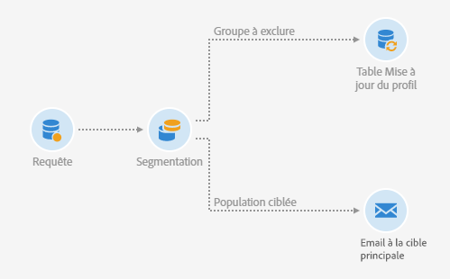

## Extension de la ressource Profil {#extending-profile}

Tout d’abord, vous devez étendre la ressource **[!UICONTROL Profil]**avec un nouveau champ correspondant au groupe témoin. Une fois le workflow exécuté, ce champ est coché pour les profils qui ont été exclus de la cible.

1. Depuis **[!UICONTROL Administration]**>**[!UICONTROL  Développement]** > **[!UICONTROL Ressources personnalisées]**, cliquez sur**[!UICONTROL  Créer]**.
1. Si vous ne l&#39;avez pas encore étendue, sélectionnez **[!UICONTROL Etendre une ressource existante]**et la ressource**[!UICONTROL  Profil]**.
1. Dans l&#39;onglet **[!UICONTROL Structure de données]**, ajoutez un nouveau champ pour le groupe témoin et sélectionnez**[!UICONTROL  Booléen]** pour le champ **[!UICONTROL Type]**.

   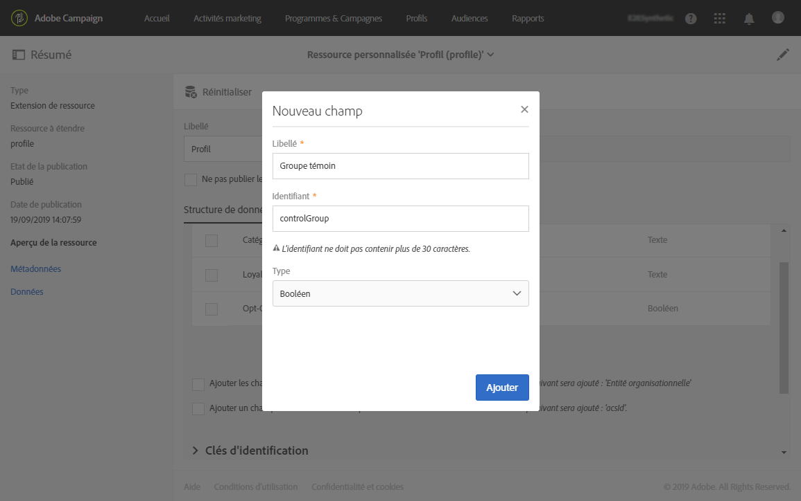

1. Dans l&#39;onglet **[!UICONTROL Définition des écrans]**, développez la section**[!UICONTROL  Configuration de l&#39;écran de détail]** et sélectionnez le champ que vous venez de créer afin qu&#39;il s&#39;affiche pour chaque profil.

   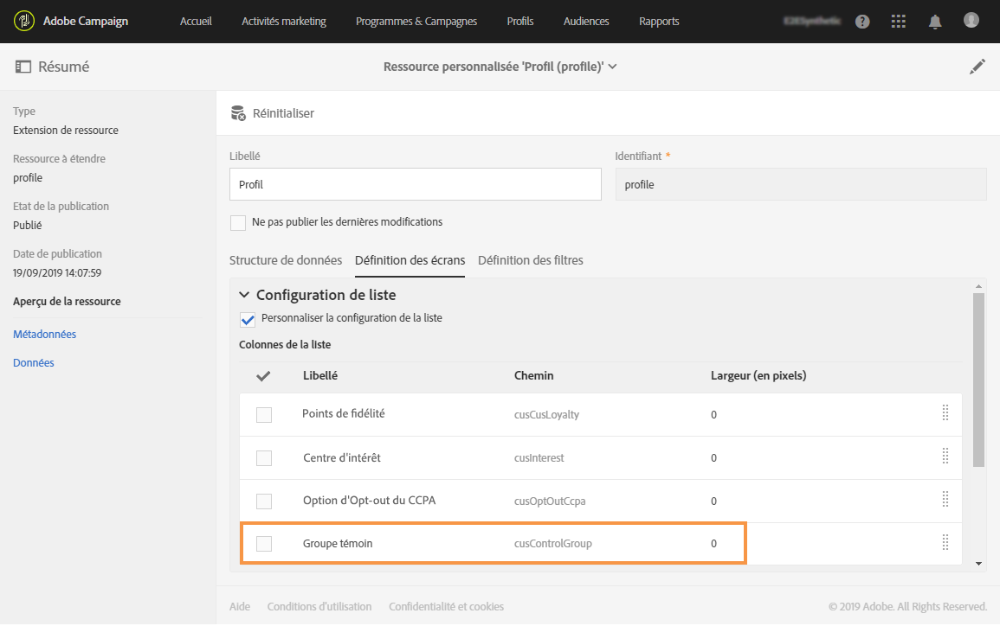

1. Enregistrez vos modifications.
1. Mettez à jour la structure de la base de données pour publier la ressource étendue **[!UICONTROL Profil]**. Voir[Publier une ressource personnalisée](../../developing/using/updating-the-database-structure.md#publishing-a-custom-resource).

Pour plus d&#39;informations sur l&#39;extension d’une ressource personnalisée, voir [Principales étapes pour ajouter une ressource](../../developing/using/key-steps-to-add-a-resource.md).

## Créer un workflow   {#creating-a-workflow}

1. Dans **[!UICONTROL Activités marketing]**, cliquez sur**[!UICONTROL  Créer]** et sélectionnez **[!UICONTROL Workflow]**.
1. Sélectionnez **[!UICONTROL Nouveau workflow]**en tant que type de workflow et cliquez sur**[!UICONTROL  Suivant]**.
1. Saisissez les propriétés du workflow, puis cliquez sur **[!UICONTROL Créer]**.

Les étapes détaillées pour créer un workflow sont présentées dans la section [Création d&#39;un workflow](../../automating/using/building-a-workflow.md).

## Créer une activité Requête {#create-a-query-activity}

1. Dans **[!UICONTROL Activités]**>**[!UICONTROL  Ciblage]**, effectuez un glisser-déposer d’une **[!UICONTROL activité Requête]**.
1. Double-cliquez sur l&#39;activité pour définir votre cible.
1. Par exemple, dans **[!UICONTROL Raccourcis]**, effectuez un glisser-déposer de**[!UICONTROL  Profil]**, sélectionnez **[!UICONTROL Age]**avec l&#39;opérateur**[!UICONTROL  Supérieur à]** et saisissez 25 dans le champ **[!UICONTROL Valeur]**.
1. Cliquez sur **[!UICONTROL Confirmer]**.

Les étapes détaillées pour créer une activité Requête sont présentées dans la section [Requête](../../automating/using/query.md).

## Créer une activité Segmentation {#creating-a-segmentation-activity}

1. Effectuez un glisser-déposer d&#39;une activité **[!UICONTROL Segmentation]**et double-cliquez dessus.
1. Dans l&#39;onglet **[!UICONTROL Segments]**, sélectionnez un segment à éditer.
1. Dans l&#39;onglet **[!UICONTROL Configuration]**de ce segment, sélectionnez l&#39;option**[!UICONTROL  Limiter la population de ce segment]**.

   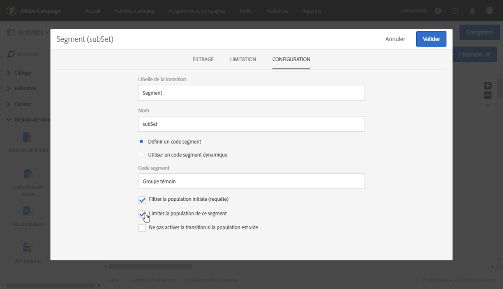

1. Dans l&#39;onglet **[!UICONTROL Limitation]**, vérifiez que l&#39;option**[!UICONTROL  Tirage aléatoire]** est sélectionnée.

   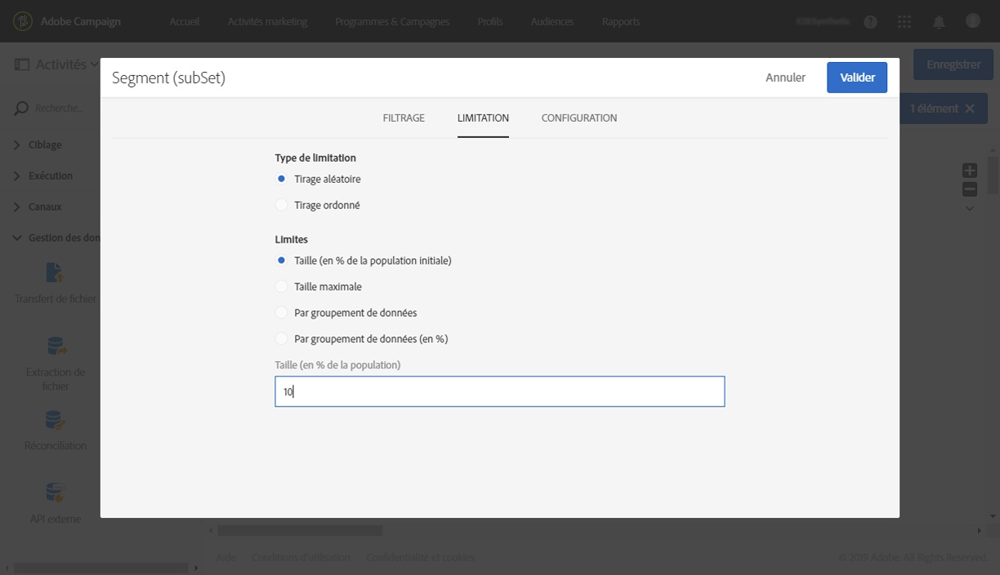

1. Définissez un pourcentage de la population initiale, par exemple 10 %, puis cliquez sur **[!UICONTROL Confirmer]**. Le groupe témoin sera constitué de 10 % de la population ciblée, choisie de manière aléatoire.
1. Dans l&#39;onglet **[!UICONTROL Options avancées]**, sélectionnez l&#39;option**[!UICONTROL  Générer le complémentaire]** et renseignez les champs **[!UICONTROL Libellé de la transition]**et**[!UICONTROL  Code segment]**.

   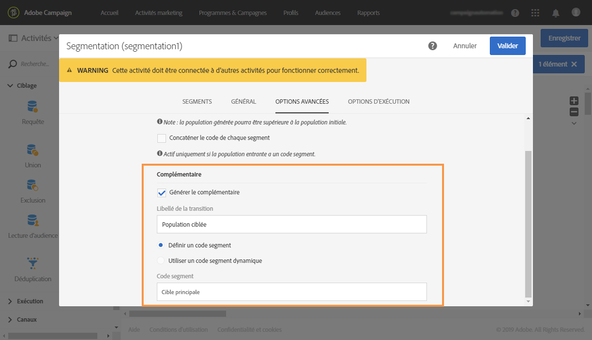

1. Cliquez sur **[!UICONTROL Confirmer]**.

Les étapes détaillées pour créer une activité Segmentation sont présentées dans la section [Segmentation](../../automating/using/segmentation.md) .

## Créer une activité Email {#creating-an-email-activity}

1. Dans **[!UICONTROL Activités]**>**[!UICONTROL  Canaux]**, effectuez un glisser-déposer d’une **[!UICONTROL Diffusion Email]**après le segment cible principal.
1. Cliquez sur l&#39;activité et sélectionnez  pour édition.
1. Sélectionnez **[!UICONTROL Email unique]**et cliquez sur**[!UICONTROL  Suivant]**.
1. Sélectionnez un modèle d&#39;email et cliquez sur **[!UICONTROL Suivant]**.
1. Saisissez les propriétés de l&#39;email et cliquez sur **[!UICONTROL Suivant]**.
1. Pour créer la mise en page de votre email, cliquez sur **[!UICONTROL Utiliser le concepteur d&#39;email]**.
1. Editez et enregistrez votre contenu.
1. Dans la section **[!UICONTROL Planning]**du tableau de bord des messages, désélectionnez l&#39;option**[!UICONTROL Demander confirmation avant d&#39;envoyer les messages}**.

Les étapes détaillées pour créer une activité Email sont présentées dans la section [Diffusion Email](../../automating/using/email-delivery.md).

## Créer une activité Mise à jour de données {#creating-update-data-activity}

1. Effectuez un glisser-déposer d&#39;une activité **[!UICONTROL Mise à jour de données]**après le segment du groupe témoin.
1. Sélectionnez l&#39;activité puis ouvrez-la à l&#39;aide du bouton , disponible dans les actions rapides qui s&#39;affichent.
1. Dans l&#39;onglet **[!UICONTROL Général]**, sélectionnez**[!UICONTROL  Mettre à jour]** dans la liste déroulante **[!UICONTROL Type d&#39;opération]**.
1. Dans l&#39;onglet **[!UICONTROL Identification]**, sélectionnez l&#39;option**[!UICONTROL  En utilisant directement la dimension de ciblage]**.
1. Sélectionnez la ressource **[!UICONTROL Profil]**que vous avez précédemment étendue comme dimension à mettre à jour.

   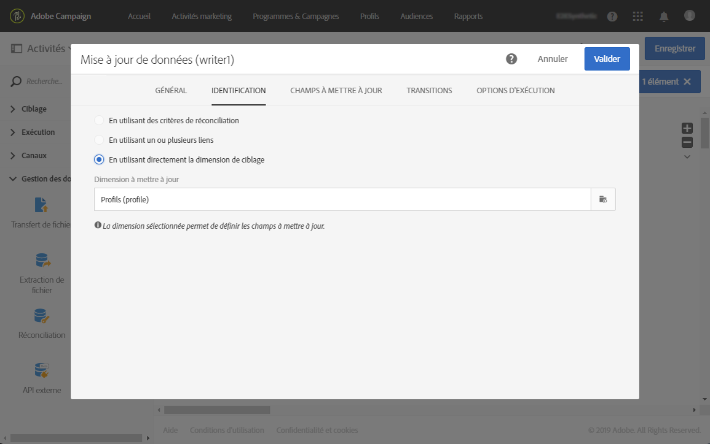

1. Dans l&#39;onglet **[!UICONTROL Champs à mettre à jour]**, sélectionnez le champ de groupe témoin que vous avez ajouté à la ressource**[!UICONTROL  Profil]** en tant que **[!UICONTROL Destination]**et entrez true comme condition.

   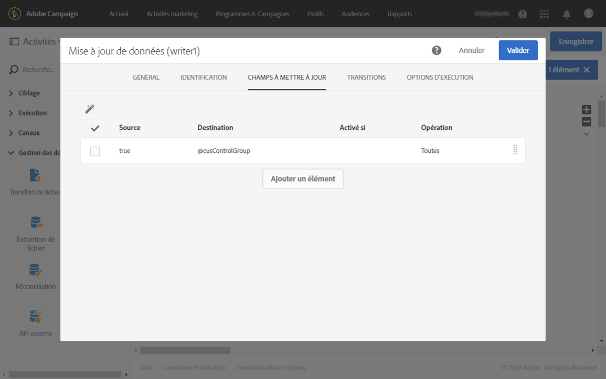

1. Cliquez sur **[!UICONTROL Confirmer]**.

Les étapes détaillées pour créer une activité Mise à jour de données sont présentées dans la section [Mise à jour de données](../../automating/using/update-data.md).

## Exécuter le workflow {#running-the-workflow}

Cliquez sur **[!UICONTROL Démarrer]**pour lancer le workflow.

Une fois le workflow exécuté, la population du groupe témoin est exclue et le message est envoyé à la cible principale restante.

La ressource **[!UICONTROL Profil]**est mise à jour comme suit : si un profil se trouvait dans le groupe témoin, le champ correspondant est coché.

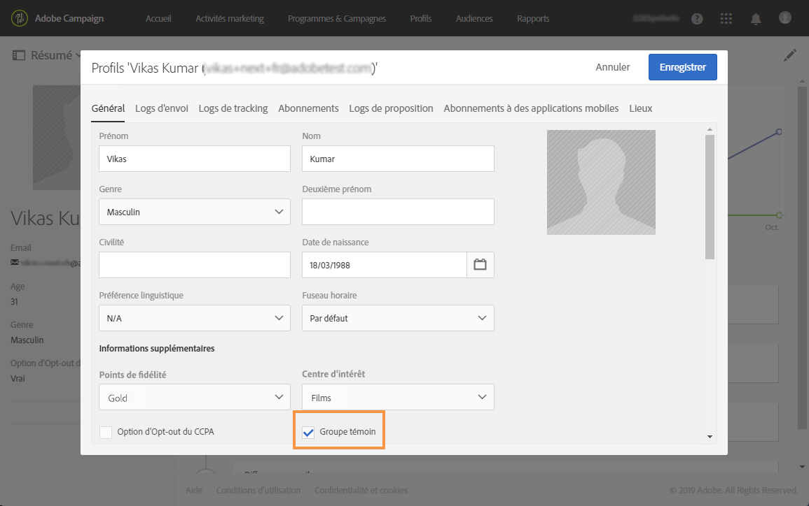

Vous pouvez maintenant comparer la réaction des destinataires du message par rapport au petit groupe qui a été exclu du message et ne l’a pas reçu.

## Réutiliser le même groupe témoin {#reusing-same-control-group}

L&#39;exemple ci-dessus permet de créer un groupe témoin global, car il est stocké en tant qu&#39;attribut de profil indépendamment des diffusions. En effet, le nouveau champ &quot;Groupe témoin&quot; créé dans le cadre de l&#39;extension de la ressource **[!UICONTROL Profil]**est mis à jour après l&#39;exécution du workflow ci-dessus.

Par conséquent, la prochaine fois que vous souhaitez utiliser le même groupe témoin, vous pouvez effectuer une segmentation sur le nouveau champ Groupe témoin plutôt que d&#39;effectuer une segmentation aléatoire.

Pour cela :
1. Lors de la création de l&#39;activité **[!UICONTROL Segmentation]**, sélectionnez le segment à éditer dans l&#39;onglet**[!UICONTROL  Segments]**.
1. Dans l&#39;onglet **[!UICONTROL Configuration]**de ce segment, veillez à ne pas sélectionner l&#39;option**[!UICONTROL  Limiter la population de ce segment]**.
1. Dans l&#39;onglet **[!UICONTROL Filtrage]**, placez**[!UICONTROL  Profils (attributs)]** dans l&#39;espace de travail principal.

   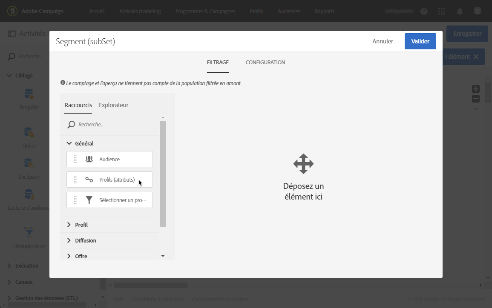

1. Dans la fenêtre **[!UICONTROL Ajouter une règle - Profils (attributs)]**, sélectionnez Groupe témoin (le champ que vous avez ajouté à la ressource**[!UICONTROL  Profil]**) et sélectionnez **[!UICONTROL Oui]**comme condition de filtrage.

   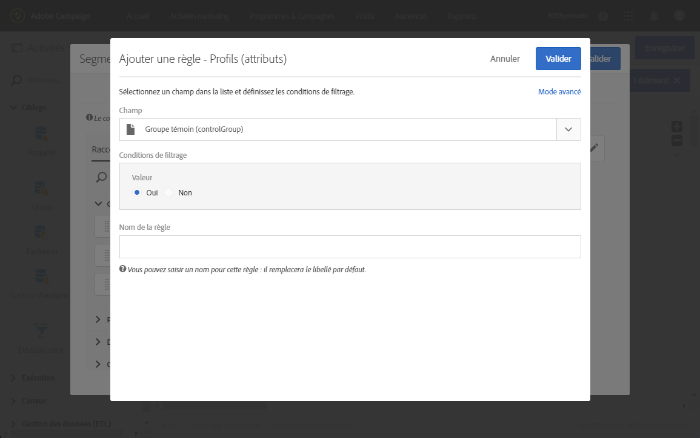