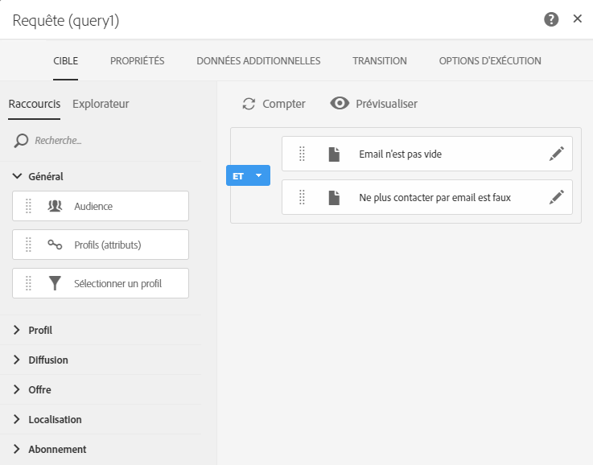
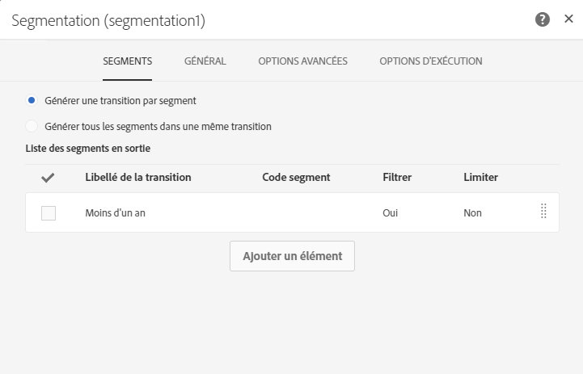
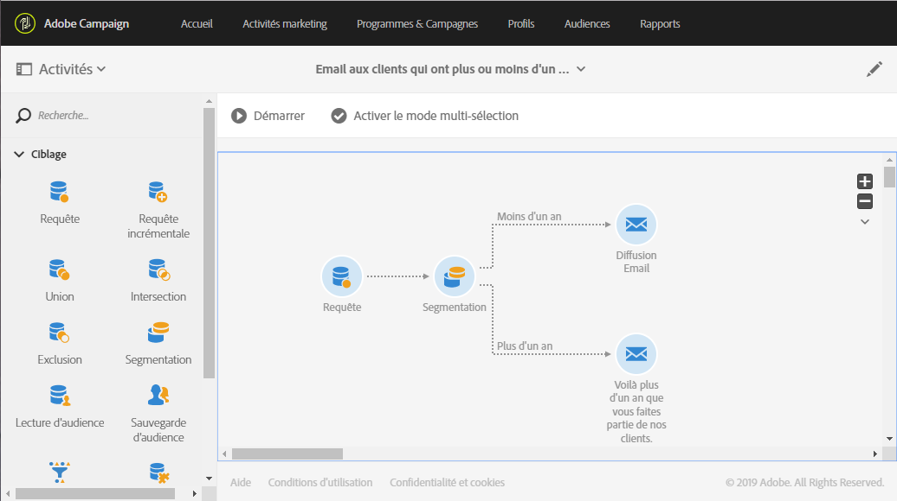

# Utilisation du flux de travail : Créer des livraisons avec un complément {#deliveries-with-complement}

Vous pouvez envoyer un courriel aux clients : un pour les clients créés il y a moins d'un an, un pour les clients créés il y a plus d'un an.

1. In **[!UICONTROL Marketing Activities]**, click **[!UICONTROL Create]** and select **[!UICONTROL Workflow]**.
1. Sélectionnez **[!UICONTROL Nouveau Workflow]** comme type de flux de travail et cliquez **[!UICONTROL sur Suivant]**.
1. Entrez les propriétés du flux de travail et cliquez **[!UICONTROL sur Créer]**.

## Créer une activité de requête {#create-a-query-activity}

1. Dans **[!UICONTROL Activités]** &gt; **[!UICONTROL Cibler]**, glisser-déposer une **[!UICONTROL activité de requête]**.
1. Double-cliquez sur l'activité.
1. Dans **[!UICONTROL les raccourcis]**, les **[!UICONTROL profils]** de drag-and-drop et le **[!UICONTROL courriel]** avec l'opérateur **[!UICONTROL n'est pas vide]**.
1. Dans **[!UICONTROL Raccourcis]**, profils de drag-and-drop **[!UICONTROL et]** sélectionnez **[!UICONTROL ne plus contacter par email]** avec la valeur **[!UICONTROL non]**.
1. Cliquez sur **[!UICONTROL Confirmer]**.

## Créer une activité de segmentation {#create-a-segmentation-activity}

1. Dans **[!UICONTROL Activités]** &gt; **[!UICONTROL Cibler]**, glisser-déposer une **[!UICONTROL activité de segmentation]** et double-cliquez dessus.
1. Hover sur le segment puis cliquez  sur les clients ciblés ajoutés cette année dans la base de données.
1. **[!UICONTROL Profils de Drag-and-Drop]** et Sélection **[!UICONTROL avec]** le type de filtre **[!UICONTROL Relatif]**.
1. Changer le **[!UICONTROL niveau de précision]** à **[!UICONTROL l'année]** et sélectionner **[!UICONTROL cette année]**.
1. Cliquez **[!UICONTROL sur Confirmer]** deux fois.
1. Dans **[!UICONTROL les options avancées]**, vérifiez **[!UICONTROL Générer un complément]** pour créer un segment ciblant les autres bénéficiaires.
1. Cliquez sur **[!UICONTROL Confirmer]**.
1. Cliquez sur **[!UICONTROL Enregistrer]**.

>[!NOTE]
>
>Pour observer la structure de la règle, cliquez sur **[!UICONTROL Mode avancé]**.

## Creating an Email delivery {#create-an-email-delivery}

1. Dans **[!UICONTROL Activités]** &gt; **[!UICONTROL Canaux]**, glisser-déposer une livraison par courriel après chaque segment.
1. Cliquez sur l'activité et sélectionnez  à modifier.
1. Sélectionnez **[!UICONTROL Single Send Email]** et cliquez **[!UICONTROL sur Suivant]**.
1. Sélectionnez un modèle de courriel et cliquez **[!UICONTROL sur Suivant]**.
1. Entrez les propriétés de courriel et cliquez **[!UICONTROL sur Suivant]**.
1. Pour créer la mise en page de votre email, cliquez sur **[!UICONTROL le designer Email]**.
1. Insérez des éléments ou sélectionnez un modèle existant.
1. Personnalisez votre email avec des offres spécifiques à chaque livraison.
1. Cliquez **[!UICONTROL sur Aperçu]** pour vérifier votre disposition.
1. Cliquez sur **[!UICONTROL Enregistrer]**.

Pour plus d'informations, reportez-vous [à la conception d'un courriel](../../designing/using/about-email-content-design.md#designing-an-email-content-from-scratch).

**Rubriques connexes :**

* [Requête](../../automating/using/query.md)
* [activité de segmentation](../../automating/using/segmentation.md)
* [Diffusion Email ](../../automating/using/email-delivery.md)
