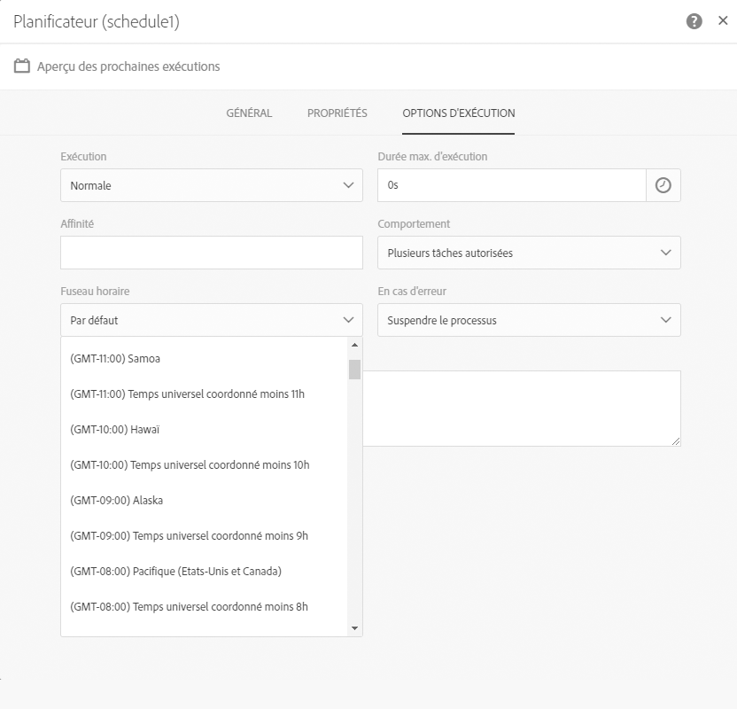

# Utilisation du flux de travail : Créer des livraisons sur la date de création des profils {#creation-date-query}

Vous pouvez envoyer une offre par courriel à l'anniversaire de la création du profil du client.

1. In **[!UICONTROL Marketing Activities]**, click **[!UICONTROL Create]** and select **[!UICONTROL Workflow]**.
1. Sélectionnez **[!UICONTROL Nouveau Workflow]** comme type de flux de travail et cliquez **[!UICONTROL sur Suivant]**.
1. Entrez les propriétés du flux de travail et cliquez **[!UICONTROL sur Créer]**.

## Creating a Scheduler activity {#creating-a-scheduler-activity}

1. Dans **[!UICONTROL Activités]** &gt; **[!UICONTROL Exécution]**, glisser-déposer une **[!UICONTROL activité]** de planificateur.
1. Double-cliquez sur l'activité.
1. Configurez l'exécution de votre livraison.
1. Dans **[!UICONTROL la fréquence d'exécution]**, sélectionnez **[!UICONTROL Daily]**.
1. Sélectionnez **[!UICONTROL un temps]** et la **[!UICONTROL fréquence de répétition]** de l'exécution pour votre flux de travail.
1. Sélectionnez la **[!UICONTROL date de début]** et **[!UICONTROL l'expiration]** de votre flux de travail.
1. Validez votre activité et sauvegardez votre workflow.

>[!NOTE]
>
>Pour commencer votre flux de travail à une fuseau horaire **[!UICONTROL spécifique, dans]** l'onglet Options d'exécution, installez le fuseau horaire pour votre programmeur dans le champ **[!UICONTROL Time Zone]**.



## Creating a Query activity {#creating-a-query-activity}

1. Pour sélectionner les destinataires, faites glisser-déposer une **[!UICONTROL activité de requête]** et double-cliquez dessus.
1. Ajoutez **[!UICONTROL des profils]** et ne sélectionnez **[!UICONTROL plus contact par email]** avec la valeur **[!UICONTROL non]**.

### Les profils retranchés créés le même jour que le jour de l'exécution {#retriving-profiles-created-on-the-same-day}

1. Dans **[!UICONTROL Profil]**, glisser-déposer le **[!UICONTROL champ créé]** . et cliquez sur **[!UICONTROL Mode avancé]**.
   
1. Dans **[!UICONTROL la liste des fonctions]**, double-cliquez **[!UICONTROL sur Day]** depuis le noeud **[!UICONTROL Date]**.
1. Ensuite, insérez le champ **[!UICONTROL Créé]** comme argument.
1. Sélectionnez **[!UICONTROL égal à (=)]** comme opérateur.
1. Pour la valeur, sélectionnez **[!UICONTROL Day]** à partir de **[!UICONTROL la noeud de date]** dans **[!UICONTROL la liste des fonctions]**.
1. Insérez la **[!UICONTROL fonction getdate ()]** comme argument.

Vous avez récupéré les profils que la journée de création est égale à la journée courante.

Vous devriez finir avec :

```Day(@created) = Day(GetDate())```


Cliquez sur **[!UICONTROL Confirmer]**.

### Retracer les profils créés le même mois que le mois d'exécution{#retriving-profiles-created-on-the-same-month}

1. Dans l'éditeur **[!UICONTROL de requêtes]** , sélectionnez la première requête et répétez-le.
1. Ouvrez le duplicata.
1. Remplacer **[!UICONTROL Day]** par **[!UICONTROL mois]** dans la requête.
1. Cliquez sur **[!UICONTROL Confirmer]**.


Vous devriez finir avec ceci :

``` Month(@created) = Month(GetDate()) ```

La requête finale affiche :

```Day(@created) = Day(GetDate()) AND Month(@created) = Month(GetDate())```


## Creating an Email delivery{#creating-an-email-delivery}

1. Glisser-déposer une livraison par courriel.
1. Cliquez sur l'activité et sélectionnez  à modifier.
1. Sélectionnez **[!UICONTROL E-mail récurrent]** et cliquez **[!UICONTROL sur Suivant]**.
1. Sélectionnez un modèle de courriel et cliquez **[!UICONTROL sur Suivant]**.
1. Entrez les propriétés de courriel et cliquez **[!UICONTROL sur Suivant]**.
1. Pour créer la mise en page de votre email, cliquez sur **[!UICONTROL le designer Email]**.
1. Insérez des éléments ou sélectionnez un modèle existant.
1. Personnalisez votre courriel en utilisant des champs et des liens.
Pour plus d'informations, reportez-vous [à la conception d'un courriel](../../designing/using/about-email-content-design.md#designing-an-email-content-from-scratch).
1. Cliquez **[!UICONTROL sur Aperçu]** pour vérifier votre disposition.
1. Cliquez sur **[!UICONTROL Enregistrer]**.

**Rubriques connexes :**

* [Requête](../../automating/using/query.md)
* [Planificateur](../../automating/using/scheduler.md)
* [Diffusion Email ](../../automating/using/email-delivery.md)
* [Canal email](../../channels/using/creating-an-email.md)
