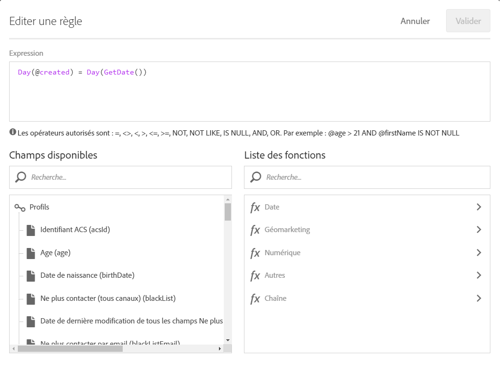

# Cas pratique de workflow : création de diffusions à la date de création des profils {#creation-date-query}

Vous pouvez envoyer une offre par email à la date anniversaire de la création du profil du client.

1. Dans **[!UICONTROL Activités marketing]**, cliquez sur **[!UICONTROL Créer]** et sélectionnez **[!UICONTROL Workflow]**.
1. Sélectionnez **[!UICONTROL Nouveau workflow]** en tant que type de workflow et cliquez sur **[!UICONTROL Suivant]**.
1. Saisissez les propriétés du workflow, puis cliquez sur **[!UICONTROL Créer]**.

## Créer une activité Planificateur {#creating-a-scheduler-activity}

1. Dans **[!UICONTROL Activités]** &gt; **[!UICONTROL Exécution]**, effectuez un glisser-déposer d'une activité **[!UICONTROL Planificateur]**.
1. Double-cliquez sur l'activité.
1. Configurez l'exécution de votre diffusion.
1. Dans **[!UICONTROL Fréquence d'exécution]**, sélectionnez **[!UICONTROL Quotidienne]**.
1. Sélectionnez une **[!UICONTROL Heure]** et **[!UICONTROL Répéter le traitement selon la périodicité suivante]** pour votre workflow.
1. Sélectionnez une date de **[!UICONTROL Début]** et d'**[!UICONTROL Expiration]** de votre workflow.
1. Validez votre activité et sauvegardez votre workflow.

>[!NOTE]
>
>Pour démarrer votre workflow dans un fuseau horaire spécifique, dans l'onglet **[!UICONTROL Options d'exécution]**, configurez le fuseau horaire du planificateur dans le champ **[!UICONTROL Fuseau horaire]**.


## Créer une activité Requête {#creating-a-query-activity}

1. Pour sélectionner les destinataires, effectuez un glisser-déposer d'une activité **[!UICONTROL Requête]** et double-cliquez dessus.
1. Ajoutez des **[!UICONTROL Profils]** et sélectionnez **[!UICONTROL Ne plus contacter par email]** avec la valeur **[!UICONTROL non]**.

### Récupération des profils créés le même jour que le jour d'exécution {#retriving-profiles-created-on-the-same-day}

1. Dans **[!UICONTROL Profil]**, effectuez un glisser-déposer du champ **[!UICONTROL Créé le]**. et cliquez sur **[!UICONTROL Mode avancé]**.
   
1. Dans la **[!UICONTROL Liste des fonctions]**, double-cliquez sur **[!UICONTROL Jour]** depuis le nœud **[!UICONTROL Date]**.
1. Ensuite, insérez le champ **[!UICONTROL Créé le]** en tant qu'argument.
1. Sélectionnez **[!UICONTROL égal à (=)]** comme opérateur.
1. Pour la valeur, sélectionnez **[!UICONTROL Jour]** depuis le nœud **[!UICONTROL Date]** dans la **[!UICONTROL Liste des fonctions]**.
1. Insérez la fonction **[!UICONTROL GetDate()]** en tant qu'argument.

Vous avez récupéré les profils dont le jour de création correspond au jour en cours.

Vous devez obtenir :

```Day(@created) = Day(GetDate())```



Cliquez sur **[!UICONTROL Confirmer]**.

### Récupérer les profils créés le même mois que le mois d'exécution{#retriving-profiles-created-on-the-same-month}

1. Dans l'éditeur de **[!UICONTROL requêtes]**, sélectionnez la première requête et dupliquez-la.
1. Ouvrez le duplicata.
1. Remplacez **[!UICONTROL Jour]** par **[!UICONTROL Mois]** dans la requête.
1. Cliquez sur **[!UICONTROL Confirmer]**.


Vous devez obtenir :

``` Month(@created) = Month(GetDate()) ```

La requête finale affiche :

```Day(@created) = Day(GetDate()) AND Month(@created) = Month(GetDate())```


## Créer une diffusion email{#creating-an-email-delivery}

1. Effectuez un glisser-déposer d'une diffusion email.
1. Cliquez sur l'activité et sélectionnez  pour édition.
1. Sélectionnez **[!UICONTROL Email récurrent]** et cliquez sur **[!UICONTROL Suivant]**.
1. Sélectionnez un modèle d'email et cliquez sur **[!UICONTROL Suivant]**.
1. Saisissez les propriétés de l'email et cliquez sur **[!UICONTROL Suivant]**.
1. Pour créer la mise en page de votre email, cliquez sur **[!UICONTROL Concepteur d'email]**.
1. Insérez des éléments ou sélectionnez un modèle existant.
1. Personnalisez votre email à l'aide de champs et de liens.
Pour plus d'informations, consultez la section décrivant la [conception d'un email](../../designing/using/designing-from-scratch.md#designing-an-email-content-from-scratch).
1. Cliquez sur **[!UICONTROL Aperçu]** pour vérifier votre mise en page.
1. Cliquez sur **[!UICONTROL Enregistrer]**.

**Rubriques connexes :**

* [Requête](../../automating/using/query.md)
* [Planificateur](../../automating/using/scheduler.md)
* [Diffusion Email ](../../automating/using/email-delivery.md)
* [Canal email](../../channels/using/creating-an-email.md)
